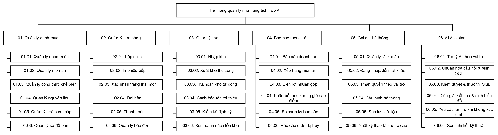
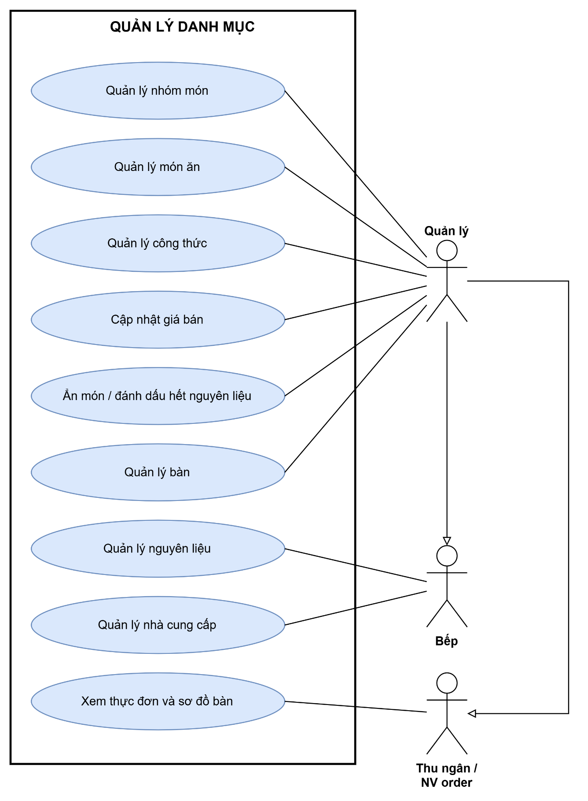
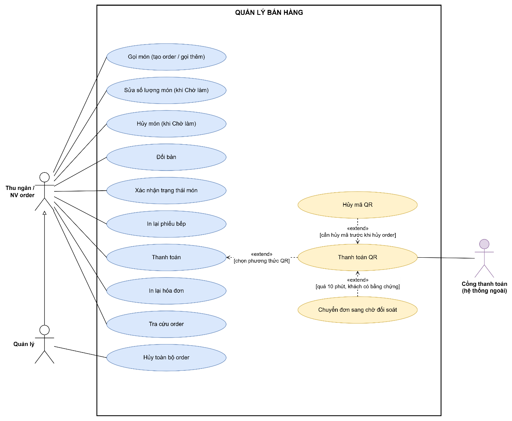
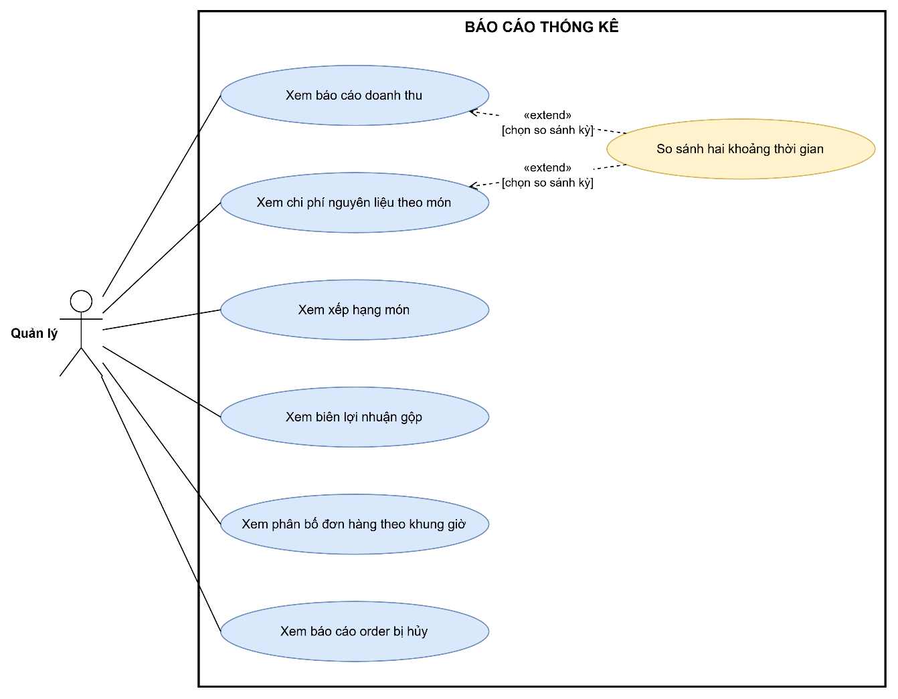
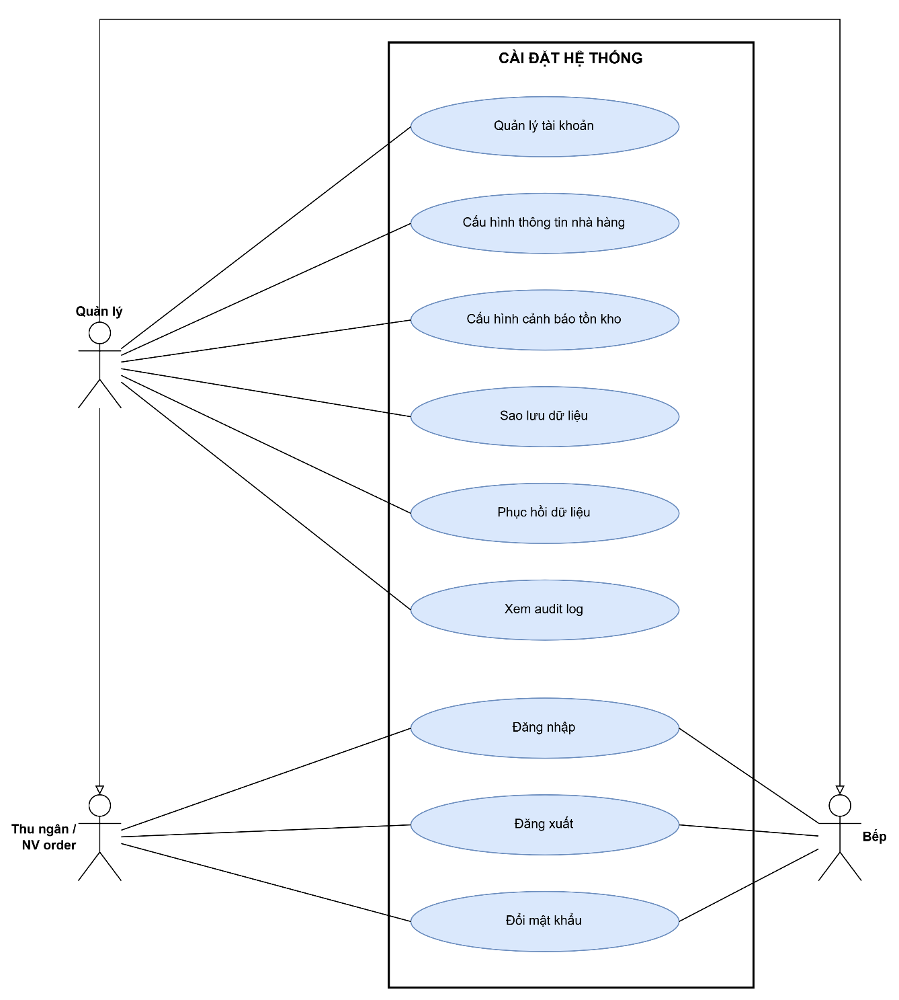
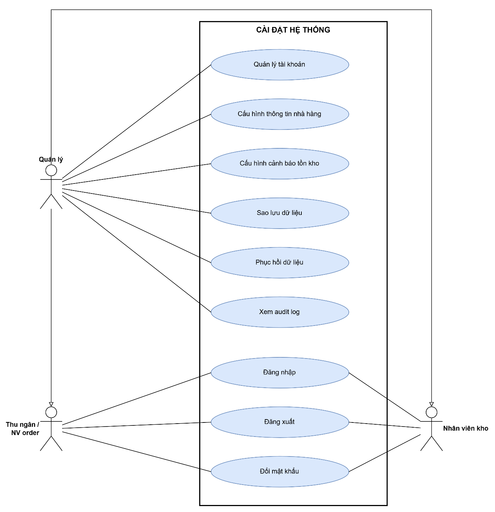
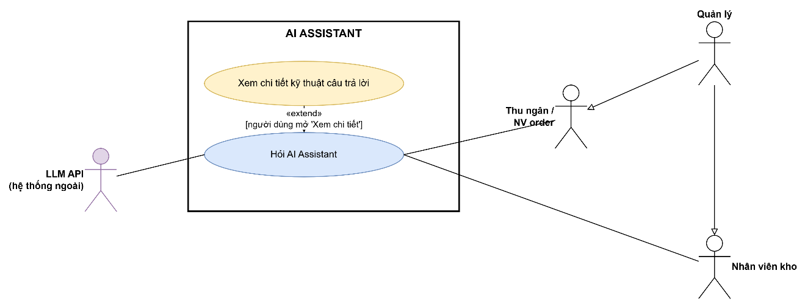
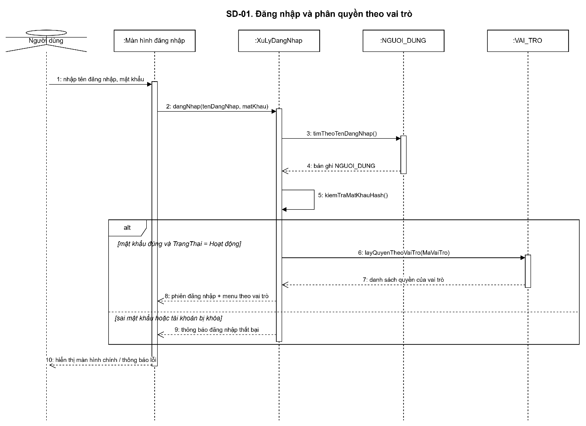
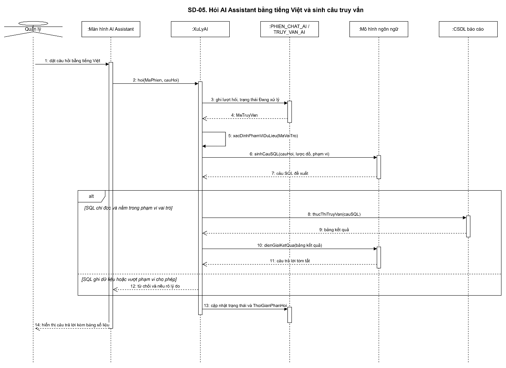

# TRƯỜNG ĐẠI HỌC MỞ HÀ NỘI

KHOA CÔNG NGHỆ THÔNG TIN

Lê Nam Khánh – Nguyễn Mạnh Hùng – Lê Nho Minh

HỆ THỐNG QUẢN LÝ NHÀ HÀNG TÍCH HỢP AI HỖ TRỢ HOẠT ĐỘNG KINH DOANH

Ngành: Công nghệ thông tin

KHÓA LUẬN TỐT NGHIỆP ĐẠI HỌC

Hà Nội – Năm 2026

# TRƯỜNG ĐẠI HỌC MỞ HÀ NỘI

KHOA CÔNG NGHỆ THÔNG TIN

Lê Nam Khánh – Nguyễn Mạnh Hùng – Lê Nho Minh

HỆ THỐNG QUẢN LÝ NHÀ HÀNG TÍCH HỢP AI HỖ TRỢ HOẠT ĐỘNG KINH DOANH

Ngành: Công nghệ thông tin

KHÓA LUẬN TỐT NGHIỆP ĐẠI HỌC

Hà Nội – Năm 2026

| TRƯỜNG ĐẠI HỌC MỞ HÀ NỘI KHOA CÔNG NGHỆ THÔNG TIN | CỘNG HÒA XÃ HỘI CHỦ NGHĨA VIỆT NAM Độc lập – Tự do – Hạnh phúc |
| --- | --- |

Hà Nội, ngày....tháng....năm.....

NHIỆM VỤ KHÓA LUẬN TỐT NGHIỆP

| Họ và tên : Lê Nam Khánh Ngày sinh : Chuyên ngành : Công nghệ phần mềm Lớp hành chính : | Giới tính : Nơi sinh : Mã SV : |
| --- | --- |
| Họ và tên : Nguyễn Mạnh Hùng Ngày sinh : Chuyên ngành : Công nghệ phần mềm Lớp hành chính : | Giới tính : Nơi sinh : Mã SV : |
| Họ và tên : Lê Nho Minh Ngày sinh : Chuyên ngành : Công nghệ phần mềm Lớp hành chính : | Giới tính : Nơi sinh : Mã SV : |

MỤC LỤC

## DANH MỤC BẢNG

Bảng 1. Danh sách thực thể của hệ thống	49

Bảng 2. Thuộc tính của thực thể VAI_TRO	50

Bảng 3. Thuộc tính của thực thể NGUOI_DUNG	50

Bảng 4. Thuộc tính của thực thể CAU_HINH_HE_THONG	51

Bảng 5. Thuộc tính của thực thể NHAT_KY_HE_THONG	51

Bảng 6. Thuộc tính của thực thể NHOM_MON	52

Bảng 7. Thuộc tính của thực thể MON_AN	53

Bảng 8. Thuộc tính của thực thể LICH_SU_GIA_MON	53

Bảng 9. Thuộc tính của thực thể CONG_THUC	54

Bảng 10. Thuộc tính của thực thể CHI_TIET_CONG_THUC	54

Bảng 11. Thuộc tính của thực thể NGUYEN_LIEU	55

Bảng 12. Thuộc tính của thực thể NHA_CUNG_CAP	56

Bảng 13. Thuộc tính của thực thể BAN	57

Bảng 14. Thuộc tính của thực thể ORDER	57

Bảng 15. Thuộc tính của thực thể CHI_TIET_ORDER	58

Bảng 16. Thuộc tính của thực thể LICH_SU_DOI_BAN	59

Bảng 17. Thuộc tính của thực thể HOA_DON	60

Bảng 18. Thuộc tính của thực thể GIAO_DICH_THANH_TOAN	60

Bảng 19. Thuộc tính của thực thể PHIEU_BEP	61

Bảng 20. Thuộc tính của thực thể PHIEU_NHAP_KHO	61

Bảng 21. Thuộc tính của thực thể CHI_TIET_PHIEU_NHAP	62

Bảng 22. Thuộc tính của thực thể LO_NGUYEN_LIEU	63

Bảng 23. Thuộc tính của thực thể PHIEU_XUAT_KHO	64

Bảng 24. Thuộc tính của thực thể CHI_TIET_PHIEU_XUAT	64

Bảng 25. Thuộc tính của thực thể PHIEU_KIEM_KE	65

Bảng 26. Thuộc tính của thực thể CHI_TIET_KIEM_KE	65

Bảng 27. Thuộc tính của thực thể GIAO_DICH_KHO	67

Bảng 28. Thuộc tính của thực thể GIA_BINH_QUAN_THANG	68

Bảng 29. Thuộc tính của thực thể PHIEN_CHAT_AI	68

Bảng 30. Thuộc tính của thực thể TRUY_VAN_AI	69

Bảng 31. Các mối quan hệ chính giữa các thực thể	71

Bảng 32. Ma trận quyền hạn theo dữ liệu và vai trò	74

Bảng 33. Ma trận quyền hạn theo chức năng và vai trò	76

Bảng 34. Trách nhiệm và thẩm quyền theo từng vai trò	78

## DANH MỤC HÌNH ẢNH

Hình 1. Sơ đồ phân rã chức năng (BFD) của hệ thống	32

Hình 2. Use Case tổng quan	32

Hình 3. Use Case quản lý danh mục	33

Hình 4. Use Case bán hàng	34

Hình 5. Use Case quản lý kho	34

Hình 6. Use Case báo cáo	35

Hình 7. Use Case cài đặt	36

Hình 8. Use Case AI Assistant	36

Hình 9. Ký hiệu sử dụng trong DFD	37

Hình 9. DFD mức ngữ cảnh (DFD0)	37

Hình 10. DFD mức đỉnh (DFD1)	37

Hình 11. DFD mức dưới đỉnh (DFD2) - 1	37

Hình 12. DFD mức dưới đỉnh (DFD2) - 2	37

Hình 13. DFD mức dưới đỉnh (DFD2) - 3	37

Hình 2. SD-01 — Đăng nhập và phân quyền theo vai trò	38

Hình 3. SD-02 — Lập và gửi order xuống bếp	38

Hình 4. SD-03 — Thanh toán bằng mã QR và phát hành hóa đơn	39

Hình 5. SD-04 — Nhập kho và tạo lô nguyên liệu	39

Hình 6. SD-05 — Hỏi AI Assistant	40

Hình 7. Mô hình thực thể liên kết (ERD) của hệ thống	77

## DANH MỤC TỪ VIẾT TẮT

| STT | Từ viết tắt | Tên đầy đủ | Ý nghĩa |
| --- | --- | --- | --- |
| 1 | BA | Business Analyst | Chuyên viên phân tích nghiệp vụ |
| 2 | FR | Functional Requirement | Yêu cầu chức năng |
| 3 | NFR | Non-Functional Requirement | Yêu cầu phi chức năng |
| 4 | LLM | Large Language Model | Mô hình ngôn ngữ lớn |
| 5 | Text-to-SQL |  | Kỹ thuật chuyển câu hỏi ngôn ngữ tự nhiên thành câu lệnh SQL |
| 6 | CSDL |  | Cơ sở dữ liệu |
| 7 | BFD | Business Function Diagram | Sơ đồ phân rã chức năng |
| 8 | DFD | Data Flow Diagram | Sơ đồ luồng dữ liệu |
| 9 | MVP | Minimum Viable Product | Sản phẩm khả dụng tối thiểu |

## CHƯƠNG 1: KHẢO SÁT HỆ THỐNG

### 1.1. Giới thiệu chung

Đề tài xây dựng hệ thống quản lý nhà hàng dạng ứng dụng web, phục vụ một nhà hàng/quán ăn quy mô vừa và nhỏ, bao quát các nghiệp vụ vận hành cốt lõi từ danh mục món, gọi món, thanh toán đến quản lý kho nguyên liệu và báo cáo doanh thu. Điểm khác biệt của hệ thống là tích hợp khối AI Assistant cho phép chủ nhà hàng/người quản lý đặt câu hỏi bằng tiếng Việt tự nhiên và nhận lại câu trả lời được tổng hợp trực tiếp từ dữ liệu kinh doanh thực tế, thay vì phải tự tra cứu và tổng hợp thủ công như với các phần mềm quản lý truyền thống.

### 1.2. Mục đích đề tài

Ngành F&B tại Việt Nam có số lượng nhà hàng, quán ăn quy mô vừa và nhỏ chiếm tỷ trọng chủ yếu, nguồn lực công nghệ hạn chế: chủ quán ra quyết định chủ yếu dựa kinh nghiệm cá nhân, bố trí nhân sự/nguyên liệu chưa bám sát khung giờ cao điểm do thiếu số liệu phân bố đơn hàng theo giờ/theo ngày; phần mềm POS hiện có chỉ hiển thị số liệu thô dưới dạng bảng biểu cố định, khiến người dùng bỏ lỡ cơ hội tối ưu doanh thu và phải tự tổng hợp thủ công khi cần phân tích sâu.

Đề tài hướng tới nghiên cứu, thiết kế và xây dựng hệ thống quản lý nhà hàng tích hợp AI, giải quyết đồng thời bài toán vận hành nghiệp vụ và khai thác dữ liệu kinh doanh bằng tiếng Việt, giúp chủ nhà hàng/người quản lý không cần kiến thức kỹ thuật vẫn đặt được câu hỏi tự nhiên và nhận câu trả lời kèm biểu đồ, đánh giá trên bộ dữ liệu mô phỏng sát thực tế.

### 1.3. Mục tiêu đề tài

#### 1.3.1. Mục tiêu tổng quát

Xây dựng một hệ thống quản lý nhà hàng dạng web phục vụ một nhà hàng/quán ăn đơn lẻ, hỗ trợ đầy đủ vòng nghiệp vụ từ quản lý danh mục, bán hàng, kho, báo cáo thống kê đến cấu hình hệ thống, có tích hợp trợ lý AI hỗ trợ tra cứu và phân tích dữ liệu kinh doanh bằng tiếng Việt.

#### 1.3.2. Mục tiêu cụ thể

- MT1: Tham khảo ý kiến người có kinh nghiệm nhà hàng để đặc tả yêu cầu; thiết kế kiến trúc hệ thống và lược đồ cơ sở dữ liệu chuẩn hóa, phục vụ cả khối nghiệp vụ và AI Assistant.
- MT2: Xây dựng hoàn chỉnh 05 module nghiệp vụ cốt lõi (MVP): Quản lý danh mục, Quản lý bán hàng, Quản lý kho, Báo cáo thống kê, Cài đặt hệ thống.
- MT3: Xây dựng khối AI Assistant ứng dụng LLM kết hợp Text-to-SQL cho hỏi đáp, phân tích dữ liệu kinh doanh bằng tiếng Việt.
- MT4: Xây dựng bộ dữ liệu đánh giá 50–100 cặp câu hỏi tiếng Việt – SQL chuẩn, phân tầng ba mức độ khó.
- MT5: Đạt độ chính xác thực thi tối thiểu 80% (câu hỏi đơn giản/trung bình) và 55% (câu hỏi phức tạp), thời gian phản hồi trung bình dưới 8 giây/câu hỏi.
### 1.4. Phạm vi đề tài

#### 1.4.1. Phạm vi nghiệp vụ

Hệ thống phục vụ một nhà hàng/quán ăn đơn lẻ (chưa mở rộng đa chi nhánh), dành cho 3 vai trò người dùng: Chủ nhà hàng/Quản lý, Thu ngân/Nhân viên order, Nhân viên kho. Phạm vi tài liệu bao gồm các nhóm chức năng chính sau:

- Quản lý danh mục: món ăn, công thức chế biến, nguyên liệu, nhà cung cấp, bàn.
- Quản lý bán hàng: order (kèm ghi chú/yêu cầu riêng cho từng món), in phiếu bếp (kể cả in lại khi lỗi), tra cứu order, thanh toán, hóa đơn.
- Quản lý kho: nhập/xuất kho, tồn kho.
- Báo cáo thống kê: doanh thu, món bán chạy/ít bán, chi phí nguyên liệu và biên lợi nhuận gộp, phân tích theo các kỳ (Business Date, tuần, tháng, năm) và theo khung giờ cao điểm.
- Cài đặt hệ thống: tài khoản, phân quyền, cấu hình hệ thống.
- AI Assistant: hỏi đáp và phân tích dữ liệu kinh doanh bằng tiếng Việt thông qua Text-to-SQL kết hợp LLM.
#### 1.4.2. Phạm vi công nghệ

Hệ thống áp dụng kiến trúc ba tầng, mô hình client-server, backend module hóa theo nghiệp vụ:

- Tầng giao diện: ứng dụng web Next.js (ba vai trò người dùng và giao diện chat AI Assistant).
- Tầng ứng dụng: backend Python/FastAPI xử lý cả nghiệp vụ quản lý và dịch vụ AI Assistant.
- Tầng dữ liệu: MySQL kèm tập view riêng theo vai trò để kiểm soát phân quyền, tách biệt AI Assistant khỏi nghiệp vụ lõi.
- SQL do LLM sinh ra được kiểm duyệt bằng sqlglot trước khi thực thi.
- Phương án chính dùng LLM thương mại qua API (GPT-4o-mini/Gemini Flash); phương án dự phòng dùng mô hình nguồn mở tại chỗ (Qwen2.5-Coder/Llama 3.1 qua Ollama).
Nhóm dự kiến xây dựng ba nhóm biểu đồ thiết kế chính: Use Case theo từng module, kèm trang tổng quan và cây kế thừa actor, ERD mô tả cấu trúc dữ liệu, và DFD (mức 0 và mức 1) cho các module, đặc biệt quy trình xử lý của AI Assistant.

#### 1.4.3. Giới hạn của đề tài

Các nội dung sau nằm ngoài phạm vi của đề tài:

- Quản lý nhân sự và tiền lương.
- Quản lý quan hệ khách hàng (CRM).
- Chương trình khuyến mãi/giảm giá.
- Tách/gộp hóa đơn.
- Xếp bàn/gợi ý bàn theo số lượng khách và sức chứa (table capacity matching); hệ thống chỉ lưu và hiển thị số chỗ ngồi của từng bàn (SoChoNgoi) làm thông tin tham khảo, không dùng để chặn order hay tự động gợi ý bàn phù hợp.
- Tích hợp với các nền tảng giao đồ ăn trực tuyến.
- Tích hợp thanh toán bằng thẻ (quẹt thẻ).
- Triển khai đa chi nhánh.
- Thuế VAT tách dòng trên hóa đơn (giá bán niêm yết đã bao gồm mọi loại thuế/phí; quán tự cân đối nghĩa vụ thuế ngoài hệ thống).
- Phân ca làm việc / mở ca / chốt ca.
- Vai trò/tài khoản riêng cho vị trí Bếp trong phần mềm: bếp làm việc hoàn toàn qua phiếu giấy in tự động (FR-SALE-26); Kitchen Display System (KDS) được thay thế bằng máy in nhiệt in phiếu bếp tại chỗ.
- Chi tiết kỹ thuật tích hợp máy in nhiệt tại bếp (driver máy in, khổ giấy, giao thức kết nối phần cứng).
- Chi tiết kỹ thuật tích hợp cổng thanh toán, cơ chế khóa/transaction xử lý tranh chấp tồn kho đồng thời, và vận hành mô hình LLM/hạ tầng suy luận.
### 1.5. Phân công thực hiện

Đề tài đăng ký thực hiện theo nhóm gồm ba thành viên: Lê Nam Khánh, Nguyễn Mạnh Hùng và Lê Nho Minh (GVHD: ThS. Trịnh Thị Xuân). Công việc cụ thể được phân công như sau:

| Thành viên | Công việc đảm nhiệm |
| --- | --- |
| Lê Nam Khánh | Trao đổi, phỏng vấn người tham gia; thu thập & phân tích yêu cầu nghiệp vụ; viết đặc tả chức năng cho từng module và AI Assistant; thiết kế luồng nghiệp vụ, sơ đồ Use Case và DFD; thiết kế mô hình dữ liệu (ERD); thiết kế tham số phân phối dữ liệu mô phỏng 12 tháng; xây dựng bộ dữ liệu đánh giá 50–100 cặp câu hỏi – SQL chuẩn; tự chạy và chấm 3 cấu hình đối chứng; tổ chức đánh giá định tính SUS; xây dựng và thực hiện UAT. |
| Nguyễn Mạnh Hùng | Xây dựng module Quản lý danh mục và Quản lý bán hàng (order, hóa đơn, thanh toán); xây dựng khối AI Assistant phần hỏi đáp bằng ngôn ngữ tự nhiên (chuẩn hóa câu hỏi, thiết kế prompt, sinh SQL, lớp kiểm duyệt câu lệnh); viết DDL và tập view phân quyền cho AI Assistant; viết harness tự động chạy 3 cấu hình đối chứng (A/B/C); tham gia kiểm thử hệ thống. |
| Lê Nho Minh | Xây dựng module Quản lý kho, Báo cáo thống kê (theo khung giờ), Cài đặt hệ thống/phân quyền; xây dựng khối AI Assistant phần diễn giải kết quả và sinh biểu đồ; viết script sinh dữ liệu mô phỏng 12 tháng; tham gia kiểm thử hệ thống. |

### 1.6. Phân tích đối thủ cạnh tranh

#### 1.6.1. Khảo sát và đánh giá chung

Các nhận định về sản phẩm thương mại được ghi nhận tại thời điểm khảo sát tháng 8/2026 và sẽ được rà soát lại trước khi bảo vệ. Các sản phẩm thương mại hiện có đã giải quyết tốt bài toán vận hành cơ bản (lập order, in hóa đơn, quản lý bàn/kho, xuất báo cáo doanh thu); phần phân tích dữ liệu chủ yếu ở dạng bảng biểu/biểu đồ theo mẫu định sẵn, chưa hỗ trợ đặt câu hỏi trực tiếp bằng ngôn ngữ tự nhiên trên dữ liệu vận hành — đây là khoảng trống mà đề tài hướng tới giải quyết.

#### 1.6.2. Phân tích chi tiết các đối thủ

| Nội dung | KiotViet / Sapo FnB | iPOS / CukCuk |
| --- | --- | --- |
| Tổng quan | Phần mềm POS/quản lý nhà hàng phổ biến tại Việt Nam. | Phần mềm quản lý nhà hàng chuyên biệt, tập trung sâu vào đặc thù ngành F&B. |
| Mục tiêu thiết kế cốt lõi | Vận hành bán hàng, quản lý bàn, quản lý kho, báo cáo doanh thu. | Quản lý bàn/khu vực, order theo mô hình nhà hàng, quản lý bếp. |
| Đối tượng người dùng chính | Chủ quán, thu ngân, nhân viên bán hàng đa ngành bán lẻ/F&B. | Chủ nhà hàng, quản lý vận hành chuyên biệt ngành F&B. |
| Ưu điểm | Giải quyết tốt bài toán vận hành cơ bản: lập order, in hóa đơn, quản lý bàn/kho, xuất báo cáo. | Gắn sát đặc thù nghiệp vụ nhà hàng hơn (bàn/khu vực, bếp). |
| Hạn chế | Phần phân tích dữ liệu chỉ ở dạng bảng biểu/biểu đồ theo mẫu định sẵn; chưa hỗ trợ hỏi đáp bằng ngôn ngữ tự nhiên. | Tương tự KiotViet/Sapo: khai thác dữ liệu vẫn ở dạng báo cáo/biểu đồ cố định, chưa cho hỏi đáp tự do bằng ngôn ngữ tự nhiên. |
| Kết luận | Đã giải quyết tốt bài toán vận hành nhưng chưa có AI hỏi đáp dữ liệu. | Đã giải quyết tốt bài toán vận hành nhưng chưa có AI hỏi đáp dữ liệu. |

Nghiên cứu Text-to-SQL ứng dụng LLM (bổ sung ngoài mẫu bảng — tham khảo)

Spider (Yu và cộng sự) là bộ dữ liệu chuẩn quy mô lớn cho Text-to-SQL đa lĩnh vực; BIRD (Li và cộng sự) xây dựng trên dữ liệu lớn, có yếu tố tri thức nghiệp vụ, phản ánh sát hơn độ khó triển khai thực tế. DIN-SQL (Pourreza và Rafiei) phân rã câu hỏi phức tạp thành các bước nhỏ kèm tự sửa lỗi; các khảo sát khác cho thấy thiết kế prompt quyết định chất lượng SQL sinh ra không kém việc chọn mô hình. Các công trình này đều xây dựng và đánh giá trên tiếng Anh với lược đồ tổng quát; chưa thấy nghiên cứu nào đánh giá riêng cho câu hỏi tiếng Việt trên lược đồ nghiệp vụ nhà hàng.

#### 1.6.3. Đề xuất giải pháp và định hướng phát triển

Dựa trên kết quả khảo sát và phân tích đối thủ, nhóm đề xuất giải pháp phát triển hệ thống theo hướng:

- Xây dựng đầy đủ khối nghiệp vụ vận hành nhà hàng (danh mục, bán hàng, kho, báo cáo, cài đặt) tương đương các sản phẩm thương mại hiện có.
- Bổ sung khối AI Assistant dùng Text-to-SQL kết hợp LLM để hỏi đáp, phân tích dữ liệu kinh doanh bằng tiếng Việt tự nhiên — tính năng mà các đối thủ khảo sát chưa hỗ trợ.
- Xây dựng bộ dữ liệu đánh giá Text-to-SQL tiếng Việt cho nghiệp vụ nhà hàng làm đóng góp khoa học, đồng thời là căn cứ đo lường chất lượng AI Assistant trước khi triển khai thực tế.
### 1.7. Khảo sát người dùng

#### 1.7.1. Mục đích khảo sát

Khảo sát người dùng nhằm ba mục đích chính: (1) nắm bắt thực trạng vận hành của nhà hàng quy mô vừa và nhỏ hiện nay — cách tổ chức order, quản lý kho nguyên liệu, thanh toán, báo cáo doanh thu; (2) xác định các điểm nghẽn, khó khăn và nhu cầu thực sự của chủ quán/nhân viên khi chưa có công cụ quản lý số hóa hỗ trợ; (3) làm căn cứ thực tế để xây dựng và điều chỉnh tài liệu đặc tả yêu cầu chức năng, tránh việc xác định yêu cầu chỉ dựa trên suy đoán chủ quan của nhóm phát triển.

#### 1.7.2. Phương pháp khảo sát

Nhóm sử dụng phương pháp phỏng vấn trực tiếp bán cấu trúc (semi-structured interview), dựa trên một bộ câu hỏi được chuẩn bị sẵn gồm 7 phần (A–G) bao quát các nhóm nghiệp vụ chính của nhà hàng, kết hợp đặt câu hỏi mở để khai thác thêm các tình huống thực tế phát sinh ngoài kịch bản.

Đối tượng khảo sát: 06 người, gồm (i) 05 người đã từng trực tiếp làm việc tại nhà hàng/quán ăn ở ba vị trí — Thu ngân, Nhân viên order và Nhân viên kho — trong đó Thu ngân và Nhân viên order mỗi vị trí 02 người, Nhân viên kho 01 người, đều có tối thiểu 6 tháng kinh nghiệm làm việc thực tế tại vị trí tương ứng; và (ii) 01 người từng trực tiếp làm chủ/quản lý một quán ăn quy mô trung bình, đại diện cho góc nhìn ra quyết định đầu tư và kiểm soát vận hành.

Hình thức thực hiện: trao đổi trực tiếp/qua gọi điện với từng người, ghi chép nội dung trả lời theo từng phần trong bộ câu hỏi dựa trên kinh nghiệm thực tế của họ tại nơi từng làm việc, sau đó tổng hợp và phân tích để rút ra các quyết định nghiệp vụ làm đầu vào cho bước xác định yêu cầu.

Hạn chế về phương pháp chọn mẫu: đối tượng khảo sát được chọn theo phương pháp thuận tiện (convenience sampling — dựa trên các mối quan hệ quen biết sẵn có của nhóm), không phải chọn mẫu ngẫu nhiên hay có chủ đích theo tiêu chí đại diện.

#### 1.7.3. Câu hỏi khảo sát

Bộ câu hỏi khảo sát được xây dựng gồm 7 phần (A–G), bao quát toàn bộ các nhóm nghiệp vụ liên quan đến phạm vi đề tài. Bảng dưới đây tóm tắt chủ đề chính của từng phần; nội dung chi tiết từng câu hỏi được trình bày ngay sau bảng.

| Phần | Chủ đề khảo sát chính | Số câu hỏi |
| --- | --- | --- |
| A | Thông tin chung về người trả lời và quy mô nhà hàng | 4 |
| B | Quy trình gọi món, ghi order và phục vụ | 6 |
| C | Quy trình thanh toán và xuất hóa đơn | 5 |
| D | Quản lý kho nguyên liệu (nhập/xuất/tồn/kiểm kê) | 6 |
| E | Quản lý danh mục: món ăn, giá bán, công thức chế biến | 5 |
| F | Báo cáo, thống kê và ra quyết định kinh doanh | 6 |
| G | Công cụ hiện tại và kỳ vọng với công cụ số hóa/AI | 5 |

Nội dung chi tiết bộ câu hỏi (A–G)

Phần A — Thông tin chung

A1. Anh/chị từng làm việc ở vị trí nào tại nhà hàng/quán ăn? Trong bao lâu?

A2. Quán có quy mô khoảng bao nhiêu bàn, phục vụ trung bình bao nhiêu khách/bàn? Có khác biệt gì giữa ngày thường và cuối tuần?

A3. Thực đơn có khoảng bao nhiêu món? Được chia thành những nhóm nào?

A4. Quán hiện đang dùng công cụ/thiết bị gì để hỗ trợ vận hành (máy tính tiền, sổ sách giấy, phần mềm…)?

Phần B — Gọi món, ghi order và phục vụ

B1. Khi khách vào quán, quy trình từ lúc chọn bàn đến khi ghi nhận order diễn ra như thế nào?

B2. Nhân viên order ghi nhận yêu cầu/ghi chú riêng của khách (vd. không hành, ít cay) bằng cách nào? Có hay xảy ra sai sót không?

B3. Thông tin món khách gọi được chuyển xuống bếp bằng hình thức gì (nói miệng, phiếu giấy, khác)? Có xảy ra tình huống bếp làm sai/thiếu món không, xử lý thế nào?

B4. Khi khách muốn gọi thêm món hoặc đổi bàn giữa chừng, quán xử lý ra sao?

B5. Khi khách hủy món hoặc đổi món, quán ghi nhận/xử lý phần nguyên liệu và thông báo cho bếp như thế nào?

B6. Anh/chị thấy bước nào trong quy trình order dễ xảy ra sai sót hoặc mất thời gian nhất?

Phần C — Thanh toán và hóa đơn

C1. Quán chấp nhận những hình thức thanh toán nào (tiền mặt, QR…)? Hình thức nào phổ biến nhất?

C2. Với thanh toán QR, quán xác nhận giao dịch đã được ghi nhận thành công bằng cách nào? Có từng gặp tình huống khách nói đã thanh toán nhưng giao dịch chưa được ghi nhận không?

C3. Hóa đơn được in ra sao, gồm những thông tin gì? Có bao giờ cần in lại hóa đơn không, khi nào?

C4. Sau khi khách thanh toán xong, bàn và order được xử lý/đóng lại như thế nào?

C5. Có tình huống khách yêu cầu tách hoặc gộp hóa đơn không? Quán xử lý thế nào nếu có?

Phần D — Quản lý kho nguyên liệu

D1. Việc nhập nguyên liệu từ nhà cung cấp được ghi chép như thế nào (sổ tay, excel, phần mềm…)?

D2. Quán có theo dõi tồn kho nguyên liệu theo thời gian thực không? Nếu có, bằng cách nào?

D3. Khi nguyên liệu sắp hết hoặc hết đột xuất giữa ca, quán phát hiện và xử lý ra sao? Có từng phải từ chối khách vì hết nguyên liệu không?

D4. Quán có thực hiện kiểm kê định kỳ không? Tần suất thế nào, quy trình ra sao?

D5. Hao hụt/hỏng nguyên liệu được ghi nhận và xử lý như thế nào?

D6. Theo anh/chị, khó khăn lớn nhất trong quản lý kho hiện nay là gì?

Phần E — Danh mục món ăn, giá bán, công thức

E1. Việc thêm món mới vào thực đơn được thực hiện như thế nào? Ai là người quyết định?

E2. Công thức chế biến (định lượng nguyên liệu cho từng món) có được ghi chép chính thức không, hay chủ yếu dựa vào kinh nghiệm/trí nhớ đầu bếp?

E3. Khi thay đổi giá bán một món, quán thông báo và áp dụng thay đổi đó như thế nào?

E4. Khi một món tạm thời không phục vụ được (hết nguyên liệu, ngừng bán…), quán thông báo cho nhân viên order bằng cách nào?

E5. Có món nào bị xóa/ngừng bán hẳn không? Dữ liệu về món đó có cần giữ lại để tra cứu không, vì sao?

Phần F — Báo cáo, thống kê và ra quyết định

F1. Quán có xem báo cáo doanh thu theo ngày/tuần/tháng không? Nếu có, lấy từ đâu và ai là người xem?

F2. Anh/chị có biết món nào bán chạy nhất, món nào ế nhất trong tháng gần đây không? Biết bằng cách nào?

F3. Việc bố trí nhân sự/nhập hàng theo khung giờ cao điểm hiện dựa trên căn cứ gì (số liệu hay kinh nghiệm cá nhân)?

F4. Quán có tính được chi phí nguyên liệu và lợi nhuận theo tháng không? Nếu có, tính như thế nào?

F5. Khi cần so sánh doanh thu tháng này với tháng trước, quán làm việc đó bằng cách nào?

F6. Nếu có một công cụ giúp trả lời nhanh các câu hỏi kiểu trên, anh/chị kỳ vọng nó cung cấp thông tin gì nhất?

Phần G — Công cụ hiện tại và kỳ vọng công nghệ/AI

G1. Quán đang dùng phần mềm/thiết bị quản lý nào (nếu có)? Điểm hài lòng và chưa hài lòng là gì?

G2. Nếu chưa dùng phần mềm, lý do là gì (chi phí, phức tạp, không thấy cần thiết…)?

G3. Anh/chị có thoải mái khi thao tác trên máy tính bảng/điện thoại trong giờ cao điểm không?

G4. Nếu có một trợ lý cho phép hỏi bằng tiếng Việt tự nhiên (vd. 'tháng này món nào lãi nhất') và nhận câu trả lời ngay, anh/chị thấy hữu ích ở mức nào? Có lo ngại gì không (vd. tính chính xác, bảo mật)?

G5. Theo anh/chị, ai trong quán (chủ, thu ngân, nhân viên kho…) sẽ dùng công cụ này nhiều nhất, và họ cần được giới hạn xem những gì?

#### 1.7.4. Kết quả và phân tích kết quả khảo sát

Kết quả khảo sát 06 người — gồm 05 nhân sự tuyến đầu (02 thu ngân, 02 nhân viên order, 01 nhân viên kho) và 01 chủ/quản lý quán quy mô trung bình — được tổng hợp theo từng phần A–G như sau; bảng chi tiết trả lời của từng người được lưu tại Phụ lục 3.

Quy mô và thực đơn: các quán được đề cập có quy mô dao động khá rộng, từ 10–12 bàn đến 25 bàn; thực đơn từ 15–20 món đến 35–40 món. Quán lớn nhất trong mẫu (25 bàn, thực đơn 35–40 món, người trả lời là thu ngân) cho thấy khoảng trống về dữ liệu vận hành khi quy mô lớn dần, còn quán của người ở vai trò chủ/quản lý (~18–20 bàn, 25–30 món) nằm ở mức trung bình của mẫu.

Công cụ hiện tại: Mức độ số hóa không đồng đều — một số quán chỉ dùng sổ giấy và máy tính tiền cơ bản, một số đã dùng phần mềm bán hàng và máy in bill/tablet order; điểm chung là chưa quán nào có công cụ theo dõi tồn kho thời gian thực hay ghi chép công thức chế biến một cách hệ thống.

Quy trình order và phục vụ: Quán dùng sổ giấy/nói miệng với bếp có tỷ lệ sai/thiếu món cao hơn rõ rệt so với quán đã dùng máy order/tablet; giờ cao điểm là thời điểm dễ sai sót nhất ở mọi quán, đặc biệt khi nhân viên vừa ghi order vừa tính tiền hoặc chữ viết tay khó đọc.

Thanh toán và hóa đơn: Tiền mặt và QR là hai hình thức phổ biến nhất; xác nhận thanh toán QR chủ yếu dựa vào tin nhắn/app ngân hàng thủ công, và nhiều người được hỏi từng gặp tình huống khách báo đã thanh toán nhưng giao dịch chưa được ghi nhận — cho thấy nhu cầu thực sự về xác nhận thanh toán tự động qua webhook.

Quản lý kho nguyên liệu: Không quán nào theo dõi tồn kho theo thời gian thực; việc phát hiện nguyên liệu sắp hết chủ yếu dựa vào báo miệng từ bếp hoặc kiểm tra thủ công định kỳ, dẫn đến rủi ro thất thoát và khó tính đúng chi phí món — đây là khó khăn được nhắc đến nhiều nhất ở nhóm quản lý và nhân viên kho.

Danh mục món ăn, giá bán, công thức: Công thức chế biến hầu như chỉ tồn tại trong kinh nghiệm của đầu bếp, không được ghi chép chính thức; thay đổi giá bán thường thông báo qua in lại/dán đè menu hoặc nhắn tin nội bộ, không có cơ chế lên lịch áp dụng theo thời điểm.

Báo cáo, thống kê và ra quyết định: Nhân sự tuyến đầu hầu như không xem hoặc chỉ xem báo cáo doanh thu cuối ca/cuối ngày, không phân tích sâu; riêng người ở vai trò quản lý xác nhận việc tính chi phí và lợi nhuận theo tháng còn thiếu chính xác do không có dữ liệu tồn kho đáng tin cậy, và việc so sánh doanh thu giữa các tháng tốn nhiều thời gian.

Công cụ hiện tại và kỳ vọng công nghệ/AI: Rào cản chính khi chưa dùng phần mềm là chi phí, độ phức tạp và nhân viên lớn tuổi khó làm quen; kỳ vọng chung là giao diện đơn giản, ít thao tác trong giờ cao điểm, có phân quyền rõ theo vai trò (ví dụ thu ngân không xem được lợi nhuận, nhân viên kho chỉ xem tồn kho); mối quan tâm lớn nhất với trợ lý AI là độ chính xác và bảo mật dữ liệu.

Phân tích kết quả:

(1) Khoảng cách về mức độ số hóa giữa các quán khá lớn, hệ thống cần đủ linh hoạt để phục vụ cả nhóm vận hành hoàn toàn thủ công lẫn nhóm đã dùng phần mềm cơ bản;

(2) Nhu cầu xác nhận thanh toán QR tự động là nhu cầu thực tế, không chỉ suy đoán, vì nhiều người được hỏi độc lập nhắc đến cùng vấn đề;

(3) Nhu cầu phân quyền xem dữ liệu theo vai trò (đặc biệt là ẩn thông tin lợi nhuận/giá nhập với thu ngân và nhân viên order) xuất phát trực tiếp từ góc nhìn của người quản lý, làm rõ thêm căn cứ cho các yêu cầu phân quyền tại mục 1.9 và 3.4.

#### 1.7.5. Hạn chế của khảo sát

Kết quả khảo sát trên có ba giới hạn cần lưu ý khi sử dụng làm căn cứ xác định yêu cầu:

Hạn chế 1 — Cỡ mẫu nhỏ: 06 người được phỏng vấn (kể cả người ở vai trò Quản lý/Chủ quán) chưa đủ để khái quát hóa cho các mô hình nhà hàng khác về quy mô hoặc loại hình kinh doanh. → Khắc phục đề xuất: mở rộng phỏng vấn thêm ở các đợt tiếp theo (xem Phụ lục 2).

Hạn chế 2 — Chọn mẫu theo quan hệ quen biết: đối tượng khảo sát được chọn theo phương pháp thuận tiện (convenience sampling), không phải chọn mẫu ngẫu nhiên hay có chủ đích theo tiêu chí đại diện; dữ liệu mang tính chất định tính/tham khảo hơn là đại diện thống kê. → Các con số cụ thể (số bàn, số món) nên được hiểu là đặc điểm của (các) trường hợp cụ thể được phỏng vấn, không phải số liệu trung bình ngành.

Hạn chế 3 — Số liệu định lượng dựa trên trí nhớ, chưa đối chiếu sổ sách: các con số về quy mô bàn và số lượng món là ước lượng theo trí nhớ của người được phỏng vấn tại thời điểm trả lời, chưa được đối chiếu với sổ sách/dữ liệu vận hành thực tế của quán. → Khi trích dẫn các con số này ở phần phân tích, cần ghi chú rõ nguồn là ước lượng định tính.

Để giảm bớt rủi ro toàn bộ luận điểm chỉ dựa trên một điểm dữ liệu (nhóm nhỏ người quen), nhóm đối chiếu thêm với một nguồn thứ cấp có quy mô khảo sát lớn hơn nhiều, trình bày ở mục dưới đây.

#### 1.7.6. Đối chiếu với nguồn thứ cấp

Nhóm đối chiếu phát hiện khảo sát sơ bộ của mình với “Báo cáo thị trường Kinh doanh Ẩm thực tại Việt Nam năm 2025” do iPOS.vn thực hiện cùng Nestlé Professional, khảo sát 3.001 chủ nhà hàng/quán cà phê và hơn 3.045 thực khách trên 34 tỉnh thành, thu thập dữ liệu từ 01/12/2025 đến 31/01/2026 [9].

Điểm tương đồng: báo cáo iPOS.vn ghi nhận ngành F&B Việt Nam năm 2025 bước vào giai đoạn “phân hóa mạnh mẽ” — các đơn vị vận hành bài bản, kiểm soát tốt chi phí nguyên vật liệu và nhân sự có nhiều cơ hội tăng trưởng hơn, trong khi nhóm vận hành kém hiệu quả dần bị đào thải. Điều này củng cố nhận định của nhóm rằng thiếu công cụ số hóa để kiểm soát tồn kho và phân tích số liệu là một bất lợi cạnh tranh thực sự đối với nhà hàng quy mô nhỏ, không chỉ là suy đoán chủ quan từ một quán.

Điểm khác biệt/cần lưu ý: báo cáo iPOS.vn hướng tới bức tranh toàn ngành (gồm cả chuỗi lớn), không tách riêng dữ liệu về mức độ ứng dụng phần mềm quản lý ở nhóm quán ăn quy mô vừa và nhỏ như phạm vi khảo sát của nhóm; do đó chỉ dùng để đối chiếu xu hướng chung (áp lực chi phí, yêu cầu chuẩn hóa vận hành), không dùng để suy ra trực tiếp các con số vận hành cụ thể (số bàn, số món) của đề tài.

### 1.8. Quy trình nghiệp vụ

a) Quy trình gọi món, phục vụ và thanh toán

Nhân viên order chọn một bàn đang Trống (hoặc đánh dấu đơn mang về), chọn món từ danh sách món đang Hoạt động, có thể ghi chú riêng cho từng món.

Khi bấm Submit, order chính thức được ghi nhận: hệ thống sinh mã order, bàn chuyển sang Đang phục vụ, kho bị trừ theo công thức, đồng thời tự động in phiếu bếp gửi xuống bếp (FR-SALE-03).

Bếp nhận phiếu giấy và chế biến hoàn toàn ngoài hệ thống (không có tài khoản/màn hình riêng cho bếp); nhân viên order cập nhật trạng thái món theo xác nhận thực tế từ bếp: Chờ làm → Đã xác nhận xong → Đã phục vụ (FR-SALE-10).

Trong lúc order còn mở, có thể gọi thêm món (in bổ sung phiếu bếp), đổi bàn, hoặc hủy món đang ở trạng thái Chờ làm — mỗi lần hủy tự động hoàn kho và ghi audit log (FR-SALE-11, FR-INV-04).

Khi khách yêu cầu thanh toán, thu ngân chọn hình thức (tiền mặt hoặc QR do hệ thống tạo cùng hóa đơn); với QR, hệ thống tạo mã động và chờ xác nhận qua webhook trong tối đa 10 phút (FR-SALE-15).

Sau khi thanh toán thành công, hệ thống in hóa đơn, khóa order (không cho sửa/hủy), bàn tự động chuyển về Trống (FR-SALE-19).

b) Quy trình quản lý kho nguyên liệu

Nhân viên kho ghi nhận phiếu nhập kho gắn với nhà cung cấp, gồm nguyên liệu, số lượng, đơn giá, quy đổi theo đơn vị tính chuẩn hóa.

Kho được trừ tự động khi order submit/thêm món/tăng số lượng, và được hoàn lại khi món bị hủy hoặc giảm số lượng ở trạng thái Chờ làm (FR-INV-03, FR-INV-04).

Khi tồn một nguyên liệu không đủ cho công thức, món liên quan tự động bị ẩn khỏi danh sách gọi món; món hiện trở lại ngay khi kho được cập nhật đủ (FR-INV-10, FR-CAT-27).

Xuất kho thủ công (hao hụt, hỏng, hủy hàng) phải có lý do và bị chặn nếu vượt tồn khả dụng; nếu số liệu sai lệch, nhân viên kho thực hiện kiểm kê định kỳ để đối chiếu và điều chỉnh lại tồn (FR-INV-06, FR-INV-08).

Hệ thống cảnh báo khi tồn một nguyên liệu xuống dưới mức tồn tối thiểu đã cấu hình, giúp nhân viên kho chủ động nhập hàng bổ sung (FR-INV-07).

c) Quy trình quản lý danh mục (món ăn, giá bán, công thức)

Quản lý tạo món ăn mới, gán vào đúng một nhóm món; món mới mặc định ở trạng thái Nháp cho đến khi được gán công thức chế biến lần đầu (FR-CAT-06).

Khi được gán công thức lần đầu, món tự động chuyển sang Hoạt động hoặc Hết nguyên liệu tùy theo tồn kho hiện có (FR-CAT-11).

Thay đổi giá bán hoặc công thức có hai cơ chế độc lập: lên lịch áp dụng theo một Business Date cụ thể (có hiệu lực từ 06:00 ngày áp dụng), hoặc sửa trực tiếp có hiệu lực ngay để khắc phục sai sót gấp — mỗi lần sửa đều được ghi lại thành một phiên bản trong lịch sử (FR-CAT-08, FR-CAT-23).

Việc xóa nhóm món, món ăn, nguyên liệu, nhà cung cấp hay bàn đều tuân theo nguyên tắc xóa mềm thống nhất: nếu đối tượng đã được dữ liệu vận hành/lịch sử tham chiếu thì chỉ ẩn khỏi các màn hình vận hành, không xóa vĩnh viễn, nhằm bảo toàn dữ liệu lịch sử cho báo cáo (FR-CAT-03, FR-CAT-04, FR-CAT-13, FR-CAT-16, FR-CAT-19).

Chi tiết đầy đủ từng yêu cầu chức năng của ba luồng trên được trình bày tại mục 2.3 — Đặc tả chức năng; sơ đồ trực quan hóa các luồng này (DFD mức ngữ cảnh, DFD1, DFD2) được trình bày tại mục 2.2.

### 1.9. Xác định yêu cầu

#### 1.9.1. Yêu cầu chức năng

Hệ thống gồm 6 module chức năng chính:

| STT | Module | Mô tả ngắn gọn |
| --- | --- | --- |
| 1 | Quản lý danh mục | Món ăn (1 nhóm/món), công thức chế biến, nguyên liệu, nhà cung cấp, bàn, ẩn/hiện món thủ công. Xóa trong toàn Module áp dụng nguyên tắc xóa mềm thống nhất. |
| 2 | Quản lý bán hàng | Lập order (yêu cầu bàn Trống, kèm ghi chú riêng cho từng món), đổi bàn, xác nhận trạng thái món, in phiếu bếp tự động (kèm cơ chế in lại khi lỗi), tra cứu order, thanh toán (kể cả cổng QR), in hóa đơn (không VAT), in lại hóa đơn, hủy order toàn phần khi cần. |
| 3 | Quản lý kho | Nhập/xuất kho, kiểm tra & chặn khi thiếu tồn (ưu tiên submit trước), trừ/hoàn kho theo trạng thái món, cảnh báo tồn tối thiểu, kiểm kê định kỳ (bắt buộc), chặn xuất kho thủ công âm tồn. |
| 4 | Báo cáo thống kê | Doanh thu theo Business Date/tuần/tháng/năm, món bán chạy/ít bán, chi phí nguyên liệu theo món (tham khảo) & biên lợi nhuận gộp tổng nhà hàng theo tháng, phân tích khung giờ cao điểm, báo cáo giá trị order bị hủy. |
| 5 | Cài đặt hệ thống | Tài khoản, đăng nhập/đăng xuất/đổi mật khẩu, phân quyền theo vai trò, cấu hình thông tin chung/mẫu hóa đơn, cấu hình cảnh báo tồn kho, sao lưu dữ liệu, nhật ký thao tác rủi ro cao. |
| 6 | AI Assistant | Hỏi đáp, phân tích dữ liệu kinh doanh bằng tiếng Việt (Text-to-SQL + LLM), mỗi vai trò có trợ lý AI riêng theo đúng phạm vi phân quyền. |

Danh mục yêu cầu chức năng chi tiết (FR) theo từng module được trình bày đầy đủ tại mục 2.3 — Đặc tả chức năng.

#### 1.9.2. Yêu cầu phi chức năng

NFR-01 — Thời gian phản hồi thao tác nghiệp vụ: Các thao tác nghiệp vụ chính (submit order, thêm/sửa món, thanh toán, cập nhật tồn kho) phản hồi trong vòng dưới 2 giây trong điều kiện tải bình thường (tối đa khoảng 20 phiên đăng nhập đồng thời).

NFR-02 — Thời gian phản hồi AI Assistant: AI Assistant phản hồi một câu hỏi trong vòng dưới 8 giây, bao gồm toàn bộ chuỗi xử lý: chuẩn hóa câu hỏi, sinh SQL, kiểm duyệt, thực thi và diễn giải kết quả.

NFR-03 — Chịu tải dữ liệu báo cáo: Module Báo cáo thống kê tổng hợp dữ liệu tối thiểu 12 tháng vận hành (ước tính 15.000–20.000 đơn hàng) mà không suy giảm đáng kể thời gian tải trang.

NFR-04 — Mã hóa mật khẩu: Mật khẩu tài khoản người dùng được lưu trữ dưới dạng băm (hash), không lưu ở dạng plaintext.

NFR-05 — Kiểm soát phân quyền ở tầng backend: Phân quyền truy cập dữ liệu và chức năng theo vai trò được kiểm soát ở tầng backend/API, không chỉ ẩn/hiện thành phần giao diện ở tầng frontend.

NFR-06 — Giới hạn quyền của AI Assistant: AI Assistant chỉ được cấp tài khoản CSDL chỉ đọc (read-only) trên tập view riêng biệt theo từng vai trò; không có quyền ghi (INSERT/UPDATE/DELETE) ở bất kỳ cấp độ nào.

NFR-07 — Nhật ký không thể chỉnh sửa: Toàn bộ bản ghi audit log và nhật ký câu hỏi/SQL của AI Assistant không thể chỉnh sửa hoặc xóa bởi tài khoản người dùng thường.

NFR-08 — Nhất quán dữ liệu khi tranh chấp tồn kho: Hệ thống đảm bảo tính nhất quán dữ liệu tồn kho khi có nhiều thao tác đồng thời tranh chấp cùng một nguyên liệu, theo nguyên tắc submit trước được trước.

NFR-09 — Điểm khôi phục dữ liệu sao lưu: Dữ liệu sao lưu có thể phục hồi về trạng thái gần nhất trước sự cố, RPO không quá 24 giờ đối với hình thức sao lưu thủ công.

NFR-10 — Toàn vẹn giao dịch: Mỗi giao dịch bán hàng, nhập/xuất kho đã ghi nhận không bị mất hoặc ghi nhận một phần khi hệ thống gặp sự cố giữa chừng (atomic).

NFR-11 — Kiến trúc dễ mở rộng vai trò/module: Kiến trúc hệ thống cho phép mở rộng thêm vai trò người dùng hoặc module nghiệp vụ mà không phải thiết kế lại toàn bộ lược đồ dữ liệu.

NFR-12 — Tách biệt tập view AI Assistant: Tập view riêng cho AI Assistant, phân tách theo từng vai trò, tách biệt khỏi bảng nghiệp vụ lõi.

NFR-13 — Tối ưu thao tác trên tablet: Giao diện nhập order/thanh toán tối ưu cho thao tác nhanh trên thiết bị màn hình cảm ứng (tablet), phù hợp giờ cao điểm.

NFR-14 — Ngôn ngữ hiển thị: Toàn bộ thông báo, cảnh báo hệ thống và câu trả lời của AI Assistant hiển thị bằng tiếng Việt.

NFR-15 — Ghi log lỗi hệ thống: Hệ thống ghi log lỗi ở tầng backend đủ chi tiết (thời điểm, thao tác, dữ liệu đầu vào liên quan) để phục vụ điều tra sự cố sau khi xảy ra.

NFR-16 — Kiểm soát chi phí gọi API LLM: Chi phí gọi API mô hình ngôn ngữ (LLM) của AI Assistant được giới hạn bằng hạn mức số câu hỏi mỗi ngày và cơ chế cache kết quả cho câu hỏi lặp lại.

NFR-17 — Tương thích trình duyệt/thiết bị: Giao diện web hoạt động ổn định trên các trình duyệt phổ biến hiện hành (Chrome, Edge, Safari) trên cả máy tính và máy tính bảng.

### 1.10. Xác định đối tượng sử dụng hệ thống

| STT | Đối tượng | Mô tả | Quyền hạn chính |
| --- | --- | --- | --- |
| 1 | Chủ nhà hàng/Quản lý | Người chịu trách nhiệm vận hành và quản trị toàn bộ hệ thống. | Toàn quyền: quản lý danh mục, cấu hình, tài khoản/phân quyền, xem toàn bộ báo cáo (doanh thu, giá vốn, biên lợi nhuận), hủy toàn bộ order, xem audit log, dùng AI Assistant phạm vi Quản lý. Cụ thể, Quản lý kế thừa toàn bộ chức năng của Thu ngân/Nhân viên order và Nhân viên kho; ngoài ra có quyền hủy toàn bộ order, quản lý danh mục, xem báo cáo, quản lý tài khoản/phân quyền, cấu hình hệ thống và xem audit log. |
| 2 | Thu ngân/Nhân viên order | Người trực tiếp lập order, xác nhận trạng thái món, thu ngân và tất toán. | Lập/sửa order, đổi bàn, xác nhận trạng thái món, hủy món (khi 'Chờ làm'), thanh toán, in/in lại hóa đơn, tra cứu order, dùng AI Assistant phạm vi doanh thu/hóa đơn/bán hàng. |
| 3 | Nhân viên kho | Người quản lý nhập/xuất kho và tồn kho nguyên liệu. | Ghi nhận phiếu nhập kho, xuất kho thủ công, kiểm kê định kỳ, xem danh sách tồn kho, dùng AI Assistant phạm vi tồn kho/nguyên liệu. |

## CHƯƠNG 2: PHÂN TÍCH HỆ THỐNG

### 2.1. Mô hình hóa chức năng nghiệp vụ

#### 2.1.1. Xác định và gom nhóm chức năng

Các chức năng nghiệp vụ được gom thành 6 nhóm (module), tương ứng với bảng tổng quan chức năng tại mục 1.9.1:

| Nhóm chức năng | Số lượng FR | Ghi chú |
| --- | --- | --- |
| 1. Quản lý danh mục | FR-CAT-01 → FR-CAT-28 (28 FR) | Nhóm món, món ăn, công thức chế biến, nguyên liệu, nhà cung cấp, bàn |
| 2. Quản lý bán hàng | FR-SALE-01 → FR-SALE-27 (27 FR) | Order, phiếu bếp, thanh toán, hóa đơn, tra cứu, hủy order |
| 3. Quản lý kho | FR-INV-01 → FR-INV-12 (12 FR) | Nhập/xuất kho, tồn kho, kiểm kê |
| 4. Báo cáo thống kê | FR-REP-01 → FR-REP-10 (10 FR) | Doanh thu, xếp hạng món, biên lợi nhuận gộp, khung giờ cao điểm |
| 5. Cài đặt hệ thống | FR-SET-01 → FR-SET-09 (9 FR) | Tài khoản, đăng nhập, phân quyền, cấu hình, sao lưu, audit log |
| 6. AI Assistant | FR-AI-01 → FR-AI-09 (9 FR) | Trợ lý AI theo vai trò, Text-to-SQL + LLM |

#### 2.1.2. Sơ đồ phân rã chức năng (BFD)

Hình 1. Sơ đồ phân rã chức năng (BFD) của hệ thống

#### 2.1.3. Sơ đồ Use Case

Các sơ đồ Use Case dưới đây gồm một sơ đồ tổng quan và sáu sơ đồ chi tiết theo từng module, tương ứng với đặc tả chức năng tại mục 2.3. Hệ thống có ba tác nhân người dùng là Quản lý, Thu ngân / NV order và Nhân viên kho, cùng hai hệ thống ngoài là Cổng thanh toán và LLM API; Quản lý kế thừa quyền của hai vai trò còn lại. Các hành vi tự động của hệ thống (trừ/hoàn kho, in phiếu, cảnh báo, ghi audit) là business rule nên không vẽ thành use case.

Hình 2. Use Case tổng quan

Hình 3. Use Case quản lý danh mục

Hình 4. Use Case bán hàng

Hình 5. Use Case quản lý kho

Hình 6. Use Case báo cáo

Hình 7. Use Case cài đặt

Hình 8. Use Case AI Assistant

### 2.2. Mô hình hóa tiến trình nghiệp vụ

#### 2.2.1. Ký hiệu sử dụng

Hình 9. Ký hiệu sử dụng trong DFD

#### 2.2.2. Sơ đồ luồng dữ liệu (DFD) mức ngữ cảnh

Hình 9. DFD mức ngữ cảnh (DFD0)

#### 2.2.3. DFD mức đỉnh (DFD1)

Hình 10. DFD mức đỉnh (DFD1)

#### 2.2.4. DFD mức dưới đỉnh (DFD2)

Hình 11. DFD mức dưới đỉnh (DFD2) - 1

Hình 12. DFD mức dưới đỉnh (DFD2) - 2

Hình 13. DFD mức dưới đỉnh (DFD2) - 3

#### 2.2.5. Sơ đồ tuần tự (Sequence Diagram)

Năm sơ đồ tuần tự dưới đây mô tả luồng xử lý của các use case chính, tương ứng với đặc tả chức năng tại mục 2.3.

Hình 2. SD-01 — Đăng nhập và phân quyền theo vai trò

Hình 3. SD-02 — Lập và gửi order xuống bếp

Hình 4. SD-03 — Thanh toán bằng mã QR và phát hành hóa đơn

Hình 5. SD-04 — Nhập kho và tạo lô nguyên liệu

Hình 6. SD-05 — Hỏi AI Assistant

### 2.3. Đặc tả chức năng

#### 2.3.1. Module 1 — Quản lý danh mục

Nguyên tắc xóa chung (áp dụng cho toàn bộ Module 1): mọi thao tác "xóa" trong Module Quản lý danh mục (nhóm món, món ăn, nguyên liệu, nhà cung cấp, bàn) đều là xóa mềm (soft delete) nếu đối tượng đã từng được dữ liệu vận hành/lịch sử tham chiếu (order, phiếu nhập kho, công thức chế biến, báo cáo). Đối tượng bị xóa mềm không còn xuất hiện ở các màn hình vận hành/lựa chọn mới nhưng vẫn giữ trong cơ sở dữ liệu để đảm bảo toàn vẹn dữ liệu lịch sử. Đối tượng chưa từng được tham chiếu bởi dữ liệu nào thì được xóa vĩnh viễn.

FR-CAT-01 — Quản lý nhóm món: Quản lý được thêm, sửa, xóa, sắp xếp danh sách nhóm món, làm cơ sở phân loại món ăn.

FR-CAT-02 — Quản lý món ăn: Quản lý được thêm, sửa, xóa, tìm kiếm món ăn với các thuộc tính: tên, giá bán, nhóm món (mỗi món chọn đúng một nhóm), hình ảnh.

FR-CAT-03 — Điều kiện xóa nhóm món: Một nhóm món còn ít nhất một món ăn chưa xóa mềm thì không cho xóa nhóm; nhóm chỉ xóa được khi toàn bộ món từng thuộc nhóm đã ở trạng thái xóa mềm. Nhóm chưa từng có món nào được xóa vĩnh viễn. Việc xóa nhóm món được ghi vào audit log (FR-SET-08).

FR-CAT-04 — Xóa món ăn là xóa mềm: Món vẫn được lưu và hiển thị trong danh mục quản trị (tra cứu, báo cáo, lịch sử order cũ) nhưng biến mất khỏi các màn hình vận hành; không có chức năng xóa vĩnh viễn (hard delete) món ăn. Việc xóa mềm món ăn được ghi vào audit log (FR-SET-08).

FR-CAT-05 — Xử lý thay đổi đang chờ khi xóa mềm món: Nếu món bị xóa mềm trong khi đang có thay đổi giá/công thức 'chờ áp dụng', hệ thống tự động hủy thay đổi đang chờ đó.

FR-CAT-06 — Trạng thái mặc định của món mới tạo: Món ăn mới tạo mặc định ở trạng thái 'Nháp — chưa cấu hình công thức' (chưa hiển thị ở màn hình gọi món), cho đến khi được gán công thức chế biến lần đầu.

FR-CAT-07 — Gán công thức chế biến: Mỗi món ăn gắn với một công thức chế biến, gồm danh sách nguyên liệu và định lượng tương ứng theo đúng đơn vị tính.

FR-CAT-08 — Lên lịch áp dụng thay đổi công thức theo Business Date: Quản lý chọn một Business Date cụ thể để áp dụng hiệu lực thay đổi công thức (mặc định đề xuất Business Date kế tiếp); có hiệu lực từ đúng 06:00 ngày áp dụng, cho order tạo từ thời điểm đó trở đi; hệ thống lưu lịch sử các phiên bản công thức.

FR-CAT-09 — Giới hạn một thay đổi công thức đang chờ áp dụng: Mỗi món ăn chỉ có tối đa một thay đổi công thức 'chờ áp dụng' tại một thời điểm; thay đổi mới ghi đè thay đổi cũ.

FR-CAT-10 — Hủy thay đổi công thức đang chờ áp dụng: Quản lý có thể hủy một thay đổi công thức đang 'chờ áp dụng' trước khi có hiệu lực. Thao tác hủy được ghi vào audit log (FR-SET-08).

FR-CAT-11 — Chuyển trạng thái món khi được gán công thức lần đầu: Ngay khi được gán công thức lần đầu, món tự động chuyển từ 'Nháp' sang 'Hoạt động' hoặc 'Hết nguyên liệu' theo tồn kho hiện có.

FR-CAT-12 — Quản lý nguyên liệu: Quản lý, Nhân viên kho thêm/sửa/xóa/tìm kiếm nguyên liệu: tên, đơn vị tính, mức tồn tối thiểu.

FR-CAT-13 — Xóa nguyên liệu theo nguyên tắc xóa mềm: Nguyên liệu đã có trong công thức chế biến hoặc phiếu nhập kho lịch sử chỉ được xóa mềm. Việc xóa được ghi vào audit log (FR-SET-08).

FR-CAT-14 — Khóa sửa đơn vị tính sau khi đã tham chiếu: Một khi nguyên liệu đã có phiếu nhập kho hoặc dùng trong công thức, hệ thống khóa không cho sửa đơn vị tính nữa.

FR-CAT-15 — Quản lý nhà cung cấp: Quản lý, Nhân viên kho quản lý danh sách nhà cung cấp: thông tin liên hệ, lịch sử nhập hàng.

FR-CAT-16 — Xóa nhà cung cấp theo nguyên tắc xóa mềm: Nhà cung cấp đã có lịch sử nhập hàng chỉ được xóa mềm. Việc xóa được ghi vào audit log (FR-SET-08).

FR-CAT-17 — Quản lý sơ đồ bàn: Quản lý thêm/sửa/xóa bàn; Thu ngân/Nhân viên order xem trạng thái Trống/Đang phục vụ.

FR-CAT-18 — Chuyển trạng thái bàn tự động: Bàn chuyển sang Đang phục vụ khi order được tạo; tự động về Trống khi order thanh toán thành công hoặc khi đổi bàn (bàn nguồn).

FR-CAT-19 — Điều kiện xóa bàn: Không cho xóa bàn đang Đang phục vụ. Bàn đã từng gắn với order lịch sử chỉ được xóa mềm. Việc xóa bàn được ghi vào audit log (FR-SET-08).

FR-CAT-20 — Cập nhật giá bán và lên lịch theo Business Date: Cập nhật giá bán, chọn Business Date áp dụng (mặc định kế tiếp); có hiệu lực từ 06:00 Business Date đó, không ảnh hưởng order đang mở trước đó.

FR-CAT-21 — Giới hạn một thay đổi giá đang chờ áp dụng: Tối đa một thay đổi giá 'chờ áp dụng' cho mỗi món tại một thời điểm; thay đổi mới ghi đè.

FR-CAT-22 — Hủy thay đổi giá đang chờ áp dụng: Quản lý có thể hủy thay đổi giá 'chờ áp dụng' trước khi có hiệu lực. Thao tác hủy được ghi vào audit log (FR-SET-08).

FR-CAT-23 — Sửa trực tiếp giá bán/công thức đang áp dụng: Quản lý có thể sửa trực tiếp giá/công thức hiện tại, áp dụng ngay, dành cho khắc phục gấp sai sót đã tồn tại; ghi vào audit log (FR-SET-08).

FR-CAT-24 — Không ảnh hưởng đến thay đổi đang chờ áp dụng theo lịch: Sửa trực tiếp và lên lịch theo Business Date là hai cơ chế độc lập; sửa trực tiếp không hủy/ghi đè thay đổi đang chờ theo lịch.

FR-CAT-25 — Ghi nhận phiên bản khi sửa trực tiếp: Mỗi lần sửa trực tiếp được ghi thành một phiên bản mới trong lịch sử giá/công thức, hiệu lực đúng thời điểm sửa.

FR-CAT-26 — Ẩn/hiện món thủ công và các trạng thái vận hành: Quản lý ẩn/hiện tạm thời một món khỏi danh sách gọi món (thủ công, độc lập với ẩn tự động theo tồn kho). Trạng thái vận hành: Hoạt động / Hết nguyên liệu.

FR-CAT-27 — Hai nguyên nhân độc lập gây trạng thái Hết nguyên liệu: FR-CAT-27a — tự động do tồn kho không đủ, tự tắt khi kho cập nhật đủ; FR-CAT-27b — Quản lý bật thủ công, chỉ Quản lý tắt được. Món chỉ hiển thị khi cả hai đều tắt.

FR-CAT-28 — Trạng thái xóa độc lập: Xóa món (FR-CAT-04) là trạng thái riêng biệt (xóa mềm), độc lập với Hoạt động/Hết nguyên liệu/Nháp.

#### 2.3.2. Module 2 — Quản lý bán hàng

FR-SALE-01 — Khởi tạo order: Nhân viên order chọn một bàn Trống hoặc đánh dấu đơn mang về, chọn một hoặc nhiều món từ danh sách món Hoạt động, sau đó bấm Submit để chính thức tạo order.

FR-SALE-02 — Ghi chú/yêu cầu đặc biệt cho món: Nhân viên order nhập ghi chú văn bản tự do cho từng món (ví dụ: 'không hành'); ghi chú gắn với từng dòng món, không bắt buộc, in kèm trên phiếu bếp; không ảnh hưởng công thức hay trừ kho.

FR-SALE-03 — Thời điểm ghi nhận order: Order chỉ ghi nhận tại thời điểm bấm Submit; không lưu order rỗng. Khi submit: bàn chuyển Đang phục vụ, kho bắt đầu bị trừ, hệ thống tự động in phiếu bếp.

FR-SALE-04 — Sinh mã order tự động: Hệ thống tự sinh mã order duy nhất theo định dạng Business Date + số thứ tự (VD: ORD-270826-015), giữ nguyên suốt vòng đời order, dùng làm định danh tra cứu.

FR-SALE-05 — Xử lý hết tồn kho ngay trước khi submit: Nếu tồn kho vừa hết trong lúc chọn món, hệ thống từ chối riêng món liên quan, giữ nguyên các món hợp lệ khác.

FR-SALE-06 — Thêm món vào order đang mở: Nhân viên order thêm món mới vào order đang mở (chưa thanh toán); mỗi lần thêm, in bổ sung phiếu bếp.

FR-SALE-07 — Điều kiện sửa/xóa món đã có trong order: Chỉ được sửa số lượng/xóa món khi món đang 'Chờ làm'; từ 'Đã xác nhận xong' trở đi không được sửa/xóa.

FR-SALE-08 — Kiểm tra tồn kho khi thêm/tăng số lượng: Món hết tồn tự động ẩn khỏi danh sách chọn; khi tăng số lượng món đã có, hệ thống kiểm tra tồn khả dụng, từ chối nếu không đủ.

FR-SALE-09 — Gọi thêm món trong bữa ăn: Khách có thể gọi thêm món trong cùng order khi chưa thanh toán.

FR-SALE-10 — Trạng thái xử lý của món: Mỗi món có trạng thái: Chờ làm → Đã xác nhận xong → Đã phục vụ; nhân viên cập nhật dựa trên xác nhận thực tế từ bếp.

FR-SALE-11 — Hủy một món trong order: Chỉ hủy được món đang 'Chờ làm'; mỗi lượt hủy ghi lại người thực hiện, thời điểm, số lượng, lý do (audit log).

FR-SALE-12 — Tự động đóng order khi toàn bộ món bị hủy: Nếu toàn bộ món trong order đã bị hủy, hệ thống tự đóng order: không phát sinh hóa đơn, bàn về Trống, hoàn kho đầy đủ.

FR-SALE-13 — Đổi bàn cho order đang mở: Chuyển order từ bàn hiện tại sang bàn Trống khác, khi order chưa vào luồng thanh toán; bàn đích chuyển Đang phục vụ, bàn nguồn về Trống. Thao tác đổi bàn được ghi vào audit log (FR-SET-08).

FR-SALE-14 — Chọn phương thức thanh toán: Thu ngân chọn phương thức: tiền mặt hoặc quét mã QR do hệ thống tạo cùng hóa đơn (không hỗ trợ chuyển khoản thủ công ngoài luồng QR).

FR-SALE-15 — Thanh toán QR: Tạo mã QR động đúng số tiền; order chuyển 'Chờ xác nhận thanh toán' tối đa 10 phút kể từ khi tạo mã (timeout).

FR-SALE-16 — Xác nhận thanh toán qua webhook: Khi cổng xác nhận thành công qua webhook, hệ thống tự động cập nhật 'Thanh toán thành công'.

FR-SALE-17 — Xử lý timeout thanh toán QR: Quá 10 phút chưa xác nhận, mã QR hết hạn; nếu khách cho biết đã quét mã và thanh toán nhưng hệ thống chưa ghi nhận giao dịch, thu ngân chuyển order sang 'Đã thanh toán — chờ đối soát'.

FR-SALE-18 — In hóa đơn: In hóa đơn hoàn chỉnh sau khi thanh toán thành công, gồm chi tiết từng món, thành tiền, tổng tiền; không tách dòng thuế VAT.

FR-SALE-19 — Khóa order sau tất toán: Sau khi tất toán (kể cả 'chờ đối soát'), hệ thống khóa hoàn toàn order: không cho sửa món, hủy món, hủy hóa đơn hay thanh toán lại.

FR-SALE-20 — Ghi nhận mốc thời gian giao dịch: Mọi giao dịch bán hàng ghi nhận kèm mốc thời gian chi tiết, làm đầu vào cho Báo cáo và AI Assistant.

FR-SALE-21 — Tra cứu/tìm kiếm order: Tra cứu một order cụ thể theo mã order, bàn, khoảng thời gian (Business Date).

FR-SALE-22 — In lại hóa đơn: In lại (reprint) đúng nguyên nội dung hóa đơn gốc đã chốt; không cho chỉnh sửa khi in lại.

FR-SALE-23 — Hủy toàn bộ order chưa thanh toán: Chỉ Quản lý được hủy toàn bộ order chưa thanh toán (kể cả có món 'Đã xác nhận xong'/'Đã phục vụ'); bắt buộc nhập lý do hủy.

FR-SALE-24 — Ngoại lệ khi đang chờ xác nhận thanh toán QR: Không cho hủy toàn order khi đang 'Chờ xác nhận thanh toán' (đã tạo mã QR), phải hủy mã QR hoặc chờ hết hạn trước.

FR-SALE-25 — Xử lý sau khi hủy toàn bộ order: Không phát sinh hóa đơn, bàn về Trống; chỉ hoàn kho cho món 'Chờ làm'; ghi vào báo cáo 'giá trị order bị hủy'.

FR-SALE-26 — In phiếu bếp tự động: Khi order được submit hoặc thêm món mới, hệ thống gửi lệnh in phiếu bếp qua máy in nhiệt, gồm bàn/mã đơn, danh sách món, số lượng, ghi chú riêng.

FR-SALE-27 — Xử lý khi in phiếu bếp thất bại: Nếu lệnh in thất bại, hệ thống hiển thị cảnh báo lỗi; nhân viên chủ động bấm in lại sau khi khắc phục sự cố máy in, không giới hạn số lần in lại.

#### 2.3.3. Module 3 — Quản lý kho

FR-INV-01 — Ghi nhận phiếu nhập kho: Nhân viên kho ghi nhận phiếu nhập kho gắn với nhà cung cấp: nguyên liệu, số lượng, đơn giá, ngày nhập, quy đổi theo đúng đơn vị tính chuẩn hóa.

FR-INV-02 — Điều kiện sửa/hủy phiếu nhập kho: Được sửa/hủy phiếu nhập nếu chưa có giao dịch xuất kho liên quan phát sinh sau đó; nếu đã có, phải điều chỉnh qua kiểm kê định kỳ. Thao tác sửa/hủy phiếu nhập được ghi vào audit log (FR-SET-08).

FR-INV-03 — Trừ kho tự động: Trừ kho theo công thức ngay khi: order submit lần đầu, thêm món mới, hoặc sửa tăng số lượng món.

FR-INV-04 — Hoàn kho khi hủy/giảm số lượng: Khi món bị hủy hoặc sửa giảm số lượng ở trạng thái 'Chờ làm', hệ thống tự động hoàn nguyên liệu vào kho.

FR-INV-05 — Xuất kho thủ công: Nhân viên kho ghi nhận xuất kho thủ công cho hao hụt, hủy hàng, nguyên liệu hỏng.

FR-INV-06 — Chặn xuất kho thủ công âm tồn: Nếu số lượng xuất vượt tồn khả dụng, hệ thống từ chối và yêu cầu đối chiếu/kiểm kê lại.

FR-INV-07 — Cảnh báo tồn tối thiểu: Hệ thống cảnh báo khi tồn của một nguyên liệu xuống dưới mức tồn tối thiểu đã cấu hình.

FR-INV-08 — Kiểm kê định kỳ: Nhân viên kho đối chiếu tồn thực tế với hệ thống, ghi nhận chênh lệch, sau xác nhận hệ thống cập nhật ghi đè lại số lượng tồn hiện tại.

FR-INV-09 — Vai trò bắt buộc trong MVP: Kiểm kê định kỳ là van an toàn duy nhất để điều chỉnh sai lệch tồn kho trước khi cho phép xuất kho thủ công tiếp tục.

FR-INV-10 — Kiểm tra tồn kho khả dụng và tự động ẩn món: Hệ thống kiểm tra tồn khả dụng theo công thức ngay khi tồn kho thay đổi; tự động chuyển món sang 'Tự động ẩn do hết tồn kho' khi không đủ.

FR-INV-11 — Xử lý tranh chấp tồn kho: Khi nhiều thao tác tranh chấp một nguyên liệu, hệ thống kiểm tra lại tồn tại thời điểm submit, xử lý theo nguyên tắc submit trước được trước; không cho tồn kho âm.

FR-INV-12 — Xem danh sách tồn kho: Xem danh sách tồn kho hiện tại: tên, đơn vị tính, số lượng tồn khả dụng, mức tồn tối thiểu, trạng thái; tìm kiếm/lọc theo tên và trạng thái cảnh báo.

#### 2.3.4. Module 4 — Báo cáo thống kê

FR-REP-01 — Báo cáo doanh thu: Hiển thị doanh thu theo Business Date/tuần/tháng/năm, theo bàn và theo hình thức thanh toán.

FR-REP-02 — Xử lý giao dịch chờ đối soát trong báo cáo doanh thu: Giao dịch 'chờ đối soát' tính tạm vào doanh thu; nếu sau bị Quản lý gắn cờ 'tranh chấp thanh toán', hệ thống điều chỉnh trừ lùi khỏi doanh thu thực nhận.

FR-REP-03 — Xếp hạng món ăn: Xếp hạng món bán chạy/ít bán theo số lượng và doanh thu, trong khoảng thời gian lựa chọn.

FR-REP-04 — Biên lợi nhuận gộp: Tính ở mức tổng toàn nhà hàng theo chu kỳ tháng = Doanh thu bán hàng − Giá vốn nguyên liệu tiêu hao.

FR-REP-05 — Cấu thành giá vốn nguyên liệu tiêu hao: Gồm: FR-REP-05a — nguyên liệu theo phiên bản công thức có hiệu lực tại thời điểm order tạo, nhân đơn giá bình quân gia quyền trong tháng; FR-REP-05b — chi phí hao hụt/hư hỏng/hết hạn phải xuất bỏ.

FR-REP-06 — Chi phí nguyên liệu theo món (tham khảo): Hiển thị riêng chi phí nguyên liệu theo từng món (không kèm hao hụt) để tham khảo, không quy thành biên lợi nhuận theo món.

FR-REP-07 — Phân bố đơn hàng theo khung giờ: Hiển thị phân bố số lượng đơn hàng và doanh thu theo khung giờ trong ngày và theo ngày trong tuần.

FR-REP-08 — So sánh hai khoảng thời gian: Cho phép so sánh doanh thu/chi phí giữa hai khoảng thời gian và hiển thị phần trăm chênh lệch.

FR-REP-09 — Hiển thị dạng bảng và biểu đồ: Báo cáo hiển thị dưới dạng bảng biểu và biểu đồ trực quan.

FR-REP-10 — Báo cáo order bị hủy: Hiển thị tổng giá trị và số lượng order bị hủy toàn bộ (kèm lý do), theo Business Date/tuần/tháng, tách biệt khỏi doanh thu.

#### 2.3.5. Module 5 — Cài đặt hệ thống

FR-SET-01 — Quản lý tài khoản: Quản lý tạo/sửa/khóa tài khoản người dùng và gán một trong ba vai trò. Các thao tác này được ghi vào audit log (FR-SET-08).

FR-SET-02 — Đăng nhập/đăng xuất/đổi mật khẩu: Người dùng tự đăng nhập/đăng xuất bằng tài khoản được cấp; tự đổi mật khẩu bất kỳ lúc nào; Quản lý đặt lại mật khẩu khi người dùng quên. Riêng thao tác Quản lý đặt lại mật khẩu hộ được ghi vào audit log (FR-SET-08); đăng nhập/đăng xuất và tự đổi mật khẩu thông thường không thuộc phạm vi audit log này.

FR-SET-03 — Giới hạn theo vai trò: Hệ thống giới hạn phạm vi truy cập chức năng và dữ liệu theo vai trò đã gán. Quản lý kế thừa toàn bộ quyền của Thu ngân/Nhân viên order và Nhân viên kho.

FR-SET-04 — Cấu hình thông tin chung: Quản lý cấu hình thông tin chung của nhà hàng: tên, địa chỉ, mẫu hóa đơn.

FR-SET-05 — Cấu hình cảnh báo tồn kho: Quản lý cấu hình tham số cảnh báo tồn kho mặc định.

FR-SET-06 — Xuất bản sao dữ liệu thủ công: Hệ thống cung cấp chức năng xuất bản sao dữ liệu thủ công. Thao tác này được ghi vào audit log (FR-SET-08).

FR-SET-07 — Sao lưu tự động (mở rộng): (Mở rộng) Hệ thống tự động sao lưu và phục hồi dữ liệu theo lịch. Thao tác phục hồi (restore) dữ liệu, dù thủ công hay theo lịch, đều được ghi vào audit log (FR-SET-08).

FR-SET-08 — Audit log cho thao tác rủi ro cao: Ghi nhật ký cho các thao tác rủi ro cao: hủy toàn bộ order, hủy món, chuyển trạng thái QR sang chờ đối soát, xuất kho thủ công, điều chỉnh qua kiểm kê, thay đổi giá/công thức theo lịch và sửa trực tiếp, hủy lịch thay đổi giá/công thức đang chờ áp dụng, xóa nhóm món/món ăn/nguyên liệu/nhà cung cấp/bàn, sửa/hủy phiếu nhập kho, đổi bàn cho order, tạo/sửa/khóa tài khoản người dùng và gán vai trò, Quản lý đặt lại mật khẩu hộ người dùng, xuất bản sao và phục hồi dữ liệu.

FR-SET-09 — Nội dung tối thiểu và quyền xem nhật ký: Mỗi bản ghi lưu tối thiểu: người thực hiện, thời điểm, loại thao tác, dữ liệu trước/sau; Quản lý xem toàn bộ.

#### 2.3.6. Module 6 — AI Assistant

FR-AI-01 — Trợ lý AI riêng theo vai trò: Mỗi vai trò sử dụng một trợ lý AI (chat) riêng biệt, đặt câu hỏi bằng tiếng Việt trong đúng phạm vi dữ liệu được phép.

FR-AI-02 — Nội dung AI của Quản lý có thể trả lời: Doanh thu, biên lợi nhuận, tồn kho, món bán chạy/ít bán, chi phí và giá nhập nguyên liệu, báo cáo order bị hủy... (đầy đủ phạm vi của cả ba vai trò, theo nguyên tắc kế thừa tại FR-SET-03).

FR-AI-03 — Nội dung AI của Thu ngân/Nhân viên order có thể trả lời: Doanh thu, hóa đơn, thông tin bán hàng thuộc phạm vi vai trò; không trả lời giá nhập hàng/lợi nhuận theo món.

FR-AI-04 — Nội dung AI của Nhân viên kho có thể trả lời: Tồn kho hiện tại, nguyên liệu, lịch sử nhập/xuất, cảnh báo tồn tối thiểu; không trả lời doanh thu/hóa đơn/lợi nhuận.

FR-AI-05 — Không truy cập chéo dữ liệu giữa các vai trò: Trợ lý AI của một vai trò không được dùng dữ liệu thuộc vai trò khác, kể cả khi người dùng cố tình hỏi vượt quyền.

FR-AI-06 — Yêu cầu làm rõ khi không xác định được đối tượng: Khi không xác định chính xác món/nguyên liệu/khoảng thời gian, hệ thống yêu cầu người dùng làm rõ hoặc diễn đạt lại.

FR-AI-07 — Hình thức trả lời: Trả lời bằng tiếng Việt, kèm biểu đồ khi cần, luôn kèm bảng số liệu gốc và ghi chú phạm vi dữ liệu đã dùng.

FR-AI-08 — Xem chi tiết kỹ thuật của câu trả lời: Người dùng có thể mở mục 'Xem chi tiết' (thu gọn mặc định) để xem thông tin kỹ thuật, phục vụ kiểm chứng.

FR-AI-09 — Thông báo khi không thể trả lời: Khi không tạo được câu trả lời hợp lệ, hệ thống thông báo và gợi ý diễn đạt lại, không im lặng hoặc trả kết quả sai.

## CHƯƠNG 3: THIẾT KẾ HỆ THỐNG

### 3.1. Thiết kế kiến trúc hệ thống

#### 3.1.1. Kiến trúc tổng thể

Hệ thống áp dụng kiến trúc ba tầng, mô hình client-server, backend module hóa theo nghiệp vụ:

- Tầng giao diện (Presentation): ứng dụng web Next.js, phục vụ ba vai trò người dùng và giao diện chat AI Assistant.
- Tầng ứng dụng (Application): backend Python/FastAPI, xử lý cả nghiệp vụ quản lý (danh mục, bán hàng, kho, báo cáo, cài đặt) và dịch vụ AI Assistant (chuẩn hóa câu hỏi, sinh SQL, kiểm duyệt, thực thi, diễn giải kết quả).
- Tầng dữ liệu (Data): MySQL, kèm tập view riêng theo từng vai trò (Quản lý/Thu ngân/Nhân viên kho) để kiểm soát phân quyền và tách biệt AI Assistant khỏi các bảng nghiệp vụ lõi.
#### 3.1.2. Kiến trúc phần mềm

Câu lệnh SQL do LLM sinh ra được kiểm duyệt bằng thư viện sqlglot trước khi thực thi (chỉ chấp nhận SELECT trên view được phân quyền, thực thi bằng tài khoản chỉ đọc). Phương án chính dùng LLM thương mại qua API (GPT-4o-mini/Gemini Flash); phương án dự phòng dùng mô hình nguồn mở tại chỗ (Qwen2.5-Coder/Llama 3.1 qua Ollama), đồng thời là một cấu hình đối chứng trong thực nghiệm đánh giá. Ba nhóm biểu đồ thiết kế chính dự kiến xây dựng: Use Case theo từng module, kèm trang tổng quan và cây kế thừa actor, ERD mô tả cấu trúc dữ liệu, và DFD (mức 0 và mức 1) cho các module, đặc biệt quy trình xử lý của AI Assistant.

### 3.2. Thiết kế cơ sở dữ liệu

Cơ sở dữ liệu được thiết kế trên hệ quản trị MySQL theo mô hình quan hệ, chuẩn hóa tới dạng chuẩn 3 (3NF) và chỉ phi chuẩn hóa có kiểm soát ở một số thuộc tính dẫn xuất (tồn kho hiện tại, giá bán hiện tại, thành tiền) nhằm giảm chi phí truy vấn cho các màn hình vận hành và cho AI Assistant. Thiết kế bám sát các đặc tả chức năng đã trình bày ở mục 2.3 và tuân thủ bốn nguyên tắc sau:

• Bảo toàn dữ liệu lịch sử: mọi thao tác xóa trên danh mục đều là xóa mềm thông qua thuộc tính DaXoa khi đối tượng đã bị dữ liệu vận hành tham chiếu, bảo đảm các order và báo cáo cũ vẫn tra cứu được.

• Quản lý hiệu lực theo thời gian: giá bán và công thức chế biến không được ghi đè mà lưu thành các phiên bản có mốc hiệu lực; mỗi dòng món trong order tham chiếu trực tiếp tới phiên bản đang hiệu lực tại thời điểm order được tạo, nhờ đó doanh thu và giá vốn tính lại ở bất kỳ thời điểm nào đều cho kết quả nhất quán.

• Ghi sổ mọi biến động kho: thay vì chỉ cập nhật số tồn, hệ thống ghi thêm một bản ghi vào bảng GIAO_DICH_KHO cho từng lần nhập, trừ tự động, hoàn kho, xuất thủ công và điều chỉnh kiểm kê; số tồn trong bảng NGUYEN_LIEU là kết quả dẫn xuất và luôn đối chiếu được với sổ cái.

• Phục vụ phân quyền và AI Assistant: dữ liệu được tổ chức để có thể xây dựng các view riêng theo từng vai trò như đã trình bày ở mục 3.1, qua đó trợ lý AI của một vai trò chỉ truy vấn được đúng phạm vi dữ liệu cho phép.

#### 3.2.1. Xác định tập thực thể và thuộc tính

Từ các mô hình nghiệp vụ ở Chương 2, hệ thống xác định được 29 thực thể, chia thành năm nhóm tương ứng với các module chức năng. Bảng 3.1 tổng hợp danh sách thực thể và vai trò của từng thực thể.

Một số quy ước trình bày được áp dụng thống nhất trong toàn mục 3.2: (1) mọi cột khóa ngoại nếu không ghi rõ NULL đều mặc định là NOT NULL — ví dụ CHI_TIET_ORDER.MaOrder, CHI_TIET_ORDER.MaMon, PHIEU_BEP.MaOrder đều là NOT NULL (dòng chi tiết/phiếu luôn phải gắn với order và món cụ thể); cột nào cho phép NULL được ghi chú riêng (như GIAO_DICH_KHO.NguoiThucHien, GIAO_DICH_KHO.MaLoNguyenLieu ở trên); (2) GENERATED COLUMN chỉ dùng khi giá trị được tính từ đúng các cột khác trong cùng dòng bằng một biểu thức đơn giản và không cần lưu lịch sử thay đổi — MON_AN.TrangThai và BAN.TenBan_Active thỏa điều kiện này; CHI_TIET_KIEM_KE.ChenhLech (SoLuongThucTe trừ SoLuongHeThong) cũng thỏa điều kiện tương tự nên được đồng bộ thành GENERATED COLUMN thay vì cột lưu trực tiếp, để tránh sai lệch nếu ứng dụng quên tính lại; (3) GIA_BINH_QUAN_THANG.Thang hiện dùng CHAR(7) (định dạng YYYY-MM) làm một phần khóa chính — nên đổi sang kiểu INT theo định dạng YYYYMM (hoặc DATE là ngày đầu tháng) để so sánh/range query theo tháng hiệu quả hơn so với so sánh chuỗi, đồng thời tránh rủi ro định dạng chuỗi không hợp lệ.

| Nhóm | Tên thực thể | Mô tả |
| --- | --- | --- |
| Người dùng và hệ thống | VAI_TRO | Danh mục ba vai trò sử dụng hệ thống (FR-SET-01, FR-SET-03). |
|  | NGUOI_DUNG | Tài khoản đăng nhập, gắn với đúng một vai trò. |
|  | CAU_HINH_HE_THONG | Tham số cấu hình chung: thông tin nhà hàng, mẫu hóa đơn, ngưỡng cảnh báo tồn, mốc Business Date. |
|  | NHAT_KY_HE_THONG | Nhật ký (audit log) các thao tác rủi ro cao (FR-SET-08, FR-SET-09). |
| Danh mục | NHOM_MON | Nhóm phân loại món ăn; mỗi món thuộc đúng một nhóm. |
|  | MON_AN | Món ăn cùng trạng thái vận hành và các cờ ẩn/hết nguyên liệu. |
|  | LICH_SU_GIA_MON | Các phiên bản giá bán của món kèm thời điểm hiệu lực (FR-CAT-20 đến FR-CAT-25). |
|  | CONG_THUC | Các phiên bản công thức chế biến của món kèm thời điểm hiệu lực. |
|  | CHI_TIET_CONG_THUC | Định lượng từng nguyên liệu trong một phiên bản công thức. |
|  | NGUYEN_LIEU | Nguyên liệu, đơn vị tính chuẩn hóa, tồn hiện tại và mức tồn tối thiểu. |
|  | NHA_CUNG_CAP | Nhà cung cấp nguyên liệu và thông tin liên hệ. |
|  | BAN | Sơ đồ bàn và trạng thái phục vụ. |
| Bán hàng | ORDER | Đơn gọi món (tại chỗ hoặc mang về) theo Business Date. |
|  | CHI_TIET_ORDER | Từng dòng món trong order, kèm ghi chú và trạng thái chế biến. |
|  | LICH_SU_DOI_BAN | Lịch sử các lần đổi bàn của order (FR-SALE-13). |
|  | HOA_DON | Hóa đơn chốt sau khi thanh toán thành công; quan hệ 1–1 với order. |
|  | GIAO_DICH_THANH_TOAN | Giao dịch thanh toán (tiền mặt/QR) và trạng thái xác nhận qua webhook. |
|  | PHIEU_BEP | Các lượt in phiếu bếp và kết quả in (FR-SALE-26, FR-SALE-27). |
| Kho | PHIEU_NHAP_KHO | Phiếu nhập hàng gắn với một nhà cung cấp. |
|  | CHI_TIET_PHIEU_NHAP | Chi tiết nguyên liệu, số lượng, đơn giá của phiếu nhập. |
|  | LO_NGUYEN_LIEU | Từng lô nguyên liệu tạo ra từ một dòng nhập, theo dõi số lượng còn lại và hạn sử dụng riêng để hỗ trợ FIFO và cảnh báo hết hạn. |
|  | PHIEU_XUAT_KHO | Phiếu xuất kho thủ công cho hao hụt, hư hỏng, hết hạn. |
|  | CHI_TIET_PHIEU_XUAT | Chi tiết nguyên liệu và số lượng xuất thủ công. |
|  | PHIEU_KIEM_KE | Phiếu kiểm kê định kỳ đối chiếu tồn thực tế với tồn hệ thống. |
|  | CHI_TIET_KIEM_KE | Chênh lệch tồn của từng nguyên liệu trong một lần kiểm kê. |
|  | GIAO_DICH_KHO | Sổ cái ghi mọi biến động kho (nhập, trừ tự động, hoàn kho, xuất thủ công, điều chỉnh kiểm kê). |
|  | GIA_BINH_QUAN_THANG | Đơn giá bình quân gia quyền theo tháng của từng nguyên liệu, phục vụ tính giá vốn (FR-REP-05). |
| AI Assistant | PHIEN_CHAT_AI | Phiên hội thoại của người dùng với trợ lý AI theo vai trò. |
|  | TRUY_VAN_AI | Câu hỏi, câu SQL sinh ra, trạng thái và thời gian phản hồi của từng lượt hỏi. |

Bảng 1. Danh sách thực thể của hệ thống

Chi tiết thuộc tính của từng thực thể được trình bày lần lượt dưới đây. Ký hiệu PK là khóa chính, FK là khóa ngoại tham chiếu tới thực thể tương ứng.

a1. Thực thể VAI_TRO

Lưu ba vai trò cố định: Chủ nhà hàng/Quản lý, Thu ngân/Nhân viên order, Nhân viên kho.

| Thuộc tính | Kiểu dữ liệu | Ràng buộc | Mô tả |
| --- | --- | --- | --- |
| MaVaiTro | SMALLINT | PK | Định danh vai trò |
| TenVaiTro | VARCHAR(50) | NOT NULL, UNIQUE | Tên vai trò |
| MoTa | VARCHAR(255) | NULL | Mô tả phạm vi trách nhiệm |

Bảng 2. Thuộc tính của thực thể VAI_TRO

a2. Thực thể NGUOI_DUNG

Tài khoản đăng nhập của nhân sự nhà hàng.

| Thuộc tính | Kiểu dữ liệu | Ràng buộc | Mô tả |
| --- | --- | --- | --- |
| MaNguoiDung | INT | PK | Định danh người dùng |
| TenDangNhap | VARCHAR(50) | NOT NULL, UNIQUE | Tên đăng nhập |
| MatKhauHash | VARCHAR(255) | NOT NULL | Mật khẩu đã băm |
| HoTen | VARCHAR(100) | NOT NULL | Họ tên nhân sự |
| SoDienThoai | VARCHAR(15) | NULL | Số liên hệ |
| MaVaiTro | SMALLINT | FK → VAI_TRO | Vai trò được gán |
| TrangThai | VARCHAR(20) | NOT NULL | Hoạt động / Đã khóa |
| NgayTao | DATETIME | NOT NULL | Thời điểm tạo tài khoản |

Bảng 3. Thuộc tính của thực thể NGUOI_DUNG

Toàn bộ khóa ngoại trong thiết kế cần công bố rõ hành vi ON DELETE/ON UPDATE, hiện chưa được nêu ở bảng nào. Nguyên tắc áp dụng: RESTRICT cho các FK trỏ tới thực thể danh mục/định danh còn đang được tham chiếu bởi chứng từ lịch sử (ví dụ NGUYEN_LIEU, MON_AN, BAN — không cho xóa cứng khi còn dữ liệu liên quan, phải dùng xóa mềm qua DaXoa); SET NULL cho các FK không bắt buộc về nghiệp vụ khi thực thể cha bị xóa (ví dụ GIAO_DICH_KHO.NguoiThucHien khi tài khoản người thực hiện bị xóa cứng — vẫn giữ lại lịch sử giao dịch); CASCADE chỉ dùng cho quan hệ chi tiết phụ thuộc hoàn toàn vào chứng từ cha trong cùng một giao dịch nghiệp vụ (ví dụ CHI_TIET_ORDER theo ORDER, CHI_TIET_PHIEU_NHAP theo PHIEU_NHAP_KHO). Riêng NGUOI_DUNG — không có cột DaXoa và bị tham chiếu ở khoảng 10 bảng (ORDER, GIAO_DICH_KHO, NHAT_KY_HE_THONG, PHIEN_CHAT_AI...) — không được xóa cứng trong mọi trường hợp; khi khóa tài khoản, thao tác chỉ là đổi TrangThai (hoặc cờ tương đương) sang "Đã khóa", các FK liên quan giữ nguyên giá trị (không SET NULL, không CASCADE) để bảo toàn lịch sử ai đã thực hiện giao dịch nào.

a3. Thực thể CAU_HINH_HE_THONG

Bảng tham số dùng chung, chỉ có một bản ghi hiệu lực.

| Thuộc tính | Kiểu dữ liệu | Ràng buộc | Mô tả |
| --- | --- | --- | --- |
| MaCauHinh | SMALLINT | PK, CHECK (MaCauHinh = 1) | Định danh bản ghi cấu hình — cố định = 1, ép DB chỉ cho một bản ghi hiệu lực |
| TenNhaHang | VARCHAR(150) | NOT NULL | Tên nhà hàng in trên hóa đơn |
| DiaChi | VARCHAR(255) | NULL | Địa chỉ nhà hàng |
| MauHoaDon | TEXT | NULL | Cấu hình mẫu hóa đơn |
| NguongTonMacDinh | DECIMAL(12,3) | NULL | Mức tồn tối thiểu mặc định (FR-SET-05) |
| GioBatDauBusinessDate | TIME | NOT NULL | Mốc bắt đầu Business Date, mặc định 06:00 |

Bảng 4. Thuộc tính của thực thể CAU_HINH_HE_THONG

a4. Thực thể NHAT_KY_HE_THONG

Ghi vết thao tác rủi ro cao, chỉ ghi thêm, không sửa/xóa.

| Thuộc tính | Kiểu dữ liệu | Ràng buộc | Mô tả |
| --- | --- | --- | --- |
| MaNhatKy | BIGINT | PK | Định danh bản ghi nhật ký |
| MaNguoiDung | INT | FK → NGUOI_DUNG | Người thực hiện |
| ThoiDiem | DATETIME | NOT NULL | Thời điểm thao tác |
| LoaiThaoTac | VARCHAR(50) | NOT NULL | Hủy order, hủy món, xóa danh mục, sửa/hủy phiếu nhập, đổi bàn, quản lý tài khoản, phục hồi dữ liệu… |
| DoiTuong | VARCHAR(50) | NOT NULL | Tên thực thể bị tác động |
| MaDoiTuong | VARCHAR(50) | NOT NULL | Khóa của bản ghi bị tác động |
| DuLieuTruoc | JSON | NULL | Giá trị trước khi thay đổi |
| DuLieuSau | JSON | NULL | Giá trị sau khi thay đổi |
| LyDo | VARCHAR(255) | NULL | Lý do do người dùng nhập |

Bảng 5. Thuộc tính của thực thể NHAT_KY_HE_THONG

a5. Thực thể NHOM_MON

Nhóm phân loại món ăn, áp dụng xóa mềm.

| Thuộc tính | Kiểu dữ liệu | Ràng buộc | Mô tả |
| --- | --- | --- | --- |
| MaNhomMon | INT | PK | Định danh nhóm món |
| TenNhomMon | VARCHAR(100) | NOT NULL | Tên nhóm |
| ThuTuHienThi | SMALLINT | NOT NULL | Thứ tự sắp xếp (FR-CAT-01) |
| DaXoa | TINYINT(1) | NOT NULL | Cờ xóa mềm |
| NgayXoa | DATETIME | NULL | Thời điểm xóa mềm |

Bảng 6. Thuộc tính của thực thể NHOM_MON

a6. Thực thể MON_AN

Món ăn; giá và công thức hiện hành được suy ra từ hai bảng lịch sử tương ứng. AnThuCong là trạng thái hiển thị do Quản lý thao tác trực tiếp (CRUD); HetNLThuCong và HetNLTuDong là cờ suy ra từ tồn kho/công thức, không phải trạng thái CRUD độc lập; TrangThai chỉ tổng hợp hiển thị từ ba thuộc tính trên, không được ghi trực tiếp.

| Thuộc tính | Kiểu dữ liệu | Ràng buộc | Mô tả |
| --- | --- | --- | --- |
| MaMon | INT | PK | Định danh món ăn |
| TenMon | VARCHAR(150) | NOT NULL | Tên món |
| MaNhomMon | INT | FK → NHOM_MON | Nhóm món (đúng một nhóm) |
| HinhAnh | VARCHAR(255) | NULL | Đường dẫn ảnh món |
| GiaHienTai | DECIMAL(12,2) | NULL | Giá đang áp dụng (dữ liệu dẫn xuất) |
| TrangThai | VARCHAR(20) | GENERATED ALWAYS AS (...) STORED | Suy diễn tự động từ AnThuCong, HetNLThuCong, HetNLTuDong — không ghi trực tiếp, tránh mâu thuẫn dữ liệu |
| AnThuCong | TINYINT(1) | NOT NULL | Quản lý ẩn thủ công (FR-CAT-26) |
| HetNLThuCong | TINYINT(1) | NOT NULL | Cờ hết nguyên liệu do Quản lý bật (FR-CAT-27b) |
| HetNLTuDong | TINYINT(1) | NOT NULL | Cờ hết nguyên liệu do tồn kho (FR-CAT-27a) |
| DaXoa | TINYINT(1) | NOT NULL | Cờ xóa mềm (FR-CAT-04) |

Bảng 7. Thuộc tính của thực thể MON_AN

a7. Thực thể LICH_SU_GIA_MON

Mỗi lần đổi giá sinh một phiên bản; order tham chiếu đúng phiên bản có hiệu lực.

| Thuộc tính | Kiểu dữ liệu | Ràng buộc | Mô tả |
| --- | --- | --- | --- |
| MaPhienBanGia | BIGINT | PK | Định danh phiên bản giá |
| MaMon | INT | FK → MON_AN | Món ăn tương ứng |
| GiaBan | DECIMAL(12,2) | NOT NULL, > 0 | Giá bán của phiên bản |
| BusinessDateApDung | DATE | NULL | Business Date được chọn để áp dụng |
| ThoiDiemHieuLuc | DATETIME | NOT NULL | Thời điểm bắt đầu hiệu lực |
| ThoiDiemHetHieuLuc | DATETIME | NULL | Thời điểm bị phiên bản sau thay thế |
| LoaiThayDoi | VARCHAR(20) | NOT NULL | Theo lịch / Sửa trực tiếp |
| TrangThai | VARCHAR(20) | NOT NULL | Chờ áp dụng / Đang áp dụng / Hết hiệu lực / Đã hủy |
| NguoiTao | INT | FK → NGUOI_DUNG | Người thực hiện thay đổi |
| ThoiDiemTao | DATETIME | NOT NULL | Thời điểm tạo phiên bản |

Bảng 8. Thuộc tính của thực thể LICH_SU_GIA_MON

a8. Thực thể CONG_THUC

Phiên bản công thức chế biến của món, cơ chế hiệu lực giống bảng giá.

| Thuộc tính | Kiểu dữ liệu | Ràng buộc | Mô tả |
| --- | --- | --- | --- |
| MaCongThuc | BIGINT | PK | Định danh phiên bản công thức |
| MaMon | INT | FK → MON_AN | Món ăn tương ứng |
| SoPhienBan | SMALLINT | NOT NULL | Số thứ tự phiên bản |
| BusinessDateApDung | DATE | NULL | Business Date áp dụng (FR-CAT-08) |
| ThoiDiemHieuLuc | DATETIME | NOT NULL | Thời điểm bắt đầu hiệu lực |
| ThoiDiemHetHieuLuc | DATETIME | NULL | Thời điểm bị thay thế |
| LoaiThayDoi | VARCHAR(20) | NOT NULL | Theo lịch / Sửa trực tiếp |
| TrangThai | VARCHAR(20) | NOT NULL | Chờ áp dụng / Đang áp dụng / Hết hiệu lực / Đã hủy |
| NguoiTao | INT | FK → NGUOI_DUNG | Người thực hiện |
| ThoiDiemTao | DATETIME | NOT NULL | Thời điểm tạo |

Bảng 9. Thuộc tính của thực thể CONG_THUC

a9. Thực thể CHI_TIET_CONG_THUC

Thực thể trung gian giữa CONG_THUC và NGUYEN_LIEU.

| Thuộc tính | Kiểu dữ liệu | Ràng buộc | Mô tả |
| --- | --- | --- | --- |
| MaCongThuc | BIGINT | PK, FK → CONG_THUC | Phiên bản công thức |
| MaNguyenLieu | INT | PK, FK → NGUYEN_LIEU | Nguyên liệu sử dụng |
| DinhLuong | DECIMAL(12,3) | NOT NULL, > 0 | Định lượng cho một suất |

Bảng 10. Thuộc tính của thực thể CHI_TIET_CONG_THUC

Không lưu DonViTinh riêng tại CHI_TIET_CONG_THUC: công thức luôn dùng đúng đơn vị tính chuẩn hóa của NGUYEN_LIEU (đã khóa qua DaKhoaDonVi sau khi được tham chiếu — FR-CAT-14), nên đơn vị tính của một dòng công thức được suy ra trực tiếp qua join tới NGUYEN_LIEU.DonViTinh, tránh lưu trùng và nguy cơ lệch dữ liệu giữa công thức và kho.

a10. Thực thể NGUYEN_LIEU

Nguyên liệu kho; SoLuongTon được cập nhật bởi mọi giao dịch kho.

| Thuộc tính | Kiểu dữ liệu | Ràng buộc | Mô tả |
| --- | --- | --- | --- |
| MaNguyenLieu | INT | PK | Định danh nguyên liệu |
| TenNguyenLieu | VARCHAR(150) | NOT NULL | Tên nguyên liệu |
| DonViTinh | VARCHAR(20) | NOT NULL | Đơn vị tính chuẩn hóa |
| DaKhoaDonVi | TINYINT(1) | NOT NULL | Khóa sửa đơn vị sau khi đã tham chiếu (FR-CAT-14) |
| MucTonToiThieu | DECIMAL(12,3) | NOT NULL | Ngưỡng cảnh báo tồn (FR-INV-07) |
| SoNgayBaoQuan | SMALLINT | NULL | Số ngày bảo quản chuẩn kể từ ngày nhập; để trống nếu nguyên liệu không quản lý hạn sử dụng |
| SoLuongTon | DECIMAL(12,3) | NOT NULL, ≥ 0 | Tồn khả dụng hiện tại — giá trị tổng hợp (cache) bằng tổng SoLuongConLai của các lô còn hiệu lực trong LO_NGUYEN_LIEU, dùng để tối ưu truy vấn cho màn hình vận hành và AI Assistant; GIAO_DICH_KHO vẫn là sổ cái ghi nhận lịch sử biến động và là nguồn sự thật. |
| Version | INT | NOT NULL, DEFAULT 0 | Số phiên bản, tăng mỗi lần ghi — dùng cho optimistic locking khi tranh chấp tồn kho (NFR-08) |
| DaXoa | TINYINT(1) | NOT NULL | Cờ xóa mềm |

Bảng 11. Thuộc tính của thực thể NGUYEN_LIEU

Hệ thống hiện có ba tầng lưu trữ tồn kho: GIAO_DICH_KHO (sổ cái, nguồn sự thật) → LO_NGUYEN_LIEU.SoLuongConLai (cache theo từng lô) → NGUYEN_LIEU.SoLuongTon (cache tổng, bằng tổng SoLuongConLai của các lô còn hiệu lực). Cột Version trên NGUYEN_LIEU chỉ bảo vệ bằng optimistic locking việc ghi đè lẫn nhau lên chính SoLuongTon, nhưng không tự đảm bảo thứ tự ghi đúng của TonSauGiaoDich trên GIAO_DICH_KHO khi nhiều giao dịch trừ kho cùng một nguyên liệu xảy ra gần như đồng thời — hai giao dịch đọc SoLuongConLai cùng lúc rồi ghi lại có thể tính sai TonSauGiaoDich hoặc ghi đè kết quả của nhau. Do đó, tầng ứng dụng cần khóa hoặc serialize theo nguyên liệu khi ghi giao dịch kho, ví dụ dùng SELECT ... FOR UPDATE trên dòng NGUYEN_LIEU (hoặc trên các dòng LO_NGUYEN_LIEU liên quan) trong cùng transaction với việc ghi GIAO_DICH_KHO, để đảm bảo các giao dịch trên cùng nguyên liệu được xử lý tuần tự. Đồng thời, một transaction ghi kho phải bao trọn cả ba lần cập nhật (GIAO_DICH_KHO, LO_NGUYEN_LIEU.SoLuongConLai, NGUYEN_LIEU.SoLuongTon) để ba tầng luôn khớp nhau; nếu vì lý do hiệu năng mà tách rời, cần bổ sung một job đối chiếu định kỳ (reconciliation job) so sánh tổng SoLuongConLai với SoLuongTon và với số dư tính từ GIAO_DICH_KHO, cảnh báo khi phát hiện lệch.

a11. Thực thể NHA_CUNG_CAP

Nhà cung cấp nguyên liệu, áp dụng xóa mềm khi đã có lịch sử nhập.

| Thuộc tính | Kiểu dữ liệu | Ràng buộc | Mô tả |
| --- | --- | --- | --- |
| MaNCC | INT | PK | Định danh nhà cung cấp |
| TenNCC | VARCHAR(150) | NOT NULL | Tên nhà cung cấp |
| NguoiLienHe | VARCHAR(100) | NULL | Người liên hệ |
| DienThoai | VARCHAR(15) | NULL | Số điện thoại |
| Email | VARCHAR(100) | NULL | Thư điện tử |
| DiaChi | VARCHAR(255) | NULL | Địa chỉ |
| DaXoa | TINYINT(1) | NOT NULL | Cờ xóa mềm |

Bảng 12. Thuộc tính của thực thể NHA_CUNG_CAP

a12. Thực thể BAN

Bàn trong sơ đồ nhà hàng; trạng thái do order điều khiển tự động.

| Thuộc tính | Kiểu dữ liệu | Ràng buộc | Mô tả |
| --- | --- | --- | --- |
| MaBan | INT | PK | Định danh bàn |
| TenBan | VARCHAR(50) | NOT NULL | Tên/số hiệu bàn |
| TenBan_Active | VARCHAR(50) | GENERATED (IF DaXoa=0 THEN TenBan ELSE NULL), UNIQUE | Cột suy sinh chỉ ràng buộc UNIQUE khi bàn chưa xóa mềm — cho phép đặt lại tên bàn đã xóa (MySQL không có partial index) |
| KhuVuc | VARCHAR(50) | NULL | Khu vực bố trí |
| SoChoNgoi | SMALLINT | NULL | Sức chứa (thông tin hiển thị tham khảo; không dùng để chặn order hay gợi ý xếp bàn — xem mục 1.4.3) |
| TrangThai | VARCHAR(20) | NOT NULL | Trống / Đang phục vụ (FR-CAT-18) |
| DaXoa | TINYINT(1) | NOT NULL | Cờ xóa mềm |

Bảng 13. Thuộc tính của thực thể BAN

a13. Thực thể ORDER

Đơn gọi món; chỉ được ghi nhận tại thời điểm Submit.

| Thuộc tính | Kiểu dữ liệu | Ràng buộc | Mô tả |
| --- | --- | --- | --- |
| MaOrder | BIGINT | PK | Định danh order |
| MaOrderHienThi | VARCHAR(20) | NOT NULL, UNIQUE | Mã tra cứu dạng ORD-ddMMyy-nnn (FR-SALE-04) |
| BusinessDate | DATE | NOT NULL | Business Date của order |
| MaBan | INT | FK → BAN, NULL (NULL khi LoaiDon = Mang về) | Bàn phục vụ; BẮT BUỘC (NOT NULL) khi LoaiDon = Tại chỗ, để trống (NULL) khi LoaiDon = Mang về |
| LoaiDon | VARCHAR(20) | NOT NULL | Tại chỗ / Mang về |
| TrangThai | VARCHAR(30) | NOT NULL | Đang mở / Chờ xác nhận thanh toán / Đã thanh toán / Chờ đối soát / Đã hủy / Tự động đóng |
| TongTien | DECIMAL(14,2) | NOT NULL | Tổng tiền tạm tính |
| NguoiTao | INT | FK → NGUOI_DUNG | Nhân viên tạo order |
| ThoiDiemTao | DATETIME | NOT NULL | Thời điểm Submit |
| ThoiDiemDong | DATETIME | NULL | Thời điểm tất toán hoặc đóng |
| LyDoHuy | VARCHAR(255) | NULL | Lý do hủy toàn bộ order (FR-SALE-23) |

Bảng 14. Thuộc tính của thực thể ORDER

Business Rule (BR-ORDER-01): MaBan IS NOT NULL khi LoaiDon = 'Tại chỗ'; MaBan IS NULL khi LoaiDon = 'Mang về'. Ràng buộc này được hiện thực bằng CHECK constraint ở tầng CSDL (MySQL 8.0.16 trở lên hỗ trợ CHECK) và được validate lại ở tầng ứng dụng khi Submit order.

a14. Thực thể CHI_TIET_ORDER

Dòng món trong order, neo vào phiên bản giá và công thức tại thời điểm tạo.

| Thuộc tính | Kiểu dữ liệu | Ràng buộc | Mô tả |
| --- | --- | --- | --- |
| MaChiTietOrder | BIGINT | PK | Định danh dòng món |
| MaOrder | BIGINT | FK → ORDER | Order chứa dòng món |
| MaMon | INT | FK → MON_AN | Món được gọi |
| MaPhienBanGia | BIGINT | FK → LICH_SU_GIA_MON, cùng MaMon với dòng order | Phiên bản giá áp dụng |
| MaCongThuc | BIGINT | FK → CONG_THUC, cùng MaMon với dòng order | Phiên bản công thức áp dụng (FR-REP-05a) |
| SoLuong | SMALLINT | NOT NULL, > 0 | Số suất |
| DonGia | DECIMAL(12,2) | NOT NULL | Đơn giá tại thời điểm gọi |
| ThanhTien | DECIMAL(14,2) | NOT NULL | Thành tiền dòng món |
| GhiChu | VARCHAR(255) | NULL | Yêu cầu đặc biệt (FR-SALE-02) |
| TrangThai | VARCHAR(20) | NOT NULL | Chờ làm / Đã xác nhận xong / Đã phục vụ / Đã hủy |
| ThoiDiemThem | DATETIME | NOT NULL | Thời điểm thêm vào order |

Bảng 15. Thuộc tính của thực thể CHI_TIET_ORDER

Business Rule (BR-CTO-01): MaPhienBanGia phải thuộc đúng LICH_SU_GIA_MON.MaMon = MaMon của chính dòng CHI_TIET_ORDER; tương tự, MaCongThuc phải thuộc đúng CONG_THUC.MaMon = MaMon của dòng đó. Ràng buộc này đảm bảo một dòng bán hàng không thể tham chiếu phiên bản giá hoặc công thức của món khác; để tránh khóa ngoại ghép bắc cầu qua MaMon làm phức tạp thiết kế, ràng buộc được kiểm tra ở tầng ứng dụng khi ghi dòng order.

a15. Thực thể LICH_SU_DOI_BAN

Vết chuyển bàn của order đang mở.

| Thuộc tính | Kiểu dữ liệu | Ràng buộc | Mô tả |
| --- | --- | --- | --- |
| MaLichSuDoiBan | BIGINT | PK | Định danh bản ghi |
| MaOrder | BIGINT | FK → ORDER | Order được chuyển |
| MaBanNguon | INT | FK → BAN | Bàn nguồn |
| MaBanDich | INT | FK → BAN | Bàn đích |
| ThoiDiem | DATETIME | NOT NULL | Thời điểm đổi bàn |
| NguoiThucHien | INT | FK → NGUOI_DUNG | Người thực hiện |

Bảng 16. Thuộc tính của thực thể LICH_SU_DOI_BAN

a16. Thực thể HOA_DON

Hóa đơn chốt sau thanh toán thành công; order bị khóa sau khi phát sinh.

| Thuộc tính | Kiểu dữ liệu | Ràng buộc | Mô tả |
| --- | --- | --- | --- |
| MaHoaDon | BIGINT | PK | Định danh hóa đơn |
| MaOrder | BIGINT | FK → ORDER, UNIQUE | Order tương ứng (1–1) |
| MaGiaoDichThanhToan | BIGINT | FK → GIAO_DICH_THANH_TOAN | Giao dịch thanh toán thành công đã chốt hóa đơn này (truy vết khi có nhiều lần thử) |
| SoHoaDon | VARCHAR(20) | NOT NULL, UNIQUE | Số hóa đơn |
| ThoiDiemXuat | DATETIME | NOT NULL | Thời điểm xuất hóa đơn |
| TongTien | DECIMAL(14,2) | NOT NULL | Tổng tiền thanh toán |
| PhuongThucThanhToan | VARCHAR(20) | NOT NULL | Tiền mặt / QR |
| NguoiLap | INT | FK → NGUOI_DUNG | Thu ngân lập hóa đơn |
| SoLanIn | SMALLINT | NOT NULL | Số lần in (FR-SALE-22) |

Bảng 17. Thuộc tính của thực thể HOA_DON

a17. Thực thể GIAO_DICH_THANH_TOAN

Lần thử thanh toán của order, gồm vòng đời mã QR và kết quả webhook.

| Thuộc tính | Kiểu dữ liệu | Ràng buộc | Mô tả |
| --- | --- | --- | --- |
| MaGiaoDichTT | BIGINT | PK | Định danh giao dịch |
| MaOrder | BIGINT | FK → ORDER | Order được thanh toán |
| PhuongThuc | VARCHAR(20) | NOT NULL | Tiền mặt / QR |
| SoTien | DECIMAL(14,2) | NOT NULL | Số tiền giao dịch |
| TrangThai | VARCHAR(30) | NOT NULL | Chờ xác nhận / Thành công / Hết hạn / Chờ đối soát / Tranh chấp |
| MaQR | VARCHAR(255) | NULL | Nội dung mã QR động |
| ThoiDiemTaoQR | DATETIME | NULL | Thời điểm sinh mã QR |
| ThoiDiemHetHan | DATETIME | NULL | Mốc hết hạn 10 phút (FR-SALE-15) |
| MaGiaoDichCong | VARCHAR(100) | NULL | Mã giao dịch phía cổng thanh toán |
| NoiDungWebhook | JSON | NULL | Dữ liệu webhook nhận được (FR-SALE-16) |

Bảng 18. Thuộc tính của thực thể GIAO_DICH_THANH_TOAN

HOA_DON, GIAO_DICH_THANH_TOAN và GIAO_DICH_KHO hiện chỉ lưu ThoiDiem thực (giờ hệ thống), không có cột BusinessDate như ORDER. Vì báo cáo doanh thu/giá vốn "theo ngày kinh doanh" (BusinessDate, không phải theo ngày lịch) phải suy diễn lại từ ThoiDiem mỗi lần join, và cách quy đổi có thể sai lệch nếu giờ bắt đầu ngày kinh doanh (business-day cutoff) từng thay đổi theo thời gian, ba bảng này cần bổ sung cột BusinessDate riêng — denormalize có kiểm soát, tuân theo đúng nguyên tắc đã nêu ở đầu mục 3.2: BusinessDate được ghi (copy) tại thời điểm tạo dòng, dựa trên cutoff đang áp dụng, thay vì tính lại từ ThoiDiem mỗi lần truy vấn.

a18. Thực thể PHIEU_BEP

Các lượt in phiếu bếp, phục vụ in lại khi máy in lỗi.

| Thuộc tính | Kiểu dữ liệu | Ràng buộc | Mô tả |
| --- | --- | --- | --- |
| MaPhieuBep | BIGINT | PK | Định danh phiếu bếp |
| MaOrder | BIGINT | FK → ORDER | Order tương ứng |
| ThoiDiemIn | DATETIME | NOT NULL | Thời điểm gửi lệnh in |
| TrangThaiIn | VARCHAR(20) | NOT NULL | Thành công / Thất bại |
| SoLanIn | SMALLINT | NOT NULL | Số lần in lại |
| NoiDung | JSON | NOT NULL | Danh sách món, số lượng, ghi chú được in |

Bảng 19. Thuộc tính của thực thể PHIEU_BEP

a19. Thực thể PHIEU_NHAP_KHO

Phiếu nhập hàng từ nhà cung cấp.

| Thuộc tính | Kiểu dữ liệu | Ràng buộc | Mô tả |
| --- | --- | --- | --- |
| MaPhieuNhap | BIGINT | PK | Định danh phiếu nhập |
| MaNCC | INT | FK → NHA_CUNG_CAP | Nhà cung cấp |
| NgayNhap | DATE | NOT NULL | Ngày nhập hàng |
| TongTien | DECIMAL(14,2) | NOT NULL | Tổng giá trị phiếu |
| TrangThai | VARCHAR(20) | NOT NULL | Hiệu lực / Đã hủy (FR-INV-02) |
| NguoiLap | INT | FK → NGUOI_DUNG | Nhân viên kho lập phiếu |
| GhiChu | VARCHAR(255) | NULL | Ghi chú |

Bảng 20. Thuộc tính của thực thể PHIEU_NHAP_KHO

a20. Thực thể CHI_TIET_PHIEU_NHAP

Dòng nguyên liệu của phiếu nhập, là nguồn tính đơn giá bình quân.

| Thuộc tính | Kiểu dữ liệu | Ràng buộc | Mô tả |
| --- | --- | --- | --- |
| MaChiTietNhap | BIGINT | PK | Định danh dòng nhập |
| MaPhieuNhap | BIGINT | FK → PHIEU_NHAP_KHO | Phiếu nhập |
| MaNguyenLieu | INT | FK → NGUYEN_LIEU | Nguyên liệu nhập |
| SoLuong | DECIMAL(12,3) | NOT NULL, > 0 | Số lượng theo đơn vị chuẩn |
| DonViMuaGoc | VARCHAR(20) | NOT NULL | Đơn vị tính ghi trên hóa đơn nhà cung cấp (trước quy đổi) |
| HeSoQuyDoi | DECIMAL(10,4) | NOT NULL, > 0 | Hệ số quy đổi từ DonViMuaGoc sang DonViTinh chuẩn hóa của NGUYEN_LIEU |
| DonGia | DECIMAL(12,2) | NOT NULL | Đơn giá nhập |
| ThanhTien | DECIMAL(14,2) | NOT NULL | Thành tiền dòng nhập |

Bảng 21. Thuộc tính của thực thể CHI_TIET_PHIEU_NHAP

a21. Thực thể LO_NGUYEN_LIEU

Từng lô nguyên liệu, tạo tự động khi ghi nhận một dòng nhập; theo dõi số lượng còn lại và hạn sử dụng riêng cho từng lô, làm căn cứ để xuất kho theo nguyên tắc nhập trước xuất trước (FIFO) và cảnh báo khi sắp/đã hết hạn.

| Thuộc tính | Kiểu dữ liệu | Ràng buộc | Mô tả |
| --- | --- | --- | --- |
| MaLoNguyenLieu | BIGINT | PK | Định danh lô nguyên liệu |
| MaNguyenLieu | INT | FK → NGUYEN_LIEU | Nguyên liệu của lô |
| MaChiTietNhap | BIGINT | FK → CHI_TIET_PHIEU_NHAP, UNIQUE | Dòng nhập đã tạo ra lô này (1–1) |
| NgayNhap | DATE | NOT NULL | Ngày nhập của lô — lấy tự động từ PHIEU_NHAP_KHO.NgayNhap tại thời điểm ghi nhận dòng nhập, dùng để sắp xếp thứ tự xuất theo FIFO |
| HanSuDung | DATE | NULL | Hạn sử dụng của lô — hệ thống tự tính bằng NgayNhap + NGUYEN_LIEU.SoNgayBaoQuan ngay khi tạo lô; để trống nếu SoNgayBaoQuan của nguyên liệu đó cũng để trống (không quản lý hạn dùng) |
| SoLuongNhap | DECIMAL(12,3) | NOT NULL, > 0 | Số lượng ban đầu của lô |
| SoLuongConLai | DECIMAL(12,3) | NOT NULL, ≥ 0 | Số lượng còn lại chưa xuất dùng của lô |
| DonGia | DECIMAL(12,2) | NOT NULL | Đơn giá nhập của lô |
| TrangThai | VARCHAR(20) | NOT NULL | Còn hạn / Sắp hết hạn / Hết hạn / Đã dùng hết |

Bảng 22. Thuộc tính của thực thể LO_NGUYEN_LIEU

Business Rule (BR-LOT-01): mỗi khi ghi nhận một dòng nhập (CHI_TIET_PHIEU_NHAP), hệ thống tự động tạo một bản ghi LO_NGUYEN_LIEU với NgayNhap lấy từ PHIEU_NHAP_KHO.NgayNhap và HanSuDung tính bằng NgayNhap + NGUYEN_LIEU.SoNgayBaoQuan, không cần nhân viên kho nhập tay. Khi trừ kho do bán hàng, xuất thủ công hoặc hoàn kho, hệ thống ưu tiên trừ vào lô có NgayNhap sớm nhất còn SoLuongConLai > 0 (FIFO); nếu số lượng cần trừ vượt quá một lô, hệ thống tách thành nhiều bản ghi GIAO_DICH_KHO tương ứng với từng lô bị ảnh hưởng. TrangThai của lô được cập nhật dựa trên HanSuDung và SoLuongConLai, làm cơ sở để cảnh báo sắp hết hạn hoặc đã dùng hết lô.

a22. Thực thể PHIEU_XUAT_KHO

Phiếu xuất kho thủ công cho hao hụt, hư hỏng, hết hạn.

| Thuộc tính | Kiểu dữ liệu | Ràng buộc | Mô tả |
| --- | --- | --- | --- |
| MaPhieuXuat | BIGINT | PK | Định danh phiếu xuất |
| LyDo | VARCHAR(30) | NOT NULL | Hao hụt / Hư hỏng / Hết hạn |
| NgayXuat | DATE | NOT NULL | Ngày xuất |
| NguoiLap | INT | FK → NGUOI_DUNG | Nhân viên kho thực hiện |
| GhiChu | VARCHAR(255) | NULL | Diễn giải |

Bảng 23. Thuộc tính của thực thể PHIEU_XUAT_KHO

a23. Thực thể CHI_TIET_PHIEU_XUAT

Dòng nguyên liệu xuất thủ công, tính vào chi phí hao hụt.

| Thuộc tính | Kiểu dữ liệu | Ràng buộc | Mô tả |
| --- | --- | --- | --- |
| MaChiTietXuat | BIGINT | PK | Định danh dòng xuất |
| MaPhieuXuat | BIGINT | FK → PHIEU_XUAT_KHO | Phiếu xuất |
| MaNguyenLieu | INT | FK → NGUYEN_LIEU | Nguyên liệu xuất |
| SoLuong | DECIMAL(12,3) | NOT NULL, > 0 | Số lượng xuất |
| GiaVonUocTinh | DECIMAL(14,2) | NOT NULL, DEFAULT 0 | Giá trị hao hụt theo đơn giá bình quân (FR-REP-05b); 0 nếu chưa có GIA_BINH_QUAN_THANG cho tháng đó, ứng dụng cảnh báo "thiếu dữ liệu giá vốn" |

Bảng 24. Thuộc tính của thực thể CHI_TIET_PHIEU_XUAT

GiaVonUocTinh mặc định = 0 khi GIA_BINH_QUAN_THANG của tháng phát sinh chưa được chốt tại thời điểm ghi phiếu xuất, và hệ thống hiện chưa có job/trigger nào tự động tính lại (backfill) giá trị này sau khi đơn giá bình quân của tháng đó được chốt. Đây là một giới hạn đã biết của thiết kế: báo cáo hao hụt (FR-REP-05b) có thể tạm thấp hơn thực tế đối với các phiếu xuất ghi nhận trước khi giá bình quân tháng được chốt. Xử lý đề xuất: bổ sung job định kỳ chạy sau khi GIA_BINH_QUAN_THANG của một tháng được chốt, quét lại các dòng CHI_TIET_PHIEU_XUAT thuộc tháng đó có GiaVonUocTinh = 0 và cập nhật lại theo đơn giá vừa chốt; nếu chưa triển khai job này trong phạm vi MVP, cần cảnh báo rõ trên báo cáo hao hụt khi có dòng chưa được tính lại, để người quản lý biết số liệu là tạm tính.

a24. Thực thể PHIEU_KIEM_KE

Phiếu kiểm kê định kỳ, cơ chế duy nhất để điều chỉnh sai lệch tồn.

| Thuộc tính | Kiểu dữ liệu | Ràng buộc | Mô tả |
| --- | --- | --- | --- |
| MaPhieuKiemKe | BIGINT | PK | Định danh phiếu kiểm kê |
| NgayKiemKe | DATE | NOT NULL | Ngày kiểm kê |
| NguoiThucHien | INT | FK → NGUOI_DUNG | Người kiểm kê |
| TrangThai | VARCHAR(20) | NOT NULL | Nháp / Đã xác nhận |
| GhiChu | VARCHAR(255) | NULL | Ghi chú |

Bảng 25. Thuộc tính của thực thể PHIEU_KIEM_KE

a25. Thực thể CHI_TIET_KIEM_KE

Chênh lệch tồn của từng nguyên liệu trong một lần kiểm kê.

| Thuộc tính | Kiểu dữ liệu | Ràng buộc | Mô tả |
| --- | --- | --- | --- |
| MaChiTietKK | BIGINT | PK | Định danh dòng kiểm kê |
| MaPhieuKiemKe | BIGINT | FK → PHIEU_KIEM_KE | Phiếu kiểm kê |
| MaNguyenLieu | INT | FK → NGUYEN_LIEU | Nguyên liệu đối chiếu |
| TonHeThong | DECIMAL(12,3) | NOT NULL | Tồn theo hệ thống |
| TonThucTe | DECIMAL(12,3) | NOT NULL | Tồn đếm thực tế |
| ChenhLech | DECIMAL(12,3) | NOT NULL | Chênh lệch (dữ liệu dẫn xuất) |

Bảng 26. Thuộc tính của thực thể CHI_TIET_KIEM_KE

a26. Thực thể GIAO_DICH_KHO

Sổ cái biến động kho; mọi thay đổi tồn đều sinh một bản ghi tại đây.

| Thuộc tính | Kiểu dữ liệu | Ràng buộc | Mô tả |
| --- | --- | --- | --- |
| MaGiaoDichKho | BIGINT | PK | Định danh giao dịch kho |
| MaNguyenLieu | INT | FK → NGUYEN_LIEU | Nguyên liệu biến động |
| LoaiGiaoDich | VARCHAR(30) | NOT NULL | Nhập / Trừ tự động / Hoàn kho / Xuất thủ công / Điều chỉnh kiểm kê |
| SoLuongThayDoi | DECIMAL(12,3) | NOT NULL | Lượng tăng (+) hoặc giảm (−) |
| TonSauGiaoDich | DECIMAL(12,3) | NOT NULL | Tồn sau khi ghi nhận |
| MaChiTietNhap | BIGINT | FK → CHI_TIET_PHIEU_NHAP, NULL | Dòng nhập nguồn (khi LoaiGiaoDich = Nhập) |
| MaChiTietOrder | BIGINT | FK → CHI_TIET_ORDER, NULL | Dòng order nguồn (khi LoaiGiaoDich = Trừ tự động / Hoàn kho) |
| MaChiTietXuat | BIGINT | FK → CHI_TIET_PHIEU_XUAT, NULL | Dòng xuất thủ công nguồn (khi LoaiGiaoDich = Xuất thủ công) |
| MaChiTietKiemKe | BIGINT | FK → CHI_TIET_KIEM_KE, NULL | Dòng chênh lệch kiểm kê nguồn (khi LoaiGiaoDich = Điều chỉnh kiểm kê) |
| MaLoNguyenLieu | BIGINT | FK → LO_NGUYEN_LIEU, NULL | Lô nguyên liệu bị ảnh hưởng — gắn lô mới tạo khi Nhập, hoặc lô bị trừ theo FIFO khi Trừ tự động/Xuất thủ công/Hoàn kho |
| ThoiDiem | DATETIME | NOT NULL | Thời điểm phát sinh |
| NguoiThucHien | INT | FK → NGUOI_DUNG, NULL | Người thực hiện; rỗng nếu do hệ thống |

Bốn cột FK ở trên là các khóa ngoại rời rạc theo từng loại chứng từ nguồn, thay cho cặp LoaiChungTu/MaChungTu polymorphic ở thiết kế trước — mỗi cột trỏ đúng một bảng nên MySQL ràng buộc được toàn vẹn tham chiếu ở tầng CSDL, và AI Assistant chỉ cần join theo đúng cột tương ứng với LoaiGiaoDich thay vì suy luận theo chuỗi. Ràng buộc CHECK (hoặc trigger ứng dụng) đảm bảo đúng một trong bốn cột chứng từ nguồn (MaChiTietNhap / MaChiTietOrder / MaChiTietXuat / MaChiTietKiemKe) khác NULL, tương ứng với giá trị LoaiGiaoDich của dòng đó. Riêng MaLoNguyenLieu là ngoại lệ nằm ngoài ràng buộc "đúng một trong bốn" này: cột này khác NULL trong mọi giao dịch có liên quan tới lô, và theo BR-LOT-01, khi LoaiGiaoDich = Trừ tự động thì cả MaChiTietOrder và MaLoNguyenLieu cùng khác NULL đồng thời (một cột xác định chứng từ nguồn, một cột xác định lô bị trừ theo FIFO). Khi LoaiGiaoDich = Nhập, MaLoNguyenLieu cũng bắt buộc khác NULL vì lô mới được tạo cùng lúc với giao dịch nhập.

Bảng 27. Thuộc tính của thực thể GIAO_DICH_KHO

a27. Thực thể GIA_BINH_QUAN_THANG

Đơn giá bình quân gia quyền theo tháng, đầu vào tính giá vốn và biên lợi nhuận.

| Thuộc tính | Kiểu dữ liệu | Ràng buộc | Mô tả |
| --- | --- | --- | --- |
| MaNguyenLieu | INT | PK, FK → NGUYEN_LIEU | Nguyên liệu |
| Thang | INT | PK | Tháng tính giá, định dạng YYYYMM (ví dụ 202609) |
| DonGiaBinhQuan | DECIMAL(12,2) | NOT NULL | Đơn giá bình quân gia quyền trong tháng |
| TongSoLuongNhap | DECIMAL(12,3) | NOT NULL | Tổng lượng nhập trong tháng |
| ThoiDiemTinh | DATETIME | NOT NULL | Thời điểm tính toán gần nhất |

Bảng 28. Thuộc tính của thực thể GIA_BINH_QUAN_THANG

a28. Thực thể PHIEN_CHAT_AI

Phiên hội thoại với trợ lý AI, gắn với vai trò để giới hạn phạm vi dữ liệu.

| Thuộc tính | Kiểu dữ liệu | Ràng buộc | Mô tả |
| --- | --- | --- | --- |
| MaPhien | BIGINT | PK | Định danh phiên chat |
| MaNguoiDung | INT | FK → NGUOI_DUNG | Người dùng của phiên |
| MaVaiTro | SMALLINT | FK → VAI_TRO | Vai trò tại thời điểm chat (FR-AI-05) |
| ThoiDiemBatDau | DATETIME | NOT NULL | Thời điểm mở phiên |
| ThoiDiemKetThuc | DATETIME | NULL | Thời điểm kết thúc phiên |

Bảng 29. Thuộc tính của thực thể PHIEN_CHAT_AI

a29. Thực thể TRUY_VAN_AI

Nhật ký từng lượt hỏi–đáp, phục vụ chức năng 'Xem chi tiết' và đánh giá thực nghiệm.

| Thuộc tính | Kiểu dữ liệu | Ràng buộc | Mô tả |
| --- | --- | --- | --- |
| MaTruyVan | BIGINT | PK | Định danh lượt truy vấn |
| MaPhien | BIGINT | FK → PHIEN_CHAT_AI | Phiên chat tương ứng |
| PhamViDuLieu | VARCHAR(50) | NULL | Tên view phân quyền (VW_AI_QUANLY / VW_AI_THUNGAN / VW_AI_KHO) thực tế được dùng để sinh SQL cho lượt truy vấn này — phục vụ audit quyền truy cập dữ liệu (NFR-06, NFR-12) |
| CauHoi | TEXT | NOT NULL | Câu hỏi tiếng Việt của người dùng |
| CauSQLSinhRa | TEXT | NULL | Câu SQL do LLM sinh sau kiểm duyệt |
| TrangThai | VARCHAR(30) | NOT NULL | Thành công / Yêu cầu làm rõ / Từ chối / Lỗi |
| KetQuaTomTat | JSON | NULL | Bảng số liệu trả về (rút gọn) |
| ThoiGianPhanHoi | INT | NULL | Thời gian phản hồi (ms), phục vụ NFR về hiệu năng |
| ThoiDiem | DATETIME | NOT NULL | Thời điểm đặt câu hỏi |

Bảng 30. Thuộc tính của thực thể TRUY_VAN_AI

PhamViDuLieu được ghi lại tại thời điểm xử lý câu hỏi, giúp truy vết chính xác AI đã được cấp quyền truy cập tập dữ liệu nào khi trả lời — hỗ trợ kiểm tra tuân thủ phân quyền (mục 3.4.1) mà không làm thay đổi cấu trúc hay luồng xử lý hiện có.

#### 3.2.2. Mô hình thực thể liên kết

Các mối liên kết giữa những thực thể đã xác định ở mục 3.2.1 được tổng hợp trong Bảng 3.31. Các quan hệ nhiều–nhiều đều được hiện thực bằng thực thể trung gian để lưu thêm thuộc tính của chính mối quan hệ đó (định lượng trong công thức, số lượng và đơn giá trong phiếu nhập, chênh lệch trong phiếu kiểm kê).

| Thực thể A | Thực thể B | Bản số | Ý nghĩa nghiệp vụ |
| --- | --- | --- | --- |
| VAI_TRO | NGUOI_DUNG | 1 – N | Một vai trò được gán cho nhiều tài khoản; mỗi tài khoản có đúng một vai trò. |
| NGUOI_DUNG | NHAT_KY_HE_THONG | 1 – N | Một người dùng phát sinh nhiều bản ghi nhật ký. |
| NHOM_MON | MON_AN | 1 – N | Một nhóm gồm nhiều món; mỗi món thuộc đúng một nhóm (FR-CAT-02). |
| MON_AN | LICH_SU_GIA_MON | 1 – N | Một món có nhiều phiên bản giá, tại mỗi thời điểm chỉ một phiên bản hiệu lực. |
| MON_AN | CONG_THUC | 1 – N | Một món có nhiều phiên bản công thức theo thời gian. |
| CONG_THUC | NGUYEN_LIEU | N – N | Quan hệ nhiều–nhiều, hiện thực qua CHI_TIET_CONG_THUC kèm định lượng. |
| BAN | ORDER | 1 – N | Một bàn phục vụ nhiều order theo thời gian; order mang về không gắn bàn. |
| NGUOI_DUNG | ORDER | 1 – N | Một nhân viên tạo nhiều order. |
| ORDER | CHI_TIET_ORDER | 1 – N | Một order gồm nhiều dòng món. |
| MON_AN | CHI_TIET_ORDER | 1 – N | Một món xuất hiện trong nhiều dòng order. |
| LICH_SU_GIA_MON | CHI_TIET_ORDER | 1 – N | Dòng món neo vào phiên bản giá có hiệu lực khi order được tạo. |
| CONG_THUC | CHI_TIET_ORDER | 1 – N | Dòng món neo vào phiên bản công thức dùng để trừ kho và tính giá vốn. |
| ORDER | HOA_DON | 1 – 1 | Một order thanh toán thành công sinh đúng một hóa đơn. |
| ORDER | GIAO_DICH_THANH_TOAN | 1 – N | Một order có thể phát sinh nhiều lần thử thanh toán (QR hết hạn, đổi phương thức). |
| ORDER | PHIEU_BEP | 1 – N | Mỗi lần submit hoặc thêm món sinh một lượt in phiếu bếp. |
| ORDER | LICH_SU_DOI_BAN | 1 – N | Một order có thể đổi bàn nhiều lần. |
| BAN | LICH_SU_DOI_BAN | 1 – N | Bàn đóng vai trò bàn nguồn hoặc bàn đích trong các lần đổi. |
| NHA_CUNG_CAP | PHIEU_NHAP_KHO | 1 – N | Một nhà cung cấp gắn với nhiều phiếu nhập. |
| PHIEU_NHAP_KHO | NGUYEN_LIEU | N – N | Hiện thực qua CHI_TIET_PHIEU_NHAP kèm số lượng và đơn giá. |
| PHIEU_XUAT_KHO | NGUYEN_LIEU | N – N | Hiện thực qua CHI_TIET_PHIEU_XUAT. |
| PHIEU_KIEM_KE | NGUYEN_LIEU | N – N | Hiện thực qua CHI_TIET_KIEM_KE kèm tồn hệ thống và tồn thực tế. |
| NGUYEN_LIEU | GIAO_DICH_KHO | 1 – N | Mọi biến động tồn của nguyên liệu được ghi thành các bản ghi sổ cái. |
| NGUYEN_LIEU | GIA_BINH_QUAN_THANG | 1 – N | Mỗi nguyên liệu có một đơn giá bình quân cho mỗi tháng. |
| NGUOI_DUNG | PHIEN_CHAT_AI | 1 – N | Một người dùng mở nhiều phiên hội thoại. |
| PHIEN_CHAT_AI | TRUY_VAN_AI | 1 – N | Một phiên gồm nhiều lượt hỏi–đáp. |
| NGUYEN_LIEU | LO_NGUYEN_LIEU | 1 – N | Một nguyên liệu có nhiều lô nhập theo thời gian. |
| CHI_TIET_PHIEU_NHAP | LO_NGUYEN_LIEU | 1 – 1 | Mỗi dòng nhập tạo ra đúng một lô. |
| LO_NGUYEN_LIEU | GIAO_DICH_KHO | 1 – N | Một lô có thể bị trừ qua nhiều giao dịch kho khác nhau. |
| CHI_TIET_ORDER | GIAO_DICH_KHO | 1 – N | Từ khi có LO_NGUYEN_LIEU, một dòng CHI_TIET_ORDER có thể sinh nhiều dòng GIAO_DICH_KHO nếu bị trừ qua nhiều lô theo FIFO (không còn là 1–1 như thiết kế trước khi thêm lô). |

Bảng 31. Các mối quan hệ chính giữa các thực thể

Trên cơ sở đó, mô hình thực thể liên kết (ERD) của hệ thống được thể hiện ở Hình 3.1. Các thực thể được nhóm theo module nghiệp vụ; mỗi ô hiển thị tên thực thể cùng khóa chính, khóa ngoại và một số thuộc tính tiêu biểu; nhãn trên mỗi đường nối thể hiện bản số của mối quan hệ.

Hình 7. Mô hình thực thể liên kết (ERD) của hệ thống

#### 3.2.3. Chiến lược Index

NFR-03 đặt yêu cầu cụ thể về khối lượng dữ liệu vận hành (khoảng 15.000–20.000 đơn/năm, sổ cái kho và nhật ký truy vấn AI phình to theo thời gian). Để đáp ứng thời gian phản hồi cho cả màn hình vận hành lẫn AI Assistant, các index sau được bổ sung vào thiết kế:

• ORDER(BusinessDate, MaBan): phục vụ tra cứu order theo ngày kinh doanh và theo bàn — thao tác vận hành chính của thu ngân.

• CHI_TIET_ORDER(MaMon, MaOrder): phục vụ báo cáo món bán chạy (FR-REP) và truy vấn tổng hợp doanh thu theo món của AI Assistant.

• GIAO_DICH_KHO(MaNguyenLieu, ThoiDiem): composite index hỗ trợ tra cứu lịch sử biến động của một nguyên liệu theo thời gian — truy vấn lõi cho cả màn hình kho và AI Assistant.

• LO_NGUYEN_LIEU(MaNguyenLieu, TrangThai, NgayNhap): bắt buộc theo BR-LOT-01 — mọi giao dịch Trừ tự động phải tìm lô còn TrangThai đang hoạt động, NgayNhap sớm nhất, SoLuongConLai > 0 cho một nguyên liệu; truy vấn này xảy ra ở mọi dòng order nên cần index composite này để không phải quét toàn bảng.

• GIAO_DICH_THANH_TOAN(MaOrder, TrangThai): phục vụ tra cứu nhanh các giao dịch đang ở trạng thái "Chờ xác nhận" hoặc "Tranh chấp" theo order.

• NGUOI_DUNG(MaVaiTro): phục vụ lọc/tổng hợp người dùng theo vai trò, dùng ở màn hình quản lý tài khoản và các view phân quyền VW_AI_*.

• NHAT_KY_HE_THONG(ThoiDiem): bảng này cũng phình to theo thời gian tương tự GIAO_DICH_KHO/TRUY_VAN_AI nhưng hiện chưa có index nào; bổ sung index theo thời điểm để hỗ trợ tra cứu/lọc theo khoảng thời gian và làm cơ sở cho partition nếu cần mở rộng sau này.

• HOA_DON(ThoiDiemXuat): phục vụ báo cáo doanh thu theo khoảng thời gian.

• TRUY_VAN_AI(MaPhien, ThoiDiem): phục vụ tải lại lịch sử hội thoại theo phiên.

• Partition theo tháng (RANGE trên ThoiDiem/BusinessDate) cho GIAO_DICH_KHO và TRUY_VAN_AI: với quy mô 15.000–20.000 order/năm như NFR-03 đặt ra, hai bảng này chưa đạt ngưỡng cần partition ngay trong phạm vi MVP; do đó partition được đề xuất như một phương án mở rộng/khả năng scale trong tương lai (khi khối lượng dữ liệu tích lũy nhiều năm) chứ không phải yêu cầu bắt buộc phải triển khai từ đầu.

### 3.3. Thiết kế giao diện

[Cần bổ sung — nội dung này chưa được khảo sát/thiết kế đầy đủ, cần bổ sung thêm]

### 3.4. Thiết kế kiểm soát

#### 3.4.1. Phân định quyền hạn về dữ liệu

Dựa trên FR-SET-03 và NFR-05/NFR-06, phân quyền được thiết kế ở hai lớp: (1) view MySQL riêng theo vai trò để giới hạn phạm vi dữ liệu mà AI Assistant được truy vấn (NFR-06, NFR-12), và (2) kiểm tra bổ sung ở tầng backend/API cho các thao tác ghi. Bảng 3.32 tổng hợp ma trận quyền theo dữ liệu cho ba vai trò.

| Nhóm dữ liệu | Chủ nhà hàng/Quản lý | Thu ngân/NV order | Nhân viên kho |
| --- | --- | --- | --- |
| Danh mục món, giá, công thức | Toàn quyền (CRUD) | Chỉ đọc | Không truy cập |
| Order, hóa đơn, thanh toán | Toàn quyền (kế thừa Thu ngân, thêm hủy toàn bộ order) | CRUD trên order/hóa đơn đang xử lý | Không truy cập |
| Kho: nguyên liệu, phiếu nhập/xuất/kiểm kê, GIAO_DICH_KHO | Toàn quyền | Chỉ đọc SoLuongTon (cảnh báo hết món) | Toàn quyền |
| Báo cáo doanh thu, giá vốn, lợi nhuận | Toàn quyền | Không truy cập | Không truy cập |
| Cấu hình hệ thống, tài khoản, nhật ký hệ thống | Toàn quyền | Không truy cập | Không truy cập |
| AI Assistant — phạm vi truy vấn tương ứng | VW_AI_QUANLY (toàn bộ) | VW_AI_THUNGAN (order/hóa đơn) | VW_AI_KHO (kho, không có doanh thu/giá vốn) |

Bảng 32. Ma trận quyền hạn theo dữ liệu và vai trò

Mỗi view AI (VW_AI_*) được tạo trên các bảng gốc kèm điều kiện lọc cột/hàng tương ứng vai trò; PHIEN_CHAT_AI.MaVaiTro xác định view nào được dùng khi sinh câu SQL cho phiên chat đó, đáp ứng trực tiếp NFR-06 và NFR-12. Đặc tả cụ thể của từng view như sau: (1) VW_AI_QUANLY (vai trò Chủ nhà hàng/Quản lý) — full quyền đọc trên toàn bộ các bảng nghiệp vụ (danh mục, order, hóa đơn, kho, báo cáo), không lọc cột hay hàng, tương ứng cột "Toàn quyền" trong Bảng 3.32; (2) VW_AI_THUNGAN (vai trò Thu ngân/NV order) — chỉ join các bảng ORDER, CHI_TIET_ORDER, HOA_DON, GIAO_DICH_THANH_TOAN, MON_AN, BAN; loại bỏ hoàn toàn các cột/bảng giá vốn, lợi nhuận và toàn bộ nhóm bảng kho (NGUYEN_LIEU, GIAO_DICH_KHO, GIA_BINH_QUAN_THANG...); (3) VW_AI_KHO (vai trò Nhân viên kho) — chỉ join các bảng NGUYEN_LIEU, LO_NGUYEN_LIEU, PHIEU_NHAP_KHO, PHIEU_XUAT_KHO, PHIEU_KIEM_KE, GIAO_DICH_KHO; loại bỏ cột GiaVonUocTinh, GIA_BINH_QUAN_THANG và toàn bộ bảng doanh thu (HOA_DON, GIAO_DICH_THANH_TOAN), khớp với dòng "Không có doanh thu/giá vốn" trong Bảng 3.32. Cả ba view đều là read-only (không hỗ trợ INSERT/UPDATE/DELETE), vì AI Assistant chỉ được phép sinh câu SELECT (đã kiểm duyệt qua sqlglot, mục 4.1.1).

Do Quản lý được kế thừa quyền lập order, thanh toán, hủy món và xuất kho thủ công (mục 3.4.1), các thao tác này khi do Quản lý thực hiện vẫn phải được ghi vào audit log đúng người thực hiện như FR-SET-08 đã quy định (hủy toàn bộ order, hủy món, xuất kho thủ công), không có ngoại lệ theo vai trò.

#### 3.4.2. Phân định quyền hạn về chức năng

Bảng 3.33 cụ thể hóa FR-SET-03 ở mức chức năng: mỗi vai trò chỉ được thực hiện các thao tác nằm trong phạm vi trách nhiệm của mình (mục 1.10), bổ sung cho ma trận quyền theo dữ liệu ở Bảng 3.32. Ma trận được suy ra từ các yêu cầu chức năng tại mục 1.9.1.

| Chức năng (yêu cầu tham chiếu) | Chủ nhà hàng/Quản lý | Thu ngân/NV order | Nhân viên kho |
| --- | --- | --- | --- |
| Quản lý nhóm món, món ăn, công thức, giá bán, ẩn/hiện món (FR-CAT-01–11, 20–28) | Có | Chỉ xem | Không |
| Quản lý nguyên liệu và nhà cung cấp (FR-CAT-12–16) | Có | Không | Có |
| Quản lý sơ đồ bàn (FR-CAT-17) | Thêm/sửa/xóa | Xem trạng thái bàn | Không |
| Lập order, thêm/sửa món, đổi bàn, cập nhật trạng thái món, in phiếu bếp (FR-SALE-01–13, 26–27) | Có (kế thừa) | Có | Không |
| Hủy một món ở trạng thái Chờ làm (FR-SALE-11) | Có (kế thừa) | Có | Không |
| Hủy toàn bộ order chưa thanh toán, bắt buộc nhập lý do (FR-SALE-23) | Có | Không | Không |
| Thanh toán tiền mặt/QR, xử lý timeout QR và chờ đối soát (FR-SALE-14–17) | Có (kế thừa) | Có | Không |
| In, in lại hóa đơn, tra cứu order (FR-SALE-18, 21, 22) | Có (kế thừa) | Có | Không |
| Ghi nhận, sửa, hủy phiếu nhập kho (FR-INV-01–02) | Có (kế thừa) | Không | Có |
| Xuất kho thủ công (FR-INV-05–06) | Có (kế thừa) | Không | Có |
| Kiểm kê định kỳ (FR-INV-08–09) | Có (kế thừa) | Không | Có |
| Xem danh sách tồn kho (FR-INV-12) | Có | Chỉ xem cảnh báo hết món | Có |
| Báo cáo doanh thu, giá vốn, lợi nhuận, xếp hạng món (FR-REP-01–10) | Có | Không | Không |
| Quản lý tài khoản, gán vai trò, đặt lại mật khẩu (FR-SET-01–02) | Có | Không | Không |
| Tự đăng nhập/đăng xuất, đổi mật khẩu (FR-SET-02) | Có | Có | Có |
| Cấu hình thông tin chung và cảnh báo tồn kho (FR-SET-04–05) | Có | Không | Không |
| Xuất bản sao dữ liệu, sao lưu/phục hồi (FR-SET-06–07) | Có | Không | Không |
| Xem nhật ký audit log (FR-SET-08–09) | Có | Không | Không |
| Dùng AI Assistant (FR-AI-01–05) | Có, phạm vi toàn bộ | Có, phạm vi bán hàng/hóa đơn/doanh thu | Có, phạm vi tồn kho/nguyên liệu |

Bảng 33. Ma trận quyền hạn theo chức năng và vai trò

Các nguyên tắc áp dụng: (1) quyền được kiểm tra ở tầng backend/API cho mọi thao tác, không chỉ ẩn nút ở giao diện (NFR-05); (2) Quản lý kế thừa toàn bộ quyền của Thu ngân/Nhân viên order và Nhân viên kho (FR-SET-03), nên các thao tác ghi "kế thừa" trong bảng vẫn phải ghi audit log đúng người thực hiện; (3) các thao tác rủi ro cao như hủy toàn bộ order, hủy món, xuất kho thủ công, sửa/hủy phiếu nhập kho, sửa trực tiếp giá/công thức, quản lý tài khoản, xuất bản sao dữ liệu đều được ghi vào audit log (FR-SET-08) và chỉ Quản lý xem được nhật ký này (FR-SET-09).

#### 3.4.3. Phân định trách nhiệm và thẩm quyền theo từng vai trò

Trách nhiệm và thẩm quyền của từng vai trò được xác định theo mục 1.10 và cụ thể hóa ở Bảng 3.34, gắn với các yêu cầu chức năng tương ứng; quyền truy cập chi tiết theo chức năng và theo dữ liệu xem tại Bảng 3.33 và Bảng 3.32.

| Vai trò | Trách nhiệm chính | Thẩm quyền quyết định | Không được thực hiện |
| --- | --- | --- | --- |
| Chủ nhà hàng/Quản lý | Chịu trách nhiệm vận hành và quản trị toàn hệ thống; kiểm soát doanh thu, giá vốn và tính đúng đắn của dữ liệu danh mục. | Hủy toàn bộ order chưa thanh toán (bắt buộc nhập lý do, FR-SALE-23); lên lịch hoặc hủy thay đổi giá/công thức, sửa trực tiếp khi cần khắc phục gấp (FR-CAT-08–10, 20–23); gắn cờ tranh chấp thanh toán (FR-REP-02); tạo/khóa tài khoản, gán vai trò, đặt lại mật khẩu (FR-SET-01–02); cấu hình hệ thống, xuất bản sao dữ liệu, xem audit log (FR-SET-04–09). | Không có ngoại lệ theo vai trò: các thao tác kế thừa từ Thu ngân và Nhân viên kho vẫn phải ghi audit log đúng người thực hiện (FR-SET-08). |
| Thu ngân/Nhân viên order | Ghi order đúng và đủ, cập nhật trạng thái món, thu tiền và phát hành hóa đơn chính xác cho từng order. | Lập và thêm/sửa món trong order đang mở, đổi bàn (FR-SALE-01–13); hủy món ở trạng thái Chờ làm (FR-SALE-11); chọn phương thức thanh toán tiền mặt hoặc QR (FR-SALE-14); chuyển order sang "Đã thanh toán — chờ đối soát" khi QR quá hạn (FR-SALE-17); in lại hóa đơn nguyên trạng (FR-SALE-22). | Hủy toàn bộ order (FR-SALE-23); sửa/hủy order hoặc hóa đơn sau tất toán (FR-SALE-19); xem giá vốn, lợi nhuận và báo cáo; thao tác kho; thay đổi danh mục, giá, công thức; quản lý tài khoản. |
| Nhân viên kho | Ghi nhận nhập, xuất, kiểm kê đúng thực tế để tồn kho trong hệ thống khớp tồn kho thật; kiểm kê là van an toàn duy nhất điều chỉnh sai lệch (FR-INV-09). | Ghi nhận phiếu nhập kho, sửa/hủy phiếu nhập khi chưa có xuất kho liên quan (FR-INV-01–02); xuất kho thủ công cho hao hụt, hủy hàng, không được làm âm tồn (FR-INV-05–06); xác nhận kết quả kiểm kê để cập nhật tồn hiện tại (FR-INV-08); quản lý nguyên liệu và nhà cung cấp (FR-CAT-12, 15). | Xem doanh thu, giá vốn, lợi nhuận; thao tác order, thanh toán, hóa đơn; thay đổi danh mục món, giá, công thức; quản lý tài khoản và cấu hình hệ thống. |

Bảng 34. Trách nhiệm và thẩm quyền theo từng vai trò

Các thẩm quyền nhạy cảm được tách khỏi vai trò tuyến đầu để giảm rủi ro sai sót và gian lận: chỉ Quản lý được hủy toàn bộ order và thay đổi giá/công thức; Thu ngân không xem được giá vốn, lợi nhuận; Nhân viên kho không xem được doanh thu; mọi điều chỉnh tồn kho sai lệch đều phải đi qua kiểm kê định kỳ có ghi nhận chênh lệch.

## CHƯƠNG 4: TRIỂN KHAI XÂY DỰNG CHƯƠNG TRÌNH

### 4.1. Công nghệ sử dụng

#### 4.1.1. Giới thiệu lý do sử dụng (Công nghệ/framework)

- Next.js (frontend): xây dựng giao diện web cho ba vai trò người dùng và giao diện chat AI Assistant.
- Python/FastAPI (backend): xử lý cả nghiệp vụ quản lý và dịch vụ AI Assistant trên cùng một nền tảng, thuận tiện tích hợp các thư viện xử lý LLM/Text-to-SQL của Python.
- sqlglot: kiểm duyệt cú pháp câu lệnh SQL do LLM sinh ra trước khi thực thi, đảm bảo chỉ chấp nhận câu lệnh SELECT.
- LLM: phương án chính dùng mô hình thương mại qua API (GPT-4o-mini/Gemini Flash) cho chất lượng sinh SQL tốt và chi phí hợp lý; phương án dự phòng dùng mô hình nguồn mở tại chỗ (Qwen2.5-Coder/Llama 3.1 qua Ollama) để giảm phụ thuộc bên thứ ba và làm cấu hình đối chứng khi đánh giá.
#### 4.1.2. Giới thiệu lý do sử dụng (Database)

MySQL được lựa chọn làm hệ quản trị cơ sở dữ liệu chính, kèm tập view riêng theo từng vai trò người dùng để kiểm soát phân quyền dữ liệu cho AI Assistant, tách biệt hoàn toàn khỏi các bảng nghiệp vụ lõi — đảm bảo thay đổi cấu trúc bảng nghiệp vụ không làm gián đoạn hoạt động của AI Assistant (NFR-12).

### 4.2. Kết quả thực hiện

Kết quả thực nghiệm dự kiến đo lường trên bộ dữ liệu đánh giá 50–100 cặp câu hỏi tiếng Việt – SQL chuẩn (phân tầng ba mức độ khó), với các chỉ số: độ chính xác thực thi, tỷ lệ SQL lỗi, tỷ lệ từ chối, thời gian phản hồi trung bình. Mục tiêu: độ chính xác thực thi tối thiểu 80% (câu hỏi đơn giản/trung bình) và 55% (câu hỏi phức tạp); thời gian phản hồi dưới 8 giây/câu hỏi. Ba cấu hình đối chứng được thực nghiệm: (A) chỉ dùng lược đồ, (B) bổ sung few-shot và chuẩn hóa tiếng Việt, (C) cấu hình B trên một mô hình khác. Kết quả cụ thể sẽ được cập nhật sau khi hoàn thành thực nghiệm.

## KẾT LUẬN

Đề tài xây dựng hệ thống quản lý nhà hàng tích hợp AI hỗ trợ hoạt động kinh doanh, gồm hai khối: khối nghiệp vụ quản lý truyền thống (danh mục, bán hàng, kho, báo cáo thống kê, cài đặt hệ thống) và khối AI Assistant cho phép người quản lý hỏi đáp, phân tích dữ liệu kinh doanh bằng ngôn ngữ tự nhiên tiếng Việt qua Text-to-SQL kết hợp LLM. Bên cạnh sản phẩm phần mềm, đề tài đóng góp một bộ dữ liệu đánh giá gồm các cặp câu hỏi tiếng Việt – câu lệnh SQL chuẩn cho nghiệp vụ nhà hàng, dùng để đo lường định lượng chất lượng của khối AI Assistant — góp phần lấp khoảng trống hiện chưa có nghiên cứu nào đánh giá Text-to-SQL tiếng Việt trên lược đồ nghiệp vụ nhà hàng.

Kết quả cụ thể về mức độ hoàn thành các module, số liệu thực nghiệm Text-to-SQL và đánh giá định tính (SUS) sẽ được cập nhật khi hoàn thiện triển khai và thực nghiệm.

## TÀI LIỆU THAM KHẢO

[1] T. Yu, R. Zhang, K. Yang, M. Yasunaga, D. Wang, Z. Li, J. Ma, I. Li, Q. Yao, S. Roman, Z. Zhang, and D. Radev, "Spider: A Large-Scale Human-Labeled Dataset for Complex and Cross-Domain Semantic Parsing and Text-to-SQL Task," in Proc. 2018 Conference on Empirical Methods in Natural Language Processing (EMNLP), Brussels, Belgium, 2018, pp. 3911–3921.

[2] J. Li, B. Hui, G. Qu, J. Yang, B. Li, B. Li, B. Wang, B. Qin, R. Cao, R. Geng, N. Huo, X. Zhou, C. Ma, G. Li, K. C. C. Chang, F. Huang, R. Cheng, and Y. Li, "Can LLM Already Serve as A Database Interface? A Big Bench for Large-Scale Database Grounded Text-to-SQLs," in Advances in Neural Information Processing Systems 36 (NeurIPS 2023), Datasets and Benchmarks Track, 2023.

[3] M. Pourreza and D. Rafiei, "DIN-SQL: Decomposed In-Context Learning of Text-to-SQL with Self-Correction," in Advances in Neural Information Processing Systems 36 (NeurIPS 2023), 2023.

[4] N. Rajkumar, R. Li, and D. Bahdanau, "Evaluating the Text-to-SQL Capabilities of Large Language Models," arXiv preprint arXiv:2204.00498, 2022.

[5] Z. Hong, Z. Yuan, Q. Zhang, H. Chen, J. Dong, F. Huang, and X. Huang, "Next-Generation Database Interfaces: A Survey of LLM-based Text-to-SQL," arXiv preprint arXiv:2406.08426, 2024.

[6] D. Gao, H. Wang, Y. Li, X. Sun, Y. Qian, B. Ding, and J. Zhou, "Text-to-SQL Empowered by Large Language Models: A Benchmark Evaluation," Proceedings of the VLDB Endowment, vol. 17, no. 5, pp. 1132–1145, 2024.

[7] KiotViet, "Phần mềm quản lý nhà hàng, quán ăn." [Trực tuyến]. Địa chỉ: https://www.kiotviet.vn. Truy cập: tháng 8/2026.

[8] MISA CukCuk, "Phần mềm quản lý nhà hàng CukCuk." [Trực tuyến]. Địa chỉ: https://www.cukcuk.vn. Truy cập: tháng 8/2026.

[9] iPOS.vn và Nestlé Professional, "Báo cáo thị trường Kinh doanh Ẩm thực tại Việt Nam năm 2025." [Trực tuyến]. Địa chỉ: https://ipos.vn. Truy cập: tháng 9/2026.

## PHỤ LỤC

Phụ lục 1 — Quy tắc nghiệp vụ chung (Business Rules tổng hợp):

- 1. Hệ thống phục vụ một nhà hàng/quán ăn đơn lẻ, chưa hỗ trợ đa chi nhánh.
- 2. Ba vai trò người dùng cố định, mỗi vai trò có phạm vi truy cập dữ liệu riêng.
- 3. Mỗi món ăn thuộc đúng một nhóm món duy nhất.
- 4. Order chỉ được ghi nhận kể từ thời điểm submit; không tồn tại order 0 món ở trạng thái mở. Order chỉ chuyển thành hóa đơn sau khi thanh toán thành công.
- 5. Sau khi thanh toán thành công, order/hóa đơn bị khóa hoàn toàn, chỉ cho phép in lại nguyên trạng; bàn tự động về Trống.
- 6. Không tích hợp thanh toán thẻ ngân hàng và không hỗ trợ chuyển khoản thủ công (chỉ tiền mặt hoặc QR do hệ thống tạo); thanh toán QR ở 'Chờ xác nhận thanh toán' cho đến khi webhook xác nhận hoặc timeout chuyển 'chờ đối soát'.
- 7. Không áp dụng khuyến mãi/giảm giá, không in tạm tính; hóa đơn không tách dòng thuế VAT.
- 8. Không hỗ trợ tách/gộp hóa đơn hay gộp bàn; hỗ trợ đổi bàn khi bàn đích đang trống.
- 9. Hệ thống tự động ẩn món khi tồn kho không đủ, hiện lại khi kho cập nhật đủ; nguyên tắc 'submit trước được trước' xử lý tranh chấp tồn kho.
- 10. Trừ kho khi order submit/thêm món/sửa tăng số lượng; hoàn kho khi hủy/sửa giảm ở trạng thái 'Chờ làm'.
- 11. Cảnh báo tồn kho dựa trên mức tồn tối thiểu cấu hình theo từng nguyên liệu.
- 12. Thay đổi giá/công thức có hai cơ chế độc lập: lên lịch theo Business Date, và sửa trực tiếp có hiệu lực ngay.
- 13. Business Date là mốc cố định 06:00–06:00 hôm sau, dùng làm căn cứ hiệu lực giá/công thức và đơn vị nhóm báo cáo theo ngày.
- 14. Biên lợi nhuận gộp = Doanh thu − Giá vốn nguyên liệu tiêu hao, tính theo tháng ở mức tổng toàn nhà hàng.
- 15. AI Assistant: mỗi vai trò có trợ lý AI riêng, chỉ truy cập dữ liệu thuộc phạm vi vai trò, kiểm soát ở tầng backend/data layer.
- 16. Mọi câu trả lời của AI Assistant phải kèm bảng số liệu gốc và chú thích phạm vi dữ liệu.
- 17. Kiểm kê kho định kỳ là chức năng bắt buộc trong MVP.
- 18. Hệ thống hỗ trợ ẩn/hiện món thủ công, tách biệt với chặn tự động theo tồn kho.
- 19. Hóa đơn có thể in lại nguyên trạng sau khi tất toán, không phải hình thức sửa/hủy.
- 20. Nguyên tắc xóa mềm áp dụng thống nhất cho toàn bộ danh mục khi đối tượng đã có dữ liệu lịch sử tham chiếu.
- 21. Quản lý có quyền hủy toàn bộ order chưa thanh toán; nguyên liệu chỉ hoàn kho cho phần món chưa chế biến.
- 22. Bếp không có tài khoản hay giao diện phần mềm riêng; tương tác qua phiếu bếp giấy in tự động.
- 23. Mỗi món trong order có thể kèm ghi chú riêng dạng văn bản tự do, không ảnh hưởng công thức hay trừ kho.
- 24. Người dùng tự đăng nhập/đăng xuất/đổi mật khẩu; khi in phiếu bếp thất bại, nhân viên chủ động in lại sau khi khắc phục sự cố máy in.
Phụ lục 2 — Các nội dung cần bổ sung thêm:

- Vấn đề #1 — Cách xác định 'nguyên liệu sắp hết' cụ thể hơn: cần phỏng vấn thêm để xác định mức tồn tối thiểu hợp lý cho từng nhóm nguyên liệu trước khi cấu hình FR-INV-07.
- Vấn đề #2 — Cỡ mẫu theo từng vai trò còn nhỏ: nhóm mới phỏng vấn 1 người ở vai trò nhân viên kho và 1 người ở vai trò chủ/quản lý (xem Phụ lục 3); cần bổ sung thêm người ở hai vai trò này tại các đợt tiếp theo để giảm rủi ro kết luận chỉ dựa trên một trường hợp.
- Vấn đề #3 — Giới hạn kỹ thuật cụ thể cho AI Assistant: NFR-06 chưa có con số cụ thể (timeout, LIMIT bản ghi), cần chốt ở giai đoạn thiết kế kỹ thuật.
- Vấn đề #4 — Lựa chọn cổng thanh toán QR cụ thể: FR-SALE-15 chưa chọn nhà cung cấp cổng thanh toán và ai đứng tên tài khoản merchant.
- Vấn đề #5 — Khung giờ 06:00 của Business Date có phù hợp thực tế vận hành không: cần xác nhận lại với chủ quán.
Phụ lục 3 — Bảng tổng hợp trả lời phỏng vấn:

Bảng dưới đây tổng hợp ý chính trong câu trả lời của từng người được phỏng vấn ở mục 1.7.4, theo từng phần A–G của bộ câu hỏi khảo sát (mục 1.7.3).

| Mã | Vai trò | Kinh nghiệm | Ý chính theo từng phần (A–G) |
| --- | --- | --- | --- |
| QL1 | Chủ/Quản lý quán | ~3 năm | A. Quán ~18–20 bàn, 25–30 món; dùng máy tính tiền cơ bản, sổ giấy, Excel và Zalo. B. Order ghi phiếu giấy chuyển bếp; vẫn còn sai/thiếu món giờ cao điểm do chữ khó đọc, viết tắt. C. Thanh toán tiền mặt/QR là chính, xác nhận qua tin nhắn ngân hàng; từng gặp khách báo đã thanh toán nhưng chưa được ghi nhận; tách/gộp hóa đơn xử lý thủ công. D. Kho chưa theo dõi tồn thời gian thực, chỉ kiểm tra định kỳ/khi bếp báo, kiểm kê tuần/tháng bằng đếm thủ công; khó khăn lớn nhất là không biết tồn thực tế, dễ thất thoát và khó tính đúng chi phí món. E. Công thức chế biến chủ yếu trong đầu bếp; đổi giá thì in lại/dán đè menu và báo miệng/Zalo; món hết hoặc ngừng bán ghi bảng nhỏ, dữ liệu món ngừng bán vẫn cần giữ để tra cứu. F. Xem báo cáo doanh thu từ máy tính tiền/sổ sách nhưng chi phí và lợi nhuận tính bằng Excel chưa chính xác do thiếu dữ liệu tồn kho; so sánh doanh thu tháng qua tháng mất nhiều thời gian; bố trí nhân sự/nhập hàng giờ cao điểm chủ yếu theo kinh nghiệm. Kỳ vọng công cụ trả lời nhanh món bán chạy, lợi nhuận từng món, cảnh báo tồn kho, so sánh doanh thu. G. Chưa dùng phần mềm quản lý vì ngại chi phí, phức tạp và nhân viên lớn tuổi khó làm quen; cần giao diện đơn giản, ít thao tác giờ cao điểm, phân quyền rõ (chủ xem toàn bộ, thu ngân không xem lợi nhuận, kho chỉ xem tồn kho); quan tâm chính khi dùng trợ lý AI là độ chính xác và bảo mật dữ liệu. |
| TN1 | Thu ngân | 8 tháng | A. Thu ngân kiêm nhập order 8 tháng; quán ~12–15 bàn, ~20 món; dùng máy tính tiền đơn giản và sổ giấy ghi order. B. Nhân viên order ghi phiếu giấy đưa thu ngân nhập máy; ghi chú khách chủ yếu nói miệng/ghi tắt, dễ nhầm giờ cao điểm; phiếu khó đọc khiến bếp làm thiếu món; vừa nhập order vừa tính tiền giờ cao điểm dễ sai nhất. C. Thanh toán tiền mặt/QR, tiền mặt phổ biến nhất; xác nhận thanh toán QR qua tin nhắn ngân hàng, từng gặp khách báo đã thanh toán nhưng chưa được ghi nhận; hóa đơn in đơn giản, in lại khi khách yêu cầu; tách/gộp hóa đơn ít gặp, xử lý thủ công. D. Ít liên quan trực tiếp, chỉ biết khi bếp báo hết món. E. Nắm menu và giá bán, không nắm công thức chế biến. F. Cuối ngày xem doanh thu trên máy tính tiền, không phân tích sâu. G. Đang dùng máy tính tiền cơ bản; mong công cụ mới dễ dùng, ít bước thao tác. |
| TN2 | Thu ngân | 1 năm | A. Thu ngân khoảng 1 năm; quán ~25 bàn, cuối tuần khách gần gấp đôi; thực đơn 35–40 món chia nhiều nhóm; dùng phần mềm bán hàng và máy in bill. B. Order nhập qua tablet chuyển thẳng xuống bếp, vẫn sai sót khi nhập nhanh; bếp nhận qua màn hình/phiếu in, đôi khi sót món; xử lý tách/gộp bill và kiểm tra QR mất thời gian nhất. C. Tiền mặt/thẻ/QR, QR phổ biến nhất; xác nhận qua app ngân hàng, có tình trạng chuyển chậm phải đối chiếu; hóa đơn có mã và thông tin thuế, in lại nhiều khi khách lấy VAT; tách/gộp hóa đơn thường xuyên bằng chức năng phần mềm. D. Biết sơ bộ tồn qua hệ thống nhưng không trực tiếp quản lý kho. E. Cập nhật giá trên hệ thống khi có thay đổi. F. Xem báo cáo doanh thu theo ca. G. Hài lòng với phần mềm hiện tại nhưng thao tác còn phức tạp; muốn AI hỗ trợ tra cứu nhanh. |
| OD1 | Nhân viên order | 6 tháng | A. Order phục vụ 6 tháng; quán 10–12 bàn, 2–4 khách/bàn; thực đơn 15–20 món; dùng sổ giấy và bút. B. Dẫn khách vào bàn, ghi order vào sổ chuyển bếp; ghi chú bằng miệng/viết tắt, hay quên ghi chú; nói miệng với bếp nên bếp dễ làm sai do ồn; gọi thêm ghi thêm sổ, đổi bàn báo thu ngân; hủy món báo bếp, nếu đã làm thì chịu; giờ cao điểm ghi order dễ sót món nhất. C. Ít xử lý thanh toán. D. Biết món hết qua bếp báo. E. Nắm menu, giá; không nắm công thức. F. Không xem báo cáo. G. Muốn app order trên điện thoại để giảm giấy. |
| OD2 | Nhân viên order | 1 năm | A. Order khoảng 1 năm; quán 20–25 bàn, 3–5 khách/bàn; thực đơn 30–35 món; dùng máy order cầm tay. B. Order qua máy chuyển bếp tự động, ghi chú trên máy có mã món nên ít sai; bếp nhận phiếu in, đôi khi trùng món; gọi thêm nhập máy, đổi bàn hệ thống tự cập nhật; hủy món cần xác nhận, hệ thống ghi nhận; xử lý yêu cầu đặc biệt của khách mất thời gian nhất. C. Phối hợp thu ngân khi khách tách bill. D. Biết tồn qua hệ thống báo hết. E. Cập nhật món mới qua hệ thống. F. Không xem báo cáo, chỉ nghe quản lý. G. Thoải mái với máy; muốn AI gợi ý món bán chạy. |
| KH1 | Nhân viên kho | 6 tháng | A. Nhân viên kho 6 tháng; quán ~20 bàn, thực đơn 25–30 món; dùng Excel và sổ tay. B. Ít liên quan đến order. C. Ít liên quan đến thanh toán. D. Nhập hàng ghi sổ tay và Excel; không theo dõi tồn thời gian thực, kiểm tra thủ công; sắp hết thì báo bếp/quản lý, từng hết đột xuất; kiểm kê hàng tuần; hao hụt ghi sổ nhưng chưa rõ nguyên nhân; khó nhất là đối chiếu số liệu và thất thoát. E. Biết nguyên liệu cho từng món, không quyết định giá. F. Cung cấp số liệu nhập/xuất cho quản lý. G. Muốn phần mềm kho đơn giản, cảnh báo tồn tối thiểu. |

Phụ lục 4 — Dữ liệu thử nghiệm và phương pháp đánh giá:

Dữ liệu thử nghiệm: dữ liệu mô phỏng khoảng 12 tháng, 15.000–20.000 đơn hàng trên 60–80 món, theo các đặc trưng thật của ngành (hai đỉnh trong ngày, cuối tuần cao hơn, mùa vụ, phân bố món theo quy luật lũy thừa).

Bộ dữ liệu đánh giá: 50–100 cặp câu hỏi tiếng Việt – SQL chuẩn, phân tầng ba mức độ khó. Người soạn SQL chuẩn không đồng thời thiết kế prompt; trên một tập con 15–20 câu ngẫu nhiên, cả ba thành viên độc lập soạn SQL để đối chiếu, tính tỷ lệ đồng thuận làm căn cứ đánh giá độ rõ ràng câu hỏi.

Tiêu chí định lượng: độ chính xác thực thi, tỷ lệ SQL lỗi, tỷ lệ từ chối, thời gian phản hồi. Ba cấu hình đối chứng: A (chỉ dùng lược đồ), B (bổ sung few-shot và chuẩn hóa tiếng Việt), C (cấu hình B trên một mô hình khác).

Đánh giá định tính: khảo sát SUS (System Usability Scale) với 3–5 người đóng vai chủ nhà hàng/quản lý, kết hợp phỏng vấn ngắn. Với cỡ mẫu này, kết quả chỉ có giá trị định tính, tham khảo.

Phụ lục 5 — Rủi ro và giải pháp giảm thiểu:

- LLM sinh câu lệnh làm thay đổi dữ liệu: chỉ chấp nhận SELECT đã kiểm tra cú pháp, dùng tài khoản chỉ đọc trên view được chỉ định.
- LLM diễn giải sai lệch kết quả (hallucination): luôn hiển thị kèm bảng số liệu gốc và câu lệnh SQL để người dùng đối chiếu.
- Người dùng truy vấn vượt phân quyền: dùng tập view riêng theo vai trò, ghi nhật ký toàn bộ câu hỏi và SQL đã chạy.
- Dữ liệu bị lộ qua API bên thứ ba: chỉ gửi lược đồ và kết quả tổng hợp, che trường nhạy cảm, dự phòng mô hình nguồn mở tại chỗ.
- Chi phí API vượt dự kiến: đặt hạn mức câu hỏi mỗi ngày, cache kết quả lặp lại, ưu tiên mô hình rẻ cho câu hỏi đơn giản.
- Độ chính xác Text-to-SQL tiếng Việt không đạt ngưỡng: thử nghiệm khả thi sớm (tuần 3–4), dự phòng giới hạn AI Assistant ở tập câu hỏi theo mẫu định sẵn.