# TRƯỜNG ĐẠI HỌC MỞ HÀ NỘI

**KHOA CÔNG NGHỆ THÔNG TIN**

**Lê Nam Khánh – Nguyễn Mạnh Hùng – Lê Nho Minh**

**HỆ THỐNG QUẢN LÝ NHÀ HÀNG TÍCH HỢP AI HỖ TRỢ HOẠT ĐỘNG KINH DOANH**

**Ngành: Công nghệ thông tin**

**KHÓA LUẬN TỐT NGHIỆP ĐẠI HỌC**

**Hà Nội – Năm 2026**

# TRƯỜNG ĐẠI HỌC MỞ HÀ NỘI

**KHOA CÔNG NGHỆ THÔNG TIN**

**Lê Nam Khánh – Nguyễn Mạnh Hùng – Lê Nho Minh**

**HỆ THỐNG QUẢN LÝ NHÀ HÀNG TÍCH HỢP AI HỖ TRỢ HOẠT ĐỘNG KINH DOANH**

**Ngành: Công nghệ thông tin**

**KHÓA LUẬN TỐT NGHIỆP ĐẠI HỌC**

**Hà Nội – Năm 2026**

| TRƯỜNG ĐẠI HỌC MỞ HÀ NỘI KHOA CÔNG NGHỆ THÔNG TIN | CỘNG HÒA XÃ HỘI CHỦ NGHĨA VIỆT NAM Độc lập – Tự do – Hạnh phúc |
| --- | --- |

Hà Nội, ngày....tháng....năm.....

**NHIỆM VỤ KHÓA LUẬN TỐT NGHIỆP**

| Họ và tên : Lê Nam Khánh Ngày sinh : Chuyên ngành : Công nghệ phần mềm Lớp hành chính : | Giới tính : Nơi sinh : Mã SV : |
| --- | --- |
| Họ và tên : Nguyễn Mạnh Hùng Ngày sinh : Chuyên ngành : Công nghệ phần mềm Lớp hành chính : | Giới tính : Nơi sinh : Mã SV : |
| Họ và tên : Lê Nho Minh Ngày sinh : Chuyên ngành : Công nghệ phần mềm Lớp hành chính : | Giới tính : Nơi sinh : Mã SV : |

**MỤC LỤC**

# DANH MỤC BẢNG

**Bảng 1. Danh sách lớp đối tượng của hệ thống	62**

Bảng 2. Thuộc tính và phương thức của lớp VAI_TRO	63

Bảng 3. Thuộc tính và phương thức của lớp NGUOI_DUNG	63

Bảng 4. Thuộc tính và phương thức của lớp CAU_HINH_HE_THONG	64

Bảng 5. Thuộc tính và phương thức của lớp NHAT_KY_HE_THONG	65

Bảng 6. Thuộc tính và phương thức của lớp NHOM_MON	65

Bảng 7. Thuộc tính và phương thức của lớp MON_AN	66

Bảng 8. Thuộc tính và phương thức của lớp LICH_SU_GIA_MON	67

Bảng 9. Thuộc tính và phương thức của lớp CONG_THUC	67

Bảng 10. Thuộc tính và phương thức của lớp CHI_TIET_CONG_THUC	68

Bảng 11. Thuộc tính và phương thức của lớp NGUYEN_LIEU	69

Bảng 12. Thuộc tính và phương thức của lớp NHA_CUNG_CAP	69

Bảng 13. Thuộc tính và phương thức của lớp BAN	70

Bảng 14. Thuộc tính và phương thức của lớp ORDER	71

Bảng 15. Thuộc tính và phương thức của lớp CHI_TIET_ORDER	72

Bảng 16. Thuộc tính và phương thức của lớp LICH_SU_DOI_BAN	73

Bảng 17. Thuộc tính và phương thức của lớp HOA_DON	73

Bảng 18. Thuộc tính và phương thức của lớp GIAO_DICH_THANH_TOAN	74

Bảng 19. Thuộc tính và phương thức của lớp PHIEU_BEP	75

Bảng 20. Thuộc tính và phương thức của lớp PHIEU_NHAP_KHO	75

Bảng 21. Thuộc tính và phương thức của lớp CHI_TIET_PHIEU_NHAP	76

Bảng 22. Thuộc tính và phương thức của lớp LO_NGUYEN_LIEU	77

Bảng 23. Thuộc tính và phương thức của lớp PHIEU_XUAT_KHO	78

Bảng 24. Thuộc tính và phương thức của lớp CHI_TIET_PHIEU_XUAT	78

Bảng 25. Thuộc tính và phương thức của lớp PHIEU_KIEM_KE	79

Bảng 26. Thuộc tính và phương thức của lớp CHI_TIET_KIEM_KE	79

Bảng 27. Thuộc tính và phương thức của lớp GIAO_DICH_KHO	81

Bảng 28. Thuộc tính và phương thức của lớp GIA_BINH_QUAN_THANG	82

Bảng 29. Thuộc tính và phương thức của lớp PHIEN_CHAT_AI	82

Bảng 30. Thuộc tính và phương thức của lớp TRUY_VAN_AI	83

Bảng 31. Các mối quan hệ chính giữa các lớp	85

Bảng 32. Ma trận quyền hạn theo dữ liệu và vai trò	94

Bảng 33. Ma trận quyền hạn theo chức năng và vai trò	97

Bảng 34. Trách nhiệm và thẩm quyền theo từng vai trò	100

Bảng 35. Mức độ đáp ứng yêu cầu chức năng theo module

Bảng 36. Thời gian xử lý báo cáo trên dữ liệu 12 tháng

Bảng 37. Kết quả thực nghiệm ba cấu hình trên 95 câu hỏi

Bảng 38. Độ chính xác thực thi theo mức độ khó so với mục tiêu MT5

Bảng 39. Đối chiếu kết quả với mục tiêu đề tài

# DANH MỤC HÌNH ẢNH

**Hình 1. Use Case tổng quan	34**

Hình 2. Use Case quản lý danh mục	35

Hình 3. Use Case bán hàng	36

Hình 4. Use Case quản lý kho	36

Hình 5. Use Case báo cáo	37

Hình 6. Use Case cài đặt	38

Hình 7. Use Case AI Assistant	38

Hình 8. Class Diagram - Module Cài đặt hệ thống	39

Hình 9. Class Diagram - Module Quản lý danh mục	40

Hình 10. Class Diagram - Module Quản lý bán hàng	41

Hình 11. Class Diagram - Module Quản lý kho	42

Hình 12. Class Diagram - Module AI Assistant	42

Hình 13. SD-01 - Đăng nhập và phân quyền theo vai trò	44

Hình 14. SD-02 - Lập và gửi order xuống bếp	44

Hình 15. SD-03a - Thanh toán bằng mã QR và phát hành hóa đơn	45

Hình 16. SD-03b - Thanh toán bằng mã QR và phát hành hóa đơn	45

Hình 17. SD-04 - Nhập kho và tạo lô nguyên liệu	46

Hình 18. SD-05 - Hỏi AI Assistant	46

# DANH MỤC TỪ VIẾT TẮT

| STT | Từ viết tắt | Tên đầy đủ | Ý nghĩa |
| --- | --- | --- | --- |
| 1 | BA | Business Analyst | Chuyên viên phân tích nghiệp vụ |
| 2 | FR | Functional Requirement | Yêu cầu chức năng |
| 3 | NFR | Non-Functional Requirement | Yêu cầu phi chức năng |
| 4 | LLM | Large Language Model | Mô hình ngôn ngữ lớn |
| 5 | Text-to-SQL |  | Kỹ thuật chuyển câu hỏi ngôn ngữ tự nhiên thành câu lệnh SQL |
| 6 | CSDL |  | Cơ sở dữ liệu |
| 7 | MVP | Minimum Viable Product | Sản phẩm khả dụng tối thiểu |
| 8 | OOAD | Object-Oriented Analysis and Design | Phân tích thiết kế hướng đối tượng |
| 9 | UML | Unified Modeling Language | Ngôn ngữ mô hình hóa hợp nhất |

# CHƯƠNG 1: KHẢO SÁT HỆ THỐNG

## 1.1. Giới thiệu chung

Đề tài xây dựng hệ thống quản lý nhà hàng dạng ứng dụng web, phục vụ một nhà hàng/quán ăn quy mô vừa và nhỏ, bao quát các nghiệp vụ vận hành cốt lõi từ danh mục món, gọi món, thanh toán đến quản lý kho nguyên liệu và báo cáo doanh thu. Điểm khác biệt của hệ thống là tích hợp khối AI Assistant cho phép chủ nhà hàng/người quản lý đặt câu hỏi bằng tiếng Việt tự nhiên và nhận lại câu trả lời được tổng hợp trực tiếp từ dữ liệu kinh doanh thực tế, thay vì phải tự tra cứu và tổng hợp thủ công như với các phần mềm quản lý truyền thống.

## 1.2. Mục đích đề tài

Ngành F&B tại Việt Nam có số lượng nhà hàng, quán ăn quy mô vừa và nhỏ chiếm tỷ trọng chủ yếu, nguồn lực công nghệ hạn chế: chủ quán ra quyết định chủ yếu dựa kinh nghiệm cá nhân, bố trí nhân sự/nguyên liệu chưa bám sát khung giờ cao điểm do thiếu số liệu phân bố đơn hàng theo giờ/theo ngày; phần mềm POS hiện có chỉ hiển thị số liệu thô dưới dạng bảng biểu cố định, khiến người dùng bỏ lỡ cơ hội tối ưu doanh thu và phải tự tổng hợp thủ công khi cần phân tích sâu.

Đề tài hướng tới nghiên cứu, thiết kế và xây dựng hệ thống quản lý nhà hàng tích hợp AI, giải quyết đồng thời bài toán vận hành nghiệp vụ và khai thác dữ liệu kinh doanh bằng tiếng Việt, giúp chủ nhà hàng/người quản lý không cần kiến thức kỹ thuật vẫn đặt được câu hỏi tự nhiên và nhận câu trả lời kèm biểu đồ, đánh giá trên bộ dữ liệu mô phỏng sát thực tế.

## 1.3. Mục tiêu đề tài

### 1.3.1. Mục tiêu tổng quát

Xây dựng một hệ thống quản lý nhà hàng dạng web phục vụ một nhà hàng/quán ăn đơn lẻ, hỗ trợ đầy đủ vòng nghiệp vụ từ quản lý danh mục, bán hàng, kho, báo cáo thống kê đến cấu hình hệ thống, có tích hợp trợ lý AI hỗ trợ tra cứu và phân tích dữ liệu kinh doanh bằng tiếng Việt.

### 1.3.2. Mục tiêu cụ thể

MT1: Tham khảo ý kiến người có kinh nghiệm nhà hàng để đặc tả yêu cầu; thiết kế kiến trúc hệ thống và lược đồ cơ sở dữ liệu chuẩn hóa, phục vụ cả khối nghiệp vụ và AI Assistant.

MT2: Xây dựng hoàn chỉnh 05 module nghiệp vụ cốt lõi (MVP): Quản lý danh mục, Quản lý bán hàng, Quản lý kho, Báo cáo thống kê, Cài đặt hệ thống (bao gồm phân quyền người dùng theo vai trò).

MT3: Xây dựng khối AI Assistant ứng dụng LLM kết hợp Text-to-SQL cho hỏi đáp, phân tích dữ liệu kinh doanh bằng tiếng Việt.

MT4: Xây dựng bộ dữ liệu đánh giá 50–100 cặp câu hỏi tiếng Việt – SQL chuẩn, phân tầng ba mức độ khó.

MT5: Đạt độ chính xác thực thi tối thiểu 80% (câu hỏi đơn giản/trung bình) và 55% (câu hỏi phức tạp), thời gian phản hồi trung bình dưới 8 giây/câu hỏi.

MT6: Đánh giá chất lượng hệ thống qua kiểm thử chức năng (test case theo từng module, bao gồm kiểm thử phân quyền/bảo mật dữ liệu theo vai trò), khảo sát khả năng sử dụng bằng thang đo SUS (System Usability Scale) và tổ chức nghiệm thu người dùng (UAT) với người có kinh nghiệm vận hành nhà hàng.

## 1.4. Phạm vi đề tài

### 1.4.1. Phạm vi nghiệp vụ

Hệ thống phục vụ một nhà hàng/quán ăn đơn lẻ (chưa mở rộng đa chi nhánh), dành cho 3 vai trò người dùng: Chủ nhà hàng/Quản lý, Thu ngân/Nhân viên order, Nhân viên kho. Phạm vi tài liệu bao gồm các nhóm chức năng chính sau:

Quản lý danh mục: món ăn, công thức chế biến, nguyên liệu, nhà cung cấp, bàn.

Quản lý bán hàng: order (kèm ghi chú/yêu cầu riêng cho từng món), in phiếu bếp (kể cả in lại khi lỗi), tra cứu order, thanh toán, hóa đơn.

Quản lý kho: nhập/xuất kho, tồn kho.

Báo cáo thống kê: doanh thu, món bán chạy/ít bán, chi phí nguyên liệu và biên lợi nhuận gộp, phân tích theo các kỳ (Business Date, tuần, tháng, năm) và theo khung giờ cao điểm.

Cài đặt hệ thống: tài khoản, phân quyền, cấu hình hệ thống.

AI Assistant: hỏi đáp và phân tích dữ liệu kinh doanh bằng tiếng Việt thông qua Text-to-SQL kết hợp LLM.

### 1.4.2. Phạm vi công nghệ

Hệ thống áp dụng kiến trúc ba tầng, mô hình client-server, backend module hóa theo nghiệp vụ:

Tầng giao diện: ứng dụng web Next.js (ba vai trò người dùng và giao diện chat AI Assistant).

Tầng ứng dụng: backend Python/FastAPI xử lý cả nghiệp vụ quản lý và dịch vụ AI Assistant.

Tầng dữ liệu: MySQL kèm tập view riêng theo vai trò để kiểm soát phân quyền, tách biệt AI Assistant khỏi nghiệp vụ lõi.

SQL do LLM sinh ra được kiểm duyệt bằng sqlglot trước khi thực thi.

Model LLM được cấu hình thông qua biến môi trường LLM_MODEL, có thể dùng mô hình thương mại qua API hoặc mô hình nguồn mở tại chỗ; thay đổi model không làm thay đổi nghiệp vụ hoặc API của hệ thống, model dự phòng chỉ được dùng khi model chính không khả dụng.

Nhóm dự kiến xây dựng ba nhóm biểu đồ phân tích thiết kế chính theo hướng đối tượng: Use Case theo từng module kèm trang tổng quan và cây kế thừa actor, Class Diagram mô tả các lớp đối tượng và quan hệ giữa chúng, và Sequence Diagram mô tả luồng tương tác, đặc biệt quy trình xử lý của AI Assistant.

### 1.4.3. Giới hạn của đề tài

Các nội dung sau nằm ngoài phạm vi của đề tài:

Quản lý nhân sự và tiền lương.

Quản lý quan hệ khách hàng (CRM).

Chương trình khuyến mãi/giảm giá.

Tách/gộp hóa đơn: mặc dù kết quả khảo sát (mục 1.7.4) có ghi nhận một số ý kiến về thao tác này, nhóm vẫn loại khỏi phạm vi vì đây là tình huống phát sinh với tần suất thấp hơn nhiều so với nhu cầu đổi bàn trong thực tế vận hành của các quán được khảo sát; ưu tiên nguồn lực khóa luận cho các chức năng có tần suất sử dụng cao hơn là hợp lý hơn, đây là hướng phát triển được đề xuất ở phần Kết luận.

Tích hợp thanh toán bằng thẻ (quẹt thẻ).

Thuế VAT tách dòng trên hóa đơn (giá bán niêm yết đã bao gồm mọi loại thuế/phí; quán tự cân đối nghĩa vụ thuế ngoài hệ thống).

Phân ca làm việc / mở ca / chốt ca.

Vai trò/tài khoản riêng cho vị trí Bếp trong phần mềm: bếp làm việc hoàn toàn qua phiếu giấy in tự động (FR-SALE-27); Kitchen Display System (KDS) được thay thế bằng máy in nhiệt in phiếu bếp tại chỗ.

Chi tiết kỹ thuật tích hợp máy in nhiệt tại bếp (driver máy in, khổ giấy, giao thức kết nối phần cứng).

Chi tiết kỹ thuật tích hợp cổng thanh toán, cơ chế khóa/transaction xử lý tranh chấp tồn kho đồng thời, và vận hành mô hình LLM/hạ tầng suy luận.

## 1.5. Phân công thực hiện

Đề tài đăng ký thực hiện theo nhóm gồm ba thành viên: Lê Nam Khánh, Nguyễn Mạnh Hùng và Lê Nho Minh (GVHD: ThS. Trịnh Thị Xuân). Công việc cụ thể được phân công như sau:

| Thành viên | Công việc đảm nhiệm |
| --- | --- |
| Lê Nam Khánh | Trao đổi, phỏng vấn người tham gia; thu thập & phân tích yêu cầu nghiệp vụ; viết đặc tả chức năng cho từng module và AI Assistant; thiết kế luồng nghiệp vụ, sơ đồ Use Case và Class Diagram; thiết kế mô hình dữ liệu quan hệ; thiết kế tham số phân phối dữ liệu mô phỏng 12 tháng; xây dựng bộ dữ liệu đánh giá 50–100 cặp câu hỏi – SQL chuẩn; tự chạy và chấm 3 cấu hình đối chứng; tổ chức đánh giá định tính SUS; xây dựng và thực hiện UAT. |
| Nguyễn Mạnh Hùng | Xây dựng module Quản lý danh mục và Quản lý bán hàng (order, hóa đơn, thanh toán); xây dựng khối AI Assistant phần hỏi đáp bằng ngôn ngữ tự nhiên (chuẩn hóa câu hỏi, thiết kế prompt, sinh SQL, lớp kiểm duyệt câu lệnh); viết DDL và tập view phân quyền cho AI Assistant; viết harness tự động chạy 3 cấu hình đối chứng (A/B/C); tham gia kiểm thử hệ thống. |
| Lê Nho Minh | Xây dựng module Quản lý kho, Báo cáo thống kê (theo khung giờ), Cài đặt hệ thống/phân quyền; xây dựng khối AI Assistant phần diễn giải kết quả và sinh biểu đồ; viết script sinh dữ liệu mô phỏng 12 tháng; tham gia kiểm thử hệ thống. |

## 1.6. Phân tích đối thủ cạnh tranh

### 1.6.1. Khảo sát và đánh giá chung

Các nhận định về sản phẩm thương mại dưới đây được ghi nhận dựa trên thông tin khảo sát tại thời điểm tháng 8/2026. Các sản phẩm thương mại hiện có đã giải quyết tốt bài toán vận hành cơ bản (lập order, in hóa đơn, quản lý bàn/kho, xuất báo cáo doanh thu); phần phân tích dữ liệu chủ yếu ở dạng bảng biểu/biểu đồ theo mẫu định sẵn. Tại thời điểm khảo sát, nhóm chưa ghi nhận tính năng đặt câu hỏi trực tiếp bằng ngôn ngữ tự nhiên trên dữ liệu vận hành ở các sản phẩm này - đây là khoảng trống mà đề tài hướng tới giải quyết; nhóm lưu ý các hãng có thể đang bổ sung tính năng tương tự nên nhận định này chỉ phản ánh đúng thời điểm khảo sát, không phải kết luận cố định về lâu dài. Bảng dưới đây trình bày riêng từng sản phẩm (KiotViet, Sapo FnB, iPOS, MISA CukCuk) dựa trên thông tin công khai (website, tài liệu sản phẩm) tại thời điểm khảo sát 8/2026.

### 1.6.2. Phân tích chi tiết các đối thủ

| Nội dung | KiotViet | Sapo FnB | iPOS (FABi/POS PC) | MISA CukCuk |
| --- | --- | --- | --- | --- |
| Tổng quan | Phần mềm quản lý bán hàng đa ngành (bán lẻ, F&B...) phổ biến nhất Việt Nam, hơn 300.000 điểm bán đang dùng. | Phần mềm quản lý bán hàng thuộc hệ sinh thái Sapo, có phiên bản Sapo FnB dành riêng ngành nhà hàng/quán ăn. | Phần mềm quản lý nhà hàng/quán cà phê chuyên biệt do iPOS.vn phát triển, hơn 35.000 điểm bán, có hai dòng POS PC (tại chỗ) và FABi (cloud/mobile). | Phần mềm quản lý nhà hàng, quán cà phê của MISA, có bản miễn phí cho hộ kinh doanh nhỏ lẻ. |
| Mục tiêu thiết kế cốt lõi | Vận hành bán hàng, quản lý bàn, quản lý kho cơ bản - thiết kế chung cho nhiều loại hình kinh doanh. | Quản lý kho/nguyên vật liệu theo lô và hạn sử dụng, tích hợp đặt bàn, CRM và báo cáo vận hành nhà hàng. | Order kỹ thuật số chuyển thẳng bếp/bar theo thứ tự, quản lý bàn/khu vực, vận hành chuỗi đa chi nhánh. | Đầy đủ nghiệp vụ theo từng hình thức phục vụ (tại bàn, phục vụ nhanh, buffet), tích hợp thanh toán QR động. |
| Đối tượng người dùng chính | Chủ quán, thu ngân, nhân viên bán hàng đa ngành bán lẻ/F&B - hướng tới người mới dùng phần mềm. | Chủ quán quy mô nhỏ–vừa muốn kiểm soát kho nguyên liệu chặt chẽ và dùng lâu dài. | Chủ nhà hàng/thương hiệu F&B từ vừa đến chuỗi lớn, ưu tiên vận hành chuyên sâu. | Chủ quán ăn/cà phê quy mô nhỏ đến nhà hàng cao cấp, kể cả hộ kinh doanh cá thể. |
| Ưu điểm | Dễ tiếp cận với người mới dùng, chi phí hợp lý, phổ biến nên dễ tìm hỗ trợ. | Mạnh về theo dõi tồn kho theo lô, cảnh báo hết hạn/sắp hết hàng, báo cáo doanh thu dạng biểu đồ. | Gắn sát đặc thù nghiệp vụ nhà hàng (bàn/khu vực, bếp), phù hợp quản lý đa chi nhánh/chuỗi. | Có bản miễn phí cho quán nhỏ, tích hợp thanh toán QR động, báo cáo phân tích khá đầy đủ. |
| Hạn chế | Một số nghiệp vụ F&B chuyên sâu (bếp, quản lý theo lô) chưa bằng phần mềm chuyên biệt ngành. | Chi phí tăng khi mở rộng quy mô/gói cao cấp; phần phân tích dữ liệu vẫn ở dạng bảng biểu/biểu đồ định sẵn. | Chi phí đầu tư tương đối cao hơn so với nhóm phần mềm đa ngành; phần phân tích dữ liệu vẫn ở dạng báo cáo/biểu đồ cố định. | Tính năng nâng cao cần bản trả phí; phần phân tích dữ liệu vẫn ở dạng báo cáo/biểu đồ cố định. |
| Kết luận | Đã giải quyết tốt bài toán vận hành cơ bản; theo thông tin công khai tại thời điểm khảo sát 8/2026, nhóm chưa ghi nhận tính năng hỏi đáp dữ liệu bằng ngôn ngữ tự nhiên. | Đã giải quyết tốt bài toán vận hành và quản lý kho; theo thông tin công khai tại thời điểm khảo sát 8/2026, nhóm chưa ghi nhận tính năng hỏi đáp dữ liệu bằng ngôn ngữ tự nhiên. | Đã giải quyết tốt bài toán vận hành chuyên sâu ngành F&B; theo thông tin công khai tại thời điểm khảo sát 8/2026, nhóm chưa ghi nhận tính năng hỏi đáp dữ liệu bằng ngôn ngữ tự nhiên. | Đã giải quyết tốt bài toán vận hành; theo thông tin công khai tại thời điểm khảo sát 8/2026, nhóm chưa ghi nhận tính năng hỏi đáp dữ liệu bằng ngôn ngữ tự nhiên. |

**Nghiên cứu Text-to-SQL ứng dụng LLM (bổ sung ngoài mẫu bảng - tham khảo)**

Spider (Yu và cộng sự) là bộ dữ liệu chuẩn quy mô lớn cho Text-to-SQL đa lĩnh vực; BIRD (Li và cộng sự) xây dựng trên dữ liệu lớn, có yếu tố tri thức nghiệp vụ, phản ánh sát hơn độ khó triển khai thực tế. DIN-SQL (Pourreza và Rafiei) phân rã câu hỏi phức tạp thành các bước nhỏ kèm tự sửa lỗi; các khảo sát khác cho thấy thiết kế prompt quyết định chất lượng SQL sinh ra không kém việc chọn mô hình. Các công trình này đều xây dựng và đánh giá trên tiếng Anh với lược đồ tổng quát; chưa thấy nghiên cứu nào đánh giá riêng cho câu hỏi tiếng Việt trên lược đồ nghiệp vụ nhà hàng.

### 1.6.3. Đề xuất giải pháp và định hướng phát triển

Dựa trên kết quả khảo sát và phân tích đối thủ, nhóm đề xuất giải pháp phát triển hệ thống theo hướng:

Xây dựng đầy đủ khối nghiệp vụ vận hành nhà hàng (danh mục, bán hàng, kho, báo cáo, cài đặt) tương đương các sản phẩm thương mại hiện có.

Bổ sung khối AI Assistant dùng Text-to-SQL kết hợp LLM để hỏi đáp, phân tích dữ liệu kinh doanh bằng tiếng Việt tự nhiên - tính năng mà các đối thủ khảo sát chưa hỗ trợ.

Xây dựng bộ dữ liệu đánh giá Text-to-SQL tiếng Việt cho nghiệp vụ nhà hàng làm đóng góp khoa học, đồng thời là căn cứ đo lường chất lượng AI Assistant trước khi triển khai thực tế.

## 1.7. Khảo sát người dùng

### 1.7.1. Mục đích khảo sát

Khảo sát người dùng nhằm ba mục đích chính: (1) nắm bắt thực trạng vận hành của nhà hàng quy mô vừa và nhỏ hiện nay - cách tổ chức order, quản lý kho nguyên liệu, thanh toán, báo cáo doanh thu; (2) xác định các điểm nghẽn, khó khăn và nhu cầu thực sự của chủ quán/nhân viên khi chưa có công cụ quản lý số hóa hỗ trợ; (3) làm căn cứ thực tế để xây dựng và điều chỉnh tài liệu đặc tả yêu cầu chức năng, tránh việc xác định yêu cầu chỉ dựa trên suy đoán chủ quan của nhóm phát triển.

### 1.7.2. Phương pháp khảo sát

Nhóm sử dụng phương pháp phỏng vấn trực tiếp bán cấu trúc (semi-structured interview), dựa trên một bộ câu hỏi được chuẩn bị sẵn gồm 7 phần (A–G) bao quát các nhóm nghiệp vụ chính của nhà hàng, kết hợp đặt câu hỏi mở để khai thác thêm các tình huống thực tế phát sinh ngoài kịch bản.

Đối tượng khảo sát: 11 người, gồm (i) 06 người đã từng trực tiếp làm việc tại nhà hàng/quán ăn ở ba vị trí - Thu ngân, Nhân viên order và Nhân viên kho - trong đó Thu ngân và Nhân viên order mỗi vị trí 02 người, Nhân viên kho 02 người, đều có tối thiểu 6 tháng kinh nghiệm làm việc thực tế tại vị trí tương ứng; và (ii) 05 người từng trực tiếp làm chủ/quản lý nhà hàng/quán ăn với quy mô và thời gian quản lý khác nhau (từ khoảng 2 năm đến 6 năm kinh nghiệm), đại diện cho góc nhìn ra quyết định đầu tư và kiểm soát vận hành ở nhiều quy mô quán khác nhau.

Hình thức thực hiện: trao đổi trực tiếp/qua gọi điện với từng người, ghi chép nội dung trả lời theo từng phần trong bộ câu hỏi dựa trên kinh nghiệm thực tế của họ tại nơi từng làm việc, sau đó tổng hợp và phân tích để rút ra các quyết định nghiệp vụ làm đầu vào cho bước xác định yêu cầu.

Phương pháp phân tích dữ liệu định tính: ghi chép phỏng vấn được mã hóa thủ công (open coding) theo từng phần A–G của bộ câu hỏi; các đoạn ghi chép có nội dung tương đồng giữa nhiều người trả lời được gom thành chủ đề (theme) - ví dụ "xác nhận thanh toán QR thủ công", "tồn kho không theo thời gian thực", "tách/gộp hóa đơn tốn thời gian" - và chỉ chủ đề được từ 2 người trở lên độc lập nhắc đến mới được xem là phát hiện có căn cứ lặp lại (trình bày tại mục 1.7.4); mỗi chủ đề được đối chiếu trực tiếp sang một hoặc nhiều yêu cầu chức năng tương ứng tại mục 1.9.1, tạo thành ma trận truy vết khảo sát → FR (chi tiết tại Phụ lục 3).

Hạn chế về phương pháp chọn mẫu: đối tượng khảo sát được chọn theo phương pháp thuận tiện (convenience sampling - dựa trên các mối quan hệ quen biết sẵn có của nhóm), không phải chọn mẫu ngẫu nhiên hay có chủ đích theo tiêu chí đại diện.

### 1.7.3. Câu hỏi khảo sát

Bộ câu hỏi khảo sát được xây dựng gồm 7 phần (A–G), bao quát toàn bộ các nhóm nghiệp vụ liên quan đến phạm vi đề tài. Bảng dưới đây tóm tắt chủ đề chính của từng phần; nội dung chi tiết từng câu hỏi được trình bày ngay sau bảng.

| Phần | Chủ đề khảo sát chính | Số câu hỏi |
| --- | --- | --- |
| A | Thông tin chung về người trả lời và quy mô nhà hàng | 4 |
| B | Quy trình gọi món, ghi order và phục vụ | 6 |
| C | Quy trình thanh toán và xuất hóa đơn | 5 |
| D | Quản lý kho nguyên liệu (nhập/xuất/tồn/kiểm kê) | 6 |
| E | Quản lý danh mục: món ăn, giá bán, công thức chế biến | 5 |
| F | Báo cáo, thống kê và ra quyết định kinh doanh | 6 |
| G | Công cụ hiện tại và kỳ vọng với công cụ số hóa/AI | 5 |

**Nội dung chi tiết bộ câu hỏi (A–G)**

**Phần A - Thông tin chung**

A1. Anh/chị từng làm việc ở vị trí nào tại nhà hàng/quán ăn? Trong bao lâu?

A2. Quán có quy mô khoảng bao nhiêu bàn, phục vụ trung bình bao nhiêu khách/bàn? Có khác biệt gì giữa ngày thường và cuối tuần?

A3. Thực đơn có khoảng bao nhiêu món? Được chia thành những nhóm nào?

A4. Quán hiện đang dùng công cụ/thiết bị gì để hỗ trợ vận hành (máy tính tiền, sổ sách giấy, phần mềm…)?

**Phần B - Gọi món, ghi order và phục vụ**

B1. Khi khách vào quán, quy trình từ lúc chọn bàn đến khi ghi nhận order diễn ra như thế nào?

B2. Nhân viên order ghi nhận yêu cầu/ghi chú riêng của khách (vd. không hành, ít cay) bằng cách nào? Có hay xảy ra sai sót không?

B3. Thông tin món khách gọi được chuyển xuống bếp bằng hình thức gì (nói miệng, phiếu giấy, khác)? Có xảy ra tình huống bếp làm sai/thiếu món không, xử lý thế nào?

B4. Khi khách muốn gọi thêm món hoặc đổi bàn giữa chừng, quán xử lý ra sao?

B5. Khi khách hủy món hoặc đổi món, quán ghi nhận/xử lý phần nguyên liệu và thông báo cho bếp như thế nào?

B6. Anh/chị thấy bước nào trong quy trình order dễ xảy ra sai sót hoặc mất thời gian nhất?

**Phần C - Thanh toán và hóa đơn**

C1. Quán chấp nhận những hình thức thanh toán nào (tiền mặt, QR…)? Hình thức nào phổ biến nhất?

C2. Với thanh toán QR, quán xác nhận giao dịch đã được ghi nhận thành công bằng cách nào? Có từng gặp tình huống khách nói đã thanh toán nhưng giao dịch chưa được ghi nhận không?

C3. Hóa đơn được in ra sao, gồm những thông tin gì? Có bao giờ cần in lại hóa đơn không, khi nào?

C4. Sau khi khách thanh toán xong, bàn và order được xử lý/đóng lại như thế nào?

C5. Có tình huống khách yêu cầu tách hoặc gộp hóa đơn không? Quán xử lý thế nào nếu có?

**Phần D - Quản lý kho nguyên liệu**

D1. Việc nhập nguyên liệu từ nhà cung cấp được ghi chép như thế nào (sổ tay, excel, phần mềm…)?

D2. Quán có theo dõi tồn kho nguyên liệu theo thời gian thực không? Nếu có, bằng cách nào?

D3. Khi nguyên liệu sắp hết hoặc hết đột xuất giữa ca, quán phát hiện và xử lý ra sao? Có từng phải từ chối khách vì hết nguyên liệu không?

D4. Quán có thực hiện kiểm kê định kỳ không? Tần suất thế nào, quy trình ra sao?

D5. Hao hụt/hỏng nguyên liệu được ghi nhận và xử lý như thế nào?

D6. Theo anh/chị, khó khăn lớn nhất trong quản lý kho hiện nay là gì?

**Phần E - Danh mục món ăn, giá bán, công thức**

E1. Việc thêm món mới vào thực đơn được thực hiện như thế nào? Ai là người quyết định?

E2. Công thức chế biến (định lượng nguyên liệu cho từng món) có được ghi chép chính thức không, hay chủ yếu dựa vào kinh nghiệm/trí nhớ đầu bếp?

E3. Khi thay đổi giá bán một món, quán thông báo và áp dụng thay đổi đó như thế nào?

E4. Khi một món tạm thời không phục vụ được (hết nguyên liệu, ngừng bán…), quán thông báo cho nhân viên order bằng cách nào?

E5. Có món nào bị xóa/ngừng bán hẳn không? Dữ liệu về món đó có cần giữ lại để tra cứu không, vì sao?

**Phần F - Báo cáo, thống kê và ra quyết định**

F1. Quán có xem báo cáo doanh thu theo ngày/tuần/tháng không? Nếu có, lấy từ đâu và ai là người xem?

F2. Anh/chị có biết món nào bán chạy nhất, món nào ế nhất trong tháng gần đây không? Biết bằng cách nào?

F3. Việc bố trí nhân sự/nhập hàng theo khung giờ cao điểm hiện dựa trên căn cứ gì (số liệu hay kinh nghiệm cá nhân)?

F4. Quán có tính được chi phí nguyên liệu và lợi nhuận theo tháng không? Nếu có, tính như thế nào?

F5. Khi cần so sánh doanh thu tháng này với tháng trước, quán làm việc đó bằng cách nào?

F6. Nếu có một công cụ giúp trả lời nhanh các câu hỏi kiểu trên, anh/chị kỳ vọng nó cung cấp thông tin gì nhất?

**Phần G - Công cụ hiện tại và kỳ vọng công nghệ/AI**

G1. Quán đang dùng phần mềm/thiết bị quản lý nào (nếu có)? Điểm hài lòng và chưa hài lòng là gì?

G2. Nếu chưa dùng phần mềm, lý do là gì (chi phí, phức tạp, không thấy cần thiết…)?

G3. Anh/chị có thoải mái khi thao tác trên máy tính bảng/điện thoại trong giờ cao điểm không?

G4. Nếu có một trợ lý cho phép hỏi bằng tiếng Việt tự nhiên (vd. 'tháng này món nào lãi nhất') và nhận câu trả lời ngay, anh/chị thấy hữu ích ở mức nào? Có lo ngại gì không (vd. tính chính xác, bảo mật)?

G5. Theo anh/chị, ai trong quán (chủ, thu ngân, nhân viên kho…) sẽ dùng công cụ này nhiều nhất, và họ cần được giới hạn xem những gì?

### 1.7.4. Kết quả và phân tích kết quả khảo sát

Kết quả khảo sát 11 người - gồm 06 nhân sự tuyến đầu (02 thu ngân, 02 nhân viên order, 02 nhân viên kho) và 05 chủ/quản lý quán với quy mô, thời gian quản lý khác nhau - được tổng hợp theo từng phần A–G như sau; bảng chi tiết trả lời của từng người được lưu tại Phụ lục 3.

Quy mô và thực đơn: các quán được đề cập có quy mô dao động rộng, từ 12 bàn (18–20 món) đến 30 bàn (40–45 món); trong nhóm chủ/quản lý, quy mô cũng trải đều từ quán nhỏ (~12 bàn, mới quản lý ~2 năm) đến quán khá lớn (~30 bàn, quản lý ~6 năm, đã có thu ngân riêng và nhân viên kho bán thời gian). Sự đa dạng này giúp các yêu cầu chức năng không chỉ phản ánh một quy mô quán cụ thể, mà bao quát cả nhóm quán nhỏ vận hành thủ công lẫn nhóm quán lớn hơn đã có phân công nhân sự rõ ràng hơn.

Công cụ hiện tại: Mức độ số hóa không đồng đều - một số quán chỉ dùng sổ giấy và máy tính tiền cơ bản, một số đã dùng phần mềm bán hàng và máy in bill/tablet order; điểm chung là chưa quán nào có công cụ theo dõi tồn kho thời gian thực hay ghi chép công thức chế biến một cách hệ thống.

Quy trình order và phục vụ: Quán dùng sổ giấy/nói miệng với bếp có tỷ lệ sai/thiếu món cao hơn rõ rệt so với quán đã dùng máy order/tablet, theo mô tả định tính của người được phỏng vấn (chưa có số liệu định lượng đối chứng, xem thêm Hạn chế 3 tại mục 1.7.5); giờ cao điểm là thời điểm dễ sai sót nhất ở mọi quán, đặc biệt khi nhân viên vừa ghi order vừa tính tiền hoặc chữ viết tay khó đọc.

Thanh toán và hóa đơn: Tiền mặt và QR là hai hình thức phổ biến nhất; xác nhận thanh toán QR chủ yếu dựa vào tin nhắn/app ngân hàng thủ công, và phần lớn người được hỏi (cả nhóm chủ/quản lý lẫn thu ngân) từng gặp tình huống khách báo đã thanh toán nhưng giao dịch chưa được ghi nhận - cho thấy nhu cầu thực sự về xác nhận thanh toán tự động qua webhook. Ngoài ra, một số người (một chủ quán, cả hai thu ngân, và nhân viên order khi phối hợp xử lý) nhắc đến thao tác tách/gộp hóa đơn, có người đánh giá đây là bước tốn thời gian nhất trong ca làm việc; nhu cầu xuất hóa đơn có thông tin thuế khi khách lấy VAT cũng được một thu ngân nhắc đến riêng lẻ.

Quản lý kho nguyên liệu: Không một quán nào trong toàn bộ mẫu khảo sát theo dõi tồn kho theo thời gian thực, kể cả những quán đã dùng phần mềm bán hàng - kho vẫn được quản lý riêng bằng Excel hoặc sổ tay, kiểm kê định kỳ theo tuần/tháng; việc phát hiện nguyên liệu sắp hết chủ yếu dựa vào báo miệng từ bếp hoặc kiểm tra thủ công, dẫn đến rủi ro thất thoát và khó tính đúng chi phí món. Đây là khó khăn được cả nhóm chủ/quản lý và nhân viên kho nhắc đến nhất quán, không phân biệt quy mô quán lớn hay nhỏ, cho thấy đây là một khoảng trống nghiệp vụ thực sự phổ biến chứ không phải đặc thù của một trường hợp riêng lẻ.

Danh mục món ăn, giá bán, công thức: Công thức chế biến hầu như chỉ tồn tại trong kinh nghiệm của đầu bếp, không được ghi chép chính thức; thay đổi giá bán thường thông báo qua in lại/dán đè menu hoặc nhắn tin nội bộ, không có cơ chế lên lịch áp dụng theo thời điểm.

Báo cáo, thống kê và ra quyết định: Nhân sự tuyến đầu hầu như không xem hoặc chỉ xem báo cáo doanh thu cuối ca/cuối ngày, không phân tích sâu; toàn bộ 5 người ở vai trò chủ/quản lý đều xác nhận việc tính chi phí và lợi nhuận theo tháng bằng Excel còn thiếu chính xác do không có dữ liệu tồn kho đáng tin cậy, và việc so sánh doanh thu giữa các tháng tốn nhiều thời gian - đây là phát hiện lặp lại nhất quán ở cả quán quy mô nhỏ lẫn quán quy mô lớn hơn trong mẫu.

Công cụ hiện tại và kỳ vọng công nghệ/AI: Rào cản chính khi chưa dùng phần mềm là chi phí, độ phức tạp và nhân viên lớn tuổi khó làm quen; kỳ vọng chung là giao diện đơn giản, ít thao tác trong giờ cao điểm, có phân quyền rõ theo vai trò (ví dụ thu ngân không xem được lợi nhuận, nhân viên kho chỉ xem tồn kho); mối quan tâm lớn nhất với trợ lý AI là độ chính xác và bảo mật dữ liệu.

**Phân tích kết quả:**

(1) Khoảng cách về mức độ số hóa giữa các quán khá lớn, hệ thống cần đủ linh hoạt để phục vụ cả nhóm vận hành hoàn toàn thủ công lẫn nhóm đã dùng phần mềm cơ bản;

(2) Nhu cầu xác nhận thanh toán QR tự động là nhu cầu thực tế, không chỉ suy đoán, vì nhiều người được hỏi độc lập nhắc đến cùng vấn đề;

(3) Nhu cầu phân quyền xem dữ liệu theo vai trò (đặc biệt là ẩn thông tin lợi nhuận/giá nhập với thu ngân và nhân viên order, giới hạn nhân viên kho chỉ xem tồn kho) được cả 5 người ở vai trò chủ/quản lý nhắc đến độc lập, không chỉ là quan điểm của một trường hợp cá biệt, củng cố thêm căn cứ thực tế cho các yêu cầu phân quyền tại mục 1.9 và 3.4.

### 1.7.5. Hạn chế của khảo sát

Kết quả khảo sát trên có ba giới hạn cần lưu ý khi sử dụng làm căn cứ xác định yêu cầu:

Hạn chế 1 - Cỡ mẫu nhỏ: 11 người được phỏng vấn (gồm 5 người ở vai trò Quản lý/Chủ quán) vẫn chưa đủ để khái quát hóa cho toàn bộ các mô hình nhà hàng về quy mô hoặc loại hình kinh doanh, đặc biệt là các mô hình chuỗi hoặc quán rất lớn nằm ngoài phạm vi mẫu hiện tại. → Khắc phục đề xuất: mở rộng phỏng vấn thêm ở các đợt tiếp theo, đặc biệt với quán quy mô lớn hơn hoặc mô hình chuỗi (xem Phụ lục 2).

Hạn chế 2 - Chọn mẫu theo quan hệ quen biết: đối tượng khảo sát được chọn theo phương pháp thuận tiện (convenience sampling), không phải chọn mẫu ngẫu nhiên hay có chủ đích theo tiêu chí đại diện; dữ liệu mang tính chất định tính/tham khảo hơn là đại diện thống kê. → Các con số cụ thể (số bàn, số món) nên được hiểu là đặc điểm của (các) trường hợp cụ thể được phỏng vấn, không phải số liệu trung bình ngành.

Hạn chế 3 - Số liệu định lượng dựa trên trí nhớ, chưa đối chiếu sổ sách: các con số về quy mô bàn và số lượng món là ước lượng theo trí nhớ của người được phỏng vấn tại thời điểm trả lời, chưa được đối chiếu với sổ sách/dữ liệu vận hành thực tế của quán. → Khi trích dẫn các con số này ở phần phân tích, cần ghi chú rõ nguồn là ước lượng định tính.

Để giảm bớt rủi ro toàn bộ luận điểm chỉ dựa trên một điểm dữ liệu (nhóm nhỏ người quen), nhóm đối chiếu thêm với một nguồn thứ cấp có quy mô khảo sát lớn hơn nhiều, trình bày ở mục dưới đây.

### 1.7.6. Đối chiếu với nguồn thứ cấp

Nhóm đối chiếu phát hiện khảo sát sơ bộ của mình với “Báo cáo thị trường Kinh doanh Ẩm thực tại Việt Nam năm 2025” do iPOS.vn thực hiện cùng Nestlé Professional, khảo sát 3.001 chủ nhà hàng/quán cà phê và hơn 3.045 thực khách trên 34 tỉnh thành, thu thập dữ liệu từ 01/12/2025 đến 31/01/2026 [9].

Điểm tương đồng: báo cáo iPOS.vn ghi nhận ngành F&B Việt Nam năm 2025 bước vào giai đoạn “phân hóa mạnh mẽ” - các đơn vị vận hành bài bản, kiểm soát tốt chi phí nguyên vật liệu và nhân sự có nhiều cơ hội tăng trưởng hơn, trong khi nhóm vận hành kém hiệu quả dần bị đào thải. Điều này củng cố nhận định của nhóm rằng thiếu công cụ số hóa để kiểm soát tồn kho và phân tích số liệu là một bất lợi cạnh tranh thực sự đối với nhà hàng quy mô nhỏ, không chỉ là suy đoán chủ quan từ một vài trường hợp riêng lẻ.

Điểm khác biệt/cần lưu ý: báo cáo iPOS.vn hướng tới bức tranh toàn ngành (gồm cả chuỗi lớn), không tách riêng dữ liệu về mức độ ứng dụng phần mềm quản lý ở nhóm quán ăn quy mô vừa và nhỏ như phạm vi khảo sát của nhóm; do đó chỉ dùng để đối chiếu xu hướng chung (áp lực chi phí, yêu cầu chuẩn hóa vận hành), không dùng để suy ra trực tiếp các con số vận hành cụ thể (số bàn, số món) của đề tài.

## 1.8. Quy trình nghiệp vụ

**a) Quy trình gọi món, phục vụ và thanh toán**

Nhân viên order chọn một bàn đang Trống (hoặc đánh dấu đơn mang về), chọn món từ danh sách món đang Hoạt động, có thể ghi chú riêng cho từng món.

Khi bấm Submit, order chính thức được ghi nhận: hệ thống sinh mã order, bàn chuyển sang Đang phục vụ, kho bị trừ theo công thức, đồng thời tự động in phiếu bếp gửi xuống bếp (FR-SALE-03).

Bếp nhận phiếu giấy và chế biến hoàn toàn ngoài hệ thống (không có tài khoản/màn hình riêng cho bếp); nhân viên order cập nhật trạng thái món theo xác nhận thực tế từ bếp: Chờ làm → Đã xác nhận xong → Đã phục vụ (FR-SALE-10).

Trong lúc order còn mở, có thể gọi thêm món (in bổ sung phiếu bếp), đổi bàn, hoặc hủy món đang ở trạng thái Chờ làm - mỗi lần hủy tự động hoàn kho và ghi audit log (FR-SALE-11, FR-INV-04).

Khi khách yêu cầu thanh toán, thu ngân chọn hình thức (tiền mặt hoặc QR do hệ thống tạo cùng hóa đơn); với QR, hệ thống tạo mã động và chờ xác nhận qua webhook trong tối đa 10 phút (FR-SALE-15).

Sau khi thanh toán thành công, hệ thống in hóa đơn, khóa order (không cho sửa/hủy), bàn tự động chuyển về Trống (FR-SALE-20).

**b) Quy trình quản lý kho nguyên liệu**

Nhân viên kho ghi nhận phiếu nhập kho gắn với nhà cung cấp, gồm nguyên liệu, số lượng, đơn giá, quy đổi theo đơn vị tính chuẩn hóa.

Kho được trừ tự động khi order submit/thêm món/tăng số lượng, và được hoàn lại khi món bị hủy hoặc giảm số lượng ở trạng thái Chờ làm (FR-INV-03, FR-INV-04).

Khi tồn một nguyên liệu không đủ cho công thức, món liên quan tự động bị ẩn khỏi danh sách gọi món; món hiện trở lại ngay khi kho được cập nhật đủ (FR-INV-10, FR-CAT-27).

Xuất kho thủ công (hao hụt, hỏng, hủy hàng) phải có lý do và bị chặn nếu vượt tồn khả dụng; nếu số liệu sai lệch, nhân viên kho thực hiện kiểm kê định kỳ để đối chiếu và điều chỉnh lại tồn (FR-INV-06, FR-INV-08).

Hệ thống cảnh báo khi tồn một nguyên liệu xuống dưới mức tồn tối thiểu đã cấu hình, giúp nhân viên kho chủ động nhập hàng bổ sung (FR-INV-07).

**c) Quy trình quản lý danh mục (món ăn, giá bán, công thức)**

Quản lý tạo món ăn mới, gán vào đúng một nhóm món; món mới mặc định ở trạng thái Nháp cho đến khi được gán công thức chế biến lần đầu (FR-CAT-06).

Khi được gán công thức lần đầu, món tự động chuyển sang Hoạt động hoặc Hết nguyên liệu tùy theo tồn kho hiện có (FR-CAT-11).

Thay đổi giá bán hoặc công thức có hai cơ chế độc lập: lên lịch áp dụng theo một Business Date cụ thể (có hiệu lực từ 06:00 ngày áp dụng), hoặc sửa trực tiếp có hiệu lực ngay để khắc phục sai sót gấp - mỗi lần sửa đều được ghi lại thành một phiên bản trong lịch sử (FR-CAT-08, FR-CAT-23).

Việc xóa nhóm món, món ăn, nguyên liệu, nhà cung cấp hay bàn đều tuân theo nguyên tắc xóa mềm thống nhất: nếu đối tượng đã được dữ liệu vận hành/lịch sử tham chiếu thì chỉ ẩn khỏi các màn hình vận hành, không xóa vĩnh viễn, nhằm bảo toàn dữ liệu lịch sử cho báo cáo (FR-CAT-03, FR-CAT-04, FR-CAT-13, FR-CAT-16, FR-CAT-19).

Chi tiết đầy đủ từng yêu cầu chức năng của ba luồng trên được trình bày tại mục 2.4 - Đặc tả chức năng; các luồng này được trực quan hóa qua Use Case (mục 2.1), Class Diagram (mục 2.2) và Sequence Diagram (mục 2.3).

## 1.9. Xác định yêu cầu

### 1.9.1. Yêu cầu chức năng

Hệ thống gồm 6 module chức năng chính:

| STT | Module | Mô tả ngắn gọn |
| --- | --- | --- |
| 1 | Quản lý danh mục | Món ăn (1 nhóm/món), công thức chế biến, nguyên liệu, nhà cung cấp, bàn, ẩn/hiện món thủ công. Xóa trong toàn Module áp dụng nguyên tắc xóa mềm thống nhất. |
| 2 | Quản lý bán hàng | Lập order (yêu cầu bàn Trống, kèm ghi chú riêng cho từng món), đổi bàn, xác nhận trạng thái món, in phiếu bếp tự động (kèm cơ chế in lại khi lỗi), tra cứu order, thanh toán (kể cả cổng QR), in hóa đơn (không VAT), in lại hóa đơn, hủy order toàn phần khi cần. |
| 3 | Quản lý kho | Nhập/xuất kho, kiểm tra & chặn khi thiếu tồn (ưu tiên submit trước), trừ/hoàn kho theo trạng thái món, cảnh báo tồn tối thiểu, kiểm kê định kỳ (bắt buộc), chặn xuất kho thủ công âm tồn. |
| 4 | Báo cáo thống kê | Doanh thu theo Business Date/tuần/tháng/năm, món bán chạy/ít bán, chi phí nguyên liệu theo món (tham khảo) & biên lợi nhuận gộp tổng nhà hàng theo tháng, phân tích khung giờ cao điểm, báo cáo giá trị order bị hủy. |
| 5 | Cài đặt hệ thống | Tài khoản, đăng nhập/đăng xuất/đổi mật khẩu, phân quyền theo vai trò, cấu hình thông tin chung/mẫu hóa đơn, cấu hình cảnh báo tồn kho, sao lưu dữ liệu, nhật ký thao tác rủi ro cao. |
| 6 | AI Assistant | Hỏi đáp, phân tích dữ liệu kinh doanh bằng tiếng Việt (Text-to-SQL + LLM), mỗi vai trò có trợ lý AI riêng theo đúng phạm vi phân quyền. |

Danh mục yêu cầu chức năng chi tiết (FR) theo từng module được trình bày đầy đủ tại mục 2.4 - Đặc tả chức năng.

### 1.9.2. Yêu cầu phi chức năng

NFR-01 - Thời gian phản hồi thao tác nghiệp vụ: Các thao tác nghiệp vụ chính (submit order, thêm/sửa món, thanh toán, cập nhật tồn kho) phản hồi trong vòng dưới 2 giây trong điều kiện tải bình thường với 20 phiên đăng nhập đồng thời.

NFR-02 - Thời gian phản hồi AI Assistant: AI Assistant phản hồi một câu hỏi trong vòng dưới 8 giây, bao gồm toàn bộ chuỗi xử lý: chuẩn hóa câu hỏi, sinh SQL, kiểm duyệt, thực thi và diễn giải kết quả.

NFR-03 - Chịu tải dữ liệu báo cáo: Module Báo cáo thống kê tổng hợp dữ liệu đánh giá tối thiểu 20.000 order/năm mà không suy giảm đáng kể thời gian tải trang.

NFR-04 - Mã hóa mật khẩu: Mật khẩu tài khoản người dùng được lưu trữ dưới dạng băm (hash), không lưu ở dạng plaintext.

NFR-05 - Kiểm soát phân quyền ở tầng backend: Phân quyền truy cập dữ liệu và chức năng theo vai trò được kiểm soát ở tầng backend/API, không chỉ ẩn/hiện thành phần giao diện ở tầng frontend.

NFR-06 - Giới hạn quyền của AI Assistant: AI Assistant chỉ được cấp tài khoản CSDL chỉ đọc (read-only) trên tập view riêng biệt theo từng vai trò; không có quyền ghi (INSERT/UPDATE/DELETE) ở bất kỳ cấp độ nào; câu SQL sinh ra chỉ được phép là SELECT trên các view mà vai trò hiện tại được phép sử dụng. Mỗi câu hỏi được sinh SQL tối đa 02 lần; nếu SQL không hợp lệ hoặc vẫn lỗi sau lần thử thứ hai, truy vấn kết thúc với trạng thái phù hợp và không thực hiện thêm. Thời gian thực thi truy vấn CSDL tối đa 3 giây; kết quả chi tiết tối đa 500 dòng.

NFR-07 - Nhật ký không thể chỉnh sửa: Toàn bộ bản ghi audit log và nhật ký câu hỏi/SQL của AI Assistant không thể chỉnh sửa hoặc xóa bởi tài khoản người dùng thường.

NFR-08 - Nhất quán dữ liệu khi tranh chấp tồn kho: Hệ thống đảm bảo tính nhất quán dữ liệu tồn kho khi có nhiều thao tác đồng thời tranh chấp cùng một nguyên liệu, theo nguyên tắc submit trước được trước.

NFR-09 - Điểm khôi phục dữ liệu sao lưu: Dữ liệu sao lưu có thể phục hồi về trạng thái gần nhất trước sự cố, RPO không quá 24 giờ đối với hình thức sao lưu thủ công.

NFR-10 - Toàn vẹn giao dịch: Mỗi giao dịch bán hàng, nhập/xuất kho đã ghi nhận không bị mất hoặc ghi nhận một phần khi hệ thống gặp sự cố giữa chừng (atomic).

NFR-11 - Kiến trúc dễ mở rộng vai trò/module: Kiến trúc hệ thống cho phép mở rộng thêm vai trò người dùng hoặc module nghiệp vụ mà không phải thiết kế lại toàn bộ lược đồ dữ liệu.

NFR-12 - Tách biệt tập view AI Assistant: Tập view riêng cho AI Assistant, phân tách theo từng vai trò, tách biệt khỏi bảng nghiệp vụ lõi.

NFR-13 - Tối ưu thao tác trên tablet: Giao diện nhập order/thanh toán tối ưu cho thao tác nhanh trên thiết bị màn hình cảm ứng (tablet), phù hợp giờ cao điểm.

NFR-14 - Ngôn ngữ hiển thị: Toàn bộ thông báo, cảnh báo hệ thống và câu trả lời của AI Assistant hiển thị bằng tiếng Việt.

NFR-15 - Ghi log lỗi hệ thống: Hệ thống ghi log lỗi ở tầng backend đủ chi tiết (thời điểm, thao tác, dữ liệu đầu vào liên quan) để phục vụ điều tra sự cố sau khi xảy ra.

NFR-16 - Kiểm soát chi phí gọi API LLM: Chi phí gọi API mô hình ngôn ngữ (LLM) của AI Assistant được giới hạn bằng hạn mức số câu hỏi mỗi ngày và cơ chế cache kết quả cho câu hỏi lặp lại.

NFR-17 - Tương thích trình duyệt/thiết bị: Giao diện web hoạt động ổn định trên các trình duyệt phổ biến hiện hành (Chrome, Edge, Safari) trên cả máy tính và máy tính bảng.

## 1.10. Xác định đối tượng sử dụng hệ thống

| STT | Đối tượng | Mô tả | Quyền hạn chính |
| --- | --- | --- | --- |
| 1 | Chủ nhà hàng/Quản lý | Người chịu trách nhiệm vận hành và quản trị toàn bộ hệ thống. | Toàn quyền: quản lý danh mục, cấu hình, tài khoản/phân quyền, xem toàn bộ báo cáo (doanh thu, giá vốn, biên lợi nhuận), hủy toàn bộ order, xem audit log, dùng AI Assistant phạm vi Quản lý. Cụ thể, Quản lý kế thừa toàn bộ chức năng của Thu ngân/Nhân viên order và Nhân viên kho; ngoài ra có quyền hủy toàn bộ order, quản lý danh mục, xem báo cáo, quản lý tài khoản/phân quyền, cấu hình hệ thống và xem audit log. |
| 2 | Thu ngân/Nhân viên order | Người trực tiếp lập order, xác nhận trạng thái món, thu ngân và tất toán. | Lập/sửa order, đổi bàn, xác nhận trạng thái món, hủy món (khi 'Chờ làm'), thanh toán, in/in lại hóa đơn, tra cứu order, dùng AI Assistant phạm vi doanh thu/hóa đơn/bán hàng. |
| 3 | Nhân viên kho | Người quản lý nhập/xuất kho và tồn kho nguyên liệu. | Ghi nhận phiếu nhập kho, xuất kho thủ công, kiểm kê định kỳ, xem danh sách tồn kho, dùng AI Assistant phạm vi tồn kho/nguyên liệu. |

# CHƯƠNG 2: PHÂN TÍCH HỆ THỐNG

## 2.1. Mô hình hóa chức năng nghiệp vụ

### 2.1.1. Xác định và gom nhóm chức năng

Các chức năng nghiệp vụ được gom thành 6 nhóm (module), tương ứng với bảng tổng quan chức năng tại mục 1.9.1:

Cột 'Mức ưu tiên' phân loại theo MoSCoW ở mức module: Must-have là nhóm chức năng vận hành tối thiểu để bán được hàng (bán hàng, kho); Should-have là nhóm hỗ trợ vận hành nhưng hệ thống vẫn chạy được nếu triển khai sau (danh mục nâng cao, báo cáo, cài đặt); riêng khối AI Assistant được xếp riêng là Core differentiator vì đây là đóng góp khoa học và điểm khác biệt chính của đề tài so với các phần mềm quản lý nhà hàng thương mại hiện có (mục 1.6), không cạnh tranh ưu tiên với nhóm CRUD mà là mục tiêu mà toàn bộ khối CRUD tồn tại để phục vụ dữ liệu đầu vào cho nó.

| Nhóm chức năng | Số lượng FR | Ghi chú | Mức ưu tiên |
| --- | --- | --- | --- |
| 1. Quản lý danh mục | FR-CAT-01 → FR-CAT-28 (28 FR) | Nhóm món, món ăn, công thức chế biến, nguyên liệu, nhà cung cấp, bàn | Should-have (nền tảng danh mục) |
| 2. Quản lý bán hàng | FR-SALE-01 → FR-SALE-29 (29 FR) | Order, phiếu bếp, thanh toán, hóa đơn, tra cứu, hủy order | Must-have (vận hành lõi) |
| 3. Quản lý kho | FR-INV-01 → FR-INV-12 (12 FR) | Nhập/xuất kho, tồn kho, kiểm kê | Must-have (vận hành lõi) |
| 4. Báo cáo thống kê | FR-REP-01 → FR-REP-10 (10 FR) | Doanh thu, xếp hạng món, biên lợi nhuận gộp, khung giờ cao điểm | Should-have |
| 5. Cài đặt hệ thống | FR-SET-01 → FR-SET-09 (9 FR) | Tài khoản, đăng nhập, phân quyền, cấu hình, sao lưu, audit log | Should-have |
| 6. AI Assistant | FR-AI-01 → FR-AI-09 (9 FR) | Trợ lý AI theo vai trò, Text-to-SQL + LLM | Core differentiator - trọng tâm đề tài |

### 2.1.2. Sơ đồ Use Case

Các sơ đồ Use Case dưới đây gồm một sơ đồ tổng quan và sáu sơ đồ chi tiết theo từng module, tương ứng với đặc tả chức năng tại mục 2.4. Hệ thống có ba tác nhân người dùng là Quản lý, Thu ngân / NV order và Nhân viên kho, cùng hai hệ thống ngoài là Cổng thanh toán và LLM API; Quản lý kế thừa quyền của hai vai trò còn lại. Các hành vi tự động của hệ thống (trừ/hoàn kho, in phiếu, cảnh báo, ghi audit) là business rule nên không vẽ thành use case.

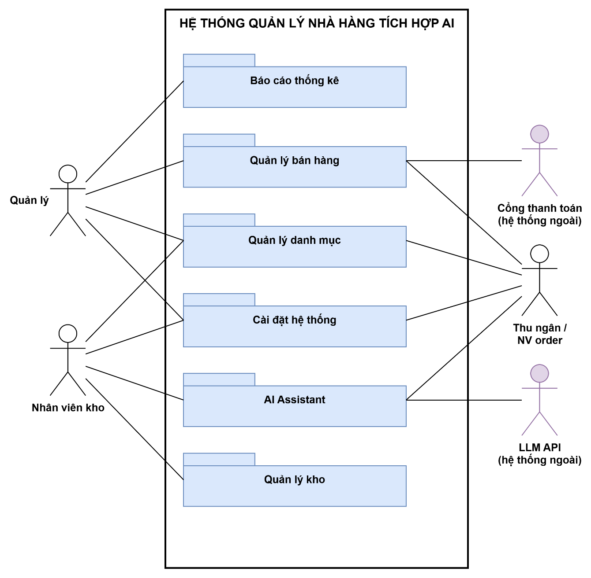

Hình 1. Use Case tổng quan

Hình 2. Use Case quản lý danh mục

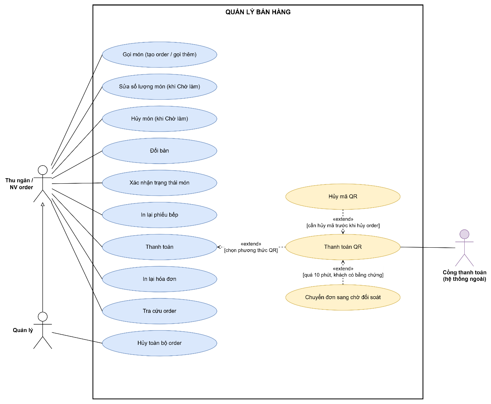

Hình 3. Use Case bán hàng

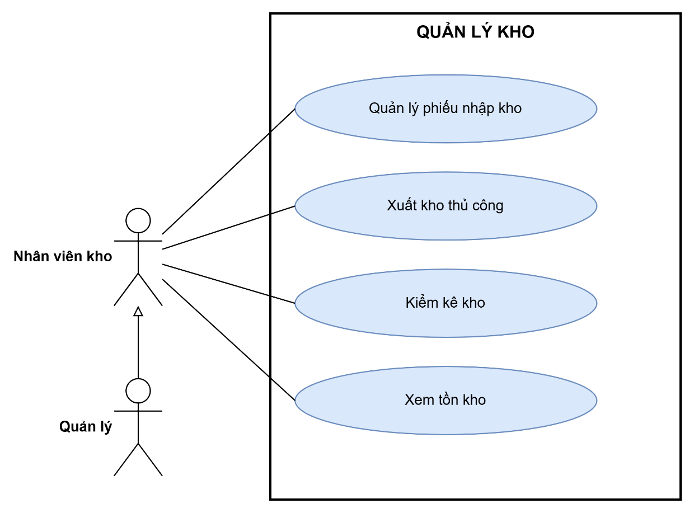

Hình 4. Use Case quản lý kho

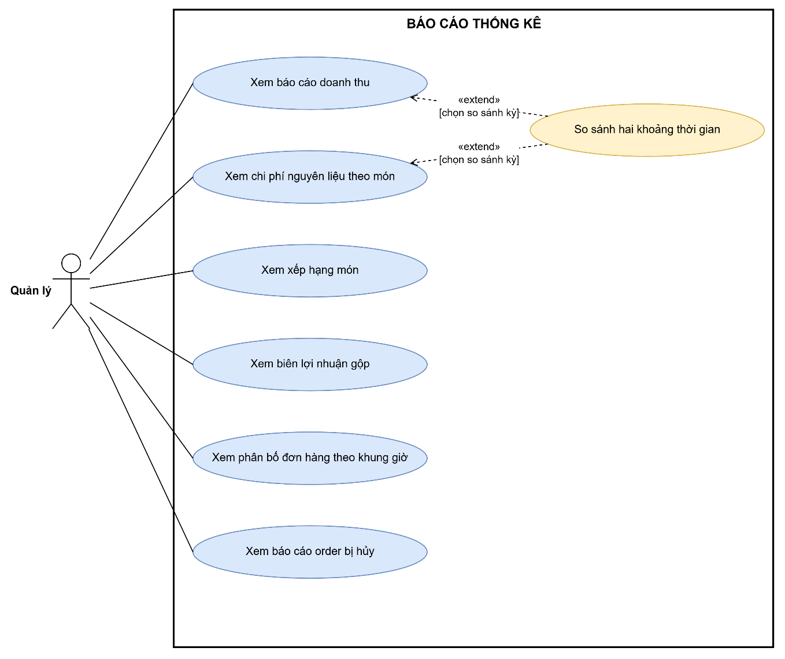

Hình 5. Use Case báo cáo

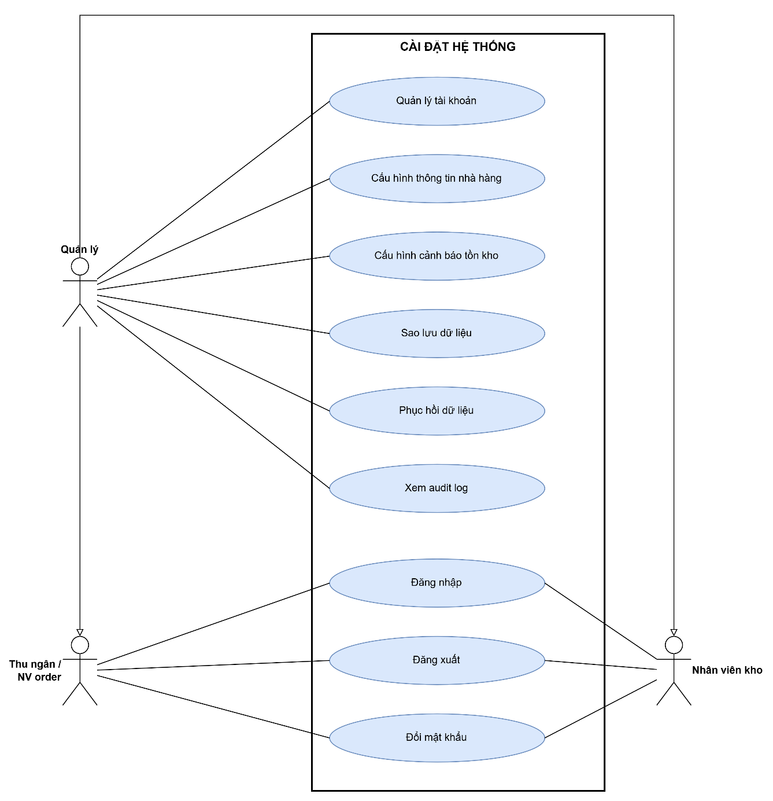

Hình 6. Use Case cài đặt

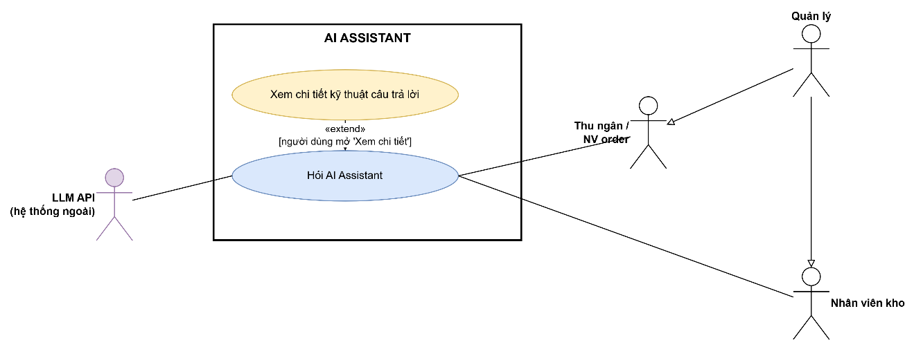

Hình 7. Use Case AI Assistant

## 2.2. Mô hình hóa đối tượng (Class Diagram)

Hệ thống được mô hình hóa theo hướng đối tượng, thể hiện dưới dạng các lớp đối tượng (class), thuộc tính và quan hệ giữa chúng - nhất quán với hướng phân tích thiết kế đối tượng (OOAD) đã dùng cho Use Case (mục 2.1) và Sequence Diagram (mục 2.3). Class Diagram tổng quát của hệ thống được trình bày theo từng nhóm module dưới đây; thuộc tính chi tiết và phương thức của từng lớp được đặc tả đầy đủ tại mục 3.2.1, quan hệ (association, bội số) được ánh xạ sang khóa chính/khóa ngoại tại mục 3.2.2.

Class Diagram được trình bày theo từng module chức năng dưới đây; các lớp thuộc module khác được tham chiếu tới bằng khung nét đứt (không lặp lại đầy đủ thuộc tính) để thể hiện đúng quan hệ liên module mà không làm rối sơ đồ.

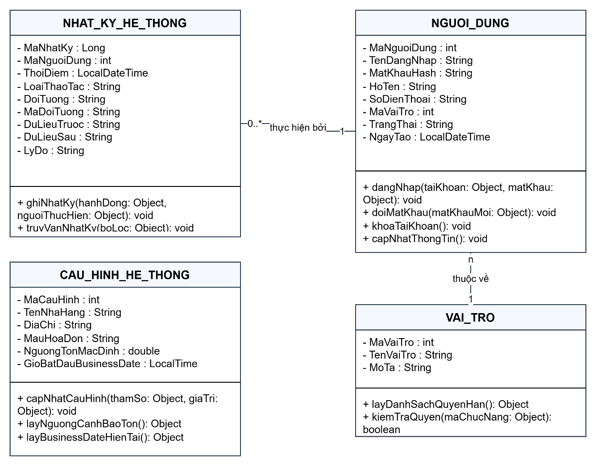

Hình 8. Class Diagram - Module Cài đặt hệ thống

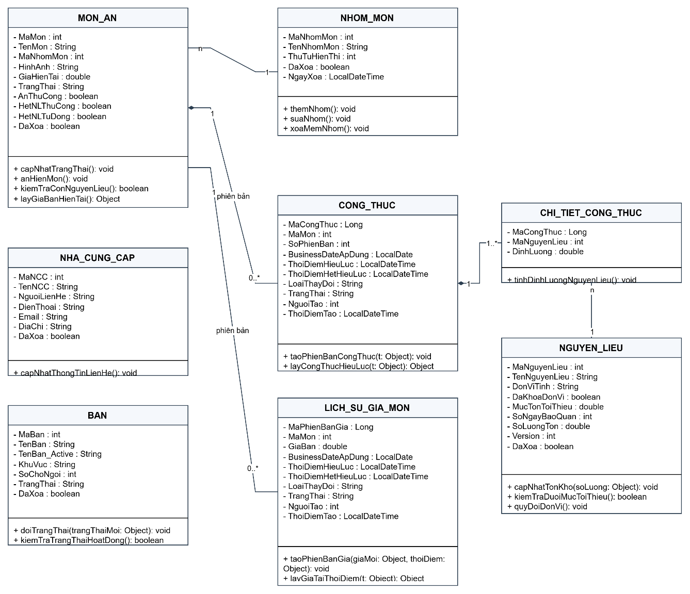

Hình 9. Class Diagram - Module Quản lý danh mục

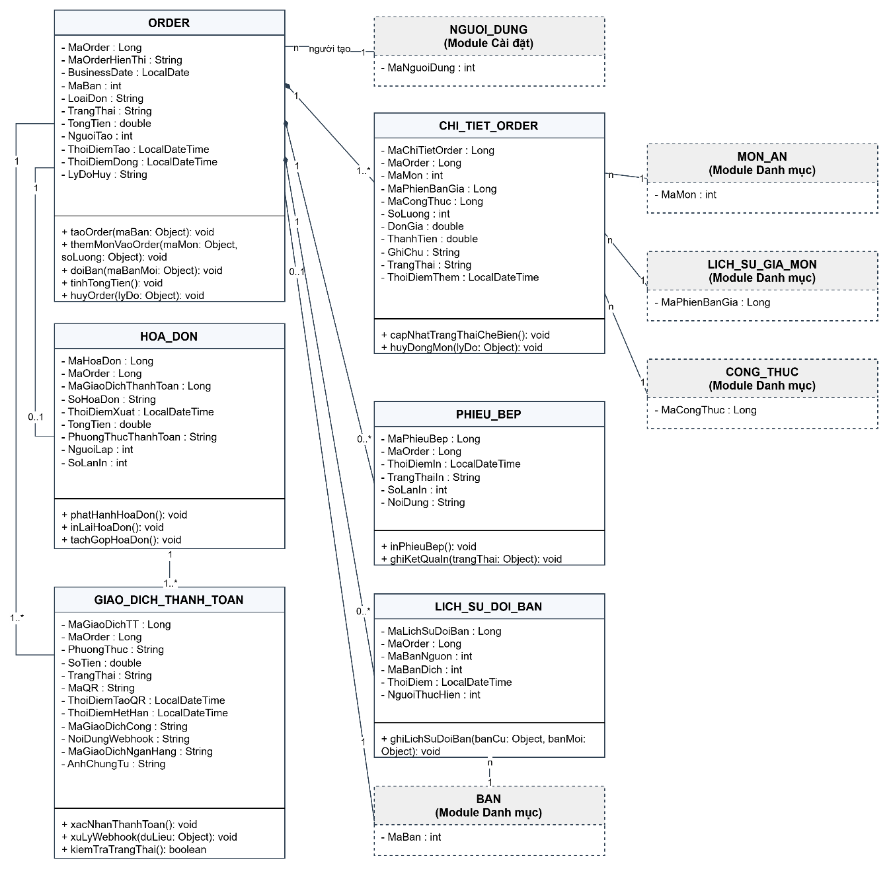

Hình 10. Class Diagram - Module Quản lý bán hàng

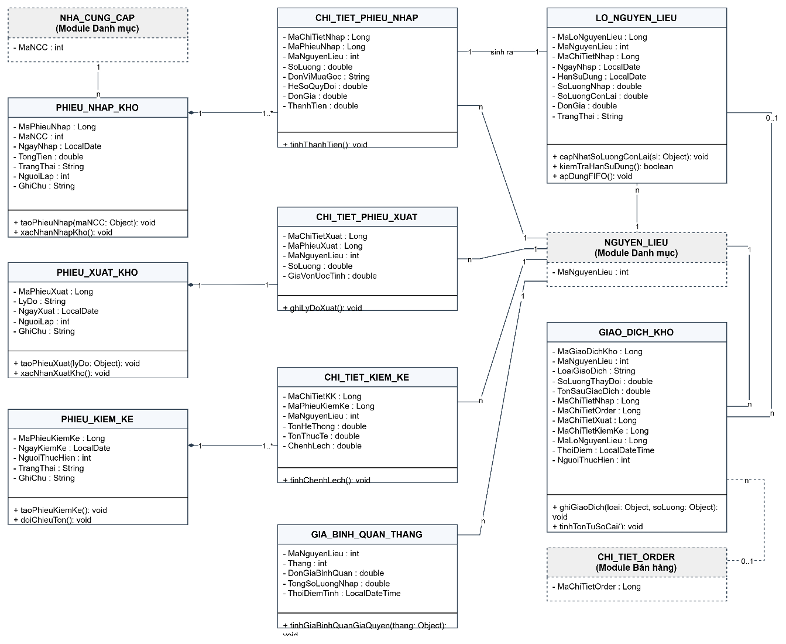

Hình 11. Class Diagram - Module Quản lý kho

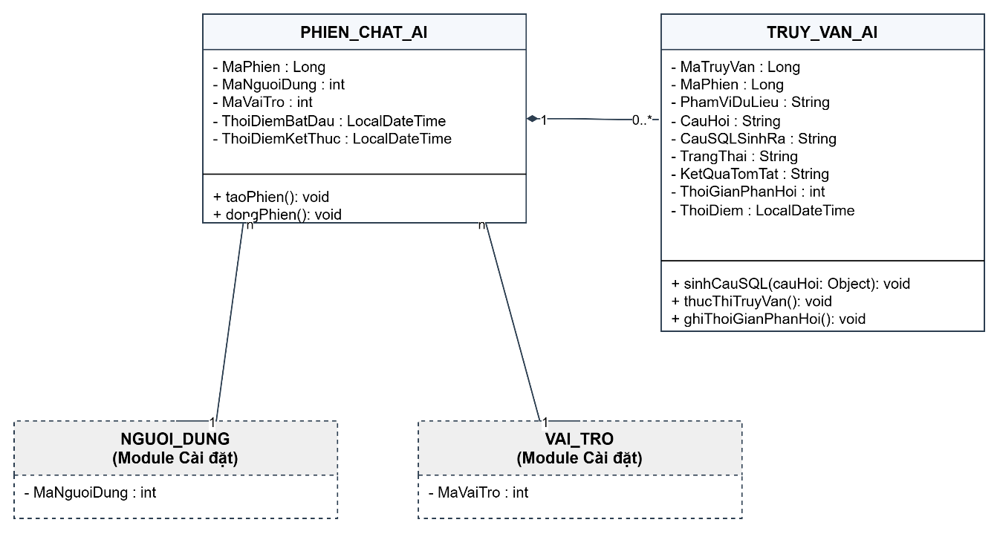

Hình 12. Class Diagram - Module AI Assistant

Module Quản lý danh mục: NHOM_MON, MON_AN, LICH_SU_GIA_MON, CONG_THUC, CHI_TIET_CONG_THUC, NGUYEN_LIEU, NHA_CUNG_CAP, BAN - MON_AN kết hợp (composition) với CONG_THUC theo từng phiên bản hiệu lực; CONG_THUC kết hợp CHI_TIET_CONG_THUC, mỗi dòng liên kết tới một NGUYEN_LIEU.

Module Quản lý bán hàng: ORDER, CHI_TIET_ORDER, LICH_SU_DOI_BAN, HOA_DON, GIAO_DICH_THANH_TOAN, PHIEU_BEP - ORDER kết hợp nhiều CHI_TIET_ORDER (1--n), mỗi CHI_TIET_ORDER tham chiếu một MON_AN; ORDER liên kết 1--1 với HOA_DON sau khi chốt, HOA_DON liên kết 1--n với GIAO_DICH_THANH_TOAN.

Module Quản lý kho: PHIEU_NHAP_KHO, CHI_TIET_PHIEU_NHAP, LO_NGUYEN_LIEU, PHIEU_XUAT_KHO, CHI_TIET_PHIEU_XUAT, PHIEU_KIEM_KE, CHI_TIET_KIEM_KE, GIAO_DICH_KHO, GIA_BINH_QUAN_THANG - mỗi CHI_TIET_PHIEU_NHAP sinh ra một LO_NGUYEN_LIEU; mọi lớp biến động (nhập/xuất/kiểm kê) đều phát sinh bản ghi GIAO_DICH_KHO, NGUYEN_LIEU chỉ giữ số tồn dẫn xuất.

Module Báo cáo thống kê: Không định nghĩa lớp riêng; module đọc (read-only) từ các lớp ở trên thông qua các lớp dịch vụ/truy vấn tổng hợp (report service).

Module Cài đặt hệ thống: VAI_TRO, NGUOI_DUNG, CAU_HINH_HE_THONG, NHAT_KY_HE_THONG - NGUOI_DUNG liên kết n--1 với VAI_TRO; mọi thao tác rủi ro cao trên các lớp khác đều phát sinh một NHAT_KY_HE_THONG.

Module AI Assistant: PHIEN_CHAT_AI, TRUY_VAN_AI - PHIEN_CHAT_AI kết hợp nhiều TRUY_VAN_AI (1--n); TRUY_VAN_AI chỉ đọc dữ liệu qua các view phân quyền dựng trên các lớp nghiệp vụ ở trên.

## 2.3. Mô hình hóa tương tác (Sequence Diagram)

Năm sơ đồ tuần tự dưới đây mô tả luồng xử lý của các use case chính, tương ứng với đặc tả chức năng tại mục 2.4.

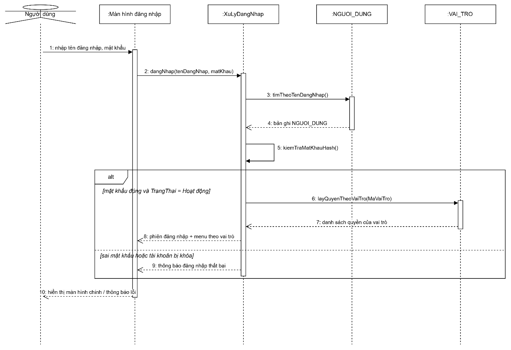

Hình 13. SD-01 - Đăng nhập và phân quyền theo vai trò

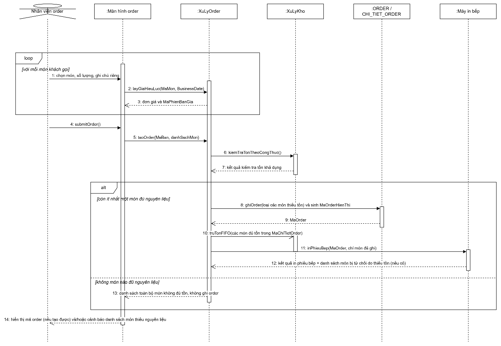

Hình 14. SD-02 - Lập và gửi order xuống bếp

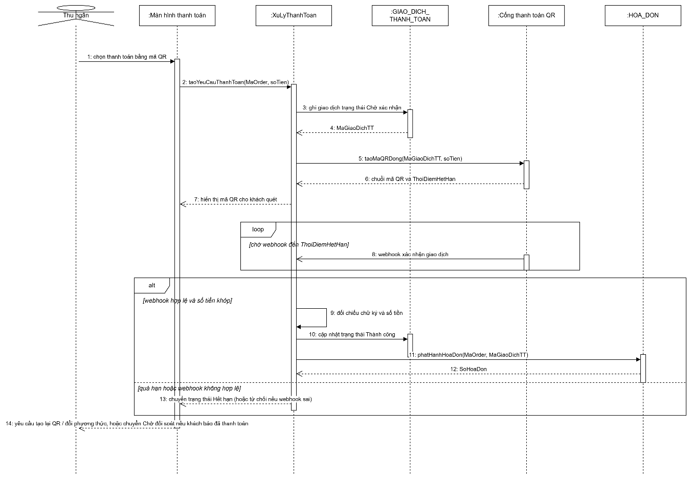

Hình 15. SD-03a - Thanh toán bằng mã QR và phát hành hóa đơn

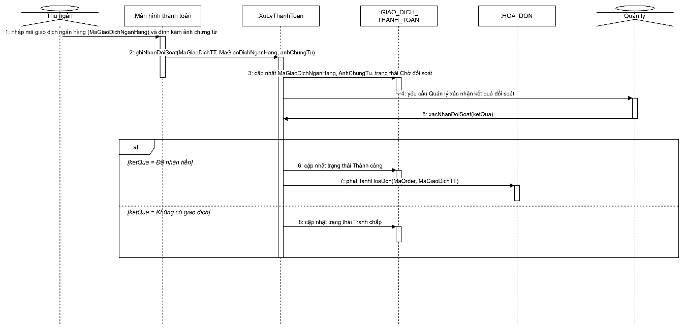

Hình 16. SD-03b - Thanh toán bằng mã QR và phát hành hóa đơn

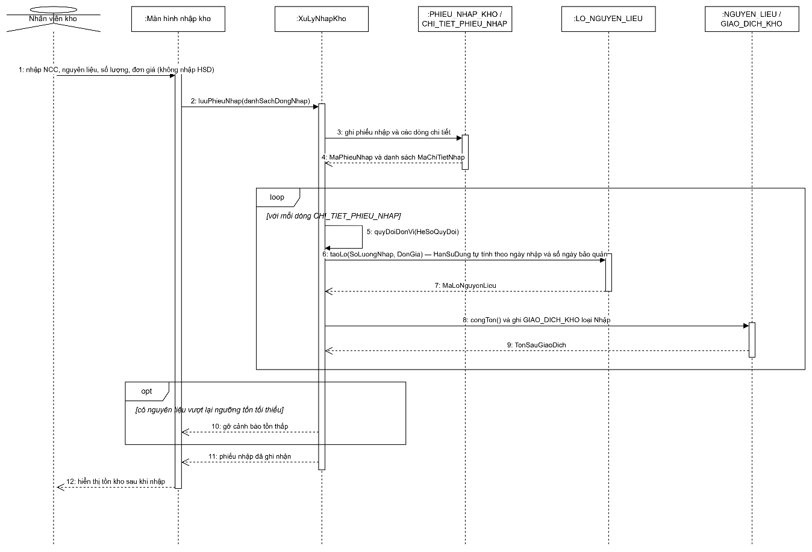

Hình 17. SD-04 - Nhập kho và tạo lô nguyên liệu

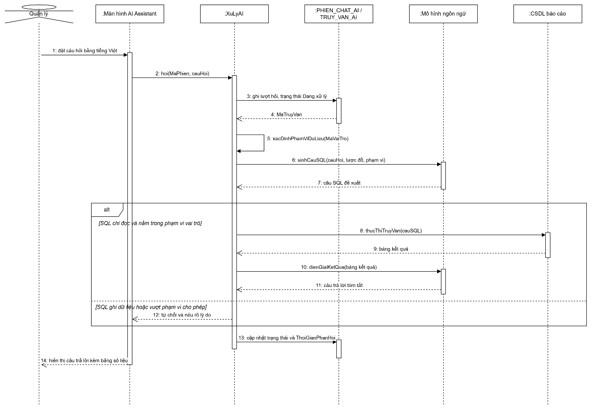

Hình 18. SD-05 - Hỏi AI Assistant

## 2.4. Đặc tả chức năng

### 2.4.1. Module 1 - Quản lý danh mục

Nguyên tắc xóa chung (áp dụng cho toàn bộ Module 1): mọi thao tác "xóa" trong Module Quản lý danh mục (nhóm món, món ăn, nguyên liệu, nhà cung cấp, bàn) đều là xóa mềm (soft delete) nếu đối tượng đã từng được dữ liệu vận hành/lịch sử tham chiếu (order, phiếu nhập kho, công thức chế biến, báo cáo). Đối tượng bị xóa mềm không còn xuất hiện ở các màn hình vận hành/lựa chọn mới nhưng vẫn giữ trong cơ sở dữ liệu để đảm bảo toàn vẹn dữ liệu lịch sử. Đối tượng chưa từng được tham chiếu bởi dữ liệu nào thì được xóa vĩnh viễn.

FR-CAT-01 - Quản lý nhóm món: Quản lý được thêm, sửa, xóa, sắp xếp danh sách nhóm món, làm cơ sở phân loại món ăn.

FR-CAT-02 - Quản lý món ăn: Quản lý được thêm, sửa, xóa, tìm kiếm món ăn với các thuộc tính: tên, giá bán, nhóm món (mỗi món chọn đúng một nhóm), hình ảnh.

FR-CAT-03 - Điều kiện xóa nhóm món: Một nhóm món còn ít nhất một món ăn chưa xóa mềm thì không cho xóa nhóm; nhóm chỉ xóa được khi toàn bộ món từng thuộc nhóm đã ở trạng thái xóa mềm. Nhóm chưa từng có món nào được xóa vĩnh viễn. Việc xóa nhóm món được ghi vào audit log (FR-SET-08).

FR-CAT-04 - Xóa món ăn là xóa mềm: Món vẫn được lưu và hiển thị trong danh mục quản trị (tra cứu, báo cáo, lịch sử order cũ) nhưng biến mất khỏi các màn hình vận hành; không có chức năng xóa vĩnh viễn (hard delete) món ăn. Việc xóa mềm món ăn được ghi vào audit log (FR-SET-08).

FR-CAT-05 - Xử lý thay đổi đang chờ khi xóa mềm món: Nếu món bị xóa mềm trong khi đang có thay đổi giá/công thức 'chờ áp dụng', hệ thống tự động hủy thay đổi đang chờ đó.

FR-CAT-06 - Trạng thái mặc định của món mới tạo: Món ăn mới tạo mặc định ở trạng thái 'Nháp - chưa cấu hình công thức' (chưa hiển thị ở màn hình gọi món), cho đến khi được gán công thức chế biến lần đầu.

FR-CAT-07 - Gán công thức chế biến: Mỗi món ăn gắn với một công thức chế biến, gồm danh sách nguyên liệu và định lượng tương ứng theo đúng đơn vị tính.

FR-CAT-08 - Lên lịch áp dụng thay đổi công thức theo Business Date: Quản lý chọn Business Date áp dụng cho thay đổi công thức; mặc định là Business Date kế tiếp, Quản lý có thể chọn sang bất kỳ Business Date nào trong tương lai nhưng không được chọn Business Date đã bắt đầu hoặc đã kết thúc. Phiên bản mới có hiệu lực từ đúng 06:00 của Business Date được chọn, áp dụng cho order tạo từ thời điểm đó trở đi và không ảnh hưởng đến công thức đã được ghi nhận trong các order tạo trước thời điểm hiệu lực; hệ thống lưu lịch sử các phiên bản công thức.

FR-CAT-09 - Giới hạn một thay đổi công thức đang chờ áp dụng: Mỗi món ăn chỉ có tối đa một thay đổi công thức 'chờ áp dụng' tại một thời điểm; thay đổi mới ghi đè thay đổi cũ.

FR-CAT-10 - Hủy thay đổi công thức đang chờ áp dụng: Quản lý có thể hủy một thay đổi công thức đang 'chờ áp dụng' trước khi có hiệu lực. Thao tác hủy được ghi vào audit log (FR-SET-08).

FR-CAT-11 - Chuyển trạng thái món khi được gán công thức lần đầu: Ngay khi được gán công thức lần đầu, món tự động chuyển từ 'Nháp' sang 'Hoạt động' hoặc 'Hết nguyên liệu' theo tồn kho hiện có.

FR-CAT-12 - Quản lý nguyên liệu: Quản lý, Nhân viên kho thêm/sửa/xóa/tìm kiếm nguyên liệu: tên, đơn vị tính, mức tồn tối thiểu riêng (nếu không cấu hình, nguyên liệu dùng mức tồn tối thiểu mặc định của hệ thống).

FR-CAT-13 - Xóa nguyên liệu theo nguyên tắc xóa mềm: Nguyên liệu đã có trong công thức chế biến hoặc phiếu nhập kho lịch sử chỉ được xóa mềm. Việc xóa được ghi vào audit log (FR-SET-08).

FR-CAT-14 - Khóa sửa đơn vị tính sau khi đã tham chiếu: Một khi nguyên liệu đã có phiếu nhập kho hoặc dùng trong công thức, hệ thống khóa không cho sửa đơn vị tính nữa.

FR-CAT-15 - Quản lý nhà cung cấp: Quản lý, Nhân viên kho quản lý danh sách nhà cung cấp: thông tin liên hệ, lịch sử nhập hàng.

FR-CAT-16 - Xóa nhà cung cấp theo nguyên tắc xóa mềm: Nhà cung cấp đã có lịch sử nhập hàng chỉ được xóa mềm. Việc xóa được ghi vào audit log (FR-SET-08).

FR-CAT-17 - Quản lý sơ đồ bàn: Quản lý thêm/sửa/xóa bàn; Thu ngân/Nhân viên order xem trạng thái Trống/Đang phục vụ.

FR-CAT-18 - Chuyển trạng thái bàn tự động: Bàn chuyển sang Đang phục vụ khi order được tạo; tự động về Trống khi order thanh toán thành công hoặc khi đổi bàn (bàn nguồn).

FR-CAT-19 - Điều kiện xóa bàn: Không cho xóa bàn đang Đang phục vụ. Bàn đã từng gắn với order lịch sử chỉ được xóa mềm. Việc xóa bàn được ghi vào audit log (FR-SET-08).

FR-CAT-20 - Cập nhật giá bán và lên lịch theo Business Date: Cập nhật giá bán và chọn Business Date áp dụng; mặc định là Business Date kế tiếp, Quản lý có thể chọn sang bất kỳ Business Date nào trong tương lai nhưng không được chọn Business Date đã bắt đầu hoặc đã kết thúc. Phiên bản giá mới có hiệu lực từ đúng 06:00 của Business Date được chọn và không ảnh hưởng đến giá đã được ghi nhận trong các order tạo trước thời điểm hiệu lực.

FR-CAT-21 - Giới hạn một thay đổi giá đang chờ áp dụng: Tối đa một thay đổi giá 'chờ áp dụng' cho mỗi món tại một thời điểm; thay đổi mới ghi đè.

FR-CAT-22 - Hủy thay đổi giá đang chờ áp dụng: Quản lý có thể hủy thay đổi giá 'chờ áp dụng' trước khi có hiệu lực. Thao tác hủy được ghi vào audit log (FR-SET-08).

FR-CAT-23 - Sửa trực tiếp giá bán/công thức đang áp dụng: Quản lý có thể sửa trực tiếp giá/công thức hiện tại, áp dụng ngay, dành cho khắc phục gấp sai sót đã tồn tại; ghi vào audit log (FR-SET-08).

FR-CAT-24 - Không ảnh hưởng đến thay đổi đang chờ áp dụng theo lịch: Sửa trực tiếp và lên lịch theo Business Date là hai cơ chế độc lập; sửa trực tiếp không hủy/ghi đè thay đổi đang chờ theo lịch.

FR-CAT-25 - Ghi nhận phiên bản khi sửa trực tiếp: Mỗi lần sửa trực tiếp được ghi thành một phiên bản mới trong lịch sử giá/công thức, hiệu lực đúng thời điểm sửa.

FR-CAT-26 - Ẩn/hiện món thủ công và các trạng thái vận hành: Quản lý ẩn/hiện tạm thời một món khỏi danh sách gọi món (thủ công, độc lập với ẩn tự động theo tồn kho). Trạng thái vận hành: Hoạt động / Hết nguyên liệu.

FR-CAT-27 - Hai nguyên nhân độc lập gây trạng thái Hết nguyên liệu: FR-CAT-27a - tự động do tồn kho không đủ, tự tắt khi kho cập nhật đủ; FR-CAT-27b - Quản lý bật thủ công, chỉ Quản lý tắt được. Món chỉ hiển thị khi cả hai đều tắt.

FR-CAT-28 - Trạng thái xóa độc lập: Xóa món (FR-CAT-04) là trạng thái riêng biệt (xóa mềm), độc lập với Hoạt động/Hết nguyên liệu/Nháp.

### 2.4.2. Module 2 - Quản lý bán hàng

FR-SALE-01 - Khởi tạo order: Nhân viên order chọn một bàn Trống hoặc đánh dấu đơn mang về, chọn một hoặc nhiều món từ danh sách món Hoạt động, sau đó bấm Submit để chính thức tạo order.

FR-SALE-02 - Ghi chú/yêu cầu đặc biệt cho món: Nhân viên order nhập ghi chú văn bản tự do cho từng món (ví dụ: 'không hành'); ghi chú gắn với từng dòng món, không bắt buộc, in kèm trên phiếu bếp; không ảnh hưởng công thức hay trừ kho.

FR-SALE-03 - Thời điểm ghi nhận order: Order chỉ ghi nhận tại thời điểm bấm Submit; không lưu order rỗng. Khi submit: bàn chuyển Đang phục vụ, kho bắt đầu bị trừ, hệ thống tự động in phiếu bếp.

FR-SALE-04 - Sinh mã order tự động: Hệ thống tự sinh mã order theo định dạng ORD-ddMMyy-nnn (ví dụ ORD-270826-015, chỉ mang tính minh họa định dạng, không phải dữ liệu thực), trong đó nnn bắt đầu từ 001 cho mỗi Business Date và tăng tuần tự trong Business Date đó; mã order là duy nhất trong toàn hệ thống, giữ nguyên suốt vòng đời order và dùng làm định danh tra cứu. Nếu transaction rollback làm phát sinh khoảng số bị bỏ trống, số đã cấp không được tái sử dụng.

FR-SALE-05 - Xử lý hết tồn kho ngay trước khi submit: Nếu tồn kho vừa hết trong lúc chọn món, hệ thống từ chối riêng món liên quan, giữ nguyên các món hợp lệ khác.

FR-SALE-06 - Thêm món vào order đang mở: Nhân viên order thêm món mới vào order đang mở (chưa thanh toán); mỗi lần thêm, in bổ sung phiếu bếp.

FR-SALE-07 - Điều kiện sửa/xóa món đã có trong order: Chỉ được sửa số lượng/xóa món khi món đang 'Chờ làm'; từ 'Đã xác nhận xong' trở đi không được sửa/xóa. Giữa 'Chờ làm' và 'Đã xác nhận xong' không có trạng thái trung gian 'Đang chế biến'; vì vậy quy tắc hoàn kho tự động (FR-SALE-11) chỉ áp dụng khi hủy/giảm số lượng món đang ở 'Chờ làm' - ngay cả khi phiếu bếp đã được in cho món đó - vì việc in phiếu chỉ là thông báo cho bếp, không làm đổi trạng thái món; món đã chuyển 'Đã xác nhận xong' thì không được hủy/sửa nên không phát sinh tình huống hoàn kho ở trạng thái này.

Vì bếp không thao tác trực tiếp trên hệ thống, việc xác minh món đã bắt đầu chế biến hay chưa là bước thủ công: nhân viên order/thu ngân trao đổi trực tiếp (gọi miệng) với bếp trước khi xác nhận hủy món đã in phiếu. Đây là biện pháp kiểm soát ngoài hệ thống nhằm hạn chế rủi ro hoàn kho sai khi món đã được chế biến; hệ thống không ghi nhận hay kiểm tra bước xác minh này.

FR-SALE-08 - Kiểm tra tồn kho khi thêm/tăng số lượng: Món hết tồn tự động ẩn khỏi danh sách chọn; khi tăng số lượng món đã có, hệ thống kiểm tra tồn khả dụng, từ chối nếu không đủ.

FR-SALE-09 - Gọi thêm món trong bữa ăn: Khách có thể gọi thêm món trong cùng order khi chưa thanh toán.

FR-SALE-10 - Trạng thái xử lý của món: Mỗi món có trạng thái: Chờ làm → Đã xác nhận xong → Đã phục vụ; nhân viên cập nhật dựa trên xác nhận thực tế từ bếp.

FR-SALE-11 - Hủy một món trong order: Chỉ hủy được món đang 'Chờ làm'; mỗi lượt hủy ghi lại người thực hiện, thời điểm, số lượng, lý do (audit log).

FR-SALE-12 - Tự động đóng order khi toàn bộ món bị hủy: Nếu toàn bộ món trong order đã bị hủy, hệ thống tự đóng order: không phát sinh hóa đơn, bàn về Trống, hoàn kho đầy đủ.

FR-SALE-13 - Đổi bàn cho order đang mở: Chuyển order từ bàn hiện tại sang bàn Trống khác, khi order chưa vào luồng thanh toán; bàn đích chuyển Đang phục vụ, bàn nguồn về Trống. Thao tác đổi bàn được ghi vào audit log (FR-SET-08).

FR-SALE-14 - Chọn phương thức thanh toán: Thu ngân chọn phương thức: tiền mặt hoặc quét mã QR do hệ thống tạo cùng hóa đơn (không hỗ trợ chuyển khoản thủ công ngoài luồng QR).

FR-SALE-15 - Thanh toán QR: Khi Thu ngân chọn thanh toán QR, hệ thống tạo một giao dịch QR cho đúng order với số tiền bằng đúng số tiền phải thanh toán; giao dịch khởi tạo ở trạng thái 'Chờ xác nhận' và có thời hạn 10 phút kể từ thời điểm tạo. Trong thời gian giao dịch QR hiện tại còn hiệu lực, hệ thống không tạo thêm một giao dịch QR khác cho cùng order.

FR-SALE-16 - Xác nhận thanh toán qua webhook: Khi nhận webhook, backend xác thực webhook, đối chiếu giao dịch, số tiền và trạng thái; webhook hợp lệ và đúng số tiền chuyển giao dịch sang 'Thành công'. Webhook trùng được xử lý idempotent, không tạo hóa đơn hoặc ghi nhận doanh thu lần thứ hai. Webhook không hợp lệ, sai số tiền hoặc không xác định được giao dịch bị từ chối và được ghi log.

FR-SALE-17 - Xử lý timeout thanh toán QR: Sau 10 phút chưa nhận được xác nhận, giao dịch QR chuyển từ 'Chờ xác nhận' sang 'Hết hạn'. Nếu khách báo đã thanh toán nhưng hệ thống chưa ghi nhận, Thu ngân chuyển giao dịch từ 'Hết hạn' sang 'Chờ đối soát'; khi xác minh được thanh toán hợp lệ, giao dịch chuyển sang 'Thành công', khi xác minh không có thanh toán hợp lệ, giao dịch chuyển sang 'Tranh chấp'. Không cho phép tạo thêm giao dịch QR mới cho order đang 'Chờ đối soát'.

FR-SALE-18 - Quy trình đối soát thủ công: Khi order ở trạng thái 'Chờ đối soát', Thu ngân nhập mã giao dịch ngân hàng/ví điện tử do khách cung cấp vào MaGiaoDichNganHang, có thể đính kèm ảnh chụp xác nhận chuyển khoản (AnhChungTu) làm bằng chứng; hệ thống không tự chuyển trạng thái chỉ dựa trên lời khai của khách. Quản lý là người duy nhất có quyền xác nhận kết quả đối soát, tách vai trò với Thu ngân để tránh một người vừa nhận tiền vừa tự xác nhận: chọn 'Xác nhận đã nhận tiền' thì giao dịch chuyển 'Thành công' và hệ thống tự phát hành hóa đơn (như bước 11–12 của SD-03); chọn 'Không có giao dịch' thì giao dịch chuyển 'Tranh chấp'. Mọi thao tác đối soát (mã giao dịch nhập vào, người xác nhận, thời điểm, kết quả) được ghi audit log.

FR-SALE-19 - In hóa đơn: In hóa đơn hoàn chỉnh sau khi thanh toán thành công, gồm chi tiết từng món, thành tiền, tổng tiền; không tách dòng thuế VAT.

FR-SALE-20 - Khóa order sau tất toán: Sau khi tất toán (kể cả 'chờ đối soát'), hệ thống khóa hoàn toàn order: không cho sửa món, hủy món, hủy hóa đơn hay thanh toán lại.

FR-SALE-21 - Ghi nhận mốc thời gian giao dịch: Mọi giao dịch bán hàng ghi nhận kèm mốc thời gian chi tiết, làm đầu vào cho Báo cáo và AI Assistant.

FR-SALE-22 - Tra cứu/tìm kiếm order: Tra cứu một order cụ thể theo mã order, bàn, khoảng thời gian (Business Date).

FR-SALE-23 - In lại hóa đơn: In lại (reprint) đúng nguyên nội dung hóa đơn gốc đã chốt; không cho chỉnh sửa khi in lại.

FR-SALE-24 - Hủy toàn bộ order chưa thanh toán: Chỉ Quản lý được hủy toàn bộ order chưa thanh toán (kể cả có món 'Đã xác nhận xong'/'Đã phục vụ'); bắt buộc nhập lý do hủy.

FR-SALE-25 - Ngoại lệ khi đang chờ xác nhận thanh toán QR: Không cho hủy toàn order khi đang 'Chờ xác nhận thanh toán' (đã tạo mã QR), phải chủ động hủy mã QR (FR-SALE-29) hoặc chờ hết hạn trước.

FR-SALE-26 - Xử lý sau khi hủy toàn bộ order: Không phát sinh hóa đơn, bàn về Trống; chỉ hoàn kho cho món 'Chờ làm'; ghi vào báo cáo 'giá trị order bị hủy'.

FR-SALE-27 - In phiếu bếp tự động: Khi order được submit hoặc thêm món mới, hệ thống gửi lệnh in phiếu bếp qua máy in nhiệt, gồm bàn/mã đơn, danh sách món, số lượng, ghi chú riêng.

FR-SALE-28 - Xử lý khi in phiếu bếp thất bại: Nếu lệnh in thất bại, hệ thống hiển thị cảnh báo lỗi; nhân viên chủ động bấm in lại sau khi khắc phục sự cố máy in, không giới hạn số lần in lại.

FR-SALE-29 - Hủy mã QR chủ động: Trong thời gian giao dịch QR đang 'Chờ xác nhận' và chưa hết hạn, Thu ngân có thể chủ động hủy giao dịch (ví dụ khách đổi ý sang thanh toán tiền mặt); giao dịch chuyển sang trạng thái 'Đã hủy', không tính vào doanh thu và không chặn việc tạo giao dịch QR mới cho order đó ngay sau đó. Thao tác hủy được ghi audit log (FR-SET-08).

### 2.4.3. Module 3 - Quản lý kho

FR-INV-01 - Ghi nhận phiếu nhập kho: Nhân viên kho ghi nhận phiếu nhập kho gắn với nhà cung cấp: nguyên liệu, số lượng, đơn giá, ngày nhập, quy đổi theo đúng đơn vị tính chuẩn hóa.

FR-INV-02 - Điều kiện sửa/hủy phiếu nhập kho: Được sửa/hủy phiếu nhập nếu chưa có giao dịch xuất kho liên quan phát sinh sau đó; nếu đã có, phải điều chỉnh qua kiểm kê định kỳ. Thao tác sửa/hủy phiếu nhập được ghi vào audit log (FR-SET-08).

FR-INV-03 - Trừ kho tự động: Trừ kho theo công thức ngay khi: order submit lần đầu, thêm món mới, hoặc sửa tăng số lượng món.

FR-INV-04 - Hoàn kho khi hủy/giảm số lượng: Khi món bị hủy hoặc sửa giảm số lượng ở trạng thái 'Chờ làm', hệ thống tự động hoàn nguyên liệu vào kho.

FR-INV-05 - Xuất kho thủ công: Nhân viên kho ghi nhận xuất kho thủ công cho hao hụt, hủy hàng, nguyên liệu hỏng.

FR-INV-06 - Chặn xuất kho thủ công âm tồn: Nếu số lượng xuất vượt tồn khả dụng, hệ thống từ chối và yêu cầu đối chiếu/kiểm kê lại.

FR-INV-07 - Cảnh báo tồn tối thiểu: Hệ thống có một mức tồn tối thiểu mặc định, cấu hình tại phần Cài đặt; mỗi nguyên liệu có thể dùng mức mặc định này hoặc có mức tồn tối thiểu riêng, không nhỏ hơn 0. Cảnh báo được kích hoạt khi tồn khả dụng của một nguyên liệu nhỏ hơn mức tồn tối thiểu đang áp dụng cho nguyên liệu đó.

FR-INV-08 - Kiểm kê định kỳ: Nhân viên kho đối chiếu tồn thực tế với hệ thống, ghi nhận chênh lệch, sau xác nhận hệ thống cập nhật ghi đè lại số lượng tồn hiện tại.

FR-INV-09 - Vai trò bắt buộc trong MVP: Kiểm kê định kỳ là van an toàn duy nhất để điều chỉnh sai lệch tồn kho trước khi cho phép xuất kho thủ công tiếp tục.

FR-INV-10 - Kiểm tra tồn kho khả dụng và tự động ẩn món: Hệ thống kiểm tra tồn khả dụng theo công thức ngay khi tồn kho thay đổi; tự động chuyển món sang 'Tự động ẩn do hết tồn kho' khi không đủ.

FR-INV-11 - Xử lý tranh chấp tồn kho: Khi nhiều thao tác tranh chấp một nguyên liệu, hệ thống kiểm tra lại tồn tại thời điểm submit, xử lý theo nguyên tắc submit trước được trước; không cho tồn kho âm.

FR-INV-12 - Xem danh sách tồn kho: Xem danh sách tồn kho hiện tại: tên, đơn vị tính, số lượng tồn khả dụng, mức tồn tối thiểu, trạng thái; tìm kiếm/lọc theo tên và trạng thái cảnh báo.

### 2.4.4. Module 4 - Báo cáo thống kê

FR-REP-01 - Báo cáo doanh thu: Hiển thị doanh thu theo Business Date/tuần/tháng/năm, theo bàn và theo hình thức thanh toán.

FR-REP-02 - Xử lý giao dịch chờ đối soát trong báo cáo doanh thu: Giao dịch 'chờ đối soát' tính tạm vào doanh thu; nếu sau bị Quản lý gắn cờ 'tranh chấp thanh toán', hệ thống điều chỉnh trừ lùi khỏi doanh thu thực nhận.

FR-REP-03 - Xếp hạng món ăn: Xếp hạng món bán chạy/ít bán theo số lượng và doanh thu, trong khoảng thời gian lựa chọn.

FR-REP-04 - Biên lợi nhuận gộp: Tính ở mức tổng toàn nhà hàng theo chu kỳ tháng = Doanh thu bán hàng − Giá vốn nguyên liệu tiêu hao.

FR-REP-05 - Cấu thành giá vốn nguyên liệu tiêu hao: Gồm: FR-REP-05a - nguyên liệu theo phiên bản công thức có hiệu lực tại thời điểm order tạo, nhân đơn giá bình quân gia quyền trong tháng; FR-REP-05b - chi phí hao hụt/hư hỏng/hết hạn phải xuất bỏ.

FR-REP-06 - Chi phí nguyên liệu theo món (tham khảo): Hiển thị riêng chi phí nguyên liệu theo từng món (không kèm hao hụt) để tham khảo, không quy thành biên lợi nhuận theo món.

FR-REP-07 - Phân bố đơn hàng theo khung giờ: Hiển thị phân bố số lượng đơn hàng và doanh thu theo khung giờ trong ngày và theo ngày trong tuần.

FR-REP-08 - So sánh hai khoảng thời gian: Cho phép so sánh doanh thu/chi phí giữa hai khoảng thời gian và hiển thị phần trăm chênh lệch.

FR-REP-09 - Hiển thị dạng bảng và biểu đồ: Báo cáo hiển thị dưới dạng bảng biểu và biểu đồ trực quan.

FR-REP-10 - Báo cáo order bị hủy: Hiển thị tổng giá trị và số lượng order bị hủy toàn bộ (kèm lý do), theo Business Date/tuần/tháng, tách biệt khỏi doanh thu.

### 2.4.5. Module 5 - Cài đặt hệ thống

FR-SET-01 - Quản lý tài khoản: Quản lý tạo/sửa/khóa tài khoản người dùng và gán một trong ba vai trò. Các thao tác này được ghi vào audit log (FR-SET-08).

FR-SET-02 - Đăng nhập/đăng xuất/đổi mật khẩu: Người dùng tự đăng nhập/đăng xuất bằng tài khoản được cấp; tự đổi mật khẩu bất kỳ lúc nào; Quản lý đặt lại mật khẩu khi người dùng quên. Riêng thao tác Quản lý đặt lại mật khẩu hộ được ghi vào audit log (FR-SET-08); đăng nhập/đăng xuất và tự đổi mật khẩu thông thường không thuộc phạm vi audit log này.

FR-SET-03 - Giới hạn theo vai trò: Hệ thống giới hạn phạm vi truy cập chức năng và dữ liệu theo vai trò đã gán. Quản lý kế thừa toàn bộ quyền của Thu ngân/Nhân viên order và Nhân viên kho.

FR-SET-04 - Cấu hình thông tin chung: Quản lý cấu hình thông tin chung của nhà hàng: tên, địa chỉ, mẫu hóa đơn.

FR-SET-05 - Cấu hình cảnh báo tồn kho: Quản lý cấu hình tham số cảnh báo tồn kho mặc định.

FR-SET-06 - Xuất bản sao dữ liệu thủ công: Hệ thống cung cấp chức năng xuất bản sao dữ liệu thủ công. Thao tác này được ghi vào audit log (FR-SET-08).

FR-SET-07 - Sao lưu tự động (mở rộng): (Mở rộng) Hệ thống tự động sao lưu và phục hồi dữ liệu theo lịch. Thao tác phục hồi (restore) dữ liệu, dù thủ công hay theo lịch, đều được ghi vào audit log (FR-SET-08).

FR-SET-08 - Audit log cho thao tác rủi ro cao: Ghi nhật ký cho các thao tác rủi ro cao: hủy toàn bộ order, hủy món, chuyển trạng thái QR sang chờ đối soát, chủ động hủy giao dịch QR (FR-SALE-29), xuất kho thủ công, điều chỉnh qua kiểm kê, thay đổi giá/công thức theo lịch và sửa trực tiếp, hủy lịch thay đổi giá/công thức đang chờ áp dụng, xóa nhóm món/món ăn/nguyên liệu/nhà cung cấp/bàn, sửa/hủy phiếu nhập kho, đổi bàn cho order, tạo/sửa/khóa tài khoản người dùng và gán vai trò, Quản lý đặt lại mật khẩu hộ người dùng, xuất bản sao và phục hồi dữ liệu.

FR-SET-09 - Nội dung tối thiểu và quyền xem nhật ký: Mỗi bản ghi lưu tối thiểu: người thực hiện, thời điểm, loại thao tác, dữ liệu trước/sau; Quản lý xem toàn bộ.

### 2.4.6. Module 6 - AI Assistant

FR-AI-01 - Trợ lý AI riêng theo vai trò: Mỗi vai trò sử dụng một trợ lý AI (chat) riêng biệt, đặt câu hỏi bằng tiếng Việt trong đúng phạm vi dữ liệu được phép.

FR-AI-02 - Nội dung AI của Quản lý có thể trả lời: Doanh thu, biên lợi nhuận, tồn kho, món bán chạy/ít bán, chi phí và giá nhập nguyên liệu, báo cáo order bị hủy... (đầy đủ phạm vi của cả ba vai trò, theo nguyên tắc kế thừa tại FR-SET-03).

FR-AI-03 - Nội dung AI của Thu ngân/Nhân viên order có thể trả lời: Doanh thu, hóa đơn, thông tin bán hàng thuộc phạm vi vai trò; không trả lời giá nhập hàng/lợi nhuận theo món.

FR-AI-04 - Nội dung AI của Nhân viên kho có thể trả lời: Tồn kho hiện tại, nguyên liệu, lịch sử nhập/xuất, cảnh báo tồn tối thiểu; không trả lời doanh thu/hóa đơn/lợi nhuận.

FR-AI-05 - Không truy cập chéo dữ liệu giữa các vai trò: Trợ lý AI của một vai trò không được dùng dữ liệu thuộc vai trò khác, kể cả khi người dùng cố tình hỏi vượt quyền.

FR-AI-06 - Yêu cầu làm rõ khi không xác định được đối tượng: Khi không xác định chính xác món/nguyên liệu/khoảng thời gian, hệ thống yêu cầu người dùng làm rõ hoặc diễn đạt lại.

FR-AI-07 - Hình thức trả lời: Trả lời bằng tiếng Việt, luôn kèm bảng số liệu gốc và ghi chú phạm vi dữ liệu đã dùng. Loại biểu đồ được chọn theo quy tắc cố định: dữ liệu biến động theo thời gian dùng line chart; so sánh giữa các nhóm/đối tượng dùng bar chart; dữ liệu cơ cấu/tỷ trọng dùng doughnut chart; trường hợp không phù hợp với ba dạng trên chỉ hiển thị bảng.

FR-AI-08 - Xem chi tiết kỹ thuật của câu trả lời: Người dùng có thể mở mục 'Xem chi tiết' (thu gọn mặc định) để xem thông tin kỹ thuật, phục vụ kiểm chứng.

FR-AI-09 - Thông báo khi không thể trả lời: Khi không tạo được câu trả lời hợp lệ, hệ thống thông báo và gợi ý diễn đạt lại, không im lặng hoặc trả kết quả sai.

# CHƯƠNG 3: THIẾT KẾ HỆ THỐNG

## 3.1. Thiết kế kiến trúc hệ thống

### 3.1.1. Kiến trúc tổng thể

Hệ thống áp dụng kiến trúc ba tầng, mô hình client-server, backend module hóa theo nghiệp vụ:

Tầng giao diện (Presentation): ứng dụng web Next.js, phục vụ ba vai trò người dùng và giao diện chat AI Assistant.

Tầng ứng dụng (Application): backend Python/FastAPI, xử lý cả nghiệp vụ quản lý (danh mục, bán hàng, kho, báo cáo, cài đặt) và dịch vụ AI Assistant (chuẩn hóa câu hỏi, sinh SQL, kiểm duyệt, thực thi, diễn giải kết quả).

Tầng dữ liệu (Data): MySQL, kèm tập view riêng theo từng vai trò (Quản lý/Thu ngân/Nhân viên kho) để kiểm soát phân quyền và tách biệt AI Assistant khỏi các bảng nghiệp vụ lõi.

### 3.1.2. Kiến trúc phần mềm

Câu lệnh SQL do LLM sinh ra được kiểm duyệt bằng thư viện sqlglot trước khi thực thi (chỉ chấp nhận SELECT trên view được phân quyền, thực thi bằng tài khoản MySQL chỉ đọc riêng theo từng vai trò, mỗi tài khoản chỉ được GRANT SELECT trên đúng tập view dành cho vai trò đó - không dùng chung một tài khoản chỉ đọc cho mọi vai trò). Phương án chính dùng LLM thương mại qua API (GPT-4o-mini/Gemini Flash); phương án dự phòng dùng mô hình nguồn mở tại chỗ (Qwen2.5-Coder/Llama 3.1 qua Ollama), đồng thời là một cấu hình đối chứng trong thực nghiệm đánh giá. Ba nhóm biểu đồ phân tích thiết kế chính dự kiến xây dựng theo hướng đối tượng: Use Case theo từng module kèm trang tổng quan và cây kế thừa actor, Class Diagram mô tả các lớp đối tượng và quan hệ giữa chúng, và Sequence Diagram mô tả luồng tương tác cho các use case chính, đặc biệt quy trình xử lý của AI Assistant.

## 3.2. Thiết kế cơ sở dữ liệu

Cơ sở dữ liệu được thiết kế trên hệ quản trị MySQL theo mô hình quan hệ, chuẩn hóa tới dạng chuẩn 3 (3NF) và chỉ phi chuẩn hóa có kiểm soát ở một số thuộc tính dẫn xuất (tồn kho hiện tại, giá bán hiện tại, thành tiền) nhằm giảm chi phí truy vấn cho các màn hình vận hành và cho AI Assistant. Thiết kế bám sát các đặc tả chức năng đã trình bày ở mục 2.4 và tuân thủ bốn nguyên tắc sau; các lớp đối tượng và quan hệ giữa chúng dưới đây kế thừa trực tiếp Class Diagram đã trình bày ở mục 2.2, được bổ sung khóa chính/khóa ngoại và kiểu dữ liệu cụ thể để hiện thực hóa trên MySQL:

• Bảo toàn dữ liệu lịch sử: mọi thao tác xóa trên danh mục đều là xóa mềm thông qua thuộc tính DaXoa khi đối tượng đã bị dữ liệu vận hành tham chiếu, bảo đảm các order và báo cáo cũ vẫn tra cứu được.

• Quản lý hiệu lực theo thời gian: giá bán và công thức chế biến không được ghi đè mà lưu thành các phiên bản có mốc hiệu lực; mỗi dòng món trong order tham chiếu trực tiếp tới phiên bản đang hiệu lực tại thời điểm order được tạo, nhờ đó doanh thu và giá vốn tính lại ở bất kỳ thời điểm nào đều cho kết quả nhất quán.

• Ghi sổ mọi biến động kho: thay vì chỉ cập nhật số tồn, hệ thống ghi thêm một bản ghi vào bảng GIAO_DICH_KHO cho từng lần nhập, trừ tự động, hoàn kho, xuất thủ công và điều chỉnh kiểm kê; số tồn trong bảng NGUYEN_LIEU là kết quả dẫn xuất và luôn đối chiếu được với sổ cái.

• Phục vụ phân quyền và AI Assistant: dữ liệu được tổ chức để có thể xây dựng các view riêng theo từng vai trò như đã trình bày ở mục 3.1, qua đó trợ lý AI của một vai trò chỉ truy vấn được đúng phạm vi dữ liệu cho phép.

### 3.2.1. Xác định các lớp đối tượng: thuộc tính và phương thức

Từ các mô hình nghiệp vụ ở Chương 2, hệ thống xác định được 29 lớp đối tượng, chia thành năm nhóm tương ứng với các module chức năng. Bảng 1 tổng hợp danh sách lớp đối tượng và vai trò của từng lớp đối tượng.

Mục 3.2.1 mô tả các lớp đối tượng ở mức khái niệm, khớp với Class Diagram UML đã chuẩn hóa: kiểu dữ liệu dùng kiểu của ngôn ngữ lập trình (String, int, Long, double, boolean, LocalDate, LocalDateTime, LocalTime), cột "Ràng buộc" chỉ diễn giải bằng lời vai trò định danh hoặc liên kết (tham chiếu) của thuộc tính, không dùng ký hiệu hay ràng buộc vật lý của cơ sở dữ liệu. Các quy ước triển khai ở mức cơ sở dữ liệu vật lý - quy tắc NOT NULL/NULL cho từng khóa ngoại, cột GENERATED COLUMN (MON_AN.TrangThai, BAN.TenBan_Active, CHI_TIET_KIEM_KE.ChenhLech), định dạng lưu trữ của GIA_BINH_QUAN_THANG.Thang (YYYYMM) - được trình bày khi ánh xạ Class Diagram sang lược đồ quan hệ tại mục 3.2.2.

| Nhóm | Tên lớp | Mô tả |
| --- | --- | --- |
| Người dùng và hệ thống | VAI_TRO | Danh mục ba vai trò sử dụng hệ thống (FR-SET-01, FR-SET-03). |
|  | NGUOI_DUNG | Tài khoản đăng nhập, gắn với đúng một vai trò. |
|  | CAU_HINH_HE_THONG | Tham số cấu hình chung: thông tin nhà hàng, mẫu hóa đơn, ngưỡng cảnh báo tồn, mốc Business Date. |
|  | NHAT_KY_HE_THONG | Nhật ký (audit log) các thao tác rủi ro cao (FR-SET-08, FR-SET-09). |
| Danh mục | NHOM_MON | Nhóm phân loại món ăn; mỗi món thuộc đúng một nhóm. |
|  | MON_AN | Món ăn cùng trạng thái vận hành và các cờ ẩn/hết nguyên liệu. |
|  | LICH_SU_GIA_MON | Các phiên bản giá bán của món kèm thời điểm hiệu lực (FR-CAT-20 đến FR-CAT-25). |
|  | CONG_THUC | Các phiên bản công thức chế biến của món kèm thời điểm hiệu lực. |
|  | CHI_TIET_CONG_THUC | Định lượng từng nguyên liệu trong một phiên bản công thức. |
|  | NGUYEN_LIEU | Nguyên liệu, đơn vị tính chuẩn hóa, tồn hiện tại và mức tồn tối thiểu. |
|  | NHA_CUNG_CAP | Nhà cung cấp nguyên liệu và thông tin liên hệ. |
|  | BAN | Sơ đồ bàn và trạng thái phục vụ. |
| Bán hàng | ORDER | Đơn gọi món (tại chỗ hoặc mang về) theo Business Date. |
|  | CHI_TIET_ORDER | Từng dòng món trong order, kèm ghi chú và trạng thái chế biến. |
|  | LICH_SU_DOI_BAN | Lịch sử các lần đổi bàn của order (FR-SALE-13). |
|  | HOA_DON | Hóa đơn chốt sau khi thanh toán thành công, duy nhất cho một order. |
|  | GIAO_DICH_THANH_TOAN | Giao dịch thanh toán (tiền mặt/QR) và trạng thái xác nhận qua webhook. |
|  | PHIEU_BEP | Các lượt in phiếu bếp và kết quả in (FR-SALE-27, FR-SALE-28). |
| Kho | PHIEU_NHAP_KHO | Phiếu nhập hàng gắn với một nhà cung cấp. |
|  | CHI_TIET_PHIEU_NHAP | Chi tiết nguyên liệu, số lượng, đơn giá của phiếu nhập. |
|  | LO_NGUYEN_LIEU | Từng lô nguyên liệu tạo ra từ một dòng nhập, theo dõi số lượng còn lại và hạn sử dụng riêng để hỗ trợ FIFO và cảnh báo hết hạn. |
|  | PHIEU_XUAT_KHO | Phiếu xuất kho thủ công cho hao hụt, hư hỏng, hết hạn. |
|  | CHI_TIET_PHIEU_XUAT | Chi tiết nguyên liệu và số lượng xuất thủ công. |
|  | PHIEU_KIEM_KE | Phiếu kiểm kê định kỳ đối chiếu tồn thực tế với tồn hệ thống. |
|  | CHI_TIET_KIEM_KE | Chênh lệch tồn của từng nguyên liệu trong một lần kiểm kê. |
|  | GIAO_DICH_KHO | Sổ cái ghi mọi biến động kho (nhập, trừ tự động, hoàn kho, xuất thủ công, điều chỉnh kiểm kê). |
|  | GIA_BINH_QUAN_THANG | Đơn giá bình quân gia quyền theo tháng của từng nguyên liệu, phục vụ tính giá vốn (FR-REP-05). |
| AI Assistant | PHIEN_CHAT_AI | Phiên hội thoại của người dùng với trợ lý AI theo vai trò. |
|  | TRUY_VAN_AI | Câu hỏi, câu SQL sinh ra, trạng thái và thời gian phản hồi của từng lượt hỏi. |

Bảng 1. Danh sách lớp đối tượng của hệ thống

Chi tiết thuộc tính và phương thức của từng lớp đối tượng được trình bày lần lượt dưới đây. Trong cột "Ràng buộc": thuộc tính đóng vai trò định danh của đối tượng được ghi "Định danh duy nhất" (hoặc "một phần" nếu là định danh phức hợp); thuộc tính đóng vai trò liên kết (tham chiếu) tới một lớp đối tượng khác được ghi rõ đối tượng được tham chiếu.

**a1. Lớp VAI_TRO**

Lưu ba vai trò cố định: Chủ nhà hàng/Quản lý, Thu ngân/Nhân viên order, Nhân viên kho.

| Thuộc tính | Kiểu dữ liệu | Ràng buộc | Mô tả |
| --- | --- | --- | --- |
| MaVaiTro | int | Định danh duy nhất của đối tượng | Định danh vai trò |
| TenVaiTro | String | Không trùng lặp | Tên vai trò |
| MoTa | String | – | Mô tả phạm vi trách nhiệm |

Bảng 2. Thuộc tính và phương thức của lớp VAI_TRO

Phương thức chính: layDanhSachQuyenHan(); kiemTraQuyen(maChucNang).

**a2. Lớp NGUOI_DUNG**

Tài khoản đăng nhập của nhân sự nhà hàng.

| Thuộc tính | Kiểu dữ liệu | Ràng buộc | Mô tả |
| --- | --- | --- | --- |
| MaNguoiDung | int | Định danh duy nhất của đối tượng | Định danh người dùng |
| TenDangNhap | String | Không trùng lặp | Tên đăng nhập |
| MatKhauHash | String | – | Mật khẩu đã băm |
| HoTen | String | – | Họ tên nhân sự |
| SoDienThoai | String | – | Số liên hệ |
| MaVaiTro | int | Tham chiếu tới đối tượng VAI_TRO | Vai trò được gán |
| TrangThai | String | – | Hoạt động / Đã khóa |
| NgayTao | LocalDateTime | – | Thời điểm tạo tài khoản |

Bảng 3. Thuộc tính và phương thức của lớp NGUOI_DUNG

Phương thức chính: dangNhap(taiKhoan, matKhau); doiMatKhau(matKhauMoi); khoaTaiKhoan(); capNhatThongTin().

**a3. Lớp CAU_HINH_HE_THONG**

Bảng tham số dùng chung, chỉ có một bản ghi hiệu lực.

| Thuộc tính | Kiểu dữ liệu | Ràng buộc | Mô tả |
| --- | --- | --- | --- |
| MaCauHinh | int | Định danh duy nhất (đối tượng singleton, chỉ tồn tại một thực thể) | Định danh bản ghi cấu hình |
| TenNhaHang | String | – | Tên nhà hàng in trên hóa đơn |
| DiaChi | String | – | Địa chỉ nhà hàng |
| MauHoaDon | String | – | Cấu hình mẫu hóa đơn |
| NguongTonMacDinh | double | – | Mức tồn tối thiểu mặc định (FR-SET-05) |
| GioBatDauBusinessDate | LocalTime | – | Mốc bắt đầu Business Date, cố định 06:00:00, không hiển thị cho người dùng chỉnh sửa trên giao diện |

Bảng 4. Thuộc tính và phương thức của lớp CAU_HINH_HE_THONG

Phương thức chính: capNhatCauHinh(thamSo, giaTri); layNguongCanhBaoTon(); layBusinessDateHienTai().

**a4. Lớp NHAT_KY_HE_THONG**

Ghi vết thao tác rủi ro cao, chỉ ghi thêm, không sửa/xóa.

| Thuộc tính | Kiểu dữ liệu | Ràng buộc | Mô tả |
| --- | --- | --- | --- |
| MaNhatKy | Long | Định danh duy nhất của đối tượng | Định danh bản ghi nhật ký |
| MaNguoiDung | int | Tham chiếu tới đối tượng NGUOI_DUNG | Người thực hiện |
| ThoiDiem | LocalDateTime | – | Thời điểm thao tác |
| LoaiThaoTac | String | – | Hủy order, hủy món, xóa danh mục, sửa/hủy phiếu nhập, đổi bàn, quản lý tài khoản, phục hồi dữ liệu… |
| DoiTuong | String | – | Tên lớp đối tượng bị tác động |
| MaDoiTuong | String | – | Định danh của đối tượng bị tác động |
| DuLieuTruoc | String | – | Giá trị trước khi thay đổi |
| DuLieuSau | String | – | Giá trị sau khi thay đổi |
| LyDo | String | – | Lý do do người dùng nhập |

Bảng 5. Thuộc tính và phương thức của lớp NHAT_KY_HE_THONG

Phương thức chính: ghiNhatKy(hanhDong, nguoiThucHien); truyVanNhatKy(boLoc).

**a5. Lớp NHOM_MON**

Nhóm phân loại món ăn, áp dụng xóa mềm.

| Thuộc tính | Kiểu dữ liệu | Ràng buộc | Mô tả |
| --- | --- | --- | --- |
| MaNhomMon | int | Định danh duy nhất của đối tượng | Định danh nhóm món |
| TenNhomMon | String | – | Tên nhóm |
| ThuTuHienThi | int | – | Thứ tự sắp xếp (FR-CAT-01) |
| DaXoa | boolean | – | Cờ xóa mềm |
| NgayXoa | LocalDateTime | – | Thời điểm xóa mềm |

Bảng 6. Thuộc tính và phương thức của lớp NHOM_MON

Phương thức chính: themNhom(); suaNhom(); xoaMemNhom().

**a6. Lớp MON_AN**

Món ăn; giá và công thức hiện hành được suy ra từ hai bảng lịch sử tương ứng. AnThuCong là trạng thái hiển thị do Quản lý thao tác trực tiếp (CRUD); HetNLThuCong và HetNLTuDong là cờ suy ra từ tồn kho/công thức, không phải trạng thái CRUD độc lập; TrangThai chỉ tổng hợp hiển thị từ ba thuộc tính trên, không được ghi trực tiếp.

| Thuộc tính | Kiểu dữ liệu | Ràng buộc | Mô tả |
| --- | --- | --- | --- |
| MaMon | int | Định danh duy nhất của đối tượng | Định danh món ăn |
| TenMon | String | – | Tên món |
| MaNhomMon | int | Tham chiếu tới đối tượng NHOM_MON | Nhóm món (đúng một nhóm) |
| HinhAnh | String | – | Đường dẫn ảnh món |
| GiaHienTai | double | – | Giá đang áp dụng (suy ra từ phiên bản giá đang hiệu lực trong LICH_SU_GIA_MON) |
| TrangThai | String | Giá trị suy ra tự động | Suy diễn từ AnThuCong, HetNLThuCong, HetNLTuDong - không gán trực tiếp, tránh mâu thuẫn dữ liệu |
| AnThuCong | boolean | – | Quản lý ẩn thủ công (FR-CAT-26) |
| HetNLThuCong | boolean | – | Cờ hết nguyên liệu do Quản lý bật (FR-CAT-27b) |
| HetNLTuDong | boolean | – | Cờ hết nguyên liệu do tồn kho (FR-CAT-27a) |
| DaXoa | boolean | – | Cờ xóa mềm (FR-CAT-04) |

Bảng 7. Thuộc tính và phương thức của lớp MON_AN

Phương thức chính: capNhatTrangThai(); anHienMon(); kiemTraConNguyenLieu(); layGiaBanHienTai().

**a7. Lớp LICH_SU_GIA_MON**

Mỗi lần đổi giá sinh một phiên bản; order tham chiếu đúng phiên bản có hiệu lực.

| Thuộc tính | Kiểu dữ liệu | Ràng buộc | Mô tả |
| --- | --- | --- | --- |
| MaPhienBanGia | Long | Định danh duy nhất của đối tượng | Định danh phiên bản giá |
| MaMon | int | Tham chiếu tới đối tượng MON_AN | Món ăn tương ứng |
| GiaBan | double | Phải lớn hơn 0 | Giá bán của phiên bản |
| BusinessDateApDung | LocalDate | – | Business Date được chọn để áp dụng |
| ThoiDiemHieuLuc | LocalDateTime | – | Thời điểm bắt đầu hiệu lực |
| ThoiDiemHetHieuLuc | LocalDateTime | – | Thời điểm bị phiên bản sau thay thế |
| LoaiThayDoi | String | – | Theo lịch / Sửa trực tiếp |
| TrangThai | String | – | Chờ áp dụng / Đang áp dụng / Hết hiệu lực / Đã hủy |
| NguoiTao | int | Tham chiếu tới đối tượng NGUOI_DUNG | Người thực hiện thay đổi |
| ThoiDiemTao | LocalDateTime | – | Thời điểm tạo phiên bản |

Bảng 8. Thuộc tính và phương thức của lớp LICH_SU_GIA_MON

Phương thức chính: taoPhienBanGia(giaMoi, thoiDiem); layGiaTaiThoiDiem(t).

**a8. Lớp CONG_THUC**

Phiên bản công thức chế biến của món, cơ chế hiệu lực giống bảng giá.

| Thuộc tính | Kiểu dữ liệu | Ràng buộc | Mô tả |
| --- | --- | --- | --- |
| MaCongThuc | Long | Định danh duy nhất của đối tượng | Định danh phiên bản công thức |
| MaMon | int | Tham chiếu tới đối tượng MON_AN | Món ăn tương ứng |
| SoPhienBan | int | – | Số thứ tự phiên bản |
| BusinessDateApDung | LocalDate | – | Business Date áp dụng (FR-CAT-08) |
| ThoiDiemHieuLuc | LocalDateTime | – | Thời điểm bắt đầu hiệu lực |
| ThoiDiemHetHieuLuc | LocalDateTime | – | Thời điểm bị thay thế |
| LoaiThayDoi | String | – | Theo lịch / Sửa trực tiếp |
| TrangThai | String | – | Chờ áp dụng / Đang áp dụng / Hết hiệu lực / Đã hủy |
| NguoiTao | int | Tham chiếu tới đối tượng NGUOI_DUNG | Người thực hiện |
| ThoiDiemTao | LocalDateTime | – | Thời điểm tạo |

Bảng 9. Thuộc tính và phương thức của lớp CONG_THUC

Phương thức chính: taoPhienBanCongThuc(t); layCongThucHieuLuc(t).

**a9. Lớp CHI_TIET_CONG_THUC**

Lớp đối tượng trung gian giữa CONG_THUC và NGUYEN_LIEU.

| Thuộc tính | Kiểu dữ liệu | Ràng buộc | Mô tả |
| --- | --- | --- | --- |
| MaCongThuc | Long | Định danh duy nhất (một phần) - Tham chiếu tới đối tượng CONG_THUC (composition) | Phiên bản công thức |
| MaNguyenLieu | int | Định danh duy nhất (một phần) - Tham chiếu tới đối tượng NGUYEN_LIEU | Nguyên liệu sử dụng |
| DinhLuong | double | Phải lớn hơn 0 | Định lượng cho một suất |

Bảng 10. Thuộc tính và phương thức của lớp CHI_TIET_CONG_THUC

Phương thức chính: tinhDinhLuongNguyenLieu().

**a10. Lớp NGUYEN_LIEU**

Nguyên liệu kho; SoLuongTon được cập nhật bởi mọi giao dịch kho.

| Thuộc tính | Kiểu dữ liệu | Ràng buộc | Mô tả |
| --- | --- | --- | --- |
| MaNguyenLieu | int | Định danh duy nhất của đối tượng | Định danh nguyên liệu |
| TenNguyenLieu | String | – | Tên nguyên liệu |
| DonViTinh | String | – | Đơn vị tính chuẩn hóa |
| DaKhoaDonVi | boolean | – | Khóa sửa đơn vị sau khi đã tham chiếu (FR-CAT-14) |
| MucTonToiThieu | double | Không nhỏ hơn 0 | Ngưỡng cảnh báo tồn riêng của nguyên liệu; nếu để trống thì dùng mức tồn tối thiểu mặc định của CAU_HINH_HE_THONG (FR-INV-07) |
| SoNgayBaoQuan | int | – | Số ngày bảo quản chuẩn kể từ ngày nhập; để trống nếu nguyên liệu không quản lý hạn sử dụng |
| SoLuongTon | double | Không nhỏ hơn 0 | Tồn khả dụng hiện tại - giá trị tổng hợp bằng tổng SoLuongConLai của các lô còn hiệu lực trong LO_NGUYEN_LIEU, dùng để tối ưu truy vấn cho màn hình vận hành và AI Assistant; GIAO_DICH_KHO vẫn là sổ cái ghi nhận lịch sử biến động và là nguồn sự thật |
| Version | int | Tăng mỗi lần ghi nhận thay đổi | Số phiên bản, dùng cho optimistic locking khi tranh chấp tồn kho (NFR-08) |
| DaXoa | boolean | – | Cờ xóa mềm |

Bảng 11. Thuộc tính và phương thức của lớp NGUYEN_LIEU

Phương thức chính: capNhatTonKho(soLuong); kiemTraDuoiMucToiThieu(); quyDoiDonVi().

**a11. Lớp NHA_CUNG_CAP**

Nhà cung cấp nguyên liệu, áp dụng xóa mềm khi đã có lịch sử nhập.

| Thuộc tính | Kiểu dữ liệu | Ràng buộc | Mô tả |
| --- | --- | --- | --- |
| MaNCC | int | Định danh duy nhất của đối tượng | Định danh nhà cung cấp |
| TenNCC | String | – | Tên nhà cung cấp |
| NguoiLienHe | String | – | Người liên hệ |
| DienThoai | String | – | Số điện thoại |
| Email | String | – | Thư điện tử |
| DiaChi | String | – | Địa chỉ |
| DaXoa | boolean | – | Cờ xóa mềm |

Bảng 12. Thuộc tính và phương thức của lớp NHA_CUNG_CAP

Phương thức chính: capNhatThongTinLienHe().

**a12. Lớp BAN**

Bàn trong sơ đồ nhà hàng; trạng thái do order điều khiển tự động.

| Thuộc tính | Kiểu dữ liệu | Ràng buộc | Mô tả |
| --- | --- | --- | --- |
| MaBan | int | Định danh duy nhất của đối tượng | Định danh bàn |
| TenBan | String | – | Tên/số hiệu bàn |
| TenBan_Active | String | Giá trị suy ra tự động, không trùng lặp trong số các bàn chưa xóa | Tên hiển thị khi bàn chưa xóa mềm; cho phép đặt lại tên của một bàn đã xóa |
| KhuVuc | String | – | Khu vực bố trí |
| SoChoNgoi | int | – | Sức chứa (thông tin hiển thị tham khảo; không dùng để chặn order hay gợi ý xếp bàn - xem mục 1.4.3) |
| TrangThai | String | – | Trống / Đang phục vụ (FR-CAT-18) |
| DaXoa | boolean | – | Cờ xóa mềm |

Bảng 13. Thuộc tính và phương thức của lớp BAN

Phương thức chính: doiTrangThai(trangThaiMoi); kiemTraTrangThaiHoatDong().

**a13. Lớp ORDER**

Đơn gọi món; chỉ được ghi nhận tại thời điểm Submit.

| Thuộc tính | Kiểu dữ liệu | Ràng buộc | Mô tả |
| --- | --- | --- | --- |
| MaOrder | Long | Định danh duy nhất của đối tượng | Định danh order |
| MaOrderHienThi | String | Không trùng lặp | Mã tra cứu dạng ORD-ddMMyy-nnn (FR-SALE-04) |
| BusinessDate | LocalDate | – | Business Date của order |
| MaBan | int | Tham chiếu tới đối tượng BAN (bắt buộc khi LoaiDon = Tại chỗ, để trống khi LoaiDon = Mang về) | Bàn phục vụ |
| LoaiDon | String | – | Tại chỗ / Mang về |
| TrangThai | String | – | Đang mở / Chờ xác nhận thanh toán / Đã thanh toán / Chờ đối soát / Tranh chấp / Đã hủy / Tự động đóng |
| TongTien | double | – | Tổng tiền tạm tính |
| NguoiTao | int | Tham chiếu tới đối tượng NGUOI_DUNG | Nhân viên tạo order |
| ThoiDiemTao | LocalDateTime | – | Thời điểm Submit |
| ThoiDiemDong | LocalDateTime | – | Thời điểm tất toán hoặc đóng |
| LyDoHuy | String | – | Lý do hủy toàn bộ order (FR-SALE-24) |

Bảng 14. Thuộc tính và phương thức của lớp ORDER

Phương thức chính: taoOrder(maBan); themMonVaoOrder(maMon, soLuong); doiBan(maBanMoi); tinhTongTien(); huyOrder(lyDo).

**a14. Lớp CHI_TIET_ORDER**

Dòng món trong order, neo vào phiên bản giá và công thức tại thời điểm tạo.

| Thuộc tính | Kiểu dữ liệu | Ràng buộc | Mô tả |
| --- | --- | --- | --- |
| MaChiTietOrder | Long | Định danh duy nhất của đối tượng | Định danh dòng món |
| MaOrder | Long | Tham chiếu tới đối tượng ORDER | Order chứa dòng món |
| MaMon | int | Tham chiếu tới đối tượng MON_AN | Món được gọi |
| MaPhienBanGia | Long | Tham chiếu tới đối tượng LICH_SU_GIA_MON (cùng món với dòng order) | Phiên bản giá áp dụng |
| MaCongThuc | Long | Tham chiếu tới đối tượng CONG_THUC (cùng món với dòng order) | Phiên bản công thức áp dụng (FR-REP-05a) |
| SoLuong | int | Phải lớn hơn 0 | Số suất |
| DonGia | double | – | Đơn giá tại thời điểm gọi |
| ThanhTien | double | – | Thành tiền dòng món |
| GhiChu | String | – | Yêu cầu đặc biệt (FR-SALE-02) |
| TrangThai | String | – | Chờ làm / Đã xác nhận xong / Đã phục vụ / Đã hủy |
| ThoiDiemThem | LocalDateTime | – | Thời điểm thêm vào order |

Bảng 15. Thuộc tính và phương thức của lớp CHI_TIET_ORDER

Phương thức chính: capNhatTrangThaiCheBien(); huyDongMon(lyDo).

**a15. Lớp LICH_SU_DOI_BAN**

Vết chuyển bàn của order đang mở.

| Thuộc tính | Kiểu dữ liệu | Ràng buộc | Mô tả |
| --- | --- | --- | --- |
| MaLichSuDoiBan | Long | Định danh duy nhất của đối tượng | Định danh bản ghi |
| MaOrder | Long | Tham chiếu tới đối tượng ORDER | Order được chuyển |
| MaBanNguon | int | Tham chiếu tới đối tượng BAN | Bàn nguồn |
| MaBanDich | int | Tham chiếu tới đối tượng BAN | Bàn đích |
| ThoiDiem | LocalDateTime | – | Thời điểm đổi bàn |
| NguoiThucHien | int | Tham chiếu tới đối tượng NGUOI_DUNG | Người thực hiện |

Bảng 16. Thuộc tính và phương thức của lớp LICH_SU_DOI_BAN

Phương thức chính: ghiLichSuDoiBan(banCu, banMoi).

**a16. Lớp HOA_DON**

Hóa đơn chốt sau thanh toán thành công; order bị khóa sau khi phát sinh.

| Thuộc tính | Kiểu dữ liệu | Ràng buộc | Mô tả |
| --- | --- | --- | --- |
| MaHoaDon | Long | Định danh duy nhất của đối tượng | Định danh hóa đơn |
| MaOrder | Long | Tham chiếu tới đối tượng ORDER, không trùng lặp | Order tương ứng |
| MaGiaoDichThanhToan | Long | Tham chiếu tới đối tượng GIAO_DICH_THANH_TOAN | Giao dịch thanh toán thành công đã chốt hóa đơn này (truy vết khi có nhiều lần thử) |
| SoHoaDon | String | Không trùng lặp | Số hóa đơn |
| ThoiDiemXuat | LocalDateTime | – | Thời điểm xuất hóa đơn |
| TongTien | double | – | Tổng tiền thanh toán |
| PhuongThucThanhToan | String | – | Tiền mặt / QR |
| NguoiLap | int | Tham chiếu tới đối tượng NGUOI_DUNG | Thu ngân lập hóa đơn |
| SoLanIn | int | – | Số lần in (FR-SALE-23) |

Bảng 17. Thuộc tính và phương thức của lớp HOA_DON

Phương thức chính: phatHanhHoaDon(); inLaiHoaDon(); tachGopHoaDon().

**a17. Lớp GIAO_DICH_THANH_TOAN**

Lần thử thanh toán của order, gồm vòng đời mã QR và kết quả webhook.

| Thuộc tính | Kiểu dữ liệu | Ràng buộc | Mô tả |
| --- | --- | --- | --- |
| MaGiaoDichTT | Long | Định danh duy nhất của đối tượng | Định danh giao dịch |
| MaOrder | Long | Tham chiếu tới đối tượng ORDER | Order được thanh toán |
| PhuongThuc | String | – | Tiền mặt / QR |
| SoTien | double | – | Số tiền giao dịch |
| TrangThai | String | – | Chờ xác nhận / Thành công / Hết hạn / Chờ đối soát / Tranh chấp / Đã hủy |
| MaQR | String | – | Nội dung mã QR động |
| ThoiDiemTaoQR | LocalDateTime | – | Thời điểm sinh mã QR |
| ThoiDiemHetHan | LocalDateTime | – | Mốc hết hạn 10 phút (FR-SALE-15) |
| MaGiaoDichCong | String | – | Mã giao dịch phía cổng thanh toán |
| NoiDungWebhook | String | – | Dữ liệu webhook nhận được (FR-SALE-16) |
| MaGiaoDichNganHang | String | – | Mã giao dịch ngân hàng/ví điện tử do Thu ngân nhập khi đối soát thủ công (FR-SALE-18) |
| AnhChungTu | String | – | Đường dẫn ảnh chụp xác nhận chuyển khoản đính kèm khi đối soát, không bắt buộc (FR-SALE-18) |

Bảng 18. Thuộc tính và phương thức của lớp GIAO_DICH_THANH_TOAN

Phương thức chính: xacNhanThanhToan(); xuLyWebhook(duLieu); kiemTraTrangThai().

**a18. Lớp PHIEU_BEP**

Các lượt in phiếu bếp, phục vụ in lại khi máy in lỗi.

| Thuộc tính | Kiểu dữ liệu | Ràng buộc | Mô tả |
| --- | --- | --- | --- |
| MaPhieuBep | Long | Định danh duy nhất của đối tượng | Định danh phiếu bếp |
| MaOrder | Long | Tham chiếu tới đối tượng ORDER | Order tương ứng |
| ThoiDiemIn | LocalDateTime | – | Thời điểm gửi lệnh in |
| TrangThaiIn | String | – | Thành công / Thất bại |
| SoLanIn | int | – | Số lần in lại |
| NoiDung | String | – | Danh sách món, số lượng, ghi chú được in |

Bảng 19. Thuộc tính và phương thức của lớp PHIEU_BEP

Phương thức chính: inPhieuBep(); ghiKetQuaIn(trangThai).

**a19. Lớp PHIEU_NHAP_KHO**

Phiếu nhập hàng từ nhà cung cấp.

| Thuộc tính | Kiểu dữ liệu | Ràng buộc | Mô tả |
| --- | --- | --- | --- |
| MaPhieuNhap | Long | Định danh duy nhất của đối tượng | Định danh phiếu nhập |
| MaNCC | int | Tham chiếu tới đối tượng NHA_CUNG_CAP | Nhà cung cấp |
| NgayNhap | LocalDate | – | Ngày nhập hàng |
| TongTien | double | – | Tổng giá trị phiếu |
| TrangThai | String | – | Hiệu lực / Đã hủy (FR-INV-02) |
| NguoiLap | int | Tham chiếu tới đối tượng NGUOI_DUNG | Nhân viên kho lập phiếu |
| GhiChu | String | – | Ghi chú |

Bảng 20. Thuộc tính và phương thức của lớp PHIEU_NHAP_KHO

Phương thức chính: taoPhieuNhap(maNCC); xacNhanNhapKho().

**a20. Lớp CHI_TIET_PHIEU_NHAP**

Dòng nguyên liệu của phiếu nhập, là nguồn tính đơn giá bình quân.

| Thuộc tính | Kiểu dữ liệu | Ràng buộc | Mô tả |
| --- | --- | --- | --- |
| MaChiTietNhap | Long | Định danh duy nhất của đối tượng | Định danh dòng nhập |
| MaPhieuNhap | Long | Tham chiếu tới đối tượng PHIEU_NHAP_KHO | Phiếu nhập |
| MaNguyenLieu | int | Tham chiếu tới đối tượng NGUYEN_LIEU | Nguyên liệu nhập |
| SoLuong | double | Phải lớn hơn 0 | Số lượng theo đơn vị chuẩn |
| DonViMuaGoc | String | – | Đơn vị tính ghi trên hóa đơn nhà cung cấp (trước quy đổi) |
| HeSoQuyDoi | double | Phải lớn hơn 0 | Hệ số quy đổi từ DonViMuaGoc sang đơn vị tính chuẩn hóa của NGUYEN_LIEU |
| DonGia | double | – | Đơn giá nhập |
| ThanhTien | double | – | Thành tiền dòng nhập |

Bảng 21. Thuộc tính và phương thức của lớp CHI_TIET_PHIEU_NHAP

Phương thức chính: tinhThanhTien().

**a21. Lớp LO_NGUYEN_LIEU**

Từng lô nguyên liệu, tạo tự động khi ghi nhận một dòng nhập; theo dõi số lượng còn lại và hạn sử dụng riêng cho từng lô, làm căn cứ để xuất kho theo nguyên tắc nhập trước xuất trước (FIFO) và cảnh báo khi sắp/đã hết hạn.

| Thuộc tính | Kiểu dữ liệu | Ràng buộc | Mô tả |
| --- | --- | --- | --- |
| MaLoNguyenLieu | Long | Định danh duy nhất của đối tượng | Định danh lô nguyên liệu |
| MaNguyenLieu | int | Tham chiếu tới đối tượng NGUYEN_LIEU | Nguyên liệu của lô |
| MaChiTietNhap | Long | Tham chiếu tới đối tượng CHI_TIET_PHIEU_NHAP, không trùng lặp | Dòng nhập đã tạo ra lô này |
| NgayNhap | LocalDate | – | Ngày nhập của lô - lấy tự động từ PHIEU_NHAP_KHO.NgayNhap tại thời điểm ghi nhận dòng nhập, dùng để sắp xếp thứ tự xuất theo FIFO |
| HanSuDung | LocalDate | – | Hạn sử dụng của lô - hệ thống tự tính bằng NgayNhap cộng số ngày bảo quản của nguyên liệu; để trống nếu nguyên liệu đó không quản lý hạn dùng |
| SoLuongNhap | double | Phải lớn hơn 0 | Số lượng ban đầu của lô |
| SoLuongConLai | double | Không nhỏ hơn 0 | Số lượng còn lại chưa xuất dùng của lô |
| DonGia | double | – | Đơn giá nhập của lô |
| TrangThai | String | – | Còn hạn / Sắp hết hạn / Hết hạn / Đã dùng hết |

Bảng 22. Thuộc tính và phương thức của lớp LO_NGUYEN_LIEU

Phương thức chính: capNhatSoLuongConLai(sl); kiemTraHanSuDung(); apDungFIFO().

**a22. Lớp PHIEU_XUAT_KHO**

Phiếu xuất kho thủ công cho hao hụt, hư hỏng, hết hạn.

| Thuộc tính | Kiểu dữ liệu | Ràng buộc | Mô tả |
| --- | --- | --- | --- |
| MaPhieuXuat | Long | Định danh duy nhất của đối tượng | Định danh phiếu xuất |
| LyDo | String | – | Hao hụt / Hư hỏng / Hết hạn |
| NgayXuat | LocalDate | – | Ngày xuất |
| NguoiLap | int | Tham chiếu tới đối tượng NGUOI_DUNG | Nhân viên kho thực hiện |
| GhiChu | String | – | Diễn giải |

Bảng 23. Thuộc tính và phương thức của lớp PHIEU_XUAT_KHO

Phương thức chính: taoPhieuXuat(lyDo); xacNhanXuatKho().

**a23. Lớp CHI_TIET_PHIEU_XUAT**

Dòng nguyên liệu xuất thủ công, tính vào chi phí hao hụt.

| Thuộc tính | Kiểu dữ liệu | Ràng buộc | Mô tả |
| --- | --- | --- | --- |
| MaChiTietXuat | Long | Định danh duy nhất của đối tượng | Định danh dòng xuất |
| MaPhieuXuat | Long | Tham chiếu tới đối tượng PHIEU_XUAT_KHO | Phiếu xuất |
| MaNguyenLieu | int | Tham chiếu tới đối tượng NGUYEN_LIEU | Nguyên liệu xuất |
| SoLuong | double | Phải lớn hơn 0 | Số lượng xuất |
| GiaVonUocTinh | double | – | Giá trị hao hụt theo đơn giá bình quân (FR-REP-05b); tạm thời bằng 0 khi GIA_BINH_QUAN_THANG của tháng phát sinh chưa được chốt, khi đó dòng dữ liệu được nhận diện là chưa hoàn tất tính giá vốn |

Bảng 24. Thuộc tính và phương thức của lớp CHI_TIET_PHIEU_XUAT

Phương thức chính: ghiLyDoXuat().

**a24. Lớp PHIEU_KIEM_KE**

Phiếu kiểm kê định kỳ, cơ chế duy nhất để điều chỉnh sai lệch tồn.

| Thuộc tính | Kiểu dữ liệu | Ràng buộc | Mô tả |
| --- | --- | --- | --- |
| MaPhieuKiemKe | Long | Định danh duy nhất của đối tượng | Định danh phiếu kiểm kê |
| NgayKiemKe | LocalDate | – | Ngày kiểm kê |
| NguoiThucHien | int | Tham chiếu tới đối tượng NGUOI_DUNG | Người kiểm kê |
| TrangThai | String | – | Nháp / Đã xác nhận |
| GhiChu | String | – | Ghi chú |

Bảng 25. Thuộc tính và phương thức của lớp PHIEU_KIEM_KE

Phương thức chính: taoPhieuKiemKe(); doiChieuTon().

**a25. Lớp CHI_TIET_KIEM_KE**

Chênh lệch tồn của từng nguyên liệu trong một lần kiểm kê.

| Thuộc tính | Kiểu dữ liệu | Ràng buộc | Mô tả |
| --- | --- | --- | --- |
| MaChiTietKK | Long | Định danh duy nhất của đối tượng | Định danh dòng kiểm kê |
| MaPhieuKiemKe | Long | Tham chiếu tới đối tượng PHIEU_KIEM_KE | Phiếu kiểm kê |
| MaNguyenLieu | int | Tham chiếu tới đối tượng NGUYEN_LIEU | Nguyên liệu đối chiếu |
| TonHeThong | double | – | Tồn theo hệ thống |
| TonThucTe | double | – | Tồn đếm thực tế |
| ChenhLech | double | Giá trị suy ra tự động | Chênh lệch giữa TonThucTe và TonHeThong |

Bảng 26. Thuộc tính và phương thức của lớp CHI_TIET_KIEM_KE

Phương thức chính: tinhChenhLech().

**a26. Lớp GIAO_DICH_KHO**

Sổ cái biến động kho; mọi thay đổi tồn đều sinh một bản ghi tại đây.

| Thuộc tính | Kiểu dữ liệu | Ràng buộc | Mô tả |
| --- | --- | --- | --- |
| MaGiaoDichKho | Long | Định danh duy nhất của đối tượng | Định danh giao dịch kho |
| MaNguyenLieu | int | Tham chiếu tới đối tượng NGUYEN_LIEU | Nguyên liệu biến động |
| LoaiGiaoDich | String | – | Nhập / Trừ tự động / Hoàn kho / Xuất thủ công / Điều chỉnh kiểm kê |
| SoLuongThayDoi | double | – | Lượng tăng (+) hoặc giảm (−) |
| TonSauGiaoDich | double | – | Tồn sau khi ghi nhận |
| MaChiTietNhap | Long | Tham chiếu tới đối tượng CHI_TIET_PHIEU_NHAP (khi LoaiGiaoDich = Nhập) | Dòng nhập nguồn |
| MaChiTietOrder | Long | Tham chiếu tới đối tượng CHI_TIET_ORDER (khi LoaiGiaoDich = Trừ tự động / Hoàn kho) | Dòng order nguồn |
| MaChiTietXuat | Long | Tham chiếu tới đối tượng CHI_TIET_PHIEU_XUAT (khi LoaiGiaoDich = Xuất thủ công) | Dòng xuất thủ công nguồn |
| MaChiTietKiemKe | Long | Tham chiếu tới đối tượng CHI_TIET_KIEM_KE (khi LoaiGiaoDich = Điều chỉnh kiểm kê) | Dòng chênh lệch kiểm kê nguồn |
| MaLoNguyenLieu | Long | Tham chiếu tới đối tượng LO_NGUYEN_LIEU | Lô nguyên liệu bị ảnh hưởng - gắn lô mới tạo khi Nhập, hoặc lô bị trừ theo FIFO khi Trừ tự động / Xuất thủ công / Hoàn kho |
| ThoiDiem | LocalDateTime | – | Thời điểm phát sinh |
| NguoiThucHien | int | Tham chiếu tới đối tượng NGUOI_DUNG (để trống nếu do hệ thống tự động ghi) | Người thực hiện |

Phương thức chính: ghiGiaoDich(loai, soLuong); tinhTonTuSoCai().

Bảng 27. Thuộc tính và phương thức của lớp GIAO_DICH_KHO

**a27. Lớp GIA_BINH_QUAN_THANG**

Đơn giá bình quân gia quyền theo tháng, đầu vào tính giá vốn và biên lợi nhuận. Lưu ý: tồn kho vật lý khi xuất (GIAO_DICH_KHO) và giá vốn báo cáo dùng hai cơ chế tách biệt có chủ đích - tồn kho trừ theo lô cụ thể theo FIFO để hỗ trợ cảnh báo hết hạn sử dụng (HSD) theo lô, trong khi giá vốn dùng đơn giá bình quân gia quyền theo tháng (không truy theo lô) để đơn giản hóa báo cáo và tránh biến động giá vốn từng đơn do chênh lệch giá nhập giữa các lô; đây là lựa chọn thiết kế có cân nhắc, không phải mâu thuẫn chưa xử lý.

| Thuộc tính | Kiểu dữ liệu | Ràng buộc | Mô tả |
| --- | --- | --- | --- |
| MaNguyenLieu | int | Định danh duy nhất (một phần) - Tham chiếu tới đối tượng NGUYEN_LIEU | Nguyên liệu |
| Thang | int | Định danh duy nhất (một phần), định dạng YYYYMM (ví dụ 202609) | Tháng tính giá |
| DonGiaBinhQuan | double | – | Đơn giá bình quân gia quyền trong tháng |
| TongSoLuongNhap | double | – | Tổng lượng nhập trong tháng |
| ThoiDiemTinh | LocalDateTime | – | Thời điểm tính toán gần nhất |

Bảng 28. Thuộc tính và phương thức của lớp GIA_BINH_QUAN_THANG

Phương thức chính: tinhGiaBinhQuanGiaQuyen(thang).

**a28. Lớp PHIEN_CHAT_AI**

Phiên hội thoại với trợ lý AI, gắn với vai trò để giới hạn phạm vi dữ liệu.

| Thuộc tính | Kiểu dữ liệu | Ràng buộc | Mô tả |
| --- | --- | --- | --- |
| MaPhien | Long | Định danh duy nhất của đối tượng | Định danh phiên chat |
| MaNguoiDung | int | Tham chiếu tới đối tượng NGUOI_DUNG | Người dùng của phiên |
| MaVaiTro | int | Tham chiếu tới đối tượng VAI_TRO | Vai trò tại thời điểm chat (FR-AI-05) |
| ThoiDiemBatDau | LocalDateTime | – | Thời điểm mở phiên |
| ThoiDiemKetThuc | LocalDateTime | – | Thời điểm kết thúc phiên |

Bảng 29. Thuộc tính và phương thức của lớp PHIEN_CHAT_AI

Phương thức chính: taoPhien(); dongPhien().

**a29. Lớp TRUY_VAN_AI**

Nhật ký từng lượt hỏi–đáp, phục vụ chức năng 'Xem chi tiết' và đánh giá thực nghiệm.

| Thuộc tính | Kiểu dữ liệu | Ràng buộc | Mô tả |
| --- | --- | --- | --- |
| MaTruyVan | Long | Định danh duy nhất của đối tượng | Định danh lượt truy vấn |
| MaPhien | Long | Tham chiếu tới đối tượng PHIEN_CHAT_AI | Phiên chat tương ứng |
| PhamViDuLieu | String | – | Tên view phân quyền (VW_AI_QUANLY / VW_AI_THUNGAN / VW_AI_KHO) thực tế được dùng để sinh SQL cho lượt truy vấn này - phục vụ audit quyền truy cập dữ liệu (NFR-06, NFR-12) |
| CauHoi | String | – | Câu hỏi tiếng Việt của người dùng |
| CauSQLSinhRa | String | – | Câu SQL do LLM sinh sau kiểm duyệt |
| TrangThai | String | – | Thành công / Yêu cầu làm rõ / Từ chối / Lỗi |
| KetQuaTomTat | String | – | Bảng số liệu trả về (rút gọn) |
| ThoiGianPhanHoi | int | – | Thời gian phản hồi (ms), phục vụ NFR về hiệu năng |
| ThoiDiem | LocalDateTime | – | Thời điểm đặt câu hỏi |

Bảng 30. Thuộc tính và phương thức của lớp TRUY_VAN_AI

Phương thức chính: sinhCauSQL(cauHoi); thucThiTruyVan(); ghiThoiGianPhanHoi().

### 3.2.2. Ánh xạ Class Diagram sang lược đồ quan hệ (CSDL)

Các mối liên kết giữa những lớp đối tượng đã xác định ở mục 3.2.1 được tổng hợp trong Bảng 31. Các quan hệ nhiều–nhiều đều được hiện thực bằng lớp đối tượng trung gian để lưu thêm thuộc tính của chính mối quan hệ đó (định lượng trong công thức, số lượng và đơn giá trong phiếu nhập, chênh lệch trong phiếu kiểm kê).

| Lớp A | Lớp B | Bản số | Ý nghĩa nghiệp vụ |
| --- | --- | --- | --- |
| VAI_TRO | NGUOI_DUNG | 1 – N | Một vai trò được gán cho nhiều tài khoản; mỗi tài khoản có đúng một vai trò. |
| NGUOI_DUNG | NHAT_KY_HE_THONG | 1 – N | Một người dùng phát sinh nhiều bản ghi nhật ký. |
| NHOM_MON | MON_AN | 1 – N | Một nhóm gồm nhiều món; mỗi món thuộc đúng một nhóm (FR-CAT-02). |
| MON_AN | LICH_SU_GIA_MON | 1 – N | Một món có nhiều phiên bản giá, tại mỗi thời điểm chỉ một phiên bản hiệu lực. |
| MON_AN | CONG_THUC | 1 – N | Một món có nhiều phiên bản công thức theo thời gian. |
| CONG_THUC | NGUYEN_LIEU | N – N | Quan hệ nhiều–nhiều, hiện thực qua CHI_TIET_CONG_THUC kèm định lượng. |
| BAN | ORDER | 1 – N | Một bàn phục vụ nhiều order theo thời gian; order mang về không gắn bàn. |
| NGUOI_DUNG | ORDER | 1 – N | Một nhân viên tạo nhiều order. |
| ORDER | CHI_TIET_ORDER | 1 – N | Một order gồm nhiều dòng món. |
| MON_AN | CHI_TIET_ORDER | 1 – N | Một món xuất hiện trong nhiều dòng order. |
| LICH_SU_GIA_MON | CHI_TIET_ORDER | 1 – N | Dòng món neo vào phiên bản giá có hiệu lực khi order được tạo. |
| CONG_THUC | CHI_TIET_ORDER | 1 – N | Dòng món neo vào phiên bản công thức dùng để trừ kho và tính giá vốn. |
| ORDER | HOA_DON | 1 – 1 | Một order thanh toán thành công sinh đúng một hóa đơn. |
| ORDER | GIAO_DICH_THANH_TOAN | 1 – N | Một order có thể phát sinh nhiều lần thử thanh toán (QR hết hạn, đổi phương thức). |
| ORDER | PHIEU_BEP | 1 – N | Mỗi lần submit hoặc thêm món sinh một lượt in phiếu bếp. |
| ORDER | LICH_SU_DOI_BAN | 1 – N | Một order có thể đổi bàn nhiều lần. |
| BAN | LICH_SU_DOI_BAN | 1 – N | Bàn đóng vai trò bàn nguồn hoặc bàn đích trong các lần đổi. |
| NHA_CUNG_CAP | PHIEU_NHAP_KHO | 1 – N | Một nhà cung cấp gắn với nhiều phiếu nhập. |
| PHIEU_NHAP_KHO | NGUYEN_LIEU | N – N | Hiện thực qua CHI_TIET_PHIEU_NHAP kèm số lượng và đơn giá. |
| PHIEU_XUAT_KHO | NGUYEN_LIEU | N – N | Hiện thực qua CHI_TIET_PHIEU_XUAT. |
| PHIEU_KIEM_KE | NGUYEN_LIEU | N – N | Hiện thực qua CHI_TIET_KIEM_KE kèm tồn hệ thống và tồn thực tế. |
| NGUYEN_LIEU | GIAO_DICH_KHO | 1 – N | Mọi biến động tồn của nguyên liệu được ghi thành các bản ghi sổ cái. |
| NGUYEN_LIEU | GIA_BINH_QUAN_THANG | 1 – N | Mỗi nguyên liệu có một đơn giá bình quân cho mỗi tháng. |
| NGUOI_DUNG | PHIEN_CHAT_AI | 1 – N | Một người dùng mở nhiều phiên hội thoại. |
| PHIEN_CHAT_AI | TRUY_VAN_AI | 1 – N | Một phiên gồm nhiều lượt hỏi–đáp. |
| NGUYEN_LIEU | LO_NGUYEN_LIEU | 1 – N | Một nguyên liệu có nhiều lô nhập theo thời gian. |
| CHI_TIET_PHIEU_NHAP | LO_NGUYEN_LIEU | 1 – 1 | Mỗi dòng nhập tạo ra đúng một lô. |
| LO_NGUYEN_LIEU | GIAO_DICH_KHO | 1 – N | Một lô có thể bị trừ qua nhiều giao dịch kho khác nhau. |
| CHI_TIET_ORDER | GIAO_DICH_KHO | 1 – N | Từ khi có LO_NGUYEN_LIEU, một dòng CHI_TIET_ORDER có thể sinh nhiều dòng GIAO_DICH_KHO nếu bị trừ qua nhiều lô theo FIFO (không còn là 1–1 như thiết kế trước khi thêm lô). |

Bảng 31. Các mối quan hệ chính giữa các lớp

Trên cơ sở đó, việc ánh xạ các lớp đối tượng sang lược đồ quan hệ của hệ thống được tổng hợp trong Bảng 31 ở trên. Các lớp đối tượng được nhóm theo module nghiệp vụ; mỗi lớp được chuyển thành một bảng với khóa chính, khóa ngoại và các thuộc tính tiêu biểu; bản số của từng mối quan hệ được xác định theo đúng mối quan hệ tương ứng đã liệt kê.

**Các ràng buộc và quy ước triển khai vật lý bổ sung theo từng lớp đối tượng**

Các đoạn dưới đây trình bày các quy ước và ràng buộc ở mức cơ sở dữ liệu vật lý (ON DELETE/ON UPDATE, CHECK constraint, cơ chế khóa dòng, denormalize có kiểm soát...) liên quan tới từng lớp đối tượng đã mô tả ở mức khái niệm tại mục 3.2.1, theo đúng nguyên tắc phân tách phạm vi đã nêu ở đầu mục đó.

**Liên quan lớp NGUOI_DUNG (mục 3.2.1, a2) - quy ước ON DELETE/ON UPDATE cho toàn bộ khóa ngoại:**

Toàn bộ khóa ngoại trong thiết kế công bố rõ hành vi ON DELETE và ON UPDATE, không dùng hành vi mặc định của CSDL. ON UPDATE của mọi khóa ngoại thống nhất là RESTRICT, vì toàn bộ khóa chính trong thiết kế là khóa thay thế (surrogate key) dạng số tự tăng, không thay đổi giá trị sau khi tạo nên không cần lan truyền cập nhật. ON DELETE áp dụng theo ba nguyên tắc. Thứ nhất, RESTRICT cho các FK trỏ tới lớp đối tượng danh mục/định danh hoặc chứng từ đang được dữ liệu lịch sử tham chiếu (NGUYEN_LIEU, MON_AN, BAN, NHA_CUNG_CAP, NHOM_MON, VAI_TRO, LICH_SU_GIA_MON, CONG_THUC, LO_NGUYEN_LIEU, GIA_BINH_QUAN_THANG; ORDER khi được GIAO_DICH_THANH_TOAN/HOA_DON tham chiếu; các dòng chi tiết nhập, order, xuất và kiểm kê khi được GIAO_DICH_KHO tham chiếu qua bốn cột MaChiTietNhap, MaChiTietOrder, MaChiTietXuat, MaChiTietKiemKe) - không cho xóa cứng khi còn dữ liệu liên quan: danh mục dùng xóa mềm qua DaXoa, chứng từ được hủy bằng chuyển trạng thái. Toàn bộ khóa ngoại tham chiếu tới NGUOI_DUNG với vai trò người thực hiện/tạo (GIAO_DICH_KHO.NguoiThucHien, NHAT_KY_HE_THONG, PHIEU_NHAP_KHO, PHIEU_KIEM_KE, ORDER.NguoiTao, PHIEN_CHAT_AI...) cũng dùng RESTRICT, nhất quán với việc NGUOI_DUNG không có cột DaXoa và không được xóa cứng trong mọi trường hợp; khi khóa tài khoản, thao tác chỉ là đổi TrangThai sang "Đã khóa", các FK liên quan giữ nguyên giá trị để bảo toàn lịch sử ai đã thực hiện giao dịch nào.

Thứ hai, CASCADE chỉ dùng cho quan hệ chi tiết phụ thuộc hoàn toàn vào chứng từ cha trong cùng một giao dịch nghiệp vụ: CHI_TIET_ORDER, PHIEU_BEP và LICH_SU_DOI_BAN theo ORDER; CHI_TIET_PHIEU_NHAP theo PHIEU_NHAP_KHO; CHI_TIET_PHIEU_XUAT theo PHIEU_XUAT_KHO; CHI_TIET_KIEM_KE theo PHIEU_KIEM_KE; CHI_TIET_CONG_THUC theo CONG_THUC; TRUY_VAN_AI theo PHIEN_CHAT_AI. CASCADE chỉ có tác dụng khi dòng chi tiết chưa bị bảng khác tham chiếu; chứng từ đã phát sinh giao dịch kho hoặc giao dịch thanh toán bị RESTRICT chặn xóa và được hủy bằng chuyển trạng thái thay vì xóa cứng. Thứ ba, SET NULL không áp dụng cho khóa ngoại nào: các cột khóa ngoại cho phép NULL (ORDER.MaBan, các cột MaChiTiet* và MaLoNguyenLieu của GIAO_DICH_KHO, GIAO_DICH_KHO.NguoiThucHien) mang giá trị NULL theo điều kiện nghiệp vụ của từng dòng dữ liệu, không nhằm xử lý trường hợp bản ghi cha bị xóa, và vẫn dùng RESTRICT.

**Liên quan lớp CHI_TIET_CONG_THUC (mục 3.2.1, a9):**

Không lưu DonViTinh riêng tại CHI_TIET_CONG_THUC: công thức luôn dùng đúng đơn vị tính chuẩn hóa của NGUYEN_LIEU (đã khóa qua DaKhoaDonVi sau khi được tham chiếu - FR-CAT-14), nên đơn vị tính của một dòng công thức được suy ra trực tiếp qua join tới NGUYEN_LIEU.DonViTinh, tránh lưu trùng và nguy cơ lệch dữ liệu giữa công thức và kho.

**Liên quan lớp NGUYEN_LIEU (mục 3.2.1, a10) - cơ chế đồng bộ ba tầng lưu trữ tồn kho:**

Hệ thống hiện có ba tầng lưu trữ tồn kho: GIAO_DICH_KHO (sổ cái, nguồn sự thật) → LO_NGUYEN_LIEU.SoLuongConLai (cache theo từng lô) → NGUYEN_LIEU.SoLuongTon (cache tổng, bằng tổng SoLuongConLai của các lô còn hiệu lực). Cột Version trên NGUYEN_LIEU chỉ bảo vệ bằng optimistic locking việc ghi đè lẫn nhau lên chính SoLuongTon, nhưng không tự đảm bảo thứ tự ghi đúng của TonSauGiaoDich trên GIAO_DICH_KHO khi nhiều giao dịch trừ kho cùng một nguyên liệu xảy ra gần như đồng thời - hai giao dịch đọc SoLuongConLai cùng lúc rồi ghi lại có thể tính sai TonSauGiaoDich hoặc ghi đè kết quả của nhau. Do đó, backend sử dụng row-level locking bằng SELECT ... FOR UPDATE trên dòng NGUYEN_LIEU tương ứng khi xử lý một giao dịch làm thay đổi tồn kho; việc khóa xảy ra trong cùng transaction với xác định lô theo FIFO và ghi giao dịch kho, nhờ đó các thao tác trên cùng một nguyên liệu được xử lý tuần tự và không cho phép tồn kho âm. Một transaction thay đổi tồn kho phải bao trọn cả ba bước: ghi GIAO_DICH_KHO, cập nhật LO_NGUYEN_LIEU.SoLuongConLai và cập nhật NGUYEN_LIEU.SoLuongTon; nếu một bước thất bại, toàn bộ transaction rollback để ba tầng luôn khớp nhau.

**Liên quan lớp ORDER (mục 3.2.1, a13):**

Business Rule (BR-ORDER-01): MaBan IS NOT NULL khi LoaiDon = 'Tại chỗ'; MaBan IS NULL khi LoaiDon = 'Mang về'. Ràng buộc này được hiện thực bằng CHECK constraint ở tầng CSDL (MySQL 8.0.16 trở lên hỗ trợ CHECK) và được validate lại ở tầng ứng dụng khi Submit order.

**Liên quan lớp CHI_TIET_ORDER (mục 3.2.1, a14):**

Business Rule (BR-CTO-01): MaPhienBanGia phải thuộc đúng LICH_SU_GIA_MON.MaMon = MaMon của chính dòng CHI_TIET_ORDER; tương tự, MaCongThuc phải thuộc đúng CONG_THUC.MaMon = MaMon của dòng đó. Ràng buộc này đảm bảo một dòng bán hàng không thể tham chiếu phiên bản giá hoặc công thức của món khác; do MySQL không hỗ trợ ràng buộc liên bảng dạng composite FK bắc cầu qua MaMon, ràng buộc được kiểm tra ở tầng ứng dụng khi ghi dòng order.

**Liên quan các lớp HOA_DON, GIAO_DICH_THANH_TOAN, GIAO_DICH_KHO (mục 3.2.1, a16/a17/a26):**

HOA_DON, GIAO_DICH_THANH_TOAN và GIAO_DICH_KHO hiện chỉ lưu ThoiDiem thực (giờ hệ thống), không có cột BusinessDate như ORDER. Vì báo cáo doanh thu/giá vốn "theo ngày kinh doanh" (BusinessDate, không phải theo ngày lịch) phải suy diễn lại từ ThoiDiem mỗi lần join, và cách quy đổi có thể sai lệch nếu giờ bắt đầu ngày kinh doanh (business-day cutoff) từng thay đổi theo thời gian, ba bảng này cần bổ sung cột BusinessDate riêng - denormalize có kiểm soát, tuân theo đúng nguyên tắc đã nêu ở đầu mục 3.2: BusinessDate được ghi (copy) tại thời điểm tạo dòng, dựa trên cutoff đang áp dụng, thay vì tính lại từ ThoiDiem mỗi lần truy vấn.

**Liên quan lớp LO_NGUYEN_LIEU (mục 3.2.1, a21):**

Business Rule (BR-LOT-01): mỗi khi ghi nhận một dòng nhập (CHI_TIET_PHIEU_NHAP), hệ thống tự động tạo một bản ghi LO_NGUYEN_LIEU với NgayNhap lấy từ PHIEU_NHAP_KHO.NgayNhap và HanSuDung tính bằng NgayNhap + NGUYEN_LIEU.SoNgayBaoQuan, không cần nhân viên kho nhập tay. Khi trừ kho do bán hàng, xuất thủ công hoặc hoàn kho, hệ thống ưu tiên trừ vào lô có NgayNhap sớm nhất trong số các lô còn SoLuongConLai > 0 và TrangThai khác 'Hết hạn' (FIFO có loại trừ lô đã hết hạn khỏi thứ tự xuất tự động; lô 'Hết hạn' còn SoLuongConLai chỉ được xử lý thủ công qua xuất huỷ, không được hệ thống tự động chọn để trừ bán hàng); nếu số lượng cần trừ vượt quá một lô, hệ thống tách thành nhiều bản ghi GIAO_DICH_KHO tương ứng với từng lô bị ảnh hưởng. Khi hoàn kho (hủy/giảm món ở trạng thái 'Chờ làm'), hệ thống hoàn số lượng đúng vào (các) lô đã bị trừ trong giao dịch gốc - dựa theo MaLoNguyenLieu ghi trên GIAO_DICH_KHO ban đầu - bất kể lô đó tại thời điểm hoàn có đang 'Hết hạn' hay không, vì đây là đảo ngược đúng giao dịch đã xảy ra chứ không phải một lần xuất/nhập mới; TrangThai của lô được cập nhật dựa trên HanSuDung và SoLuongConLai, làm cơ sở để cảnh báo sắp hết hạn hoặc đã dùng hết lô.

BR-LOT-02 - Phân bổ chênh lệch kiểm kê xuống từng lô: FR-INV-08 chỉ ghi nhận chênh lệch (ChenhLech) ở mức nguyên liệu trong CHI_TIET_KIEM_KE; khi xác nhận phiếu kiểm kê, hệ thống tiếp tục phân bổ chênh lệch đó xuống các lô theo quy tắc: nếu ChenhLech < 0 (tồn thực tế thấp hơn hệ thống), trừ lần lượt theo FIFO vào các lô còn SoLuongConLai > 0 và chưa 'Hết hạn' - cùng thứ tự với khi trừ kho bán hàng; nếu ChenhLech > 0 (phát hiện thừa), cộng vào lô có NgayNhap gần nhất còn hiệu lực, hoặc nếu không còn lô nào hiệu lực thì tạo một lô điều chỉnh mới với NgayNhap = NgayKiemKe, HanSuDung để trống và đánh dấu LoDieuChinhKiemKe = true để phân biệt với lô nhập hàng thực tế, phục vụ truy vết. Mỗi lô bị ảnh hưởng sinh một bản ghi GIAO_DICH_KHO loại 'Điều chỉnh kiểm kê' gắn MaLoNguyenLieu và MaChiTietKiemKe tương ứng. Đây là lựa chọn đơn giản hóa phù hợp quy mô MVP (đối chiếu ở mức nguyên liệu khi đếm, phân bổ lô tự động ở hậu kỳ) thay vì bắt nhân viên kho đếm và nhập tay theo từng lô, đánh đổi lấy tốc độ kiểm kê thay vì độ chính xác tuyệt đối đến từng lô.

**Liên quan lớp CHI_TIET_PHIEU_XUAT (mục 3.2.1, a23):**

GiaVonUocTinh mặc định = 0 khi GIA_BINH_QUAN_THANG của tháng phát sinh chưa được chốt tại thời điểm ghi phiếu xuất; dòng dữ liệu tương ứng được nhận diện là chưa hoàn tất tính giá vốn cho đến khi được cập nhật lại. Job backfill là một thành phần bắt buộc trong phạm vi MVP: sau khi đơn giá bình quân của một tháng được chốt, job này quét lại toàn bộ dòng CHI_TIET_PHIEU_XUAT thuộc tháng đó còn GiaVonUocTinh = 0 và cập nhật lại theo đơn giá vừa chốt. Báo cáo hao hụt (FR-REP-05b) phải phản ánh rõ các dòng dữ liệu chưa hoàn tất tính giá vốn trong trường hợp job backfill chưa chạy xong, để người quản lý biết số liệu đang là tạm tính.

**Liên quan lớp GIAO_DICH_KHO (mục 3.2.1, a26) - ràng buộc CHECK cho các khóa ngoại rời rạc:**

Bốn cột FK ở trên là các khóa ngoại rời rạc theo từng loại chứng từ nguồn, thay cho cặp LoaiChungTu/MaChungTu polymorphic ở thiết kế trước - mỗi cột trỏ đúng một bảng nên MySQL ràng buộc được toàn vẹn tham chiếu ở tầng CSDL, và AI Assistant chỉ cần join theo đúng cột tương ứng với LoaiGiaoDich thay vì suy luận theo chuỗi. LoaiGiaoDich phải ánh xạ với đúng khóa ngoại chứng từ nguồn tương ứng: Nhập → MaChiTietNhap khác NULL; Trừ tự động → MaChiTietOrder khác NULL; Hoàn kho → MaChiTietOrder khác NULL; Xuất thủ công → MaChiTietXuat khác NULL; Điều chỉnh kiểm kê → MaChiTietKiemKe khác NULL. Ràng buộc này được kiểm soát bằng CHECK constraint ở CSDL và được kiểm tra lại tại backend. Riêng MaLoNguyenLieu là ngoại lệ nằm ngoài ràng buộc "đúng một trong bốn" này: cột này khác NULL trong mọi giao dịch có liên quan tới lô, và theo BR-LOT-01, khi LoaiGiaoDich = Trừ tự động thì cả MaChiTietOrder và MaLoNguyenLieu cùng khác NULL đồng thời (một cột xác định chứng từ nguồn, một cột xác định lô bị trừ theo FIFO). Khi LoaiGiaoDich = Nhập, MaLoNguyenLieu cũng bắt buộc khác NULL vì lô mới được tạo cùng lúc với giao dịch nhập.

**Liên quan lớp TRUY_VAN_AI (mục 3.2.1, a29):**

PhamViDuLieu được ghi lại tại thời điểm xử lý câu hỏi, giúp truy vết chính xác AI đã được cấp quyền truy cập tập dữ liệu nào khi trả lời - hỗ trợ kiểm tra tuân thủ phân quyền (mục 3.4.1) mà không làm thay đổi cấu trúc hay luồng xử lý hiện có.

### 3.2.3. Chiến lược Index

NFR-03 đặt yêu cầu cụ thể về khối lượng dữ liệu vận hành (tối thiểu 20.000 order/năm, sổ cái kho và nhật ký truy vấn AI phình to theo thời gian). Để đáp ứng thời gian phản hồi cho cả màn hình vận hành lẫn AI Assistant, các index sau được bổ sung vào thiết kế:

• ORDER(BusinessDate, MaBan): phục vụ tra cứu order theo ngày kinh doanh và theo bàn - thao tác vận hành chính của thu ngân.

• CHI_TIET_ORDER(MaMon, MaOrder): phục vụ báo cáo món bán chạy (FR-REP) và truy vấn tổng hợp doanh thu theo món của AI Assistant.

• GIAO_DICH_KHO(MaNguyenLieu, ThoiDiem): composite index hỗ trợ tra cứu lịch sử biến động của một nguyên liệu theo thời gian - truy vấn lõi cho cả màn hình kho và AI Assistant.

• LO_NGUYEN_LIEU(MaNguyenLieu, TrangThai, NgayNhap): bắt buộc theo BR-LOT-01 - mọi giao dịch Trừ tự động phải tìm lô còn TrangThai đang hoạt động, NgayNhap sớm nhất, SoLuongConLai > 0 cho một nguyên liệu; truy vấn này xảy ra ở mọi dòng order nên cần index composite này để không phải quét toàn bảng.

• GIAO_DICH_THANH_TOAN(MaOrder, TrangThai): phục vụ tra cứu nhanh các giao dịch đang ở trạng thái "Chờ xác nhận" hoặc "Tranh chấp" theo order.

• NGUOI_DUNG(MaVaiTro): phục vụ lọc/tổng hợp người dùng theo vai trò, dùng ở màn hình quản lý tài khoản và các view phân quyền VW_AI_*.

• NHAT_KY_HE_THONG(ThoiDiem): bảng này cũng phình to theo thời gian tương tự GIAO_DICH_KHO/TRUY_VAN_AI nhưng hiện chưa có index nào; bổ sung index theo thời điểm để hỗ trợ tra cứu/lọc theo khoảng thời gian và làm cơ sở cho partition nếu cần mở rộng sau này.

• HOA_DON(ThoiDiemXuat): phục vụ báo cáo doanh thu theo khoảng thời gian.

• TRUY_VAN_AI(MaPhien, ThoiDiem): phục vụ tải lại lịch sử hội thoại theo phiên.

• Partition theo tháng (RANGE trên ThoiDiem/BusinessDate) cho GIAO_DICH_KHO và TRUY_VAN_AI: partition theo tháng không thuộc phạm vi MVP; với quy mô tối thiểu 20.000 order/năm như NFR-03 đặt ra, hai bảng này chưa đạt ngưỡng cần partition ngay, và được để lại như một phương án mở rộng/khả năng scale trong tương lai (khi khối lượng dữ liệu tích lũy nhiều năm).

## 3.3. Thiết kế giao diện

Giao diện được tổ chức theo từng module chức năng, mỗi màn hình chỉ hiển thị cho đúng (các) vai trò được phép truy cập theo FR-SET-03, tương ứng trực tiếp với các yêu cầu chức năng đã đặc tả tại mục 2.4. Nguyên tắc trình bày chung áp dụng thống nhất trên toàn bộ giao diện: mỗi màn hình đều có bốn trạng thái hiển thị - success (dữ liệu tải thành công), error (lỗi tải dữ liệu hoặc lỗi thao tác, kèm thông báo và tùy chọn thử lại), loading (chỉ báo đang xử lý khi gọi API) và empty (chưa có dữ liệu, kèm hướng dẫn thao tác tiếp theo); trạng thái nút bấm (bật/tắt, hiển thị/ẩn) được điều khiển theo đúng điều kiện nghiệp vụ tương ứng, ví dụ nút thanh toán bị vô hiệu hóa khi order đang ở trạng thái Chờ xác nhận thanh toán, nút xóa được thay bằng nút ẩn/xóa mềm khi đối tượng đã có dữ liệu lịch sử tham chiếu; validation dữ liệu đầu vào được thực hiện ở cả tầng giao diện (phản hồi tức thời) và tầng backend (theo NFR-05), không cho submit khi dữ liệu bắt buộc còn thiếu hoặc sai định dạng.

Module Danh mục (FR-CAT): các màn hình quản lý nhóm món, món ăn, công thức, giá bán và sơ đồ bàn dành cho Quản lý; màn hình nguyên liệu và nhà cung cấp dành cho Quản lý và Nhân viên kho (FR-CAT-12–16); Thu ngân/Nhân viên order chỉ xem (không sửa) danh sách món và trạng thái bàn. Trường dữ liệu chính trên từng màn hình tương ứng đúng các thuộc tính đã đặc tả tại mục 3.2.1. Thao tác chính gồm thêm/sửa/xóa mềm, gán/hiệu chỉnh công thức, và lên lịch hoặc sửa trực tiếp giá/công thức; màn hình lên lịch chỉ cho lưu khi đã chọn một Business Date hợp lệ trong tương lai (FR-CAT-08, FR-CAT-20).

Module Bán hàng (FR-SALE): màn hình gọi món dành cho Thu ngân/Nhân viên order và Quản lý (kế thừa theo FR-SET-03), hiển thị sơ đồ bàn và danh sách món theo nhóm, tự động ẩn các món đang Hết nguyên liệu khỏi danh sách chọn. Màn hình thanh toán hiển thị hai lựa chọn Tiền mặt/QR; khi chọn QR, giao diện hiển thị mã QR cùng đồng hồ đếm ngược 10 phút, tự chuyển hiển thị sang Hết hạn khi hết thời gian; nút tạo QR mới bị vô hiệu hóa trong khi giao dịch hiện tại còn hiệu lực hoặc khi order đang Chờ đối soát. Màn hình chi tiết order khóa toàn bộ thao tác sửa/hủy sau khi tất toán (FR-SALE-20); thao tác hủy toàn bộ order chưa thanh toán (bắt buộc nhập lý do) chỉ hiển thị cho Quản lý (FR-SALE-24).

Module Kho (FR-INV): màn hình dành cho Nhân viên kho và Quản lý, gồm nhập kho, xuất kho thủ công, kiểm kê định kỳ và tra cứu tồn theo lô. Danh sách nguyên liệu đánh dấu cảnh báo riêng biệt khi tồn khả dụng nhỏ hơn mức tồn tối thiểu đang áp dụng cho nguyên liệu đó (FR-INV-07). Nút xác nhận phiếu kiểm kê chỉ bật khi đã nhập đủ số liệu tồn thực tế cho toàn bộ nguyên liệu trong phiếu.

Module Báo cáo (FR-REP): màn hình chỉ dành cho Quản lý; Thu ngân/Nhân viên order và Nhân viên kho không truy cập module này mà tra cứu số liệu thuộc phạm vi vai trò qua AI Assistant (FR-AI-03, FR-AI-04). Bộ lọc chính theo Business Date/tuần/tháng; báo cáo giá vốn và hao hụt hiển thị rõ nhãn dữ liệu tạm tính đối với các dòng CHI_TIET_PHIEU_XUAT chưa hoàn tất tính giá vốn.

Module AI Assistant (FR-AI): giao diện chat riêng theo vai trò; mỗi câu trả lời hiển thị kèm bảng số liệu gốc, biểu đồ tương ứng theo quy tắc tại FR-AI-07, và mục Xem chi tiết thu gọn mặc định chứa câu SQL đã sinh (FR-AI-08).

Module Cài đặt (FR-SET): dành riêng cho Quản lý, gồm quản lý tài khoản/vai trò, cấu hình mức tồn tối thiểu mặc định, mẫu hóa đơn và tra cứu audit log; mốc giờ bắt đầu Business Date không hiển thị như một trường có thể chỉnh sửa.

Điều hướng cơ bản đi theo thanh điều hướng chính phân theo module, chỉ hiển thị các mục mà vai trò đăng nhập được phép truy cập; mỗi màn hình danh sách điều hướng tới màn hình chi tiết/chỉnh sửa tương ứng và có đường quay lại rõ ràng.

Tối ưu thao tác trên tablet: các thao tác giờ cao điểm (gọi món, thanh toán) được thiết kế với vùng chạm đủ lớn, tối thiểu số lần chạm để hoàn tất một thao tác, hạn chế màn hình con lồng nhau; ưu tiên bàn phím số cho các trường nhập số lượng và số tiền.

## 3.4. Thiết kế kiểm soát

### 3.4.1. Phân định quyền hạn về dữ liệu

Dựa trên FR-SET-03 và NFR-05/NFR-06, phân quyền được thiết kế ở hai lớp: (1) view MySQL riêng theo vai trò để giới hạn phạm vi dữ liệu mà AI Assistant được truy vấn (NFR-06, NFR-12), và (2) kiểm tra bổ sung ở tầng backend/API cho các thao tác ghi. Bảng 32 tổng hợp ma trận quyền theo dữ liệu cho ba vai trò.

| Nhóm dữ liệu | Chủ nhà hàng/Quản lý | Thu ngân/NV order | Nhân viên kho |
| --- | --- | --- | --- |
| Danh mục món, giá, công thức | Toàn quyền (CRUD) | Chỉ đọc | Không truy cập |
| Order, hóa đơn, thanh toán | Toàn quyền (kế thừa Thu ngân, thêm hủy toàn bộ order) | CRUD trên order/hóa đơn đang xử lý | Không truy cập |
| Kho: nguyên liệu, phiếu nhập/xuất/kiểm kê, GIAO_DICH_KHO | Toàn quyền | Chỉ đọc SoLuongTon (cảnh báo hết món) | Toàn quyền |
| Báo cáo doanh thu, giá vốn, lợi nhuận | Toàn quyền | Không truy cập | Không truy cập |
| Cấu hình hệ thống, tài khoản, nhật ký hệ thống | Toàn quyền | Không truy cập | Không truy cập |
| AI Assistant - phạm vi truy vấn tương ứng | VW_AI_QUANLY (toàn bộ) | VW_AI_THUNGAN (order/hóa đơn) | VW_AI_KHO (kho, không có doanh thu/giá vốn) |

Bảng 32. Ma trận quyền hạn theo dữ liệu và vai trò

Mỗi view AI (VW_AI_*) được tạo trên các bảng gốc kèm điều kiện lọc cột/hàng tương ứng vai trò; PHIEN_CHAT_AI.MaVaiTro xác định view nào được dùng khi sinh câu SQL cho phiên chat đó, đáp ứng trực tiếp NFR-06 và NFR-12. Đặc tả cụ thể của từng view như sau: (1) VW_AI_QUANLY (vai trò Chủ nhà hàng/Quản lý) - full quyền đọc trên toàn bộ các bảng nghiệp vụ (danh mục, order, hóa đơn, kho, báo cáo), không lọc cột hay hàng, tương ứng cột "Toàn quyền" trong Bảng 32; (2) VW_AI_THUNGAN (vai trò Thu ngân/NV order) - chỉ join các bảng ORDER, CHI_TIET_ORDER, HOA_DON, GIAO_DICH_THANH_TOAN, MON_AN, BAN; loại bỏ hoàn toàn các cột/bảng giá vốn, lợi nhuận và toàn bộ nhóm bảng kho (NGUYEN_LIEU, GIAO_DICH_KHO, GIA_BINH_QUAN_THANG...); (3) VW_AI_KHO (vai trò Nhân viên kho) - chỉ join các bảng NGUYEN_LIEU, LO_NGUYEN_LIEU, PHIEU_NHAP_KHO, PHIEU_XUAT_KHO, PHIEU_KIEM_KE, GIAO_DICH_KHO; loại bỏ cột GiaVonUocTinh, GIA_BINH_QUAN_THANG và toàn bộ bảng doanh thu (HOA_DON, GIAO_DICH_THANH_TOAN), khớp với dòng "Không có doanh thu/giá vốn" trong Bảng 32. Cả ba view đều là read-only (không hỗ trợ INSERT/UPDATE/DELETE), vì AI Assistant chỉ được phép sinh câu SELECT (đã kiểm duyệt qua sqlglot, mục 4.1.1).

Do Quản lý được kế thừa quyền lập order, thanh toán, hủy món và xuất kho thủ công (mục 3.4.1), các thao tác này khi do Quản lý thực hiện vẫn phải được ghi vào audit log đúng người thực hiện như FR-SET-08 đã quy định (hủy toàn bộ order, hủy món, xuất kho thủ công), không có ngoại lệ theo vai trò.

### 3.4.2. Phân định quyền hạn về chức năng

Bảng 33 cụ thể hóa FR-SET-03 ở mức chức năng: mỗi vai trò chỉ được thực hiện các thao tác nằm trong phạm vi trách nhiệm của mình (mục 1.10), bổ sung cho ma trận quyền theo dữ liệu ở Bảng 32. Ma trận được suy ra từ các yêu cầu chức năng tại mục 1.9.1.

| Chức năng (yêu cầu tham chiếu) | Chủ nhà hàng/Quản lý | Thu ngân/NV order | Nhân viên kho |
| --- | --- | --- | --- |
| Quản lý nhóm món, món ăn, công thức, giá bán, ẩn/hiện món (FR-CAT-01–11, 20–28) | Có | Chỉ xem | Không |
| Quản lý nguyên liệu và nhà cung cấp (FR-CAT-12–16) | Có | Không | Có |
| Quản lý sơ đồ bàn (FR-CAT-17) | Thêm/sửa/xóa | Xem trạng thái bàn | Không |
| Lập order, thêm/sửa món, đổi bàn, cập nhật trạng thái món, in phiếu bếp (FR-SALE-01–13, 27–28) | Có (kế thừa) | Có | Không |
| Hủy một món ở trạng thái Chờ làm (FR-SALE-11) | Có (kế thừa) | Có | Không |
| Hủy toàn bộ order chưa thanh toán, bắt buộc nhập lý do (FR-SALE-24) | Có | Không | Không |
| Thanh toán tiền mặt/QR, xử lý timeout QR và chờ đối soát (FR-SALE-14–17, 29) | Có (kế thừa) | Có | Không |
| In, in lại hóa đơn, tra cứu order (FR-SALE-19, 21, 22) | Có (kế thừa) | Có | Không |
| Ghi nhận, sửa, hủy phiếu nhập kho (FR-INV-01–02) | Có (kế thừa) | Không | Có |
| Xuất kho thủ công (FR-INV-05–06) | Có (kế thừa) | Không | Có |
| Kiểm kê định kỳ (FR-INV-08–09) | Có (kế thừa) | Không | Có |
| Xem danh sách tồn kho (FR-INV-12) | Có | Chỉ xem cảnh báo hết món | Có |
| Báo cáo doanh thu, giá vốn, lợi nhuận, xếp hạng món (FR-REP-01–10) | Có | Không | Không |
| Quản lý tài khoản, gán vai trò, đặt lại mật khẩu (FR-SET-01–02) | Có | Không | Không |
| Tự đăng nhập/đăng xuất, đổi mật khẩu (FR-SET-02) | Có | Có | Có |
| Cấu hình thông tin chung và cảnh báo tồn kho (FR-SET-04–05) | Có | Không | Không |
| Xuất bản sao dữ liệu, sao lưu/phục hồi (FR-SET-06–07) | Có | Không | Không |
| Xem nhật ký audit log (FR-SET-08–09) | Có | Không | Không |
| Dùng AI Assistant (FR-AI-01–05) | Có, phạm vi toàn bộ | Có, phạm vi bán hàng/hóa đơn/doanh thu | Có, phạm vi tồn kho/nguyên liệu |

Bảng 33. Ma trận quyền hạn theo chức năng và vai trò

Các nguyên tắc áp dụng: (1) quyền được kiểm tra ở tầng backend/API cho mọi thao tác, không chỉ ẩn nút ở giao diện (NFR-05); (2) Quản lý kế thừa toàn bộ quyền của Thu ngân/Nhân viên order và Nhân viên kho (FR-SET-03), nên các thao tác ghi "kế thừa" trong bảng vẫn phải ghi audit log đúng người thực hiện; (3) các thao tác rủi ro cao như hủy toàn bộ order, hủy món, xuất kho thủ công, sửa/hủy phiếu nhập kho, sửa trực tiếp giá/công thức, quản lý tài khoản, xuất bản sao dữ liệu đều được ghi vào audit log (FR-SET-08) và chỉ Quản lý xem được nhật ký này (FR-SET-09).

### 3.4.3. Phân định trách nhiệm và thẩm quyền theo từng vai trò

Trách nhiệm và thẩm quyền của từng vai trò được xác định theo mục 1.10 và cụ thể hóa ở Bảng 34, gắn với các yêu cầu chức năng tương ứng; quyền truy cập chi tiết theo chức năng và theo dữ liệu xem tại Bảng 33 và Bảng 32.

| Vai trò | Trách nhiệm chính | Thẩm quyền quyết định | Không được thực hiện |
| --- | --- | --- | --- |
| Chủ nhà hàng/Quản lý | Chịu trách nhiệm vận hành và quản trị toàn hệ thống; kiểm soát doanh thu, giá vốn và tính đúng đắn của dữ liệu danh mục. | Hủy toàn bộ order chưa thanh toán (bắt buộc nhập lý do, FR-SALE-24); lên lịch hoặc hủy thay đổi giá/công thức, sửa trực tiếp khi cần khắc phục gấp (FR-CAT-08–10, 20–23); gắn cờ tranh chấp thanh toán (FR-REP-02); tạo/khóa tài khoản, gán vai trò, đặt lại mật khẩu (FR-SET-01–02); cấu hình hệ thống, xuất bản sao dữ liệu, xem audit log (FR-SET-04–09). | Không có ngoại lệ theo vai trò: các thao tác kế thừa từ Thu ngân và Nhân viên kho vẫn phải ghi audit log đúng người thực hiện (FR-SET-08). |
| Thu ngân/Nhân viên order | Ghi order đúng và đủ, cập nhật trạng thái món, thu tiền và phát hành hóa đơn chính xác cho từng order. | Lập và thêm/sửa món trong order đang mở, đổi bàn (FR-SALE-01–13); hủy món ở trạng thái Chờ làm (FR-SALE-11); chọn phương thức thanh toán tiền mặt hoặc QR (FR-SALE-14); chuyển order sang "Đã thanh toán - chờ đối soát" khi QR quá hạn (FR-SALE-17); chủ động hủy giao dịch QR đang chờ xác nhận (FR-SALE-29); in lại hóa đơn nguyên trạng (FR-SALE-23). | Hủy toàn bộ order (FR-SALE-24); sửa/hủy order hoặc hóa đơn sau tất toán (FR-SALE-20); xem giá vốn, lợi nhuận và báo cáo; thao tác kho; thay đổi danh mục, giá, công thức; quản lý tài khoản. |
| Nhân viên kho | Ghi nhận nhập, xuất, kiểm kê đúng thực tế để tồn kho trong hệ thống khớp tồn kho thật; kiểm kê là van an toàn duy nhất điều chỉnh sai lệch (FR-INV-09). | Ghi nhận phiếu nhập kho, sửa/hủy phiếu nhập khi chưa có xuất kho liên quan (FR-INV-01–02); xuất kho thủ công cho hao hụt, hủy hàng, không được làm âm tồn (FR-INV-05–06); xác nhận kết quả kiểm kê để cập nhật tồn hiện tại (FR-INV-08); quản lý nguyên liệu và nhà cung cấp (FR-CAT-12, 15). | Xem doanh thu, giá vốn, lợi nhuận; thao tác order, thanh toán, hóa đơn; thay đổi danh mục món, giá, công thức; quản lý tài khoản và cấu hình hệ thống. |

Bảng 34. Trách nhiệm và thẩm quyền theo từng vai trò

Các thẩm quyền nhạy cảm được tách khỏi vai trò tuyến đầu để giảm rủi ro sai sót và gian lận: chỉ Quản lý được hủy toàn bộ order và thay đổi giá/công thức; Thu ngân không xem được giá vốn, lợi nhuận; Nhân viên kho không xem được doanh thu; mọi điều chỉnh tồn kho sai lệch đều phải đi qua kiểm kê định kỳ có ghi nhận chênh lệch.

# CHƯƠNG 4: TRIỂN KHAI XÂY DỰNG CHƯƠNG TRÌNH

## 4.1. Công nghệ sử dụng

### 4.1.1. Giới thiệu lý do sử dụng (Công nghệ/framework)

Next.js (frontend): xây dựng giao diện web cho ba vai trò người dùng và giao diện chat AI Assistant.

Python/FastAPI (backend): xử lý cả nghiệp vụ quản lý và dịch vụ AI Assistant trên cùng một nền tảng, thuận tiện tích hợp các thư viện xử lý LLM/Text-to-SQL của Python.

sqlglot: kiểm duyệt cú pháp câu lệnh SQL do LLM sinh ra trước khi thực thi, đảm bảo chỉ chấp nhận câu lệnh SELECT.

LLM: hệ thống sử dụng model LLM được cấu hình thông qua biến môi trường LLM_MODEL; thay đổi model không làm thay đổi nghiệp vụ hoặc API của hệ thống. Model dự phòng chỉ được sử dụng khi model chính không khả dụng, đồng thời đóng vai trò cấu hình đối chứng khi đánh giá.

### 4.1.2. Giới thiệu lý do sử dụng (Database)

MySQL được lựa chọn làm hệ quản trị cơ sở dữ liệu chính, kèm tập view riêng theo từng vai trò người dùng để kiểm soát phân quyền dữ liệu cho AI Assistant, tách biệt hoàn toàn khỏi các bảng nghiệp vụ lõi - đảm bảo thay đổi cấu trúc bảng nghiệp vụ không làm gián đoạn hoạt động của AI Assistant (NFR-12).

### 4.1.3. Quy trình phát triển

Nhóm áp dụng mô hình thác nước có điều chỉnh kết hợp xây dựng tăng dần theo module (modified waterfall kết hợp incremental): các bước khảo sát (Chương 1) và phân tích/thiết kế (Chương 2, 3) được thực hiện tuần tự và chốt trước khi triển khai, phù hợp với đặc điểm khóa luận chỉ có một mốc bảo vệ duy nhất; trong giai đoạn triển khai (Chương 4), từng module (Quản lý danh mục, Quản lý bán hàng, Quản lý kho, Báo cáo thống kê, Cài đặt hệ thống, AI Assistant) được xây dựng và kiểm thử độc lập thành từng đợt tăng dần theo phân công tại mục 1.5, cho phép điều chỉnh chi tiết kỹ thuật khi phát sinh vướng mắc thực tế mà không phải làm lại toàn bộ thiết kế đã chốt.

Quản lý mã nguồn: sử dụng Git với kho lưu trữ dùng chung cho ba thành viên; mỗi module/tính năng được phát triển trên một nhánh riêng (branch theo tên module), hợp nhất (merge) vào nhánh chính sau khi cá nhân tự kiểm thử chức năng liên quan; commit message ghi rõ module và nội dung thay đổi để thuận tiện truy vết khi lỗi phát sinh.

Theo dõi tiến độ: nhóm họp trao đổi định kỳ hằng tuần để cập nhật tiến độ từng module theo phân công tại mục 1.5, đối chiếu với các mốc: hoàn thành khảo sát và đặc tả yêu cầu → hoàn thành thiết kế CSDL/kiến trúc → hoàn thành từng module nghiệp vụ → tích hợp khối AI Assistant → kiểm thử hệ thống (test case theo module, SUS, UAT) → hoàn thiện báo cáo. Vướng mắc hoặc thay đổi phạm vi phát sinh trong quá trình triển khai được ghi nhận và phản ánh ngược lại vào mục 1.4.3 (Giới hạn của đề tài) khi cần.

## 4.2. Kết quả thực hiện

### 4.2.1. Kết quả xây dựng chương trình

Hệ thống được xây dựng đầy đủ sáu module theo mục 1.4.1, mỗi module gồm phần backend (FastAPI, kiểm tra quyền ở tầng API theo NFR-05) và các màn hình tương ứng trên giao diện web (Next.js). Bảng 35 tổng hợp mức độ đáp ứng yêu cầu chức năng tại mục 2.4.

| Module | Số yêu cầu chức năng | Đã đáp ứng | Ghi chú |
| --- | --- | --- | --- |
| Quản lý danh mục (FR-CAT) | 28 | 28 | Màn hình món ăn, nhóm món, nguyên liệu, nhà cung cấp, bàn; lên lịch giá/công thức theo Business Date; hiển thị theo Bảng 33 |
| Quản lý bán hàng (FR-SALE) | 29 | 29 | Máy in nhiệt nằm ngoài phạm vi (mục 1.4.3): phiếu bếp, hóa đơn in qua trình duyệt; thanh toán QR dùng VietQR chuyển khoản qua cổng SePay (môi trường Test mode) thông qua một adapter, xác nhận bằng webhook có API key và API tra cứu giao dịch; bộ giả lập có chữ ký HMAC được giữ cho kiểm thử tự động |
| Quản lý kho (FR-INV) | 12 | 12 | Nhập kho theo lô, trừ kho FIFO, xuất thủ công, kiểm kê, chốt giá vốn bình quân tháng |
| Báo cáo thống kê (FR-REP) | 10 | 10 | Doanh thu, xếp hạng món, khung giờ, biên lợi nhuận gộp, giá vốn, so sánh kỳ, order bị hủy; mỗi báo cáo có bảng và biểu đồ |
| Cài đặt hệ thống (FR-SET) | 9 | 8 | FR-SET-07 (sao lưu tự động, phục hồi) là yêu cầu mở rộng, chưa triển khai; sao lưu thủ công FR-SET-06 đã có |
| AI Assistant (FR-AI) | 9 | 9 | Mô hình thương mại DeepSeek qua API; mỗi vai trò một view và một tài khoản CSDL chỉ-đọc riêng |
| **Tổng** | **97** | **96** | |

Bảng 35. Mức độ đáp ứng yêu cầu chức năng theo module

Mã nguồn được kiểm thử tự động ở cả hai tầng: 349 ca kiểm thử backend (pytest) và 89 ca kiểm thử giao diện (Vitest), chạy lại trên hệ thống tích hợp liên tục (CI) trước mỗi lần hợp nhất mã nguồn vào nhánh chính. Bộ test case chức năng đầy đủ theo từng yêu cầu, bao gồm kiểm thử phân quyền và phạm vi dữ liệu AI theo vai trò, được trình bày tại tài liệu kiểm thử đi kèm mã nguồn (thư mục docs/testing).

### 4.2.2. Đánh giá yêu cầu phi chức năng

Hiệu năng báo cáo (NFR-01, NFR-03) được đo trên bộ dữ liệu mô phỏng 12 tháng gồm 15.497 order và 14.560 hóa đơn (Business Date từ 02/10/2025 đến 25/09/2026, 80 món, 68 nguyên liệu, 20 bàn). Bảng 36 ghi thời gian xử lý các báo cáo cho tháng 8/2026, đều thấp hơn nhiều so với ngưỡng 2 giây.

| Báo cáo | Thời gian xử lý | Ngưỡng NFR-01 |
| --- | --- | --- |
| Doanh thu theo kỳ | 0,041 giây | 2 giây |
| Xếp hạng món ăn | 0,012 giây | 2 giây |
| Phân bố theo khung giờ | 0,006 giây | 2 giây |
| Cơ cấu giá vốn | 0,013 giây | 2 giây |

Bảng 36. Thời gian xử lý báo cáo trên dữ liệu 12 tháng

Cơ chế cách ly dữ liệu của AI Assistant (NFR-06, NFR-12) được kiểm chứng trực tiếp trên MySQL 8.4: mỗi tài khoản chỉ-đọc chỉ truy vấn được view của vai trò tương ứng, bị từ chối khi truy vấn bảng nghiệp vụ lõi (ví dụ HOA_DON) và view của vai trò khác. Lỗi backend được ghi log kèm thời điểm, thao tác và dữ liệu đầu vào (mật khẩu, token được che), người dùng chỉ nhận thông báo tiếng Việt kèm mã lỗi để tra cứu (NFR-15).

Lưu ý về dữ liệu: bộ sinh dữ liệu nhắm tới 20.000 order nhưng chỉ ghi nhận được 15.497 order, vì các order thiếu nguyên liệu bị từ chối đúng theo quy tắc nghiệp vụ (FR-SALE-05) thay vì được ghi nhận sai. Con số này thấp hơn mức tối thiểu đã đặt ra tại Phụ lục 4; các chỉ số hiệu năng ở Bảng 36 vẫn còn dư địa lớn so với ngưỡng.

### 4.2.3. Thực nghiệm AI Assistant (Text-to-SQL)

Thiết lập thực nghiệm: bộ dữ liệu đánh giá gồm 95 cặp câu hỏi tiếng Việt – SQL chuẩn, phân tầng 31 câu dễ, 40 câu trung bình, 24 câu khó; theo vai trò gồm 45 câu của Quản lý, 24 câu của Thu ngân/Nhân viên order và 26 câu của Nhân viên kho; trong đó 6 câu cố ý hỏi vượt phạm vi vai trò, câu trả lời đúng là từ chối. Ba cấu hình theo Phụ lục 4: A dùng lược đồ view và chỉ dẫn; B bổ sung ví dụ few-shot và chuẩn hóa câu hỏi tiếng Việt; C là cấu hình B trên mô hình suy luận khác. Cấu hình A và B dùng mô hình DeepSeek-V4.1-Flash (mã deepseek-flash), cấu hình C dùng DeepSeek-V4-Pro (mã deepseek-v4-pro), cùng nhiệt độ 0, chạy ngày 26/09/2026 trên dữ liệu mô phỏng mô tả ở mục 4.2.2.

Chỉ số: độ chính xác thực thi được đo bằng cách chạy cả câu SQL do mô hình sinh và câu SQL chuẩn rồi so sánh tập kết quả, không so sánh văn bản SQL. Báo cáo hai mức: chặt (tập kết quả trùng khớp, số được so theo giá trị) và nới lỏng (cho phép kết quả có thêm cột, ví dụ trả thêm đơn vị tính bên cạnh số lượng tồn). Thời gian phản hồi tính từ lúc gửi câu hỏi tới khi có kết quả truy vấn; trong hệ thống thật còn thêm một bước diễn giải bằng LLM.

| Cấu hình | Chính xác (chặt) | Chính xác (nới lỏng) | Tỷ lệ SQL lỗi | Tỷ lệ từ chối | Thời gian trung bình | Trung vị | Phân vị 95 |
| --- | --- | --- | --- | --- | --- | --- | --- |
| A | 56,8% | 69,5% | 1,1% | 6,3% | 5,7 giây | 3,5 giây | 15,0 giây |
| B | **66,3%** | **75,8%** | 0,0% | 8,4% | **5,1 giây** | **2,8 giây** | 14,5 giây |
| C | 57,9% | 64,2% | 7,4% | 11,6% | 8,8 giây | 7,4 giây | 20,2 giây |

Bảng 37. Kết quả thực nghiệm ba cấu hình trên 95 câu hỏi

| Mức độ | Mục tiêu (MT5) | A (chặt / nới lỏng) | B (chặt / nới lỏng) | C (chặt / nới lỏng) |
| --- | --- | --- | --- | --- |
| Dễ (31 câu) | ≥ 80% | 87,1% / 96,8% | **90,3% / 96,8%** | 83,9% / 90,3% |
| Trung bình (40 câu) | ≥ 80% | 55,0% / 67,5% | **70,0% / 80,0%** | 57,5% / 65,0% |
| Khó (24 câu) | ≥ 55% | 20,8% / 37,5% | **29,2% / 41,7%** | 25,0% / 29,2% |

Bảng 38. Độ chính xác thực thi theo mức độ khó so với mục tiêu MT5

Nhận xét:

- Cấu hình B cho kết quả tốt nhất ở mọi mức độ và nhanh nhất: bổ sung few-shot và chuẩn hóa tiếng Việt nâng độ chính xác chặt từ 56,8% lên 66,3%, rõ nhất ở câu trung bình (55,0% lên 70,0%). Với câu dễ, cả ba cấu hình đều vượt mục tiêu 80%.
- Mục tiêu MT5 chỉ đạt một phần: câu dễ đạt; câu trung bình chỉ chạm mức 80% khi chấm nới lỏng; câu khó (29,2% chặt, 41,7% nới lỏng) còn cách xa mục tiêu 55%. Phần lớn câu khó sai đòi hỏi kết hợp nhiều loại bản ghi trong cùng một view, ví dụ doanh thu theo bàn (mã bàn nằm ở bản ghi order, tổng tiền nằm ở bản ghi hóa đơn) hoặc biên lợi nhuận (kết hợp hóa đơn, giao dịch kho và đơn giá bình quân tháng). Đây là hệ quả trực tiếp của thiết kế một view duy nhất cho mỗi vai trò: đơn giản hóa phân quyền (NFR-06) nhưng làm câu hỏi nhiều bước khó hơn cho mô hình.
- Mô hình suy luận (cấu hình C) không cải thiện độ chính xác mà còn tăng tỷ lệ lỗi (7,4%, chủ yếu do quá thời gian chờ) và thời gian phản hồi (trung vị 7,4 giây), nên không phù hợp làm mô hình chính; hệ thống dùng nó làm mô hình dự phòng khi mô hình chính không khả dụng.
- Phân quyền dữ liệu được bảo đảm ở cả ba cấu hình: 6/6 câu hỏi vượt phạm vi vai trò đều bị từ chối (FR-AI-05). Tỷ lệ từ chối còn lại là các trường hợp mô hình hỏi lại để làm rõ (FR-AI-06).
- Thời gian phản hồi trung bình của cấu hình B (5,1 giây) đạt mục tiêu dưới 8 giây, nhưng 14/95 câu (14,7%) vẫn vượt 8 giây do độ trễ dao động của dịch vụ API; hệ thống cắt ở ngưỡng 8 giây và thông báo cho người dùng thay vì treo (NFR-02).

Giới hạn của thực nghiệm: mỗi cấu hình chạy một lần nên chưa đo độ dao động giữa các lần chạy; bộ câu hỏi và SQL chuẩn do chính nhóm soạn, bước ba thành viên soạn độc lập trên một tập con để tính tỷ lệ đồng thuận (Phụ lục 4) chưa thực hiện; một số câu hỏi về "hôm nay" trả về tập rỗng vì dữ liệu mô phỏng kết thúc ngày 25/09/2026; câu hỏi về lô sắp hết hạn (Q092) luôn trả về tập rỗng do dữ liệu mô phỏng chưa có số ngày bảo quản của nguyên liệu. Trong quá trình thực nghiệm, 23 câu SQL chuẩn được sửa và 3 câu hỏi được diễn đạt lại cho khớp với cấu trúc view đã hoàn thiện; danh sách chi tiết được lưu kèm bộ dữ liệu đánh giá.

### 4.2.4. Đối chiếu với mục tiêu đề tài

| Mục tiêu | Kết quả |
| --- | --- |
| MT1 – Khảo sát, đặc tả, thiết kế kiến trúc và CSDL | Đạt: Chương 1–3 |
| MT2 – Năm module nghiệp vụ cốt lõi | Đạt: 96/97 yêu cầu chức năng (Bảng 35), yêu cầu còn lại là phần mở rộng |
| MT3 – AI Assistant Text-to-SQL tiếng Việt | Đạt: đủ 9 yêu cầu FR-AI, cách ly dữ liệu theo vai trò đã kiểm chứng |
| MT4 – Bộ dữ liệu đánh giá 50–100 câu, ba mức độ khó | Đạt: 95 câu (31 dễ, 40 trung bình, 24 khó) |
| MT5 – Độ chính xác ≥ 80% (dễ/trung bình), ≥ 55% (khó), dưới 8 giây | Đạt một phần: câu dễ và thời gian trung bình đạt; câu trung bình chỉ đạt khi chấm nới lỏng; câu khó chưa đạt (Bảng 38) |
| MT6 – Kiểm thử chức năng, SUS, UAT | Đạt một phần: kiểm thử tự động và bộ test case theo module đã hoàn thành; khảo sát SUS và nghiệm thu UAT với người dùng thực tế chưa thực hiện tại thời điểm viết báo cáo |

Bảng 39. Đối chiếu kết quả với mục tiêu đề tài

# KẾT LUẬN

Đề tài xây dựng hệ thống quản lý nhà hàng tích hợp AI hỗ trợ hoạt động kinh doanh, gồm hai khối: khối nghiệp vụ quản lý truyền thống (danh mục, bán hàng, kho, báo cáo thống kê, cài đặt hệ thống) và khối AI Assistant cho phép người quản lý hỏi đáp, phân tích dữ liệu kinh doanh bằng ngôn ngữ tự nhiên tiếng Việt qua Text-to-SQL kết hợp LLM. Bên cạnh sản phẩm phần mềm, đề tài đóng góp một bộ dữ liệu đánh giá gồm các cặp câu hỏi tiếng Việt – câu lệnh SQL chuẩn cho nghiệp vụ nhà hàng, dùng để đo lường định lượng chất lượng của khối AI Assistant - Các bộ dữ liệu Text-to-SQL tiếng Việt công bố trước đó (ví dụ ViText2SQL của VinAI Research) tập trung vào các lược đồ tổng quát, chưa có bộ dữ liệu nào xây dựng riêng cho lược đồ nghiệp vụ nhà hàng (order, hóa đơn, tồn kho theo lô/HSD); vì vậy đóng góp của đề tài góp phần lấp khoảng trống này ở phạm vi lược đồ chuyên biệt đó, chứ không phải khoảng trống về Text-to-SQL tiếng Việt nói chung.

Kết quả đạt được: hệ thống đáp ứng 96/97 yêu cầu chức năng, yêu cầu còn lại (sao lưu tự động, FR-SET-07) là phần mở rộng; các báo cáo xử lý dưới 0,05 giây trên dữ liệu 12 tháng; khối AI Assistant tách biệt dữ liệu theo vai trò bằng view và tài khoản chỉ-đọc riêng, từ chối đúng toàn bộ câu hỏi vượt quyền trong thực nghiệm. Trên bộ 95 câu hỏi, cấu hình tốt nhất (few-shot và chuẩn hóa tiếng Việt trên DeepSeek-V4.1-Flash) đạt độ chính xác thực thi 66,3% (75,8% khi chấm nới lỏng) với thời gian phản hồi trung bình 5,1 giây, vượt mục tiêu ở câu hỏi dễ nhưng chưa đạt mục tiêu ở câu hỏi khó.

Hạn chế: độ chính xác với câu hỏi nhiều bước còn thấp, chủ yếu do mỗi vai trò chỉ có một view gộp nhiều loại bản ghi; một phần câu hỏi vẫn vượt ngưỡng 8 giây do phụ thuộc độ trễ của dịch vụ LLM bên ngoài; khảo sát SUS và nghiệm thu UAT với người dùng thực tế chưa thực hiện; máy in nhiệt vẫn ở mức mô phỏng, còn thanh toán QR đã dùng cổng SePay thật nhưng ở môi trường Test mode.

Hướng phát triển: tách view theo nhóm nghiệp vụ trong cùng phạm vi vai trò hoặc bổ sung lớp ngữ nghĩa (các chỉ số dựng sẵn như doanh thu theo bàn, biên lợi nhuận) để giảm độ khó cho mô hình; chọn ví dụ few-shot theo độ tương đồng với câu hỏi; đưa cổng thanh toán SePay sang môi trường production và tích hợp máy in nhiệt thật; cho phép AI đề xuất thao tác ghi dữ liệu để người dùng xác nhận (AI đề xuất, người xác nhận) thay vì chỉ dừng ở tra cứu; bổ sung tách/gộp hóa đơn, sao lưu tự động và phục hồi dữ liệu; mở rộng cho nhiều chi nhánh.

# TÀI LIỆU THAM KHẢO

[1] T. Yu, R. Zhang, K. Yang, M. Yasunaga, D. Wang, Z. Li, J. Ma, I. Li, Q. Yao, S. Roman, Z. Zhang, and D. Radev, "Spider: A Large-Scale Human-Labeled Dataset for Complex and Cross-Domain Semantic Parsing and Text-to-SQL Task," in Proc. 2018 Conference on Empirical Methods in Natural Language Processing (EMNLP), Brussels, Belgium, 2018, pp. 3911–3921.

[2] J. Li, B. Hui, G. Qu, J. Yang, B. Li, B. Li, B. Wang, B. Qin, R. Cao, R. Geng, N. Huo, X. Zhou, C. Ma, G. Li, K. C. C. Chang, F. Huang, R. Cheng, and Y. Li, "Can LLM Already Serve as A Database Interface? A Big Bench for Large-Scale Database Grounded Text-to-SQLs," in Advances in Neural Information Processing Systems 36 (NeurIPS 2023), Datasets and Benchmarks Track, 2023.

[3] M. Pourreza and D. Rafiei, "DIN-SQL: Decomposed In-Context Learning of Text-to-SQL with Self-Correction," in Advances in Neural Information Processing Systems 36 (NeurIPS 2023), 2023.

[4] N. Rajkumar, R. Li, and D. Bahdanau, "Evaluating the Text-to-SQL Capabilities of Large Language Models," arXiv preprint arXiv:2204.00498, 2022.

[5] Z. Hong, Z. Yuan, Q. Zhang, H. Chen, J. Dong, F. Huang, and X. Huang, "Next-Generation Database Interfaces: A Survey of LLM-based Text-to-SQL," arXiv preprint arXiv:2406.08426, 2024.

[6] D. Gao, H. Wang, Y. Li, X. Sun, Y. Qian, B. Ding, and J. Zhou, "Text-to-SQL Empowered by Large Language Models: A Benchmark Evaluation," Proceedings of the VLDB Endowment, vol. 17, no. 5, pp. 1132–1145, 2024.

[7] KiotViet, "Phần mềm quản lý nhà hàng, quán ăn." [Trực tuyến]. Địa chỉ: https://www.kiotviet.vn. Truy cập: tháng 8/2026.

[8] MISA CukCuk, "Phần mềm quản lý nhà hàng CukCuk." [Trực tuyến]. Địa chỉ: https://www.cukcuk.vn. Truy cập: tháng 8/2026.

[9] iPOS.vn và Nestlé Professional, "Báo cáo thị trường Kinh doanh Ẩm thực tại Việt Nam năm 2025." [Trực tuyến]. Địa chỉ: https://ipos.vn. Truy cập: tháng 9/2026.

# PHỤ LỤC

Phụ lục 1 - Quy tắc nghiệp vụ chung (Business Rules tổng hợp):

1. Hệ thống phục vụ một nhà hàng/quán ăn đơn lẻ, chưa hỗ trợ đa chi nhánh.

2. Ba vai trò người dùng cố định, mỗi vai trò có phạm vi truy cập dữ liệu riêng.

3. Mỗi món ăn thuộc đúng một nhóm món duy nhất.

4. Order chỉ được ghi nhận kể từ thời điểm submit; không tồn tại order 0 món ở trạng thái mở. Order chỉ chuyển thành hóa đơn sau khi thanh toán thành công.

5. Sau khi thanh toán thành công, order/hóa đơn bị khóa hoàn toàn, chỉ cho phép in lại nguyên trạng; bàn tự động về Trống.

6. Không tích hợp thanh toán thẻ ngân hàng; QR ở trạng thái 'Chờ xác nhận thanh toán' cho đến khi webhook SePay xác nhận hoặc hết 10 phút thì chuyển 'Chờ đối soát'.

7. Không áp dụng khuyến mãi/giảm giá, không in tạm tính; hóa đơn không tách dòng thuế VAT.

8. Không hỗ trợ tách/gộp hóa đơn hay gộp bàn; hỗ trợ đổi bàn khi bàn đích đang trống.

9. Hệ thống tự động ẩn món khi tồn kho không đủ, hiện lại khi kho cập nhật đủ; nguyên tắc 'submit trước được trước' xử lý tranh chấp tồn kho.

10. Trừ kho khi order submit/thêm món/sửa tăng số lượng; hoàn kho khi hủy/sửa giảm ở trạng thái 'Chờ làm'.

11. Cảnh báo tồn kho dựa trên mức tồn tối thiểu cấu hình theo từng nguyên liệu.

12. Thay đổi giá/công thức có hai cơ chế độc lập: lên lịch theo Business Date, và sửa trực tiếp có hiệu lực ngay.

13. Business Date là mốc cố định 06:00–06:00 hôm sau, dùng làm căn cứ hiệu lực giá/công thức và đơn vị nhóm báo cáo theo ngày.

14. Biên lợi nhuận gộp = Doanh thu − Giá vốn nguyên liệu tiêu hao, tính theo tháng ở mức tổng toàn nhà hàng.

15. AI Assistant: mỗi vai trò có trợ lý AI riêng, chỉ truy cập dữ liệu thuộc phạm vi vai trò, kiểm soát ở tầng backend/data layer.

16. Mọi câu trả lời của AI Assistant phải kèm bảng số liệu gốc và chú thích phạm vi dữ liệu.

17. Kiểm kê kho định kỳ là chức năng bắt buộc trong MVP.

18. Hệ thống hỗ trợ ẩn/hiện món thủ công, tách biệt với chặn tự động theo tồn kho.

19. Hóa đơn có thể in lại nguyên trạng sau khi tất toán, không phải hình thức sửa/hủy.

20. Nguyên tắc xóa mềm áp dụng thống nhất cho toàn bộ danh mục khi đối tượng đã có dữ liệu lịch sử tham chiếu.

21. Quản lý có quyền hủy toàn bộ order chưa thanh toán; nguyên liệu chỉ hoàn kho cho các món đang ở trạng thái 'Chờ làm' tại thời điểm hủy - hệ thống không phân biệt được món đã bắt đầu chế biến hay chưa ở trạng thái này, đây là giới hạn đã biết và được chấp nhận có chủ đích (xem lý giải tại FR-SALE-07).

22. Bếp không có tài khoản hay giao diện phần mềm riêng; tương tác qua phiếu bếp giấy in tự động.

23. Mỗi món trong order có thể kèm ghi chú riêng dạng văn bản tự do, không ảnh hưởng công thức hay trừ kho.

24. Người dùng tự đăng nhập/đăng xuất/đổi mật khẩu; khi in phiếu bếp thất bại, nhân viên chủ động in lại sau khi khắc phục sự cố máy in.

**Phụ lục 2 - Các nội dung cần bổ sung thêm:**

Vấn đề #1 - Giá trị cụ thể của mức tồn tối thiểu: cơ chế đã được chốt (mức mặc định cấu hình tại phần Cài đặt, mỗi nguyên liệu có thể dùng mức mặc định hoặc mức riêng), nhưng cần phỏng vấn thêm để xác định con số hợp lý cho từng nhóm nguyên liệu trước khi cấu hình.

Vấn đề #2 - Cỡ mẫu theo từng vai trò chưa đồng đều: nhóm chủ/quản lý có cỡ mẫu lớn nhất (5 người), trong khi nhóm nhân viên order và thu ngân chỉ có 2 người mỗi vai trò, nhân viên kho 2 người (xem Phụ lục 3); cần bổ sung thêm ở các vai trò còn ít tại đợt khảo sát tiếp theo để cân bằng cỡ mẫu giữa các vai trò.

Vấn đề #3 - Lựa chọn cổng thanh toán QR cụ thể: FR-SALE-15 chưa chọn nhà cung cấp cổng thanh toán và ai đứng tên tài khoản merchant.

**Phụ lục 3 - Bảng tổng hợp trả lời phỏng vấn:**

**Bảng ma trận truy vết chủ đề khảo sát → FR/NFR**

Các chủ đề dưới đây được rút ra từ bước mã hóa mở (open coding) tại mục 1.7.2, chỉ giữ lại chủ đề được từ 2 người trở lên độc lập nhắc đến (trừ hai chủ đề đơn lẻ về VAT và trạng thái danh mục được giữ lại vì liên quan trực tiếp đến quyết định phạm vi), đối chiếu trực tiếp sang FR/NFR tương ứng tại mục 1.9.1 hoặc sang phần Giới hạn của đề tài (1.4.3) khi bị loại khỏi phạm vi.

| Chủ đề (theme) từ mã hóa mở | Số người nhắc độc lập | FR/NFR tương ứng |
| --- | --- | --- |
| Order giấy/miệng dễ sai, thiếu món giờ cao điểm | ≥ 6 (QL, TN, NV order) | FR-SALE-01→06, FR-SALE-27 (in phiếu bếp tự động) |
| Xác nhận thanh toán QR thủ công qua tin nhắn, có trường hợp khách báo đã trả nhưng chưa ghi nhận | ≥ 5 (QL, TN) | FR-SALE-15, FR-SALE-16, FR-SALE-17, FR-SALE-18 (đối soát) |
| Tách/gộp hóa đơn tốn thời gian nhất trong ca | 3 (QL, TN) | Ghi nhận tại Giới hạn của đề tài (1.4.3) - ngoài phạm vi MVP, có giải trình lý do |
| Xuất hóa đơn có VAT khi khách yêu cầu | 1 (TN) | Ghi nhận tại Giới hạn của đề tài (1.4.3) - ngoài phạm vi MVP |
| Không theo dõi tồn kho thời gian thực, khó tính đúng chi phí món | 11 (toàn bộ mẫu) | FR-INV-01→10, FR-REP-05, FR-REP-05a/05b |
| Công thức chế biến chỉ trong kinh nghiệm đầu bếp, không ghi chép chính thức | ≥ 4 (QL) | FR-CAT (công thức món ăn), FR-CAT-08, FR-CAT-09 |
| Đổi giá bán không có cơ chế lên lịch, chỉ dán đè menu/nhắn tin nội bộ | ≥ 3 (QL) | FR-CAT-20, FR-CAT-21 |
| Tính chi phí/lợi nhuận theo tháng bằng Excel thiếu chính xác | 5 (toàn bộ QL/Chủ quán) | FR-REP-05, FR-REP-05a/05b, GIA_BINH_QUAN_THANG |
| Cần phân quyền xem dữ liệu theo vai trò (ẩn lợi nhuận/giá nhập với TN, giới hạn NV kho) | 5 (toàn bộ QL/Chủ quán) | FR-SET-03, NFR-05, NFR-06 |
| Kỳ vọng AI Assistant chính xác và bảo mật dữ liệu | ≥ 4 | NFR-06, NFR-12, FR-AI-01→09, sqlglot |

Bảng dưới đây tổng hợp ý chính trong câu trả lời của từng người được phỏng vấn ở mục 1.7.4, theo từng phần A–G của bộ câu hỏi khảo sát (mục 1.7.3).

| Mã | Vai trò | Kinh nghiệm | Ý chính theo từng phần (A–G) |
| --- | --- | --- | --- |
| QL1 | Chủ/Quản lý quán | ~3 năm | A. Quán ~18–20 bàn, 25–30 món; dùng máy tính tiền cơ bản, sổ giấy, Excel và Zalo. B. Order ghi phiếu giấy chuyển bếp; vẫn còn sai/thiếu món giờ cao điểm do chữ khó đọc, viết tắt. C. Thanh toán tiền mặt/QR là chính, xác nhận qua tin nhắn ngân hàng; từng gặp khách báo đã thanh toán nhưng chưa được ghi nhận; tách/gộp hóa đơn xử lý thủ công. D. Kho chưa theo dõi tồn thời gian thực, chỉ kiểm tra định kỳ/khi bếp báo, kiểm kê tuần/tháng bằng đếm thủ công; khó khăn lớn nhất là không biết tồn thực tế, dễ thất thoát và khó tính đúng chi phí món. E. Công thức chế biến chủ yếu trong đầu bếp; đổi giá thì in lại/dán đè menu và báo miệng/Zalo; món hết hoặc ngừng bán ghi bảng nhỏ, dữ liệu món ngừng bán vẫn cần giữ để tra cứu. F. Xem báo cáo doanh thu từ máy tính tiền/sổ sách nhưng chi phí và lợi nhuận tính bằng Excel chưa chính xác do thiếu dữ liệu tồn kho; so sánh doanh thu tháng qua tháng mất nhiều thời gian; bố trí nhân sự/nhập hàng giờ cao điểm chủ yếu theo kinh nghiệm. Kỳ vọng công cụ trả lời nhanh món bán chạy, lợi nhuận từng món, cảnh báo tồn kho, so sánh doanh thu. G. Chưa dùng phần mềm quản lý vì ngại chi phí, phức tạp và nhân viên lớn tuổi khó làm quen; cần giao diện đơn giản, ít thao tác giờ cao điểm, phân quyền rõ (chủ xem toàn bộ, thu ngân không xem lợi nhuận, kho chỉ xem tồn kho); quan tâm chính khi dùng trợ lý AI là độ chính xác và bảo mật dữ liệu. |
| QL2 | Chủ/Quản lý quán | ~5 năm | A. Quán ~25–30 bàn, 35–40 món; đã dùng phần mềm bán hàng nhưng chưa có module kho. B. Order nhập qua tablet, chuyển bếp tự động; vẫn sót món khi nhập nhanh giờ cao điểm. C. Thanh toán tiền mặt/QR; QR xác nhận qua app ngân hàng thủ công; từng gặp khách báo đã chuyển khoản nhưng chưa ghi nhận; hóa đơn in có mã, in lại khi khách yêu cầu. D. Kho theo dõi bằng Excel, kiểm kê tuần; thất thoát không rõ nguyên nhân; khó nhất là đối chiếu số liệu. E. Công thức trong đầu bếp, chưa ghi chép; đổi giá in lại menu. F. Xem báo cáo doanh thu theo ca; chi phí và lợi nhuận tính tay chưa chính xác; muốn so sánh doanh thu tháng nhanh hơn. G. Hài lòng với phần mềm hiện tại nhưng thao tác còn phức tạp; muốn AI hỗ trợ tra cứu nhanh, phân quyền rõ. |
| QL3 | Chủ/Quản lý quán | ~2 năm | A. Quán ~12 bàn, 18–20 món; dùng số giấy, Zalo và Excel. B. Order ghi phiếu giấy, chuyển bếp; sai/thiếu món giờ cao điểm do chữ khó đọc. C. Tiền mặt/QR; xác nhận qua tin nhắn ngân hàng; từng gặp khách báo đã thanh toán nhưng chưa ghi nhận. D. Kho không theo dõi thời gian thực, kiểm tra khi bếp báo; kiểm kê tháng bằng đếm tay; khó nhất là không biết tồn thực tế và dễ thất thoát. E. Công thức trong đầu bếp; đổi giá dán đè menu và báo miệng. F. Xem doanh thu cuối ngày từ máy tính tiền; chi phí tính Excel chưa chính xác; bố trí nhân sự theo kinh nghiệm. G. Chưa dùng phần mềm vì ngại chi phí và phức tạp; muốn giao diện đơn giản, cảnh báo tồn kho, phân quyền rõ; lo ngại độ chính xác và bảo mật của AI. |
| QL4 | Chủ/Quản lý quán | ~4 năm | A. Quán ~20 bàn, 30–35 món; dùng phần mềm bán hàng cơ bản và máy in bill. B. Order qua máy tính bảng, chuyển bếp tự động; ghi chú khách trên máy; ít sai sót hơn so với số giấy. C. Tiền mặt/QR; QR xác nhận qua app ngân hàng; đôi khi chuyển chậm phải đối chiếu; hóa đơn in lại khi cần. D. Kho quản lý bằng Excel, kiểm kê tuần; hao hụt ghi nhận nhưng chưa rõ nguyên nhân; muốn có cảnh báo tồn tối thiểu tự động. E. Công thức chưa ghi chép hệ thống; đổi giá cập nhật trên phần mềm. F. Xem báo cáo doanh thu theo ngày/tuần; chi phí và lợi nhuận tính tay; so sánh doanh thu tháng mất thời gian. G. Muốn công cụ hỏi đáp nhanh về món bán chạy, lợi nhuận, tồn kho; cần phân quyền để thu ngân không xem lợi nhuận. |
| QL5 | Chủ/Quản lý quán | ~6 năm | A. Quán ~30 bàn, 40–45 món; có thu ngân riêng và nhân viên kho bán thời gian; dùng phần mềm bán hàng và Excel. B. Order qua máy order cầm tay, chuyển bếp tự động; ghi chú trên máy có mã món; đôi khi trùng món. C. Tiền mặt/QR; QR phổ biến, xác nhận qua app ngân hàng; từng gặp khách báo đã thanh toán nhưng chưa ghi nhận; hóa đơn in lại khi cần. D. Kho quản lý bằng Excel và số tay; kiểm kê tuần; thất thoát khó kiểm soát; muốn có hệ thống theo dõi tồn thời gian thực. E. Công thức chưa ghi chép bài bản; đổi giá cập nhật trên phần mềm và thông báo nội bộ. F. Xem báo cáo doanh thu theo ca/ngày; chi phí và lợi nhuận tính Excel chưa chính xác; so sánh doanh thu tháng tốn thời gian. G. Sẵn sàng dùng AI nếu chính xác và bảo mật; muốn phân quyền rõ (chủ xem toàn bộ, thu ngân không xem lợi nhuận, kho chỉ xem tồn kho). |
| TN1 | Thu ngân | 8 tháng | A. Thu ngân kiêm nhập order 8 tháng; quán ~12–15 bàn, ~20 món; dùng máy tính tiền đơn giản và sổ giấy ghi order. B. Nhân viên order ghi phiếu giấy đưa thu ngân nhập máy; ghi chú khách chủ yếu nói miệng/ghi tắt, dễ nhầm giờ cao điểm; phiếu khó đọc khiến bếp làm thiếu món; vừa nhập order vừa tính tiền giờ cao điểm dễ sai nhất. C. Thanh toán tiền mặt/QR, tiền mặt phổ biến nhất; xác nhận thanh toán QR qua tin nhắn ngân hàng, từng gặp khách báo đã thanh toán nhưng chưa được ghi nhận; hóa đơn in đơn giản, in lại khi khách yêu cầu; tách/gộp hóa đơn ít gặp, xử lý thủ công. D. Ít liên quan trực tiếp, chỉ biết khi bếp báo hết món. E. Nắm menu và giá bán, không nắm công thức chế biến. F. Cuối ngày xem doanh thu trên máy tính tiền, không phân tích sâu. G. Đang dùng máy tính tiền cơ bản; mong công cụ mới dễ dùng, ít bước thao tác. |
| TN2 | Thu ngân | 1 năm | A. Thu ngân khoảng 1 năm; quán ~25 bàn, cuối tuần khách gần gấp đôi; thực đơn 35–40 món chia nhiều nhóm; dùng phần mềm bán hàng và máy in bill. B. Order nhập qua tablet chuyển thẳng xuống bếp, vẫn sai sót khi nhập nhanh; bếp nhận qua màn hình/phiếu in, đôi khi sót món; xử lý tách/gộp bill và kiểm tra QR mất thời gian nhất. C. Tiền mặt/thẻ/QR, QR phổ biến nhất; xác nhận qua app ngân hàng, có tình trạng chuyển chậm phải đối chiếu; hóa đơn có mã và thông tin thuế, in lại nhiều khi khách lấy VAT; tách/gộp hóa đơn thường xuyên bằng chức năng phần mềm. D. Biết sơ bộ tồn qua hệ thống nhưng không trực tiếp quản lý kho. E. Cập nhật giá trên hệ thống khi có thay đổi. F. Xem báo cáo doanh thu theo ca. G. Hài lòng với phần mềm hiện tại nhưng thao tác còn phức tạp; muốn AI hỗ trợ tra cứu nhanh. |
| OD1 | Nhân viên order | 6 tháng | A. Order phục vụ 6 tháng; quán 10–12 bàn, 2–4 khách/bàn; thực đơn 15–20 món; dùng sổ giấy và bút. B. Dẫn khách vào bàn, ghi order vào sổ chuyển bếp; ghi chú bằng miệng/viết tắt, hay quên ghi chú; nói miệng với bếp nên bếp dễ làm sai do ồn; gọi thêm ghi thêm sổ, đổi bàn báo thu ngân; hủy món báo bếp, nếu đã làm thì chịu; giờ cao điểm ghi order dễ sót món nhất. C. Ít xử lý thanh toán. D. Biết món hết qua bếp báo. E. Nắm menu, giá; không nắm công thức. F. Không xem báo cáo. G. Muốn app order trên điện thoại để giảm giấy. |
| OD2 | Nhân viên order | 1 năm | A. Order khoảng 1 năm; quán 20–25 bàn, 3–5 khách/bàn; thực đơn 30–35 món; dùng máy order cầm tay. B. Order qua máy chuyển bếp tự động, ghi chú trên máy có mã món nên ít sai; bếp nhận phiếu in, đôi khi trùng món; gọi thêm nhập máy, đổi bàn hệ thống tự cập nhật; hủy món cần xác nhận, hệ thống ghi nhận; xử lý yêu cầu đặc biệt của khách mất thời gian nhất. C. Phối hợp thu ngân khi khách tách bill. D. Biết tồn qua hệ thống báo hết. E. Cập nhật món mới qua hệ thống. F. Không xem báo cáo, chỉ nghe quản lý. G. Thoải mái với máy; muốn AI gợi ý món bán chạy. |
| KH1 | Nhân viên kho | 6 tháng | A. Nhân viên kho 6 tháng; quán ~20 bàn, thực đơn 25–30 món; dùng Excel và sổ tay. B. Ít liên quan đến order. C. Ít liên quan đến thanh toán. D. Nhập hàng ghi sổ tay và Excel; không theo dõi tồn thời gian thực, kiểm tra thủ công; sắp hết thì báo bếp/quản lý, từng hết đột xuất; kiểm kê hàng tuần; hao hụt ghi sổ nhưng chưa rõ nguyên nhân; khó nhất là đối chiếu số liệu và thất thoát. E. Biết nguyên liệu cho từng món, không quyết định giá. F. Cung cấp số liệu nhập/xuất cho quản lý. G. Muốn phần mềm kho đơn giản, cảnh báo tồn tối thiểu. |
| KH2 | Nhân viên kho | 1 năm | A. Nhân viên kho 1 năm; quán ~25 bàn, thực đơn 30–35 món; dùng Excel và số tay. B. Ít liên quan đến order. C. Ít liên quan đến thanh toán. D. Nhập hàng ghi số tay và Excel; không theo dõi tồn thời gian thực; kiểm tra thủ công định kỳ; sắp hết thì báo bếp/quản lý; từng hết đột xuất; kiểm kê hàng tuần; hao hụt ghi số nhưng chưa rõ nguyên nhân; khó nhất là đối chiếu số liệu và thất thoát. E. Biết nguyên liệu cho từng món, không quyết định giá. F. Cung cấp số liệu nhập/xuất cho quản lý. G. Muốn phần mềm kho đơn giản, cảnh báo tồn tối thiểu, dễ dùng. |

**Phụ lục 4 - Dữ liệu thử nghiệm và phương pháp đánh giá:**

Dữ liệu thử nghiệm: dữ liệu mô phỏng khoảng 12 tháng, tối thiểu 20.000 đơn hàng (theo ngưỡng của NFR-03) trên 60–80 món, theo các đặc trưng thật của ngành (hai đỉnh trong ngày, cuối tuần cao hơn, mùa vụ, phân bố món theo quy luật lũy thừa).

Bộ dữ liệu đánh giá: 50–100 cặp câu hỏi tiếng Việt – SQL chuẩn, phân tầng ba mức độ khó. Người soạn SQL chuẩn không đồng thời thiết kế prompt; trên một tập con 15–20 câu ngẫu nhiên, cả ba thành viên độc lập soạn SQL để đối chiếu, tính tỷ lệ đồng thuận làm căn cứ đánh giá độ rõ ràng câu hỏi.

Tiêu chí định lượng: độ chính xác thực thi, tỷ lệ SQL lỗi, tỷ lệ từ chối, thời gian phản hồi. Ba cấu hình đối chứng: A (chỉ dùng lược đồ), B (bổ sung few-shot và chuẩn hóa tiếng Việt), C (cấu hình B trên một mô hình khác).

Đánh giá định tính: khảo sát SUS (System Usability Scale) với 3–5 người đóng vai chủ nhà hàng/quản lý, kết hợp phỏng vấn ngắn. Với cỡ mẫu này, kết quả chỉ có giá trị định tính, tham khảo.

**Phụ lục 5 - Rủi ro và giải pháp giảm thiểu:**

LLM sinh câu lệnh làm thay đổi dữ liệu: chỉ chấp nhận SELECT đã kiểm tra cú pháp, dùng tài khoản chỉ đọc trên view được chỉ định.

LLM diễn giải sai lệch kết quả (hallucination): luôn hiển thị kèm bảng số liệu gốc và câu lệnh SQL để người dùng đối chiếu.

Người dùng truy vấn vượt phân quyền: dùng tập view riêng theo vai trò, ghi nhật ký toàn bộ câu hỏi và SQL đã chạy.

Dữ liệu bị lộ qua API bên thứ ba: chỉ gửi lược đồ và kết quả tổng hợp, che trường nhạy cảm, dự phòng mô hình nguồn mở tại chỗ.

Chi phí API vượt dự kiến: đặt hạn mức câu hỏi mỗi ngày, cache kết quả lặp lại, ưu tiên mô hình rẻ cho câu hỏi đơn giản.

Độ chính xác Text-to-SQL tiếng Việt không đạt ngưỡng: thử nghiệm khả thi sớm (tuần 3–4), dự phòng giới hạn AI Assistant ở tập câu hỏi theo mẫu định sẵn.