TRƯỜNG ĐẠI HỌC MỞ HÀ NỘI

**KHOA CÔNG NGHỆ THÔNG TIN**

**Lê Nam Khánh – Nguyễn Mạnh Hùng – Lê Nho Minh**

**HỆ THỐNG QUẢN LÝ NHÀ HÀNG TÍCH HỢP AI HỖ TRỢ HOẠT ĐỘNG KINH DOANH**

**Ngành: Công nghệ thông tin**

**KHÓA LUẬN TỐT NGHIỆP ĐẠI HỌC**

**Hà Nội – Năm 2026**

**LỜI CAM ĐOAN**

Chúng tôi xin cam đoan khóa luận “Hệ thống quản lý nhà hàng tích hợp AI hỗ trợ hoạt động kinh doanh” là công trình của nhóm, được thực hiện dưới sự hướng dẫn của ThS. Trịnh Thị Xuân. Các số liệu khảo sát, kết quả thực nghiệm và kết quả kiểm thử trình bày trong báo cáo do nhóm thu thập và thực hiện; các tài liệu tham khảo được trích dẫn đầy đủ theo quy định. Nhóm xin chịu trách nhiệm về nội dung của báo cáo.

Hà Nội, ngày ….. tháng ….. năm 2026

Nhóm sinh viên thực hiện

(Ký và ghi rõ họ tên)

Lê Nam Khánh – Nguyễn Mạnh Hùng – Lê Nho Minh

**LỜI CẢM ƠN**

Nhóm xin gửi lời cảm ơn chân thành đến ThS. Trịnh Thị Xuân đã tận tình hướng dẫn, góp ý về định hướng và cách trình bày trong suốt quá trình thực hiện khóa luận. Nhóm cảm ơn quý thầy cô Khoa Công nghệ thông tin, Trường Đại học Mở Hà Nội đã trang bị kiến thức nền tảng cho nhóm trong những năm học vừa qua.

Nhóm cũng cảm ơn những người đã dành thời gian tham gia khảo sát, chia sẻ kinh nghiệm làm việc thực tế tại nhà hàng, quán ăn; các ý kiến này là căn cứ quan trọng để xác định yêu cầu của hệ thống. Cuối cùng, nhóm xin cảm ơn gia đình và bạn bè đã động viên, hỗ trợ nhóm hoàn thành khóa luận.

**TÓM TẮT**

Khóa luận xây dựng hệ thống quản lý nhà hàng dạng ứng dụng web cho nhà hàng, quán ăn quy mô vừa và nhỏ, gồm sáu module: danh mục, bán hàng, kho, báo cáo thống kê, cài đặt và AI Assistant. Hệ thống thống nhất dữ liệu từ lúc khách gọi món đến khi đối soát doanh thu, quản lý nguyên liệu theo lô FIFO, thanh toán tiền mặt và QR có đối soát, và phân quyền dữ liệu, chức năng theo từng vai trò. AI Assistant cho phép người dùng hỏi số liệu kinh doanh bằng tiếng Việt; câu SQL do mô hình ngôn ngữ lớn sinh ra chỉ được chạy trên các view chỉ đọc theo vai trò sau khi qua bước kiểm duyệt.

Yêu cầu hệ thống được xác định từ phân tích phần mềm hiện có và khảo sát 51 người từng làm việc hoặc quản lý tại nhà hàng, quán ăn. Hệ thống được mô hình hóa bằng UML, thiết kế cơ sở dữ liệu quan hệ và kiểm thử trên dữ liệu mô phỏng. Nhóm thực nghiệm Text-to-SQL tiếng Việt trên 80 câu hỏi với ba cấu hình, 720 lượt chạy: cấu hình B đạt độ đúng nới lỏng 84,58% và p95 6,73 giây, nhưng có 13,75% lượt lỗi hoặc hết thời gian trong giới hạn 5 giây mỗi lần gọi mô hình. Bộ kiểm thử nghiệp vụ gồm 209 ca, trong đó 195 ca đã chạy, 188 ca đạt và 7 ca chưa đạt.

Từ khóa: quản lý nhà hàng, ứng dụng web, Text-to-SQL, mô hình ngôn ngữ lớn, quản lý kho theo lô FIFO.

**ABSTRACT**

This thesis presents a web-based management system for small and medium-sized restaurants, covering menu management, sales, inventory, reporting, system settings and an AI Assistant. The system unifies data from order taking to revenue reconciliation, tracks ingredients by FIFO batch, supports cash and QR payments with reconciliation, and enforces role-based access. The AI Assistant answers business questions in Vietnamese: SQL generated by a large language model is validated and executed only on read-only, role-specific views.

Requirements were derived from a competitor analysis and a survey of 51 people with restaurant work or management experience. The system was modelled in UML, designed with a relational database and tested on simulated data. A Vietnamese Text-to-SQL experiment on 80 questions, three configurations and 720 runs showed that configuration B reached 84.58% relaxed execution accuracy with a 6.73 s p95 latency, while 13.75% of runs failed or timed out under a 5-second per-call limit. Of 209 functional test cases, 195 were executed, with 188 passed and 7 failed.

Keywords: restaurant management, web application, Text-to-SQL, large language model, FIFO inventory.

**MỤC LỤC**

- [DANH MỤC TỪ VIẾT TẮT](#danh-mục-từ-viết-tắt)
- [MỞ ĐẦU](#mở-đầu)
- [1. GIỚI THIỆU](#1-giới-thiệu)
  - [1.1. Giới thiệu chung](#11-giới-thiệu-chung)
  - [1.2. Mục đích đề tài](#12-mục-đích-đề-tài)
  - [1.3. Mục tiêu đề tài](#13-mục-tiêu-đề-tài)
    - [1.3.1. Mục tiêu tổng quát](#131-mục-tiêu-tổng-quát)
    - [1.3.2. Mục tiêu cụ thể](#132-mục-tiêu-cụ-thể)
  - [1.4. Phạm vi đề tài](#14-phạm-vi-đề-tài)
    - [1.4.1. Phạm vi nghiệp vụ](#141-phạm-vi-nghiệp-vụ)
    - [1.4.2. Phạm vi công nghệ](#142-phạm-vi-công-nghệ)
    - [1.4.3. Giới hạn phạm vi](#143-giới-hạn-phạm-vi)
  - [1.5. Phân công thực hiện](#15-phân-công-thực-hiện)
- [2. KHẢO SÁT HỆ THỐNG](#2-khảo-sát-hệ-thống)
  - [2.1. Phân tích đối thủ cạnh tranh](#21-phân-tích-đối-thủ-cạnh-tranh)
    - [2.1.1. Khảo sát và đánh giá chung](#211-khảo-sát-và-đánh-giá-chung)
    - [2.1.2. Phân tích chi tiết các đối thủ](#212-phân-tích-chi-tiết-các-đối-thủ)
    - [2.1.3. Cơ sở lý thuyết và nghiên cứu liên quan](#213-cơ-sở-lý-thuyết-và-nghiên-cứu-liên-quan)
    - [2.1.4. Đề xuất giải pháp và định hướng phát triển](#214-đề-xuất-giải-pháp-và-định-hướng-phát-triển)
  - [2.2. Khảo sát người dùng](#22-khảo-sát-người-dùng)
    - [2.2.1. Mục đích khảo sát](#221-mục-đích-khảo-sát)
    - [2.2.2. Phương pháp khảo sát](#222-phương-pháp-khảo-sát)
    - [2.2.3. Câu hỏi khảo sát](#223-câu-hỏi-khảo-sát)
    - [2.2.4. Kết quả và phân tích kết quả khảo sát](#224-kết-quả-và-phân-tích-kết-quả-khảo-sát)
    - [2.2.5. Hạn chế của khảo sát](#225-hạn-chế-của-khảo-sát)
    - [2.2.6. Đối chiếu với nguồn thứ cấp](#226-đối-chiếu-với-nguồn-thứ-cấp)
  - [2.3. Quy trình nghiệp vụ](#23-quy-trình-nghiệp-vụ)
    - [2.3.1. Gọi món tại chỗ](#231-gọi-món-tại-chỗ)
    - [2.3.2. Gọi món mang về](#232-gọi-món-mang-về)
    - [2.3.3. Kiểm kê và điều chỉnh tồn](#233-kiểm-kê-và-điều-chỉnh-tồn)
  - [2.4. Xác định yêu cầu](#24-xác-định-yêu-cầu)
    - [2.4.1. Yêu cầu chức năng](#241-yêu-cầu-chức-năng)
    - [2.4.2. Yêu cầu phi chức năng](#242-yêu-cầu-phi-chức-năng)
  - [2.5. Xác định đối tượng sử dụng hệ thống](#25-xác-định-đối-tượng-sử-dụng-hệ-thống)
  - [2.6. Hiện trạng vận hành và các bên liên quan](#26-hiện-trạng-vận-hành-và-các-bên-liên-quan)
  - [2.7. Nghiên cứu khả thi và ràng buộc](#27-nghiên-cứu-khả-thi-và-ràng-buộc)
    - [2.7.1. Khả thi kỹ thuật](#271-khả-thi-kỹ-thuật)
    - [2.7.2. Khả thi kinh tế](#272-khả-thi-kinh-tế)
    - [2.7.3. Khả thi vận hành](#273-khả-thi-vận-hành)
    - [2.7.4. Khả thi pháp lý và ràng buộc](#274-khả-thi-pháp-lý-và-ràng-buộc)
- [3. PHÂN TÍCH HỆ THỐNG](#3-phân-tích-hệ-thống)
  - [3.1. Mô hình hóa chức năng nghiệp vụ](#31-mô-hình-hóa-chức-năng-nghiệp-vụ)
    - [3.1.1. Xác định và gom nhóm chức năng](#311-xác-định-và-gom-nhóm-chức-năng)
    - [3.1.2. Sơ đồ Use Case](#312-sơ-đồ-use-case)
  - [3.2. Mô hình hóa đối tượng (Class Diagram)](#32-mô-hình-hóa-đối-tượng-class-diagram)
  - [3.3. Mô hình hóa tương tác (Sequence Diagram)](#33-mô-hình-hóa-tương-tác-sequence-diagram)
  - [3.4. Đặc tả chức năng](#34-đặc-tả-chức-năng)
    - [3.4.1. Gọi món tại chỗ và quản lý lượt giữ](#341-gọi-món-tại-chỗ-và-quản-lý-lượt-giữ)
    - [3.4.2. Thanh toán QR](#342-thanh-toán-qr)
    - [3.4.3. Kiểm kê và điều chỉnh tồn](#343-kiểm-kê-và-điều-chỉnh-tồn)
    - [3.4.4. Hỏi AI Assistant](#344-hỏi-ai-assistant)
- [4. THIẾT KẾ HỆ THỐNG](#4-thiết-kế-hệ-thống)
  - [4.1. Thiết kế kiến trúc hệ thống](#41-thiết-kế-kiến-trúc-hệ-thống)
    - [4.1.1. Kiến trúc tổng thể](#411-kiến-trúc-tổng-thể)
    - [4.1.2. Kiến trúc phần mềm](#412-kiến-trúc-phần-mềm)
    - [4.1.3. Quy trình xử lý câu hỏi AI](#413-quy-trình-xử-lý-câu-hỏi-ai)
  - [4.2. Thiết kế cơ sở dữ liệu](#42-thiết-kế-cơ-sở-dữ-liệu)
    - [4.2.1. Xác định các lớp đối tượng](#421-xác-định-các-lớp-đối-tượng)
    - [4.2.2. Ánh xạ Class Diagram sang lược đồ quan hệ (CSDL)](#422-ánh-xạ-class-diagram-sang-lược-đồ-quan-hệ-csdl)
    - [4.2.3. Thiết kế chỉ mục](#423-thiết-kế-chỉ-mục)
  - [4.3. Thiết kế giao diện](#43-thiết-kế-giao-diện)
  - [4.4. Thiết kế kiểm soát](#44-thiết-kế-kiểm-soát)
    - [4.4.1. Phân định quyền hạn về dữ liệu](#441-phân-định-quyền-hạn-về-dữ-liệu)
    - [4.4.2. Phân định quyền hạn về chức năng](#442-phân-định-quyền-hạn-về-chức-năng)
  - [4.5. Thiết kế API và lớp xử lý](#45-thiết-kế-api-và-lớp-xử-lý)
  - [4.6. Thiết kế bảo mật tập trung](#46-thiết-kế-bảo-mật-tập-trung)
- [5. CÀI ĐẶT VÀ TRIỂN KHAI HỆ THỐNG](#5-cài-đặt-và-triển-khai-hệ-thống)
  - [5.1. Công nghệ sử dụng](#51-công-nghệ-sử-dụng)
    - [5.1.1. Lựa chọn công nghệ và framework](#511-lựa-chọn-công-nghệ-và-framework)
    - [5.1.2. Lựa chọn hệ quản trị cơ sở dữ liệu](#512-lựa-chọn-hệ-quản-trị-cơ-sở-dữ-liệu)
    - [5.1.3. Quy trình phát triển](#513-quy-trình-phát-triển)
  - [5.2. Tổ chức cài đặt và các xử lý lõi](#52-tổ-chức-cài-đặt-và-các-xử-lý-lõi)
  - [5.3. Thiết lập môi trường và chạy thử](#53-thiết-lập-môi-trường-và-chạy-thử)
  - [5.4. Kết quả cài đặt](#54-kết-quả-cài-đặt)
- [6. KIỂM THỬ VÀ ĐÁNH GIÁ](#6-kiểm-thử-và-đánh-giá)
  - [6.1. Cơ sở và nguyên tắc đánh giá](#61-cơ-sở-và-nguyên-tắc-đánh-giá)
  - [6.2. Dữ liệu và đáp án chuẩn](#62-dữ-liệu-và-đáp-án-chuẩn)
  - [6.3. Chỉ số và cấu hình thực nghiệm](#63-chỉ-số-và-cấu-hình-thực-nghiệm)
  - [6.4. Kết quả thực nghiệm AI Assistant](#64-kết-quả-thực-nghiệm-ai-assistant)
  - [6.5. Kiểm thử an toàn AI Assistant](#65-kiểm-thử-an-toàn-ai-assistant)
  - [6.6. Kiểm thử nghiệp vụ](#66-kiểm-thử-nghiệp-vụ)
  - [6.7. Kiểm thử hiệu năng](#67-kiểm-thử-hiệu-năng)
  - [6.8. Đánh giá khả năng sử dụng](#68-đánh-giá-khả-năng-sử-dụng)
- [KẾT LUẬN](#kết-luận)
  - [Kết quả đạt được so với mục tiêu](#kết-quả-đạt-được-so-với-mục-tiêu)
  - [Hạn chế](#hạn-chế)
  - [Hướng phát triển](#hướng-phát-triển)
- [TÀI LIỆU THAM KHẢO](#tài-liệu-tham-khảo)
- [PHỤ LỤC](#phụ-lục)
  - [Tài liệu đi kèm báo cáo](#tài-liệu-đi-kèm-báo-cáo)
  - [A. Quy định triển khai cơ sở dữ liệu](#a-quy-định-triển-khai-cơ-sở-dữ-liệu)
    - [A.1. Ràng buộc toàn vẹn và giao dịch](#a1-ràng-buộc-toàn-vẹn-và-giao-dịch)
    - [A.2. Chỉ mục và mở rộng](#a2-chỉ-mục-và-mở-rộng)
  - [B. Bằng chứng kiểm thử và thực nghiệm](#b-bằng-chứng-kiểm-thử-và-thực-nghiệm)
    - [B.1. Kết quả đánh giá mở rộng](#b1-kết-quả-đánh-giá-mở-rộng)

# DANH MỤC TỪ VIẾT TẮT

| **STT** | **Từ viết tắt** | **Tên đầy đủ**                                                                             | **Ý nghĩa**                                                   |
|---------|-----------------|--------------------------------------------------------------------------------------------|---------------------------------------------------------------|
| 1       | FR              | Functional Requirement                                                                     | Yêu cầu chức năng                                             |
| 2       | NFR             | Non-Functional Requirement                                                                 | Yêu cầu phi chức năng                                         |
| 3       | LLM             | Large Language Model                                                                       | Mô hình ngôn ngữ lớn                                          |
| 4       | Text-to-SQL     |                                                                                            | Kỹ thuật chuyển câu hỏi ngôn ngữ tự nhiên thành câu lệnh SQL  |
| 5       | CSDL            |                                                                                            | Cơ sở dữ liệu                                                 |
| 6       | MVP             | Minimum Viable Product                                                                     | Sản phẩm khả dụng tối thiểu                                   |
| 7       | UML             | Unified Modeling Language                                                                  | Ngôn ngữ mô hình hóa hợp nhất                                 |
| 8       | FIFO            | First In, First Out                                                                        | Nhập trước, xuất trước (thứ tự xuất lô nguyên liệu)           |
| 9       | SUS             | System Usability Scale                                                                     | Thang đo khả năng sử dụng hệ thống                            |
| 10      | UAT             | User Acceptance Testing                                                                    | Kiểm thử chấp nhận của người dùng                             |
| 11      | POS             | Point of Sale                                                                              | Điểm bán hàng / phần mềm bán hàng                             |
| 12      | QR              | Quick Response                                                                             | Mã phản hồi nhanh (mã QR thanh toán)                          |
| 13      | API             | Application Programming Interface                                                          | Giao diện lập trình ứng dụng                                  |
| 14      | CRUD            | Create, Read, Update, Delete                                                               | Các thao tác thêm, xem, sửa, xóa dữ liệu                      |
| 15      | AI              | Artificial Intelligence                                                                    | Trí tuệ nhân tạo                                              |
| 16      | SQL             | Structured Query Language                                                                  | Ngôn ngữ truy vấn có cấu trúc                                 |
| 17      | DDL             | Data Definition Language                                                                   | Ngôn ngữ định nghĩa dữ liệu                                   |
| 18      | FK              | Foreign Key                                                                                | Khóa ngoại                                                    |
| 19      | 3NF             | Third Normal Form                                                                          | Dạng chuẩn 3                                                  |
| 20      | BR              | Business Rule                                                                              | Quy tắc nghiệp vụ (mã BR-…)                                   |
| 21      | CRM             | Customer Relationship Management                                                           | Quản lý quan hệ khách hàng                                    |
| 22      | INP             | Interaction to Next Paint                                                                  | Chỉ số độ trễ tương tác của trang web (Core Web Vitals)       |
| 23      | ISO/IEC         | International Organization for Standardization / International Electrotechnical Commission | Tổ chức tiêu chuẩn hóa quốc tế / Ủy ban kỹ thuật điện quốc tế |
| 24      | OWASP           | Open Worldwide Application Security Project                                                | Tổ chức công bố hướng dẫn về an toàn ứng dụng                 |
| 25      | QT              |                                                                                            | Quy trình nghiệp vụ                                           |
| 26      | UC              | Use Case                                                                                   | Ca sử dụng                                                    |
| 27      | TC              | Test Case                                                                                  | Ca kiểm thử                                                   |
| 28      | SD              | Sequence Diagram                                                                           | Sơ đồ tuần tự                                                 |
| 29      | p50 / p95       | 50th / 95th percentile                                                                     | Phân vị 50 / 95 của thời gian phản hồi                        |
| 30      | RBAC            | Role-Based Access Control                                                                  | Kiểm soát truy cập theo vai trò                               |
| 31      | PK              | Primary Key – khóa chính                                                                   | khóa chính                                                    |
| 32      | DTO             | Data Transfer Object – đối tượng truyền dữ liệu                                            | đối tượng truyền dữ liệu                                      |
| 33      | AST             | Abstract Syntax Tree – cây cú pháp trừu tượng                                              | cây cú pháp trừu tượng                                        |
| 34      | sqlglot         |                                                                                            | Thư viện phân tích và chuyển đổi cú pháp SQL                  |

# MỞ ĐẦU

Trong một nhà hàng, các nghiệp vụ gọi món, chế biến, thanh toán và quản lý nguyên liệu gắn chặt với nhau: một order được ghi nhận sẽ kéo theo phiếu bếp, lượng nguyên liệu tiêu hao, giá vốn và doanh thu của ngày. Khi các khâu này được ghi chép rời rạc, số liệu ở khâu sau khó đối chiếu với khâu trước, và người quản lý mất nhiều thời gian để có được một bức tranh kinh doanh đáng tin cậy. Đó là lý do nhóm chọn xây dựng một hệ thống quản lý thống nhất dữ liệu cho các khâu này, kèm một trợ lý AI giúp khai thác dữ liệu bằng ngôn ngữ tự nhiên.

Về mặt thực tiễn, hệ thống hướng tới việc giảm thao tác ghi chép thủ công, thống nhất dữ liệu từ lúc khách gọi món đến lúc đối soát doanh thu, đồng thời phân quyền để mỗi vị trí chỉ xem và xử lý đúng phần việc của mình. Về mặt kỹ thuật, đề tài thử nghiệm cách đưa mô hình ngôn ngữ lớn vào một hệ thống nghiệp vụ theo hướng thận trọng: trợ lý AI chỉ đọc dữ liệu thông qua các view theo vai trò, và câu lệnh SQL do mô hình sinh ra phải được kiểm duyệt trước khi thực thi. Với người quản lý, các số liệu doanh thu và lợi nhuận gộp (tính theo chi phí nguyên liệu) được tổng hợp từ cùng một nguồn dữ liệu nghiệp vụ, nhờ đó nhất quán giữa các khâu.

Đóng góp chính của khóa luận gồm ba phần. Thứ nhất, một hệ thống quản lý nhà hàng dạng web với sáu module, thống nhất dữ liệu từ lúc gọi món đến lúc đối soát doanh thu. Thứ hai, quy trình xác định yêu cầu và thiết kế đi từ khảo sát 51 người có kinh nghiệm làm việc tại nhà hàng, kèm mô hình hóa bằng UML và thiết kế cơ sở dữ liệu. Thứ ba, một thực nghiệm Text-to-SQL tiếng Việt cho dữ liệu nhà hàng trên 80 câu hỏi với ba cấu hình, cùng kiểm thử chức năng, an toàn và hiệu năng của hệ thống.

Báo cáo trình bày quá trình xây dựng hệ thống theo trình tự khảo sát, phân tích, thiết kế, cài đặt và đánh giá. Yêu cầu được xác định từ phân tích thông tin công khai của các nhà cung cấp và khảo sát 51 người có kinh nghiệm làm việc tại nhà hàng. Kết quả khảo sát được đối chiếu với bối cảnh thị trường, sau đó chuyển thành yêu cầu chức năng, yêu cầu phi chức năng và mô hình UML. Các mô hình này là cơ sở thiết kế kiến trúc, cơ sở dữ liệu, giao diện và cơ chế phân quyền.

Báo cáo gồm sáu chương. Chương 1 giới thiệu mục tiêu, phạm vi và phân công; Chương 2 trình bày khảo sát, yêu cầu và nghiên cứu khả thi; Chương 3 phân tích hệ thống; Chương 4 thiết kế kiến trúc, dữ liệu, giao diện, API và bảo mật; Chương 5 trình bày cài đặt và triển khai; Chương 6 trình bày thực nghiệm, kiểm thử và đánh giá. Phụ lục tổng hợp tài liệu đi kèm, quy định cơ sở dữ liệu và bằng chứng kiểm thử.

# 1. GIỚI THIỆU

## 1.1. Giới thiệu chung

Đề tài hướng tới xây dựng hệ thống quản lý nhà hàng dạng ứng dụng web, phục vụ một nhà hàng/quán ăn quy mô vừa và nhỏ. Hệ thống bao quát các nghiệp vụ cốt lõi từ quản lý danh mục món, gọi món, thanh toán đến quản lý kho nguyên liệu và báo cáo doanh thu. AI Assistant hỗ trợ người dùng đặt câu hỏi bằng tiếng Việt và khai thác dữ liệu nghiệp vụ theo quyền của từng vai trò. Hệ thống được kiểm thử và thực nghiệm trên dữ liệu mô phỏng theo đặc trưng vận hành nhà hàng.

## 1.2. Mục đích đề tài

Trong phạm vi khảo sát của đề tài, mức độ số hóa tại nhà hàng/quán ăn vừa và nhỏ còn không đồng đều. Ghi nhận order, xác nhận thanh toán và theo dõi nguyên liệu vẫn có bước thủ công. Các sản phẩm thương mại đã có báo cáo và một số tính năng AI; đề tài vì vậy tập trung xây dựng quy trình nghiệp vụ thống nhất và thực nghiệm hỏi đáp tiếng Việt có kiểm soát trên dữ liệu nhà hàng.

Đề tài nghiên cứu, thiết kế và xây dựng hệ thống quản lý nhà hàng dạng web cho nhà hàng/quán ăn quy mô vừa và nhỏ, nhằm giảm thao tác thủ công trong vận hành, kiểm soát quyền truy cập dữ liệu và chức năng theo từng vai trò, đồng thời cho phép người dùng tra cứu nhanh số liệu kinh doanh bằng tiếng Việt qua trợ lý AI (AI Assistant) trong phạm vi được cấp quyền. Chất lượng của hệ thống được đánh giá bằng các phép thử tại Chương 6.

## 1.3. Mục tiêu đề tài

### 1.3.1. Mục tiêu tổng quát

Xây dựng một hệ thống quản lý nhà hàng dạng web phục vụ một nhà hàng/quán ăn đơn lẻ, hỗ trợ đầy đủ vòng nghiệp vụ từ quản lý danh mục, bán hàng, kho, báo cáo thống kê đến cấu hình và phân quyền hệ thống. Hệ thống tích hợp AI Assistant, sử dụng mô hình ngôn ngữ lớn qua API, như một công cụ hỗ trợ tra cứu dữ liệu kinh doanh bằng tiếng Việt.

### 1.3.2. Mục tiêu cụ thể

MT1: Khảo sát người có kinh nghiệm làm việc tại nhà hàng để xác định yêu cầu; phân tích, thiết kế hệ thống và cơ sở dữ liệu quan hệ chuẩn hóa.

MT2: Xây dựng sáu module, trong đó danh mục, bán hàng, kho và toàn bộ cài đặt hệ thống thuộc mức Must-have; báo cáo thống kê thuộc mức Should-have; AI Assistant phục vụ mục tiêu MT4.

MT3: Bảo đảm các nghiệp vụ trọng yếu chạy đúng: giữ món và trừ/hoàn kho theo lô FIFO, thanh toán và đối soát, tính giá vốn và lợi nhuận gộp, kiểm soát truy cập theo vai trò ở backend.

MT4: Tích hợp AI Assistant để tra cứu dữ liệu kinh doanh bằng tiếng Việt theo quyền từng vai trò, dùng Text-to-SQL trên view chỉ đọc và kiểm duyệt truy vấn trước khi thực thi.

MT5: Đánh giá AI Assistant trên 80 câu hỏi tiếng Việt về độ đúng truy vấn, độ đúng câu trả lời, tỷ lệ lỗi, thời gian và chi phí; so sánh ba cấu hình A, B, C theo độ khó (không đặt ngưỡng độ đúng tuyệt đối), với mục tiêu p95 dưới 10 giây (Chương 6).

MT6: Đánh giá toàn hệ thống qua kiểm thử chức năng và phân quyền, khảo sát khả năng sử dụng bằng thang SUS (System Usability Scale) và nghiệm thu người dùng (UAT) với người có kinh nghiệm vận hành nhà hàng.

## 1.4. Phạm vi đề tài

### 1.4.1. Phạm vi nghiệp vụ

Hệ thống phục vụ một nhà hàng/quán ăn đơn lẻ (chưa mở rộng đa chi nhánh), dành cho 3 vai trò người dùng: Chủ nhà hàng/Quản lý, Thu ngân/Nhân viên order và Bếp. Phạm vi tài liệu bao gồm các nhóm chức năng chính sau:

- Quản lý danh mục: món ăn, công thức chế biến, nguyên liệu, nhà cung cấp, bàn.

- Quản lý bán hàng: order (kèm ghi chú/yêu cầu riêng cho từng món), đổi bàn, in phiếu bếp (kể cả in lại khi lỗi), tra cứu order, thanh toán (tiền mặt, QR, kể cả đối soát thủ công), hóa đơn.

- Quản lý kho: nhập/xuất kho, tồn kho, quản lý lô nguyên liệu theo FIFO và hạn sử dụng, kiểm kê định kỳ.

- Báo cáo thống kê: doanh thu, món bán chạy/ít bán, chi phí nguyên liệu và lợi nhuận gộp theo chi phí nguyên liệu, phân tích theo các kỳ (Business Date, tuần, tháng, năm) và theo khung giờ cao điểm.

- Cài đặt hệ thống: tài khoản, phân quyền, cấu hình hệ thống.

- AI Assistant: tra cứu và so sánh dữ liệu kinh doanh bằng tiếng Việt; hỗ trợ quản lý xem xét biến động doanh thu, lượng bán theo món và khung giờ, đồng thời đáp ứng câu hỏi bán hàng/kho theo vai trò.

### 1.4.2. Phạm vi công nghệ

Phạm vi công nghệ là ứng dụng web, backend cung cấp API, CSDL quan hệ và dịch vụ mô hình ngôn ngữ lớn qua API. Lựa chọn công nghệ cụ thể được trình bày tập trung tại mục 5.1; kiến trúc và luồng xử lý tại mục 4.1.

### 1.4.3. Giới hạn phạm vi

Các nội dung sau nằm ngoài phạm vi của đề tài:

- Quản lý nhân sự và tiền lương.

- Quản lý quan hệ khách hàng (CRM).

- Chương trình khuyến mãi/giảm giá.

- Tích hợp thanh toán bằng thẻ (quẹt thẻ).

- Thuế VAT tách dòng trên hóa đơn (giá bán niêm yết đã bao gồm mọi loại thuế/phí; quán tự cân đối nghĩa vụ thuế ngoài hệ thống).

- Phân ca làm việc / mở ca / chốt ca.

- Chi tiết kỹ thuật tích hợp máy in nhiệt tại bếp (driver máy in, khổ giấy, giao thức kết nối phần cứng).

- Phạm vi mở rộng gồm tích hợp chuyên sâu cổng thanh toán, xử lý tải lớn/đa máy chủ và tự vận hành LLM. MVP dùng một CSDL MySQL với khóa dòng (mục 4.2.2).

- Kết quả kiểm thử thanh toán QR sử dụng dữ liệu mô phỏng; in phiếu bếp được kiểm tra qua bộ nhận TCP. Kết quả vận hành tiền thật và máy in vật lý chưa được ghi nhận.

- Hóa đơn trong hệ thống là hóa đơn nội bộ, chưa phải hóa đơn điện tử theo quy định của cơ quan thuế.

## 1.5. Phân công thực hiện

Đề tài do ba thành viên Lê Nam Khánh, Nguyễn Mạnh Hùng và Lê Nho Minh thực hiện dưới sự hướng dẫn của ThS. Trịnh Thị Xuân. Bảng 1 phân công trách nhiệm cho toàn bộ quá trình thực hiện, bao gồm các công việc khảo sát, thiết kế, phát triển và đánh giá.

<table>
<colgroup>
<col style="width: 19%" />
<col style="width: 66%" />
<col style="width: 13%" />
</colgroup>
<thead>
<tr class="header">
<th>Thành viên</th>
<th>Công việc đảm nhiệm</th>
<th>Tỷ lệ đóng góp</th>
</tr>
</thead>
<tbody>
<tr class="odd">
<td>Lê Nam Khánh</td>
<td>
Khảo sát: thiết kế bảng hỏi, tổ chức khảo sát, tổng hợp và phân tích kết quả.

Phân tích, thiết kế: thiết kế luồng nghiệp vụ; viết đặc tả Danh mục và Cài đặt/phân quyền; vẽ Use Case, Sequence Diagram; thiết kế mô hình dữ liệu; rà soát nhất quán giữa đặc tả, sơ đồ và mô hình dữ liệu.

Kiểm thử, đánh giá: xây dựng test case, kiểm thử từng module và kiểm thử hồi quy; rà soát bộ 80 cặp câu hỏi – SQL chuẩn; tổ chức đánh giá SUS và UAT.
</td>
<td></td>
</tr>
<tr class="even">
<td>Nguyễn Mạnh Hùng</td>
<td>
Khảo sát: tham gia khảo sát, phân tích đối thủ; viết đặc tả Bán hàng.

Thiết kế: thiết kế mô hình dữ liệu; wireframe gọi món, thanh toán, đăng nhập/phân quyền; viết DDL và view phân quyền cho AI Assistant; dựng khung dự án (Git, Next.js, FastAPI).

Phát triển: module Bán hàng (order, hóa đơn, thanh toán), Cài đặt/phân quyền và phần hỏi đáp của AI Assistant (chuẩn hóa câu hỏi, prompt, sinh SQL, kiểm duyệt).

Đánh giá: xây dựng một phần ba bộ câu hỏi – SQL chuẩn; sửa lỗi theo kết quả kiểm thử.
</td>
<td></td>
</tr>
<tr class="odd">
<td>Lê Nho Minh</td>
<td>
Khảo sát: tham gia khảo sát (đặc biệt nghiệp vụ kho), phân tích đối thủ; viết đặc tả Kho, Báo cáo và AI Assistant.

Thiết kế: thiết kế mô hình dữ liệu; vẽ Class Diagram; wireframe danh mục, kho, báo cáo; thiết kế tham số và viết script sinh dữ liệu mô phỏng 12 tháng.

Phát triển: module Danh mục, Kho, Báo cáo thống kê; phần diễn giải kết quả và sinh biểu đồ của AI Assistant.

Đánh giá: xây dựng công cụ tự động chạy ba cấu hình A/B/C; xây dựng một phần ba bộ câu hỏi – SQL chuẩn; sửa lỗi theo kết quả kiểm thử.
</td>
<td></td>
</tr>
</tbody>
</table>

Bảng 1. Phân công công việc của các thành viên

# 2. KHẢO SÁT HỆ THỐNG

## 2.1. Phân tích đối thủ cạnh tranh

### 2.1.1. Khảo sát và đánh giá chung

Nhóm phân tích KiotViet, Sapo FnB, iPOS FABi và MISA CUKCUK dựa trên tài liệu công khai của nhà cung cấp \[1\]–\[4\]. Các sản phẩm hỗ trợ nghiệp vụ bán hàng và khai thác dữ liệu. MISA CUKCUK cung cấp trợ lý MISA AVA để tóm tắt, phân tích báo cáo \[4\]. KiotViet công bố KiCi hỗ trợ hỏi đáp số liệu bằng ngôn ngữ tự nhiên trong nhóm tài liệu bán lẻ \[21\]. Bảng 2 tổng hợp các chức năng được mô tả trong từng nguồn; phạm vi so sánh giới hạn ở thông tin công bố, không bao gồm trải nghiệm sử dụng trực tiếp.

### 2.1.2. Phân tích chi tiết các đối thủ

| Nội dung                   | KiotViet                                                                                                   | Sapo FnB                                                                                          | iPOS (FABi/ POS PC)                                                                               | MISA CukCuk                                                                                       |
|----------------------------|------------------------------------------------------------------------------------------------------------|---------------------------------------------------------------------------------------------------|---------------------------------------------------------------------------------------------------|---------------------------------------------------------------------------------------------------|
| Nghiệp vụ được nguồn mô tả | Báo cáo bán hàng, tài chính, hàng hóa và tồn kho \[1\].                                                    | Gọi món, định lượng, cảnh báo tồn thấp, phân quyền và thanh toán \[2\].                           | Gọi món, tùy chỉnh món, quản lý bàn và thanh toán nhiều phương thức \[3\].                        | MISA AVA hỗ trợ phân tích/tóm tắt tình hình kinh doanh trên ứng dụng quản lý \[4\].               |
| Bằng chứng về AI           | KiCi cho hỏi số liệu bằng ngôn ngữ tự nhiên; tài liệu thuộc nhóm retail, chưa xác nhận mọi gói FnB \[21\]. | Nguồn được kiểm tra chưa đủ để xác nhận hỏi đáp Text-to-SQL trên dữ liệu vận hành.                | Nguồn được kiểm tra chưa đủ để xác nhận hỏi đáp Text-to-SQL trên dữ liệu vận hành.                | Có trợ lý AI báo cáo; nguồn không đủ để kết luận cơ chế bên trong là Text-to-SQL.                 |
| Phạm vi so sánh            | Tài liệu công khai của nhà cung cấp; phạm vi so sánh không bao gồm thử nghiệm sản phẩm trực tiếp.          | Tài liệu công khai của nhà cung cấp; phạm vi so sánh không bao gồm thử nghiệm sản phẩm trực tiếp. | Tài liệu công khai của nhà cung cấp; phạm vi so sánh không bao gồm thử nghiệm sản phẩm trực tiếp. | Tài liệu công khai của nhà cung cấp; phạm vi so sánh không bao gồm thử nghiệm sản phẩm trực tiếp. |

Bảng 2. So sánh các phần mềm quản lý nhà hàng

### 2.1.3. Cơ sở lý thuyết và nghiên cứu liên quan

Spider (Yu và cộng sự) \[5\] và BIRD (Li và cộng sự) \[6\] cung cấp các bộ dữ liệu đánh giá Text-to-SQL trên nhiều lược đồ và tình huống truy vấn. DIN-SQL (Pourreza và Rafiei) \[7\] đề xuất phân rã câu hỏi thành các bước kết hợp tự sửa lỗi. Các nghiên cứu đánh giá LLM cho Text-to-SQL \[8\], \[9\] và khảo sát tổng quan \[10\] là cơ sở tham khảo cho việc lựa chọn mô hình, thiết kế prompt và đánh giá truy vấn. Đối với tiếng Việt, ViText2SQL \[11\] cung cấp cơ sở nghiên cứu về chuyển câu hỏi tự nhiên thành SQL. Trên cơ sở các tài liệu này, đề tài lựa chọn đánh giá câu hỏi tiếng Việt trên lược đồ nghiệp vụ nhà hàng.

### 2.1.4. Đề xuất giải pháp và định hướng phát triển

Phân tích đối thủ và khảo sát người dùng tại mục 2.2 là cơ sở xác định các định hướng sau:

- Xây dựng hệ thống gồm sáu module: năm module nghiệp vụ cốt lõi (danh mục, bán hàng, kho, báo cáo thống kê, cài đặt) và AI Assistant (Bảng 5), phù hợp với phạm vi một nhà hàng/quán ăn quy mô vừa và nhỏ.

- AI Assistant tập trung vào hỏi đáp dữ liệu nhà hàng bằng tiếng Việt qua view theo vai trò, kiểm duyệt truy vấn trước thực thi và đánh giá trên bộ câu hỏi có đáp án chuẩn.

- Bộ dữ liệu đánh giá Text-to-SQL tiếng Việt cho nghiệp vụ nhà hàng được sử dụng để đo lường chất lượng AI Assistant và so sánh các cấu hình thực nghiệm tại Chương 6.

## 2.2. Khảo sát người dùng

### 2.2.1. Mục đích khảo sát

Khảo sát người dùng xác định thực trạng vận hành của nhà hàng quy mô vừa và nhỏ, gồm tổ chức order, kho nguyên liệu, thanh toán và báo cáo doanh thu. Khảo sát đồng thời ghi nhận khó khăn, nhu cầu số hóa của Chủ nhà hàng/Quản lý và nhân viên để làm căn cứ xây dựng yêu cầu chức năng.

### 2.2.2. Phương pháp khảo sát

Nhóm sử dụng phương pháp khảo sát bằng bảng hỏi trực tuyến (online questionnaire, thiết kế trên Google Forms), phân nhánh theo vai trò công việc để mỗi người trả lời chỉ thấy các câu hỏi phù hợp với vị trí của mình, kết hợp một số câu hỏi mở ngắn để thu thập thêm góc nhìn ngoài các lựa chọn có sẵn.

**Đối tượng khảo sát:** Nhóm gồm (i) 44 người đã từng trực tiếp làm việc tại nhà hàng/quán ăn ở ba vị trí - Thu ngân, Nhân viên order và Nhân viên bếp, đa phần có tối thiểu 6 tháng kinh nghiệm - trong đó Thu ngân 14 người, Nhân viên order 20 người, Nhân viên bếp 10 người; và (ii) 7 người từng trực tiếp làm chủ/quản lý nhà hàng/quán ăn với quy mô và thời gian quản lý khác nhau, đại diện cho góc nhìn ra quyết định đầu tư và kiểm soát vận hành. Tổng cộng có 51 người tham gia khảo sát.

**Hình thức thực hiện:** Bảng hỏi được gửi qua liên kết trực tuyến để người trả lời tự điền theo trải nghiệm thực tế tại quán từng làm việc; bảng hỏi phân nhánh theo vai trò ở câu 0.1 (vai trò công việc), sau đó tự động chuyển đến phần phù hợp. Dữ liệu trả lời được thu thập tự động vào bảng tính, sau đó nhóm tổng hợp và phân tích để rút ra các quyết định nghiệp vụ làm đầu vào cho bước xác định yêu cầu.

Dữ liệu trắc nghiệm được tổng hợp theo tần suất và tỷ lệ phần trăm cho từng câu hỏi, từng nhóm vai trò. Với câu hỏi chọn nhiều đáp án, mẫu số là số người trả lời câu đó; tổng tỷ lệ các lựa chọn có thể vượt 100%. Ngưỡng 30% được dùng để lựa chọn các chủ đề xuất hiện phổ biến trong nhóm được hỏi. Các câu trả lời mở H1, H2 được đọc và gom theo chủ đề. Kết quả khảo sát được đối chiếu với yêu cầu hệ thống và quyết định phạm vi; phương án thiết kế do nhóm đề xuất được phân biệt với nhu cầu được hỏi trực tiếp. Ánh xạ các kết quả chính sang FR/NFR được tích hợp trong bảng tại mục 2.2.4.

Người tham gia được lựa chọn theo phương pháp thuận tiện, thông qua các mối quan hệ và mạng lưới tiếp cận của nhóm. Giới hạn của phương pháp và phạm vi diễn giải kết quả được trình bày tại mục 2.2.5.

### 2.2.3. Câu hỏi khảo sát

Bộ câu hỏi khảo sát được xây dựng dưới dạng bảng hỏi trắc nghiệm (có phân nhánh theo vai trò ở câu 0.1 (vai trò công việc)), gồm 5 phần (Phần 1–5), bao quát toàn bộ các nhóm nghiệp vụ liên quan đến phạm vi đề tài, đồng thời được ánh xạ theo đúng ba vai trò sử dụng hệ thống (Quản lý, Thu ngân/Nhân viên order, Bếp) theo phạm vi của từng phần; các câu hỏi có nội dung trùng lặp giữa vai trò (ví dụ xác nhận thanh toán QR, quản lý kho) được lặp lại ở Phần 4 để thu thập thêm góc nhìn từ Chủ nhà hàng/Quản lý. Bảng dưới đây tóm tắt chủ đề chính của từng phần; nội dung chi tiết từng câu hỏi được trình bày tại phần 2 của [01_Khao_sat_nguoi_dung.md](Tai_lieu/01_Khao_sat_nguoi_dung.md).

| **Phần** | **Chủ đề khảo sát chính**                                                                                                                             | **Số câu hỏi** |
|----------|-------------------------------------------------------------------------------------------------------------------------------------------------------|----------------|
| Phần 1   | Thông tin chung: vai trò, kinh nghiệm, quy mô quán, thực đơn, khung giờ cao điểm (0.1–0.4, A1–A3) - áp dụng chung, có phân nhánh theo vai trò tại 0.1 | 7              |
| Phần 2   | Gọi món/ghi order, phục vụ, thanh toán và hóa đơn (B1–B6, C1–C6) - dành cho Thu ngân/Nhân viên order                                                  | 12             |
| Phần 3   | Quản lý kho nguyên liệu và công thức chế biến (D1–D6, E1) - dành cho Nhân viên bếp                                                                    | 7              |
| Phần 4   | Thanh toán, quản lý kho, danh mục món/giá bán, báo cáo và ra quyết định (C3–C4, D1–D6, E1–E4, F1–F5) - dành cho Chủ nhà hàng/Quản lý                  | 17             |
| Phần 5   | Rào cản, kỳ vọng với công cụ số hóa/AI và câu hỏi mở (G1–G7, H1–H2) - áp dụng chung cho mọi vai trò                                                   | 9              |

Bảng 3. Cấu trúc bộ câu hỏi khảo sát

### 2.2.4. Kết quả và phân tích kết quả khảo sát

Khảo sát gồm 51 người: 7 Quản lý, 14 Thu ngân, 20 Nhân viên order và 10 Bếp. Mẫu số được ghi riêng theo nhóm trả lời; câu chọn nhiều đáp án có tổng tỷ lệ lớn hơn 100%.

| **Nội dung**          | **Kết quả chính**                                                                                      | **Hàm ý yêu cầu**                                                         | **FR/NFR liên quan**           |
|-----------------------|--------------------------------------------------------------------------------------------------------|---------------------------------------------------------------------------|--------------------------------|
| Gọi món               | 15/34 vẫn ghi giấy; 14/34 thường xuyên hoặc rất thường xuyên gặp sai/thiếu món.                        | Lượt chọn, gửi món, phiếu bếp và lịch sử điều chỉnh phải thống nhất.      | FR-SALE-01–06, 31–32           |
| Thanh toán QR         | 94% nhóm thu ngân/order xác nhận thủ công; 85% từng gặp khách báo trả nhưng chưa ghi nhận.             | Theo dõi giao dịch, xác minh, đối soát và chống ghi nhận trùng.           | FR-SALE-14–20, 33–35           |
| Tồn kho               | 0/17 theo dõi tồn liên tục; 13/17 khó biết tồn thực tế.                                                | Sổ cái kho, tồn khả dụng và kiểm kê định kỳ.                              | FR-INV-01–14; FR-REP-05        |
| Công thức và danh mục | 14/17 lưu công thức bằng sổ tay hoặc kinh nghiệm; 7/7 quản lý cần giữ lịch sử món ngừng bán.           | Phiên bản giá/công thức và bảo toàn dữ liệu lịch sử.                      | FR-CAT-04, 07–10, 20–28        |
| Báo cáo               | 6/7 quản lý tính chi phí/lợi nhuận bằng Excel hoặc chưa chính xác; 4/7 mất trên 15 phút so sánh tháng. | Báo cáo từ dữ liệu nghiệp vụ, thống nhất định nghĩa doanh thu và giá vốn. | FR-REP-01–13                   |
| Khả năng sử dụng      | 57% chọn rào cản phức tạp/khó dùng; 49/51 muốn phạm vi riêng theo vai trò.                             | Giao diện theo vai trò; đánh giá SUS và phân quyền backend.               | FR-SET-03; NFR-04, 09–10       |
| AI                    | 82% chọn cần/rất cần trợ lý AI; lo khó dùng 39%, độ chính xác 37%.                                     | Hỏi đáp tiếng Việt, kèm số liệu nguồn và giới hạn truy cập.               | FR-AI-01–10; NFR-02, 05, 08–09 |

Bảng 4. Tổng hợp kết quả khảo sát và quyết định yêu cầu

Khó khăn được ghi nhận tập trung ở chuyển order, đối soát QR và đối chiếu tồn kho. Những kết quả này là cơ sở thiết kế quy trình thống nhất từ gọi món đến ghi nhận doanh thu và nguyên liệu. Nhu cầu báo cáo lợi nhuận được phân tích riêng ở nhóm Quản lý; kết quả toàn mẫu phản ánh cơ cấu có 44/51 người là nhân viên.

Có 14/51 người để lại ý kiến mở sử dụng được. Các chủ đề gồm đối soát QR, kiểm soát thất thoát, phiếu bếp ổn định, báo cáo trên điện thoại và ẩn doanh thu với nhân viên. Quản lý lô và hạn dùng là quyết định thiết kế dựa thêm vào ý kiến mở và khảo sát đối thủ, chưa phải nhu cầu đã được hỏi trực tiếp trong bảng hỏi.

Kết quả phản ánh trải nghiệm tự khai của mẫu thuận tiện. Bộ câu hỏi được trình bày trong tài liệu 01; Bảng 4 thể hiện mối liên hệ giữa kết quả khảo sát và yêu cầu hệ thống.

### 2.2.5. Hạn chế của khảo sát

Kết quả khảo sát có các giới hạn sau:

- **Cỡ mẫu: khảo sát gồm** 51 người, trong đó có 7 Chủ nhà hàng/Quản lý. Quy mô này chưa đủ để khái quát kết quả cho toàn bộ loại hình nhà hàng, đặc biệt là các chuỗi và nhà hàng lớn nằm ngoài phạm vi mẫu. Hướng khảo sát tiếp theo là tăng số người tham gia, đặc biệt ở vai trò Chủ nhà hàng/Quản lý.

- **Phương pháp chọn mẫu: người tham gia** được tiếp cận theo phương pháp thuận tiện, chủ yếu thông qua quan hệ quen biết. Mẫu không có tính đại diện thống kê cho toàn ngành; các tỷ lệ phản ánh đặc điểm của nhóm người đã tham gia khảo sát.

- **Nguồn dữ liệu: thông tin** về số bàn, số món và tần suất tình huống phát sinh do người trả lời tự khai theo trải nghiệm, chưa được đối chiếu với sổ sách hoặc dữ liệu vận hành của nhà hàng. Câu hỏi trắc nghiệm cũng hạn chế khả năng tìm hiểu sâu từng tình huống; hai câu hỏi mở H1 và H2 cung cấp thêm thông tin định tính.

- Bộ câu hỏi: chưa có câu hỏi riêng về quản lý lô và hạn sử dụng, nên chưa đo lường trực tiếp mức độ cần thiết của hai chức năng này. Nội dung về quản lý lô nguyên liệu và cảnh báo hạn sử dụng dựa trên phân tích đối thủ và các ý kiến mở (H1, H2), như phân tích tại mục 2.2.4.

### 2.2.6. Đối chiếu với nguồn thứ cấp 

Kết quả khảo sát được đối chiếu định tính với báo cáo ngành tại \[12\]; nguồn thứ cấp bổ sung bối cảnh, không thay thế dữ liệu của 51 người tham gia hoặc được gộp vào mẫu khảo sát.

## 2.3. Quy trình nghiệp vụ

Hệ thống gồm 23 quy trình, từ quản lý danh mục đến phục vụ, thanh toán, kho, quản trị và hỏi đáp dữ liệu. Luồng tại chỗ gắn bàn; luồng mang về không gắn bàn. Lần chọn món giữ nguyên liệu theo lượt chọn; lần gửi đầu tiên mới tạo order và chuyển giữ thành tiêu hao. Gọi thêm của cả hai loại đơn sử dụng cùng cơ chế giữ món.

Hủy lượt chọn giải phóng phần chưa gửi. Hủy hoặc giảm món đã gửi phải đáp ứng điều kiện chế biến; việc giải phóng bàn độc lập với thanh toán. Order được đóng bằng thao tác thủ công theo điều kiện nghiệp vụ. Các thao tác hủy order, đóng chưa thu được tiền và đối soát thuộc quyền Quản lý theo điều kiện nghiệp vụ.

Danh sách QT-01–QT-23, luồng xử lý và quy tắc nghiệp vụ được trình bày trong tài liệu [02_Quy_trinh_va_quy_tac_nghiep_vu.md](Tai_lieu/02_Quy_trinh_va_quy_tac_nghiep_vu.md)

Ba quy trình dưới đây minh họa vòng đời gọi món tại chỗ, mang về và kiểm kê. Các quy trình còn lại được tra cứu theo mã QT trong tài liệu chi tiết.

### 2.3.1. Gọi món tại chỗ

Bước 1. Nhân viên order tiếp nhận khách, chọn bàn trống, thêm món, số lượng và ghi chú; hệ thống giữ nguyên liệu cho các món đã chọn.

Bước 2. Khi nhân viên xác nhận gửi món, hệ thống tạo order, chuyển bàn sang Đang phục vụ và tạo phiếu bếp. Nếu giá hoặc công thức đã thay đổi, nhân viên xác nhận lại nội dung mới trước khi gửi.

Bước 3. Bếp chế biến và báo món xong để nhân viên cập nhật trạng thái phục vụ. Khi order Đang mở và còn gắn đúng bàn, khách có thể gọi thêm qua lượt chọn giữ món hoặc đổi sang bàn trống. Nếu khách yêu cầu giảm hoặc hủy món, nhân viên xác nhận với Bếp trước khi xử lý theo UC 2.3.

Bước 4. Thu ngân thực hiện thanh toán. Khi khách rời đi, nhân viên giải phóng bàn; thanh toán thành công không tự giải phóng bàn khi khách còn ngồi.

Hình 1. QT-07 — Gọi món tại chỗ. Luồng chính.

### 2.3.2. Gọi món mang về

Bước 1. Nhân viên chọn loại Mang về, thêm món, số lượng và ghi chú, không gắn bàn; nguyên liệu được giữ như khi gọi món tại chỗ.

Bước 2. Nhân viên xác nhận gửi món; hệ thống tạo order mang về và phiếu bếp, không thay đổi trạng thái bàn. Khi order còn Đang mở, nhân viên tiếp nhận phần gọi thêm qua lượt chọn giữ món theo UC 2.3; mỗi lần gửi chỉ ghi nhận phần món mới.

Bước 3. Thu ngân in phiếu tạm tính và thực hiện thanh toán tiền mặt hoặc QR.

Bước 4. Bếp chế biến, đóng gói; nhân viên giao món và cập nhật Đã phục vụ. Khi order đã thanh toán, bị hủy hoặc đã đóng, khách mua thêm thì lập order mới.

Hình 2. QT-08 — Gọi món mang về. Luồng chính.

### 2.3.3. Kiểm kê và điều chỉnh tồn

Bước 1. Bếp hoặc Quản lý mở kiểm kê sau khi kết thúc phục vụ; hệ thống tạm khóa các thao tác làm thay đổi tồn.

Bước 2. Bếp đếm tồn thực tế theo nguyên liệu, gồm cả lô hết hạn còn hàng.

Bước 3. Hệ thống tính chênh lệch so với tồn sổ sách; người kiểm kê kiểm tra, nhập lý do và xác nhận.

Bước 4. Hệ thống phân bổ chênh lệch xuống từng lô và ghi nhận điều chỉnh; chênh lệch âm sinh chứng từ xuất hủy, không trừ tồn lần hai. Kết thúc phiên thì mở khóa kho.

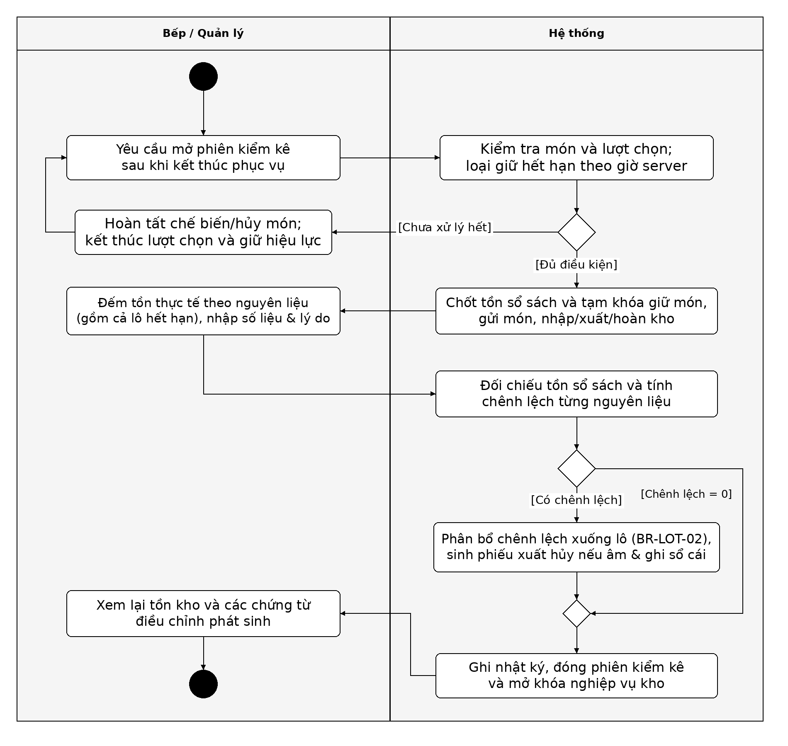

Hình 3. QT-17 — Kiểm kê và điều chỉnh tồn kho. Luồng chính.

## 2.4. Xác định yêu cầu

### 2.4.1. Yêu cầu chức năng

Hệ thống gồm 6 module chức năng chính (cột cuối ghi các câu hỏi khảo sát liên quan):

| **STT** | **Module**       | **Mô tả ngắn gọn**                                                                                                                                                                                                                          | **Nhu cầu từ khảo sát**        |
|---------|------------------|---------------------------------------------------------------------------------------------------------------------------------------------------------------------------------------------------------------------------------------------|--------------------------------|
| 1       | Quản lý danh mục | Ba nghiệp vụ độc lập: quản lý món ăn, quản lý công thức và quản lý giá bán; cùng danh mục nhóm món, nguyên liệu, nhà cung cấp và bàn. Giữ lịch sử phiên bản và xóa mềm theo điều kiện.                                                      | E1, E2, E3, E4                 |
| 2       | Quản lý bán hàng | Lập order tại chỗ hoặc mang về, ghi chú món, đổi bàn, cập nhật trạng thái món, in/in lại phiếu bếp, tra cứu order, in phiếu tạm tính, thanh toán tiền mặt/QR, xác minh thanh toán, in/in lại hóa đơn và hủy order theo điều kiện nghiệp vụ. | B1, B3, B4, B5, B6, C3, C4, C6 |
| 3       | Quản lý kho      | Nhập kho theo lô; xuất tiêu hao theo FIFO qua nhiều lô; xuất hủy theo lô thực tế; kiểm kê và điều chỉnh tồn. Theo dõi tồn sổ sách, đang giữ, khả dụng và hạn sử dụng.                                                                       | D2, D3, D4, D5, D6             |
| 4       | Báo cáo thống kê | Doanh thu theo Business Date/tuần/tháng/năm, xếp hạng món, chi phí nguyên liệu và lợi nhuận gộp theo chi phí nguyên liệu, phân tích khung giờ, theo dõi thanh toán chưa hoàn tất và báo cáo order bị hủy hoặc đóng chưa thu được tiền.      | F3, F4, F5, G7                 |
| 5       | Cài đặt hệ thống | Tài khoản, đăng nhập/đăng xuất/đổi mật khẩu, phân quyền theo vai trò, cấu hình hệ thống (mẫu hóa đơn, mốc Business Date), cấu hình cảnh báo tồn kho, cảnh báo hạn sử dụng, hạn mức câu hỏi AI, nhật ký thao tác rủi ro cao.                 | G6                             |
| 6       | AI Assistant     | Hỏi đáp, phân tích dữ liệu kinh doanh bằng tiếng Việt (Text-to-SQL + LLM), mỗi vai trò có trợ lý AI riêng theo đúng phạm vi phân quyền.                                                                                                     | G3, G4, G7                     |

Bảng 5. Các module chức năng của hệ thống

Mỗi module được mô tả chi tiết đến từng chức năng (Use Case) tại Bảng 6. Mã Use Case thống nhất với các sơ đồ tại mục 3.1.2, quy trình nghiệp vụ tại mục 2.3 (cột Quy trình), đặc tả tại mục 3.4 và danh mục Use Case tại tài liệu 03.

| **Mã UC** | **Tên Use Case**                               | **Tác nhân**                               |
|-----------|------------------------------------------------|--------------------------------------------|
| 1.1       | Quản lý nhóm món                               | Quản lý                                    |
| 1.2       | Quản lý món ăn                                 | Quản lý                                    |
| 1.3       | Quản lý công thức                              | Quản lý                                    |
| 1.4       | Quản lý giá bán                                | Quản lý                                    |
| 1.5       | Quản lý bàn                                    | Quản lý                                    |
| 1.6       | Quản lý nguyên liệu                            | Bếp                                        |
| 1.7       | Quản lý nhà cung cấp                           | Bếp                                        |
| 2.1       | Gọi món tại chỗ                                | Thu ngân/ Nhân viên order                  |
| 2.2       | Gọi món mang về                                | Thu ngân/ Nhân viên order                  |
| 2.3       | Quản lý order và phục vụ                       | Thu ngân/ Nhân viên order                  |
| 2.4       | Thanh toán                                     | Thu ngân/ Nhân viên order                  |
| 2.5       | Thanh toán QR                                  | Thu ngân/ Nhân viên order; Cổng thanh toán |
| 2.6       | Xử lý xác minh thanh toán và khoản QR ngoại lệ | Quản lý                                    |
| 2.7       | Hủy toàn bộ order                              | Quản lý                                    |
| 2.8       | Tra cứu order                                  | Quản lý; Thu ngân/Nhân viên order          |
| 3.1       | Nhập kho theo lô                               | Bếp                                        |
| 3.2       | Theo dõi xuất nguyên liệu                      | Bếp                                        |
| 3.3       | Lập phiếu xuất hủy                             | Bếp                                        |
| 3.4       | Kiểm kê và điều chỉnh tồn                      | Bếp                                        |
| 3.5       | Theo dõi tồn kho theo lô                       | Bếp                                        |
| 4.1       | Xem báo cáo doanh thu                          | Quản lý                                    |
| 4.2       | Xem chi phí và lợi nhuận gộp                   | Quản lý                                    |
| 4.3       | Xem báo cáo tiêu thụ món                       | Quản lý                                    |
| 4.4       | Xem phân bố order theo khung giờ               | Quản lý                                    |
| 4.5       | Xem báo cáo order và thanh toán                | Quản lý                                    |
| 5.1       | Quản lý người dùng                             | Quản lý                                    |
| 5.2       | Cấu hình hệ thống                              | Quản lý                                    |
| 5.3       | Xem nhật ký hệ thống                           | Quản lý                                    |
| 5.4       | Đăng nhập và quản lý tài khoản cá nhân         | Người dùng                                 |
| 6.1       | Hỏi AI Assistant                               | Người dùng; Claude API của Anthropic       |

Bảng 6. Mô tả chức năng theo Use Case của từng module

Các yêu cầu chức năng chi tiết (FR) được trình bày theo module tại tài liệu 03; đặc tả luồng xử lý của từng Use Case được trình bày tại mục 3.4.

Mức ưu tiên và tiêu chí chấp nhận cho đủ 107 FR nằm ở phần L của tài liệu [03_Dac_ta_chuc_nang_UC_FR.md](Tai_lieu/03_Dac_ta_chuc_nang_UC_FR.md). Bốn đặc tả trọng yếu được đối chiếu ở phần M của cùng tài liệu. Mức Must tập trung vào vận hành, tính đúng, toàn vẹn và an toàn; Should là các chức năng hoàn thiện. Could và Won’t được xác định riêng, không làm tăng tổng số FR.

### 2.4.2. Yêu cầu phi chức năng

Các yêu cầu phi chức năng gồm 11 tiêu chí có thể kiểm chứng, nhóm theo ISO/IEC 25010:2023 \[13\]: hiệu suất (NFR-01–03), bảo mật và truy vết (NFR-04–06), độ tin cậy (NFR-07, NFR-11), sử dụng tài nguyên (NFR-08), khả năng sử dụng (NFR-09) và tính tương thích (NFR-10). Ngưỡng hiệu năng và căn cứ được trình bày tại mục 6.1; kịch bản tái lập nằm trong tài liệu 06, phần J. Mỗi yêu cầu chỉ được kết luận đạt sau khi chạy kiểm thử và lưu bằng chứng.

<table>
<colgroup>
<col style="width: 17%" />
<col style="width: 50%" />
<col style="width: 32%" />
</colgroup>
<thead>
<tr class="header">
<th><strong>Mã – Tiêu chí</strong></th>
<th><strong>Yêu cầu</strong></th>
<th><strong>Điều kiện đo</strong></th>
</tr>
</thead>
<tbody>
<tr class="odd">
<td>
<strong>NFR-01</strong>

Hiệu năng nghiệp vụ
</td>
<td>Thêm/điều chỉnh giữ món, gửi món, cập nhật danh mục và ghi nhận kho phản hồi nhanh: p95 không quá 1 giây ở từng thao tác và không có lỗi kỹ thuật (5xx, hết kết nối). Mốc 1 giây theo Nielsen [14].</td>
<td>Dữ liệu 20.000 order; 20 người dùng ảo (đo thêm ở mức 5 và 10); đo từ lúc gửi yêu cầu đến lúc nhận đủ kết quả, không tính ngân hàng và máy in; 3 lần lặp.</td>
</tr>
<tr class="even">
<td>
<strong>NFR-02</strong>

Phản hồi AI Assistant
</td>
<td>Toàn chuỗi xử lý (chuẩn hóa, sinh SQL, kiểm duyệt, thực thi, diễn giải): p95 dưới 10 giây ở các lượt thành công; tỷ lệ lỗi/timeout không quá 5%. Mốc 10 giây theo Nielsen [14].</td>
<td>Bộ 80 câu, mỗi câu 3 lần, tính cả lần thử lại; báo cáo p50 và p95 của các lượt thành công.</td>
</tr>
<tr class="odd">
<td>
<strong>NFR-03</strong>

Hiệu năng báo cáo
</td>
<td>Báo cáo doanh thu và xếp hạng món: p95 dưới 10 giây mỗi loại; số liệu khớp 100% với truy vấn đối chiếu trực tiếp trên CSDL; thao tác quá 1 giây hiển thị trạng thái đang xử lý.</td>
<td>Dữ liệu mô phỏng 12 tháng, 20.000 order (khoảng 55 order/ngày, giả định của nhóm); 5 người dùng ảo; ghi cấu hình máy.</td>
</tr>
<tr class="even">
<td>
<strong>NFR-04</strong>

Bảo mật truy cập
</td>
<td>Mật khẩu lưu dạng băm; phân quyền kiểm tra ở backend; dùng HTTPS; khóa API chỉ ở server; dữ liệu gửi LLM chỉ gồm lược đồ và kết quả cần thiết. Mọi yêu cầu trái quyền, tài khoản bị khóa hoặc phiên hết hạn đều bị từ chối (401/403).</td>
<td>Gọi API trái vai trò; dùng tài khoản bị khóa và phiên hết hạn; xem bảng người dùng; quét mã nguồn, log và nội dung gửi LLM để tìm mật khẩu, khóa API, thông tin đăng nhập.</td>
</tr>
<tr class="odd">
<td>
<strong>NFR-05</strong>

An toàn AI
</td>
<td>AI chỉ dùng tài khoản CSDL chỉ đọc trên view theo vai trò và chỉ chạy được câu SELECT hợp lệ. Mỗi câu hỏi sinh SQL tối đa 2 lần; truy vấn tối đa 3 giây và 500 dòng. Không ca nào trong bộ AT01–AT20 truy cập trái quyền hoặc ghi dữ liệu thành công.</td>
<td>Bộ ca AT01–AT20: giả mạo vai trò, chèn chỉ dẫn, yêu cầu ghi dữ liệu, truy vấn ngoài view, đổi quyền giữa phiên, vượt giới hạn; đối chiếu phản hồi và log CSDL.</td>
</tr>
<tr class="even">
<td>
<strong>NFR-06</strong>

Nhật ký và truy vết
</td>
<td>Audit log và nhật ký câu hỏi/SQL không sửa, không xóa được. Mỗi thao tác rủi ro cao có một bản ghi đủ thời điểm, người thực hiện, mã yêu cầu, thao tác và trạng thái; log không chứa mật khẩu, token, khóa API.</td>
<td>Thử sửa/xóa log bằng từng vai trò; thực hiện mẫu các thao tác rủi ro cao; quét nội dung log.</td>
</tr>
<tr class="odd">
<td>
<strong>NFR-07</strong>

Toàn vẹn kho và giao dịch
</td>
<td>Không tồn âm, không cấp trùng nguyên liệu, không trừ kho hai lần. Mỗi thao tác chạy trong một transaction: lỗi giữa chừng thì rollback hoàn toàn; gửi lặp cùng mã yêu cầu chỉ tạo một kết quả.</td>
<td>Bốn tình huống tranh chấp (hai bàn cùng giữ phần cuối, hai món chung nguyên liệu, gửi món đúng lúc hết hạn giữ, gửi lặp sau timeout), mỗi tình huống từ 100 lần; thêm ca lỗi giữa chừng và ca mở kiểm kê khi có giao dịch song song; đối chiếu sổ cái, lô, lượt giữ, order.</td>
</tr>
<tr class="even">
<td>
<strong>NFR-08</strong>

Hạn mức AI
</td>
<td>Chi phí gọi LLM được giới hạn bằng hạn mức 50 câu/người/ngày (Quản lý cấu hình được) và cache câu hỏi lặp lại. Câu vượt hạn mức bị chặn; không trả kết quả cũ sau khi dữ liệu hoặc quyền thay đổi; ghi nhận token và chi phí từng câu.</td>
<td>Hỏi vượt hạn mức; hỏi lặp lại; đổi dữ liệu hoặc quyền rồi hỏi lại (ít nhất 10 ca).</td>
</tr>
<tr class="odd">
<td>
<strong>NFR-09</strong>

Khả năng sử dụng
</td>
<td>Người dùng làm được các nhiệm vụ chính không cần hướng dẫn: điểm SUS trung bình từ 68 trở lên [20] và ít nhất 80% nhiệm vụ hoàn thành không cần hỗ trợ.</td>
<td>Ít nhất 5 người từng làm quản lý hoặc thu ngân; 3 nhiệm vụ; thang SUS [19].</td>
</tr>
<tr class="even">
<td>
<strong>NFR-10</strong>

Tính tương thích
</td>
<td>Chạy đúng trên thiết bị và trình duyệt quán thường dùng: hoàn thành kịch bản gọi món và thanh toán trên tablet, Chrome và Safari; INP không quá 200 ms ở phân vị 75 [18].</td>
<td>Chạy kịch bản gọi món và thanh toán trên tablet và trên Chrome, Safari.</td>
</tr>
<tr class="odd">
<td>
<strong>NFR-11</strong>

Sao lưu và phục hồi
</td>
<td>Cơ sở dữ liệu được sao lưu ít nhất mỗi ngày; phục hồi thành công từ bản sao lưu gần nhất và dữ liệu sau phục hồi khớp thời điểm sao lưu.</td>
<td>Sao lưu, phục hồi vào cơ sở dữ liệu trống và đối chiếu số bản ghi của các bảng chính.</td>
</tr>
</tbody>
</table>

Bảng 7. Yêu cầu phi chức năng, ngưỡng và cách kiểm chứng

## 2.5. Xác định đối tượng sử dụng hệ thống

| **STT** | **Đối tượng**             | **Mô tả**                                                                   | **Quyền hạn chính**                                                                                                                                                                                                                                                                                                                         |
|---------|---------------------------|-----------------------------------------------------------------------------|---------------------------------------------------------------------------------------------------------------------------------------------------------------------------------------------------------------------------------------------------------------------------------------------------------------------------------------------|
| 1       | Chủ nhà hàng/Quản lý      | Người chịu trách nhiệm vận hành và quản trị toàn bộ hệ thống.               | Kế thừa quyền của Thu ngân/Nhân viên order và Bếp; quản lý danh mục món, giá và công thức, cấu hình, tài khoản và phân quyền; xem toàn bộ báo cáo và nhật ký; hủy toàn bộ order theo điều kiện; xác nhận đối soát, mở lại thanh toán, đóng order chưa thu được tiền và xử lý khoản QR ngoại lệ; sử dụng AI Assistant trong phạm vi Quản lý. |
| 2       | Thu ngân/ Nhân viên order | Người trực tiếp lập order, xác nhận trạng thái món, thu ngân và tất toán.   | Lập/sửa order, đổi bàn, xác nhận trạng thái món, hủy món (khi “Chờ làm”), in phiếu tạm tính, thanh toán, in/in lại hóa đơn, tra cứu order, dùng AI Assistant phạm vi doanh thu/hóa đơn/bán hàng.                                                                                                                                            |
| 3       | Bếp                       | Người trực tiếp chế biến món và quản lý nhập/xuất kho, tồn kho nguyên liệu. | Quản lý danh mục nguyên liệu và nhà cung cấp, ghi nhận phiếu nhập kho, quản lý lô nguyên liệu theo FIFO và hạn sử dụng, lập phiếu xuất hủy, kiểm kê định kỳ, xem danh sách tồn kho, dùng AI Assistant phạm vi tồn kho/nguyên liệu.                                                                                                          |

Bảng 8. Đối tượng sử dụng hệ thống và quyền hạn chính

## 2.6. Hiện trạng vận hành và các bên liên quan

Hiện trạng được tổng hợp từ các trải nghiệm tự khai trong khảo sát, chưa phải quan sát trực tiếp một nhà hàng duy nhất. Thu ngân/nhân viên order ghi nhận yêu cầu của khách, chuyển món cho bếp, thu tiền và kiểm tra QR; Bếp tiếp nhận yêu cầu, chế biến và kiểm đếm nguyên liệu; Quản lý đối soát, theo dõi chi phí và quyết định nhập hàng. Công cụ hiện tại gồm giấy, trao đổi miệng, ứng dụng ngân hàng, POS và Excel, làm phát sinh các điểm bàn giao cần đối chiếu.

| **Bên liên quan**                | **Nhu cầu và trách nhiệm**                                                                     |
|----------------------------------|------------------------------------------------------------------------------------------------|
| Quản lý                          | Xác nhận yêu cầu và quy tắc doanh thu, giá vốn, đối soát; phê duyệt phạm vi và nghiệm thu.     |
| Thu ngân/Nhân viên order         | Gọi món, kiểm tra trạng thái, thu tiền, xác minh và tra cứu lịch sử.                           |
| Bếp                              | Xác nhận chế biến, nhập/xuất, kiểm kê và giải thích chênh lệch.                                |
| Khách hàng                       | Gọi đúng món, biết số tiền và nhận xác nhận thanh toán; không là tài khoản ứng dụng trong MVP. |
| Nhóm phát triển và dịch vụ ngoài | Triển khai, bảo trì, bảo vệ dữ liệu; dịch vụ AI/QR cung cấp API theo hợp đồng kết nối.         |

## 2.7. Nghiên cứu khả thi và ràng buộc

### 2.7.1. Khả thi kỹ thuật

Kiến trúc web và CSDL quan hệ đáp ứng mô hình một nhà hàng; transaction, khóa dòng và khóa duy nhất được dùng cho các nghiệp vụ kho và thanh toán. Các kết quả ở Chương 6 chứng minh một phần khả năng hiện thực, nhưng còn lỗi nghiệp vụ, lỗi pool ở 20 người dùng và tỷ lệ timeout AI cao. Kết nối QR và máy in mới được mô phỏng; khả thi tích hợp thực phải được xác nhận khi có thiết bị và thông tin dịch vụ.

### 2.7.2. Khả thi kinh tế

Dự toán API sử dụng các đơn giá cấu hình trong mã nguồn được đối chiếu trong đợt thực nghiệm ngày 27/10/2026 (Phụ lục B): Opus 5.5 là 4 USD/triệu token đầu vào và 20 USD/triệu token đầu ra; Haiku 5.5 là 0,10 USD/triệu token đầu vào và 0,50 USD/triệu token đầu ra. Đây là tham số tính chi phí của hệ thống; chi phí thanh toán được đối chiếu với usage và hóa đơn của nhà cung cấp. Backend hỗ trợ prompt cache; dự toán cơ sở chưa tính phần giảm chi phí do cache hoặc Batch API, thuế và dịch vụ ngoài mô hình. Đơn giá cache cấu hình là 5 USD/triệu token ghi và 0,20 USD/triệu token đọc; thời hạn prompt cache là 5 phút.

Với giả định mỗi câu hỏi dùng 3.000 token đầu vào và 600 token đầu ra cho Opus 5.5, 1.000 token đầu vào và 200 token đầu ra cho Haiku 5.5, chi phí cơ sở là 0,0242 USD/câu. Token đầu ra Opus bao gồm phần suy luận được tính phí. Kịch bản 100 câu/ngày trong 30 ngày có chi phí 72,60 USD/tháng; dự phòng 20% thành 87,12 USD/tháng. Token, cache, phần suy luận và lần thử lại thực tế được ghi log để đối chiếu với dự toán.

Ba cấu hình A/B/C chạy 80 câu, mỗi câu 3 lần, tạo 720 lượt đánh giá. A và B dùng giả định tại đoạn trên; C dự toán 2.600 token đầu ra Opus, giữ nguyên lượng token đầu vào và diễn giải, tương ứng 0,0642 USD/câu. Chi phí cơ sở của lần thử là 27,024 USD, dự phòng 20% và làm tròn thành 32,43 USD; chưa gồm tập phát triển và bộ an toàn. Chi phí ghi nhận được tổng hợp theo từng model và usage API; khóa truy cập được lưu ở backend.

Tổng chi phí sở hữu gồm phí API, máy chủ, tên miền, sao lưu, thiết bị, kết nối thanh toán, vận hành và bảo trì. Dự toán API chỉ phản ánh một thành phần chi phí, không đại diện cho toàn bộ chi phí triển khai và không được dùng để tính thời gian hoàn vốn.

Trang sản phẩm Sapo nhà hàng công bố mức giá khởi điểm từ 170.000 đồng/tháng \[2\]. Giá theo gói của sản phẩm thương mại có phạm vi dịch vụ khác với dự toán tự phát triển hệ thống.

Đơn giá tham chiếu của Opus 5.5 là 4/20 USD cho mỗi triệu token đầu vào/đầu ra \[16\]; Haiku 5.5 là 0,10/0,50 USD khi prompt không quá 100.000 token \[22\]. Dự toán sử dụng các mức giá này; chi phí phát sinh phụ thuộc số token và điều kiện dịch vụ.

### 2.7.3. Khả thi vận hành

Có 57% người tham gia khảo sát chọn phần mềm phức tạp là rào cản sử dụng. Thiết kế giao diện vì vậy được phân theo vai trò, dùng tên nghiệp vụ tiếng Việt và hiển thị dữ liệu nguồn cùng câu trả lời AI. Tiêu chí khả năng sử dụng gồm điểm SUS trung bình từ 68 và ít nhất 80% nhiệm vụ hoàn thành không cần hỗ trợ, với tối thiểu 5 người tham gia.

### 2.7.4. Khả thi pháp lý và ràng buộc

Bản thử nghiệm sử dụng dữ liệu mô phỏng và hóa đơn nội bộ. Các ràng buộc triển khai gồm quyền thu thập, lưu trữ và xử lý dữ liệu cá nhân; điều kiện gửi dữ liệu sang dịch vụ AI; giấy phép phần mềm, thư viện; và yêu cầu đối với thanh toán, hóa đơn điện tử. Mật khẩu, token và khóa API không được gửi cho mô hình. Tích hợp hóa đơn điện tử và hoàn tiền ngân hàng tự động nằm ngoài phạm vi đề tài.

Đề tài được thực hiện bởi ba thành viên theo phân công tại mục 1.5, trong phạm vi một nhà hàng và dữ liệu thử nghiệm. Hệ thống phụ thuộc kết nối mạng và dịch vụ API bên ngoài. Các giá trị kinh tế tại mục này là dự toán cho quy mô thử nghiệm.

# 3. PHÂN TÍCH HỆ THỐNG

## 3.1. Mô hình hóa chức năng nghiệp vụ

### 3.1.1. Xác định và gom nhóm chức năng

Các chức năng nghiệp vụ được gom thành 6 nhóm (module), tương ứng với bảng tổng quan chức năng tại mục 2.4.1.

Bảng 9 phân loại các nhóm chức năng theo mức ưu tiên. Danh mục, bán hàng, kho và cài đặt hệ thống thuộc mức Must-have. Nhóm cài đặt bao gồm tài khoản, xác thực, phân quyền, cấu hình, ngưỡng cảnh báo tồn kho, ghi nhật ký, nội dung tối thiểu của nhật ký và quyền tra cứu nhật ký.

Báo cáo thống kê thuộc mức Should-have. AI Assistant là chức năng hỗ trợ theo mục tiêu MT4. Hai module này khai thác dữ liệu từ các module nghiệp vụ.

| **Nhóm chức năng**   | **Số lượng FR**                 | **Ghi chú**                                                                         | **Mức ưu tiên**                    |
|----------------------|---------------------------------|-------------------------------------------------------------------------------------|------------------------------------|
| 1\. Quản lý danh mục | FR-CAT-01 → FR-CAT-28 (28 FR)   | Nhóm món, món ăn, công thức chế biến, nguyên liệu, nhà cung cấp, bàn                | Must-have                          |
| 2\. Quản lý bán hàng | FR-SALE-01 → FR-SALE-35 (35 FR) | Order, phiếu bếp, thanh toán, hóa đơn, tra cứu, hủy order                           | Must-have                          |
| 3\. Quản lý kho      | FR-INV-01 → FR-INV-14 (14 FR)   | Nhập/xuất kho, tồn kho theo lô (FIFO), kiểm kê                                      | Must-have                          |
| 4\. Báo cáo thống kê | FR-REP-01 → FR-REP-13 (13 FR)   | Doanh thu, xếp hạng món, lợi nhuận gộp theo chi phí nguyên liệu, khung giờ cao điểm | Should-have                        |
| 5\. Cài đặt hệ thống | FR-SET-01 → FR-SET-07 (7 FR)    | Tài khoản, đăng nhập, phân quyền, cấu hình, audit log                               | Must-have: FR-SET-01–07.           |
| 6\. AI Assistant     | FR-AI-01 → FR-AI-10 (10 FR)     | Trợ lý AI theo vai trò, Text-to-SQL + LLM                                           | Chức năng hỗ trợ theo mục tiêu MT4 |

Bảng 9. Tổng hợp các nhóm chức năng và mức ưu tiên

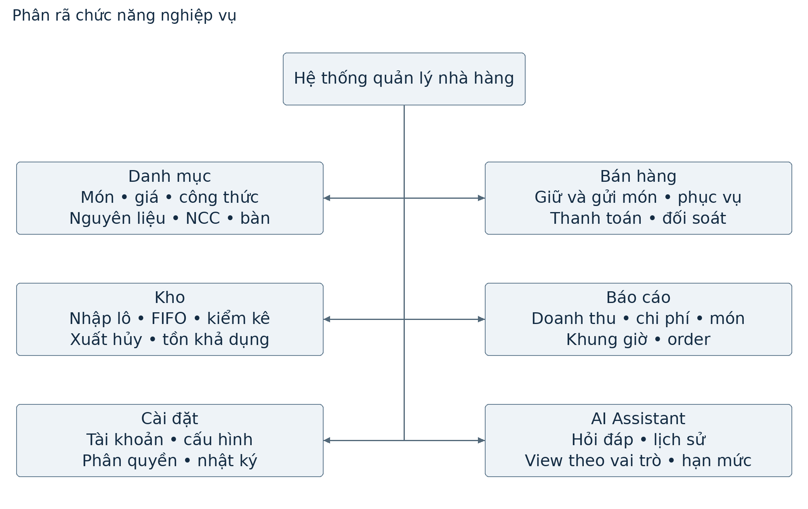

Hình 4. Phân rã sáu nhóm chức năng của hệ thống

### 3.1.2. Sơ đồ Use Case

Bộ Use Case gồm một sơ đồ tổng quan và sáu sơ đồ chi tiết với 30 Use Case. Các sơ đồ tổng quan, bán hàng, kho và AI được trình bày dưới đây; bộ sơ đồ đầy đủ nằm trong file [UseCase_HeThongQuanLyNhaHang.drawio](So_do/UseCase_HeThongQuanLyNhaHang.drawio). Các nhóm chức năng trên sơ đồ tổng quan được đánh số từ 1 đến 6; Use Case chi tiết mang mã hai cấp theo nhóm, như 1.1, 1.2 và 2.1. Ba tác nhân người dùng là Quản lý, Thu ngân/Nhân viên order và Bếp; Cổng thanh toán và Claude API của Anthropic là hệ thống ngoài. Tên, mã và phạm vi từng Use Case được tổng hợp và đối chiếu với yêu cầu chức năng tại tài liệu 03.

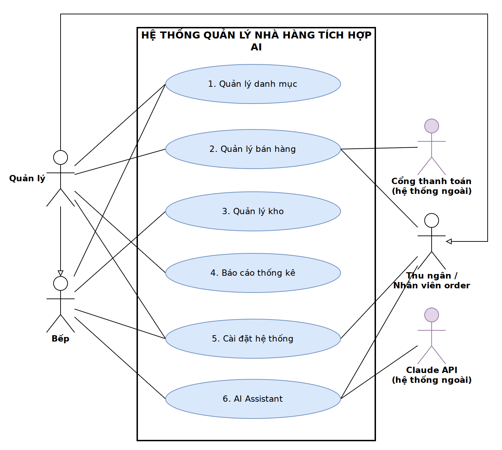

Hình 5. Use Case tổng quan

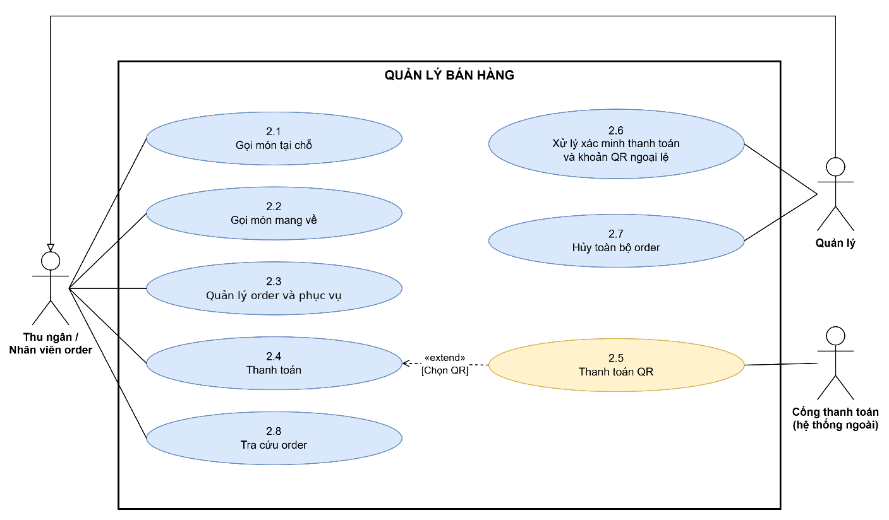

Hình 6. Use Case bán hàng

Hình 7. Use Case quản lý kho

Hình 8. Use Case AI Assistant

## 3.2. Mô hình hóa đối tượng (Class Diagram)

Mô hình lớp mô tả các đối tượng nghiệp vụ, thuộc tính và quan hệ của hệ thống theo hướng phân tích thiết kế hướng đối tượng. Các sơ đồ được tổ chức theo module; thuộc tính và phương thức được đặc tả tại phần D của tài liệu 04, còn quan hệ và bội số được ánh xạ sang lược đồ quan hệ tại mục 4.2.2. Bội số trong sơ đồ dùng ký hiệu 1, 0..1, 0..\* và 1..\*. Các kiểu dữ liệu khái niệm được định nghĩa cùng đặc tả lớp và ánh xạ sang kiểu MySQL tại mục 4.2.2.

Các lớp tham chiếu từ module khác được thể hiện bằng khung nét đứt nền xám, tên lớp kèm tên module trong ngoặc (ví dụ “(Module Danh mục)”), chỉ trình bày thông tin cần thiết để nhận diện quan hệ giữa các module.

Hình 9. Class Diagram - Module Quản lý danh mục

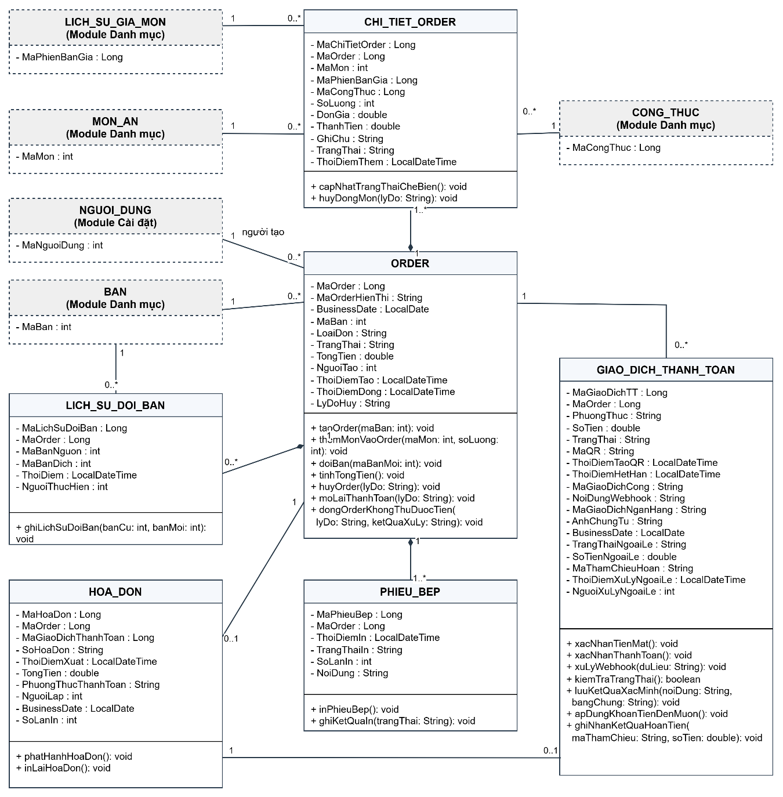

Hình 10. Class Diagram - Module Quản lý bán hàng

Hình 11. Class Diagram - Giữ món (Module Quản lý bán hàng)

Hình 12. Class Diagram - Module Quản lý kho

Hình 13. Class Diagram - Module Cài đặt hệ thống

Hình 14. Class Diagram - Module AI Assistant

Module Quản lý danh mục: NHOM_MON, MON_AN, LICH_SU_GIA_MON, CONG_THUC, CHI_TIET_CONG_THUC, NGUYEN_LIEU, NHA_CUNG_CAP, BAN - MON_AN kết hợp (composition) với CONG_THUC theo từng phiên bản hiệu lực; CONG_THUC kết hợp CHI_TIET_CONG_THUC, mỗi dòng liên kết tới một NGUYEN_LIEU.

Module Quản lý bán hàng: ORDER, CHI_TIET_ORDER, LICH_SU_DOI_BAN, HOA_DON, GIAO_DICH_THANH_TOAN, PHIEU_BEP - ORDER kết hợp nhiều CHI_TIET_ORDER (1--1..\*), mỗi CHI_TIET_ORDER tham chiếu một MON_AN; ORDER liên kết 1--0..\* với GIAO_DICH_THANH_TOAN (mỗi lần thanh toán hoặc thử thanh toán là một giao dịch) và 1--0..1 với HOA_DON sau khi chốt; HOA_DON tham chiếu đúng một giao dịch “Thành công” qua MaGiaoDichThanhToan. GIU_CHO_MON lưu các dòng chưa gửi theo MaLuotChon; CHI_TIET_GIU_CHO lưu nguyên liệu theo lô. Khi gửi thành công, lượt giữ tham chiếu dòng CHI_TIET_ORDER đã tạo.

Module Quản lý kho: PHIEU_NHAP_KHO, CHI_TIET_PHIEU_NHAP, LO_NGUYEN_LIEU, PHIEU_XUAT_KHO, CHI_TIET_PHIEU_XUAT, PHIEU_KIEM_KE, CHI_TIET_KIEM_KE, GIAO_DICH_KHO, GIA_BINH_QUAN_THANG - mỗi CHI_TIET_PHIEU_NHAP sinh ra một LO_NGUYEN_LIEU (lô điều chỉnh kiểm kê là ngoại lệ, không có dòng nhập); mọi lớp biến động (nhập/xuất/kiểm kê) đều phát sinh bản ghi GIAO_DICH_KHO, NGUYEN_LIEU chỉ giữ số tồn dẫn xuất. Lượng đang giữ được tổng hợp từ CHI_TIET_GIU_CHO; phiên kiểm kê được quản lý bằng trạng thái PHIEU_KIEM_KE.

Module Báo cáo thống kê: Không định nghĩa lớp riêng; module đọc (read-only) từ các lớp ở trên thông qua các lớp dịch vụ/truy vấn tổng hợp (report service).

Module Cài đặt hệ thống: VAI_TRO, NGUOI_DUNG, CAU_HINH_HE_THONG, NHAT_KY_HE_THONG - NGUOI_DUNG liên kết 0..\*--1 với VAI_TRO; mọi thao tác rủi ro cao trên các lớp khác đều phát sinh một NHAT_KY_HE_THONG. CAU_HINH_HE_THONG chứa ThoiGianGiuChoPhut để xác định thời hạn cho từng dòng món chưa gửi.

Module AI Assistant: PHIEN_CHAT_AI, TRUY_VAN_AI - PHIEN_CHAT_AI kết hợp nhiều TRUY_VAN_AI (1--0..\*); TRUY_VAN_AI chỉ đọc dữ liệu qua các view phân quyền dựng trên các lớp nghiệp vụ ở trên.

## 3.3. Mô hình hóa tương tác (Sequence Diagram)

Bộ 35 sơ đồ gồm 30 sơ đồ chính và năm sơ đồ con được tổ chức theo mã UC, kèm hậu tố cho luồng dùng chung. Toàn bộ sơ đồ nằm trong tài liệu [05_Bo_so_do_Sequence_Diagram.md](Tai_lieu/05_Bo_so_do_Sequence_Diagram.md)

Các sơ đồ tiêu biểu dưới đây thể hiện việc gửi món, quản lý giữ món, kiểm kê và chuỗi xử lý câu hỏi AI. Mã SD liên kết với Use Case và yêu cầu chức năng tương ứng.

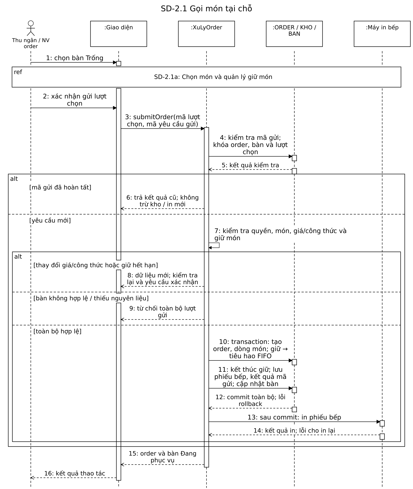

Hình 15. SD-2.1 – Gọi món tại chỗ

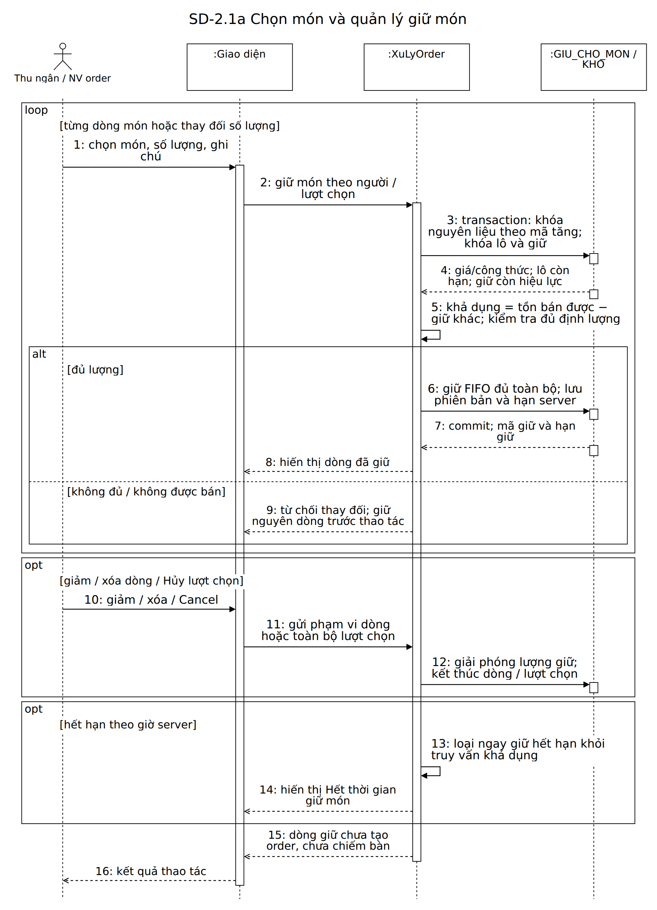

Hình 16. SD-2.1a – Chọn món và quản lý giữ món

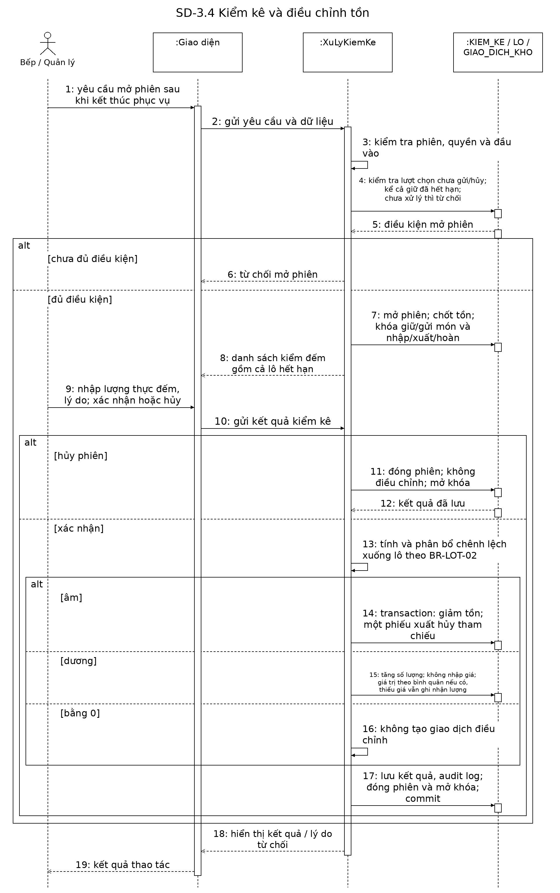

Hình 17. SD-3.4 – Kiểm kê và điều chỉnh tồn

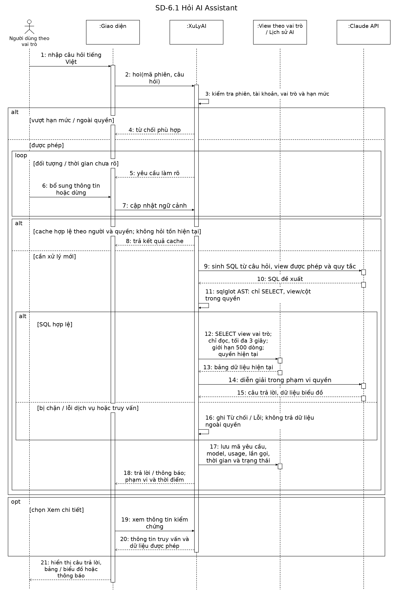

Hình 18. SD-6.1 – Hỏi AI Assistant

## 3.4. Đặc tả chức năng

Hệ thống gồm 30 Use Case và 107 yêu cầu chức năng. Bốn đặc tả dưới đây tập trung vào các luồng cần kiểm soát nguyên tử, chống xử lý lặp và phân quyền; danh mục đầy đủ và FR chi tiết nằm trong tài liệu 03.

### 3.4.1. Gọi món tại chỗ và quản lý lượt giữ

UC 2.1; phần giữ món dùng chung UC 2.2 và 2.3. Tác nhân: Thu ngân/Nhân viên order; Quản lý kế thừa quyền.

Tiền điều kiện: Đăng nhập còn hiệu lực; bàn dự kiến trống; món có giá và công thức hợp lệ; không có phiên kiểm kê đang khóa nghiệp vụ.

Bước 1. Nhân viên chọn bàn, thêm món, số lượng và ghi chú. Backend kiểm tra vai trò, người sở hữu lượt chọn, phiên bản giá/công thức và lượng khả dụng.

Bước 2. Trong transaction, khóa nguyên liệu theo mã tăng dần rồi khóa lô và lượt giữ; phân bổ phần cần giữ theo FIFO trên lô còn hạn. Lượt chọn chưa gửi chưa tạo tiêu hao và chưa chiếm bàn.

Bước 3. Khi gửi, backend kiểm tra lại bàn, hạn giữ, phiên bản và dữ liệu; khóa các bản ghi liên quan. Nhân viên xác nhận lại nếu giá/công thức đã đổi.

Bước 4. Một transaction tạo order/dòng món, ghi tiêu hao theo lô, kết thúc giữ, cập nhật tổng tồn và liên kết bàn đang phục vụ. Mã yêu cầu gửi và mã dòng ngăn ghi nhận lặp.

Bước 5. Lưu phiếu bếp cùng dữ liệu nghiệp vụ; chỉ in sau khi commit. Trả order và trạng thái món cho người dùng.

Luồng phụ và ngoại lệ: Hết hạn giữ: kiểm tra lại lượng khả dụng và phiên bản; chỉ tiếp nhận khi toàn bộ dòng hợp lệ. Thiếu nguyên liệu: giữ danh sách để nhân viên trao đổi với khách, không ghi nhận dở hoặc tự gia hạn. Giá/công thức đổi: giải phóng giữ cũ, chỉ tạo giữ mới sau xác nhận. Bàn đã bị nhận: không tạo order thứ hai. Gửi lặp: trả kết quả trước đó. In lỗi: in lại phiếu cũ, không trừ kho lại.

Hậu điều kiện: Thành công: mỗi lượng nguyên liệu được ghi tiêu hao một lần, bàn gắn đúng order, còn lịch sử phiên bản. Thất bại: rollback toàn bộ phần ghi dữ liệu.

Truy vết: FR-SALE-01–05, 08, 24, 31–32; FR-INV-03, 10–13.

### 3.4.2. Thanh toán QR

UC 2.5 và nhánh xác minh UC 2.6. Tác nhân: Thu ngân/Nhân viên order; cổng thanh toán; Quản lý đối soát.

Tiền điều kiện: Order chưa thanh toán, đã xử lý phần chọn chưa gửi; tổng tiền được chốt; kết nối QR sử dụng bộ mô phỏng trong bản thử.

Bước 1. Thu ngân chọn QR; hệ thống tạo lần thanh toán và mã tham chiếu, hiển thị mã và hạn dùng; order sang Chờ xác nhận thanh toán.

Bước 2. Adapter nhận thông báo từ cổng. Backend xác thực nguồn theo hợp đồng tích hợp, đối chiếu mã giao dịch, order, số tiền và trạng thái.

Bước 3. Khóa order và các giao dịch liên quan trong transaction; kiểm tra mã khoản nhận, số tiền, lịch sử mở lại và điều kiện FR-SALE-15–17. Chỉ nhánh đủ điều kiện xác nhận tự động mới ghi thành công, cập nhật order và phát hành một hóa đơn; nhánh còn lại ghi ngoại lệ hoặc từ chối webhook không hợp lệ.

Bước 4. Trả trạng thái để giao diện hiển thị và in chứng từ. Thanh toán không tự giải phóng bàn; việc giải phóng theo UC 2.3.

Luồng phụ và ngoại lệ: Webhook lặp: không tạo thêm hóa đơn hoặc doanh thu. Hết hạn/hủy khi chưa trả: trở về Đang mở theo quy tắc. Khách báo đã trả nhưng chưa xác nhận: chuyển Chờ xác minh. Tiền đến muộn: tự xác nhận nếu đúng giao dịch, đủ tiền và order chưa mở lại thanh toán, chưa đóng/hủy hoặc được thanh toán bằng giao dịch khác; hủy lần QR mới chưa nhận tiền nếu có. Nếu không thỏa điều kiện, thu trùng hoặc sai số tiền thì lưu khoản ngoại lệ cho Quản lý theo FR-SALE-16–17, không tự cộng doanh thu.

“Mở lại thanh toán” trong điều kiện trên chỉ quyết định của Quản lý theo FR-SALE-23. Việc QR hết hạn hoặc bị hủy đưa order về Đang mở không phải quyết định này; hệ thống đối chiếu lịch sử xử lý khi nhận tiền muộn.

Hậu điều kiện: Chỉ xác nhận hợp lệ mới phát hành hóa đơn. Một order tối đa một hóa đơn; lịch sử các lần thanh toán và đối soát được giữ đầy đủ.

Truy vết: FR-SALE-14–19, 21–22, 29, 33; luồng Quản lý theo FR-SALE-20, 23, 34–35.

### 3.4.3. Kiểm kê và điều chỉnh tồn

UC 3.4. Tác nhân: Bếp; Quản lý kế thừa quyền.

Tiền điều kiện: Kết thúc phục vụ, món đã chế biến hoặc hủy hợp lệ; xử lý hết lượt chọn chưa gửi và giữ còn hiệu lực; không có phiên kiểm kê khác.

Bước 1. Người dùng yêu cầu mở phiên. Backend khóa bản ghi điều phối, xác định giữ còn hiệu lực theo giờ server và kiểm tra mọi lượt chọn chưa kết thúc. Lượt giữ hết hạn không chiếm nguyên liệu nhưng lượt chọn vẫn phải được gửi hợp lệ hoặc hủy trước khi mở kiểm kê.

Bước 2. Chốt tồn sổ sách, gồm lô hết hạn; mở phiên duy nhất và chặn giữ/gửi món, nhập/xuất/hoàn kho trong phiên.

Bước 3. Người dùng nhập tồn thực tế theo nguyên liệu và lý do chênh lệch. Hệ thống tính chênh lệch để người dùng xác nhận.

Bước 4. Xác nhận trong một transaction: âm phân bổ FIFO trên lô còn lượng kể cả hết hạn; dương cộng vào lô mới nhất còn hiệu lực, hoặc tạo lô điều chỉnh nếu không có.

Bước 5. Ghi giao dịch điều chỉnh, phiếu xuất hủy tham chiếu khi thiếu và audit log; phiếu này không trừ kho lần hai. Người kiểm kê không nhập giá. Hệ thống tự định giá theo bình quân khi đủ căn cứ; thiếu giá vẫn ghi số lượng, phần giá trị chưa xác định. Đóng phiên và mở lại thao tác kho.

Luồng phụ và ngoại lệ: Còn lượt chọn Đang giữ hoặc Hết hạn chưa được gửi/hủy: từ chối mở phiên và yêu cầu nhân viên xử lý lượt chọn. Hết hạn không tự hủy lượt chọn và không làm điều kiện mở kiểm kê trở thành hợp lệ. Hủy phiên: không điều chỉnh tồn. Lỗi giữa chừng: rollback, không để giao dịch kho và chứng từ lệch nhau.

Hậu điều kiện: Mỗi chênh lệch được áp dụng một lần; tổng lô bằng tồn tổng hợp và sổ cái. Xác nhận/hủy kết thúc khóa nghiệp vụ.

Truy vết: FR-INV-08–11; FR-SET-06.

### 3.4.4. Hỏi AI Assistant

UC 6.1. Tác nhân: Quản lý, Thu ngân/Nhân viên order, Bếp; dịch vụ LLM.

Tiền điều kiện: Tài khoản hoạt động, phiên hợp lệ, còn hạn mức; phiên hội thoại thuộc người dùng.

Bước 1. Backend lấy vai trò từ phiên, kiểm tra trạng thái tài khoản và hạn mức; không dùng vai trò do câu hỏi tự khai.

Bước 2. Chuẩn hóa ngày kinh doanh, thời gian và chỉ số. Hỏi lại nếu thiếu hoặc mơ hồ; từ chối yêu cầu ngoài quyền.

Bước 3. Cung cấp lược đồ view được phép và định nghĩa nghiệp vụ cho LLM; kiểm duyệt AST cho toàn bộ bảng, cột, truy vấn con, CTE/UNION.

Bước 4. Chỉ chạy SELECT hợp lệ bằng tài khoản CSDL chỉ đọc theo vai trò; tối đa 3 giây, 500 dòng và hai lần sinh SQL.

Bước 5. Trả lời tiếng Việt kèm dữ liệu, kỳ, đơn vị và thời điểm; ghi mã truy vết, trạng thái, thời gian và usage. Cache gắn quyền và dữ liệu, không dùng cache cũ cho tồn khả dụng.

Luồng phụ và ngoại lệ: Hết hạn mức: chặn và thông báo. SQL vượt quyền/ghi dữ liệu: chặn trước thực thi. Lỗi dịch vụ: thông báo cùng mã truy vết. Kết quả rỗng: nói không có dữ liệu, không tự tạo số liệu. Đổi quyền giữa phiên: áp dụng quyền hiện tại và vô hiệu cache liên quan.

Hậu điều kiện: Không thay đổi dữ liệu nghiệp vụ; không trả dữ liệu ngoài view vai trò; lịch sử thuộc đúng người dùng.

Truy vết: FR-AI-01–10; NFR-02, 04–05, 08.

# 4. THIẾT KẾ HỆ THỐNG

## 4.1. Thiết kế kiến trúc hệ thống

### 4.1.1. Kiến trúc tổng thể

Hệ thống áp dụng kiến trúc ba tầng, mô hình client-server, backend module hóa theo nghiệp vụ:

- Tầng giao diện (Presentation): ứng dụng web Next.js, phục vụ ba vai trò người dùng và giao diện chat AI Assistant.

- Tầng ứng dụng (Application): backend Python/FastAPI, xử lý cả nghiệp vụ quản lý (danh mục, bán hàng, kho, báo cáo, cài đặt) và dịch vụ AI Assistant (chuẩn hóa câu hỏi, sinh SQL, kiểm duyệt, thực thi, diễn giải kết quả).

- Tầng dữ liệu (Data): MySQL, kèm tập view riêng theo từng vai trò (Quản lý/Thu ngân và Nhân viên order/Bếp) để kiểm soát phân quyền và tách biệt AI Assistant khỏi các bảng nghiệp vụ lõi.

Hình 19. Kiến trúc thành phần và ranh giới dữ liệu

### 4.1.2. Kiến trúc phần mềm

Dịch vụ AI sử dụng Claude Opus 5.5 để sinh SQL và Claude Haiku 5.5 để diễn giải kết quả qua Claude API của Anthropic (mục 5.1.1). Backend điều phối hỏi đáp qua các view MySQL được phân quyền; sqlglot hỗ trợ phân tích cú pháp truy vấn. Tài khoản CSDL riêng chỉ có quyền SELECT trên tập view của vai trò. Quy trình không cấp cho LLM thông tin đăng nhập CSDL hoặc quyền thực thi trực tiếp.

Kiến trúc phân tách module nghiệp vụ và quyền theo vai trò để hỗ trợ mở rộng.

Hình 20. Thiết kế triển khai web và API

Sơ đồ thể hiện phương án triển khai có HTTPS; cấu hình công khai và tích hợp QR thật chỉ được xác nhận sau kiểm tra môi trường triển khai. Kết quả tải ở Chương 6 được đo trên một máy dùng chung, không đồng nghĩa đã có triển khai sản xuất theo sơ đồ này.

### 4.1.3. Quy trình xử lý câu hỏi AI

Backend xác thực phiên, kiểm tra tài khoản, xác định vai trò hiện tại và hạn mức. Mỗi câu hỏi có mã truy vết; lịch sử hội thoại chỉ được lấy từ phiên thuộc người dùng đó. Thời gian tương đối được quy đổi theo múi giờ và Business Date của nhà hàng.

Hệ thống xác định chỉ số, khoảng thời gian và đối tượng từ câu hỏi. Thông tin thiếu hoặc tên món mơ hồ được trả về dưới dạng yêu cầu làm rõ. Với yêu cầu hợp lệ, ngữ cảnh gồm lược đồ view được phép, định nghĩa doanh thu, giá vốn, tồn khả dụng và ví dụ thuộc tập phát triển.

LLM sinh một truy vấn. Bộ kiểm duyệt phân tích cây cú pháp, chỉ chấp nhận một truy vấn đọc; mọi bảng, cột, truy vấn con và nhánh UNION/CTE phải nằm trong danh sách cho phép. Các lệnh ghi, truy cập schema hệ thống, xuất tệp, hàm gây trì hoãn và câu lệnh nhiều phần bị từ chối. Hệ thống áp giới hạn dòng và thời gian ở tầng thực thi.

Truy vấn hợp lệ chạy bằng tài khoản chỉ đọc theo vai trò, timeout 3 giây và tối đa 500 dòng. Lỗi cú pháp hoặc lỗi thực thi được phép sinh lại SQL một lần trong cùng phạm vi; yêu cầu trái quyền kết thúc ngay. Kết quả rỗng được diễn đạt là không có dữ liệu phù hợp; lỗi dịch vụ trả thông báo thử lại và mã truy vết.

Backend tính các chỉ số và chênh lệch xác định từ kết quả truy vấn; LLM diễn giải bảng số liệu. Câu trả lời nêu thời gian, đơn vị, phạm vi và thời điểm truy vấn. Nội dung văn bản từ dữ liệu được đặt trong vùng dữ liệu riêng, không được sử dụng làm chỉ dẫn hệ thống. Bảng số liệu gốc đi cùng câu trả lời để người dùng đối chiếu.

Theo hướng dẫn OWASP \[15\], kiểm soát prompt injection kết hợp phân tách chỉ dẫn và dữ liệu, quyền tối thiểu và kiểm tra đầu ra. Thiết kế dùng backend và quyền CSDL làm ranh giới truy cập; việc bảo vệ system prompt là một lớp hỗ trợ. Bộ ca kiểm thử bao gồm yêu cầu giả mạo vai trò, lộ prompt, chỉ dẫn nhúng trong tên/ghi chú và truy vấn vượt view.

Các rủi ro chính của AI Assistant và cách giảm thiểu được tóm tắt dưới đây.

Rủi ro truy cập trái quyền được kiểm soát bằng vai trò lấy từ phiên xác thực, danh sách view/cột cho phép, tài khoản chỉ đọc và kiểm tra lại quyền ở mỗi lượt hỏi. Lịch sử hội thoại và cache được cô lập theo người dùng, vai trò và phiên bản quyền.

Rủi ro prompt injection được kiểm tra với chỉ dẫn trực tiếp, giả mạo vai trò và nội dung độc hại trong dữ liệu. Nội dung mô hình sinh ra phải qua kiểm duyệt; các ca kiểm thử kiểm tra cả kết quả trả về và nhật ký thực thi CSDL \[15\].

Rủi ro sai số liệu hoặc diễn giải được đánh giá bằng kết quả chuẩn độc lập. Câu trả lời kèm dữ liệu nguồn, đơn vị và khoảng thời gian; nhận xét không có căn cứ bị tính sai. Định nghĩa doanh thu, giá vốn và khả dụng được dùng thống nhất giữa báo cáo và view AI.

Rủi ro lộ dữ liệu qua dịch vụ bên ngoài được giảm bằng chọn đúng cột cần thiết, loại thông tin cá nhân và bí mật truy cập, giới hạn dữ liệu gửi ra. Khóa API lưu tại backend; dữ liệu mô phỏng được dùng trong thực nghiệm.

Rủi ro vượt ngân sách được theo dõi bằng token và số lần gọi thực tế, hạn mức người dùng và giới hạn đầu ra. Truy vấn tồn khả dụng luôn lấy dữ liệu hiện tại; các kết quả khác chỉ cache trong phạm vi quyền và thời hạn xác định.

Rủi ro dịch vụ không khả dụng được xử lý bằng timeout, thông báo lỗi và ghi nhận lần gọi. Chức năng nghiệp vụ chính hoạt động độc lập với AI. Nếu chất lượng Text-to-SQL chưa đạt mục tiêu, kết quả được báo cáo theo nhóm câu hỏi và phạm vi hỗ trợ được xác định từ bằng chứng thực nghiệm.

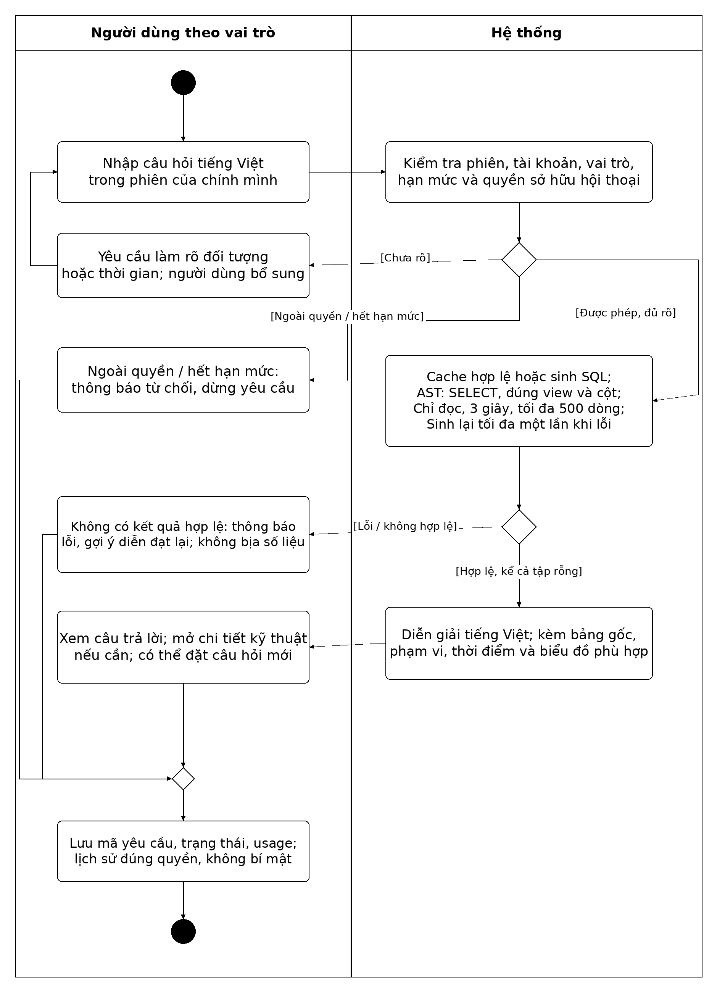

Hình 21. QT-23 Hỏi AI Assistant và các nhánh ngoại lệ

## 4.2. Thiết kế cơ sở dữ liệu

Cơ sở dữ liệu MySQL áp dụng mô hình quan hệ, chuẩn hóa đến dạng chuẩn 3 (3NF). Một số giá trị dẫn xuất như tồn kho hiện tại và thành tiền được lưu có kiểm soát để hỗ trợ truy vấn vận hành và AI Assistant. Các lớp trong mô hình tại mục 3.2 được ánh xạ sang khóa chính, khóa ngoại và kiểu dữ liệu MySQL theo đặc tả chức năng tại mục 3.4 và tài liệu 03. Thiết kế tuân theo bốn nguyên tắc:

- Bảo toàn dữ liệu lịch sử: đối tượng danh mục đã được dữ liệu vận hành hoặc lịch sử tham chiếu được xóa mềm qua DaXoa. Món ăn chỉ được xóa mềm; các danh mục khác được xóa vĩnh viễn khi đáp ứng điều kiện riêng tại tài liệu 03, bảo đảm các order và báo cáo cũ vẫn tra cứu được.

- Quản lý hiệu lực theo thời gian: giá bán và công thức chế biến không được ghi đè mà lưu thành các phiên bản có mốc hiệu lực; mỗi dòng món trong order tham chiếu trực tiếp tới phiên bản đang hiệu lực tại thời điểm dòng món được gửi vào order, nhờ đó doanh thu và giá vốn tính lại ở bất kỳ thời điểm nào đều cho kết quả nhất quán.

- Ghi sổ biến động tồn: mỗi lần nhập, tiêu hao, hoàn, xuất thủ công hoặc điều chỉnh tạo bản ghi GIAO_DICH_KHO. Giữ món được lưu riêng; tồn sổ sách đối chiếu với sổ cái, lượng khả dụng đối chiếu thêm các lượt giữ còn hiệu lực.

- Phục vụ phân quyền và AI Assistant: dữ liệu được tổ chức để có thể xây dựng các view riêng theo từng vai trò theo đặc tả tại mục 4.4.1, qua đó trợ lý AI của một vai trò chỉ truy vấn được đúng phạm vi dữ liệu cho phép.

### 4.2.1. Xác định các lớp đối tượng

Từ các mô hình nghiệp vụ ở Chương 3, hệ thống xác định được 31 lớp đối tượng, chia theo các nhóm dữ liệu nghiệp vụ. Bảng 10 tổng hợp danh sách lớp đối tượng và vai trò của từng lớp đối tượng.

| **Nhóm**               | **Tên lớp**          |
|------------------------|----------------------|
| Người dùng và hệ thống | VAI_TRO              |
|                        | NGUOI_DUNG           |
|                        | CAU_HINH_HE_THONG    |
|                        | NHAT_KY_HE_THONG     |
| Danh mục               | NHOM_MON             |
|                        | MON_AN               |
|                        | LICH_SU_GIA_MON      |
|                        | CONG_THUC            |
|                        | CHI_TIET_CONG_THUC   |
|                        | NGUYEN_LIEU          |
|                        | NHA_CUNG_CAP         |
|                        | BAN                  |
| Bán hàng               | ORDER                |
|                        | CHI_TIET_ORDER       |
|                        | LICH_SU_DOI_BAN      |
|                        | HOA_DON              |
|                        | GIAO_DICH_THANH_TOAN |
|                        | PHIEU_BEP            |
| Kho                    | PHIEU_NHAP_KHO       |
|                        | CHI_TIET_PHIEU_NHAP  |
|                        | LO_NGUYEN_LIEU       |
|                        | PHIEU_XUAT_KHO       |
|                        | CHI_TIET_PHIEU_XUAT  |
|                        | PHIEU_KIEM_KE        |
|                        | CHI_TIET_KIEM_KE     |
|                        | GIAO_DICH_KHO        |
|                        | GIA_BINH_QUAN_THANG  |
| AI Assistant           | PHIEN_CHAT_AI        |
|                        | TRUY_VAN_AI          |
| Bán hàng và kho        | GIU_CHO_MON          |
| Bán hàng và kho        | CHI_TIET_GIU_CHO     |

Bảng 10. Danh sách lớp đối tượng của hệ thống

Thuộc tính và phương thức chi tiết của từng lớp được đặc tả tại phần D của tài liệu 04.

### 4.2.2. Ánh xạ Class Diagram sang lược đồ quan hệ (CSDL)

Quan hệ đầy đủ giữa 31 lớp nằm trong tài liệu 04 và file [ClassDiagram_HeThongQuanLyNhaHang.drawio](So_do/ClassDiagram_HeThongQuanLyNhaHang.drawio). Hai lược đồ sau làm rõ các khóa và liên kết cốt lõi khi triển khai bán hàng, giữ món và kho.

Hình 22. Khóa và liên kết cốt lõi của bán hàng

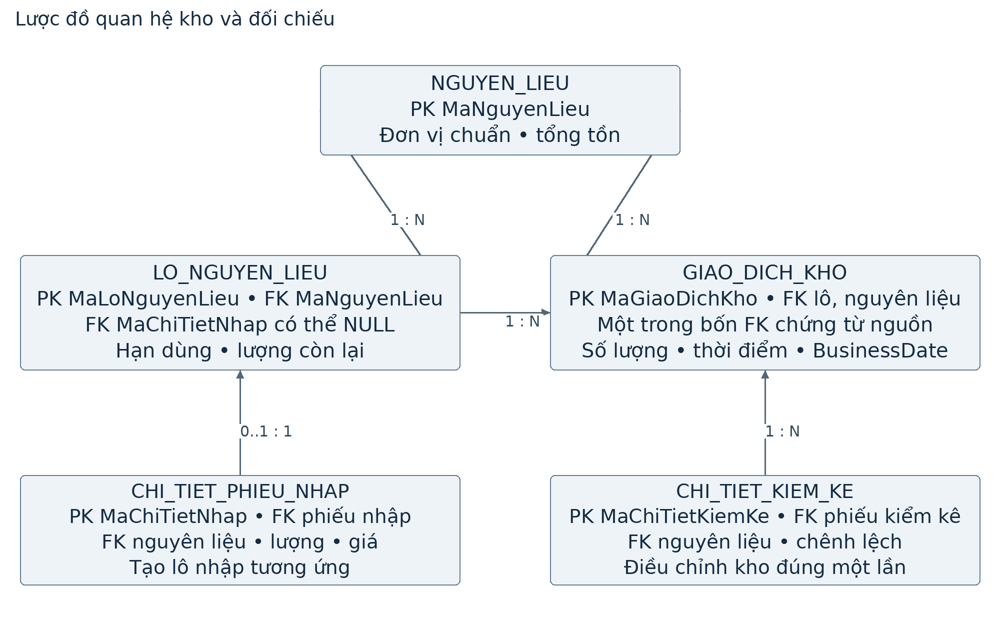

Hình 23. Khóa và liên kết cốt lõi của kho

Các khóa ngoại được xác định từ quan hệ trong tài liệu 04 và lược đồ cốt lõi trên. Quy tắc toàn vẹn được tổng hợp dưới đây; ràng buộc triển khai và chỉ mục chi tiết nằm tại Phụ lục A.

Ánh xạ kiểu dữ liệu khái niệm sang MySQL được áp dụng thống nhất dưới đây. Định danh không đổi sau khi tạo; trường cho phép NULL được ghi theo điều kiện tại các phần D, F và G của tài liệu 04. Các bảng nghiệp vụ đã ghi nhận được bảo toàn lịch sử.

| Kiểu / nhóm dữ liệu                   | Kiểu MySQL và quy ước                                                                                                                                                                       |
|---------------------------------------|---------------------------------------------------------------------------------------------------------------------------------------------------------------------------------------------|
| int / Long                            | BIGINT cho định danh thay thế; PK tự tăng khi là định danh thay thế. Mã vai trò dùng VARCHAR(20). Các FK dùng cùng kiểu với PK được tham chiếu.                                                                          |
| String                                | VARCHAR theo giới hạn trường; dùng TEXT cho ghi chú, prompt/kết quả dài; dữ liệu webhook hoặc trước/sau dạng có cấu trúc dùng JSON. Tất cả dùng utf8mb4.                                    |
| double – tiền                         | DECIMAL(18,2) cho giá bán, giá nhập, thành tiền, doanh thu và giá vốn. Chi phí API dùng DECIMAL(18,10). Không dùng FLOAT/DOUBLE cho tiền trong CSDL.                                         |
| double – lượng                        | DECIMAL(18,6) cho số lượng, định lượng và hệ số quy đổi theo đơn vị chuẩn. Số suất món là INT dương.                                                                                        |
| boolean                               | BOOLEAN (TINYINT(1)); CHECK giới hạn 0 hoặc 1; cờ không có ý nghĩa rỗng là NOT NULL.                                                                                                        |
| LocalDate / LocalDateTime / LocalTime | DATE / DATETIME(3) / TIME. Thời điểm được diễn giải theo múi giờ nhà hàng; BusinessDate đã lưu không tính lại theo cấu hình mới.                                                            |
| Thuộc tính dẫn xuất                   | TrangThai hiển thị và HetNguyenLieu của MON_AN tính từ dữ liệu hiện hành. Giá hiện hành lấy phiên bản hiệu lực; tổng tồn lưu đệm phải cập nhật cùng transaction và đối chiếu sổ cái.        |
| NULL / NOT NULL                       | MaOrder và MaChiTietOrder của giữ món NULL trước khi có kết quả tương ứng; MaBan của order NULL chỉ với mang về. Ràng buộc chi tiết và các khóa UNIQUE/CHECK theo phần F/G của tài liệu 04. |

Các khóa ngoại bảo vệ dữ liệu tham chiếu và lịch sử chứng từ; việc xóa danh mục tuân theo trạng thái sử dụng. Giá và công thức gắn phiên bản với dòng món, giúp tra cứu order cũ không bị thay đổi khi cập nhật danh mục.

GIAO_DICH_KHO là sổ cái biến động; số lượng theo lô và tồn nguyên liệu là dữ liệu tổng hợp cần đối chiếu với sổ cái. GIU_CHO_MON và CHI_TIET_GIU_CHO lưu riêng phần nguyên liệu đang giữ để lượng khả dụng phản ánh các lượt chọn chưa gửi. Giữ, chuyển giữ thành tiêu hao và hoàn nguyên liệu được cập nhật nguyên tử trong transaction.

Tiêu hao bán hàng phân bổ FIFO trên các lô còn hạn; hoàn món trả về đúng lô giao dịch gốc, kể cả khi lô đã hết hạn tại thời điểm hoàn. Kiểm kê điều chỉnh chênh lệch ở mức nguyên liệu xuống các lô theo BR-LOT-02; chứng từ xuất hủy do kiểm kê tham chiếu giao dịch điều chỉnh, không trừ kho lần nữa. Số phân bổ trên hệ thống có thể khác tồn thực tế của từng lô vì MVP kiểm kê theo nguyên liệu.

Hóa đơn và giao dịch thanh toán kế thừa Business Date của order để thống nhất ghi nhận doanh thu; giao dịch kho lưu thời điểm biến động thực tế. Từng nguồn xuất hủy và chứng từ kho có liên kết nguồn rõ ràng, cho phép truy vết và ngăn tổng hợp lặp. Các điều kiện khóa ngoại, CHECK và liên kết nguồn được đặc tả tại Phụ lục A.1.

| **Bảng và trường**              | **Kiểu và khóa**                                      | **Ràng buộc thiết kế**                                                                                   |
|---------------------------------|-------------------------------------------------------|----------------------------------------------------------------------------------------------------------|
| ORDER.MaOrder; MaBan; NguoiTao  | BIGINT PK; BIGINT FK BAN; BIGINT FK NGUOI_DUNG              | MaBan NULL chỉ với mang về; BusinessDate DATE NOT NULL.                                                  |
| CHI_TIET_ORDER                  | MaChiTietOrder BIGINT PK; MaOrder BIGINT FK           | FK món, giá, công thức phải cùng món; SoLuong INT \> 0; DonGia và ThanhTien DECIMAL(18,2).               |
| GIU_CHO_MON                     | MaGiuCho BIGINT PK; MaOrder BIGINT FK NULL            | ThoiDiemHetHan DATETIME(3); UNIQUE (MaYeuCauGui, MaDongYeuCau); MaChiTietOrder FK UNIQUE khi có giá trị. |
| CHI_TIET_GIU_CHO                | PK (MaGiuCho, MaLoNguyenLieu); cả hai BIGINT FK       | SoLuongGiu DECIMAL(18,6) \> 0; không cấp vượt lượng khả dụng.                                            |
| LO_NGUYEN_LIEU                  | MaLoNguyenLieu BIGINT PK; MaNguyenLieu INT FK         | SoLuongConLai DECIMAL(18,6) ≥ 0; HanSuDung cho phép NULL; lô điều chỉnh không bắt buộc MaChiTietNhap.    |
| GIAO_DICH_THANH_TOAN và HOA_DON | MaGiaoDichTT / MaHoaDon BIGINT PK; MaOrder BIGINT FK  | HOA_DON.MaOrder UNIQUE; mã giao dịch cổng có giá trị phải chống lặp; số tiền DECIMAL(18,2).              |
| GIAO_DICH_KHO                   | MaGiaoDichKho BIGINT PK; FK nguyên liệu, lô, chứng từ | CHECK đúng một FK chứng từ nguồn theo loại; biến động và tồn cập nhật cùng transaction.                  |
| NGUOI_DUNG                      | MaNguoiDung INT PK; MaVaiTro INT FK                   | TenDangNhap UNIQUE; MatKhauHash VARCHAR(255) NOT NULL; tài khoản khóa không được gọi API.                |

Bảng 11. Ràng buộc vật lý của các bảng trọng yếu

Các kiểu và ràng buộc trên xác định thiết kế dữ liệu. Từ điển vật lý gồm 37 bảng và ánh xạ từ 31 lớp nghiệp vụ được trình bày trong tài liệu [04_Mo_hinh_va_dac_ta_lop.md](Tai_lieu/04_Mo_hinh_va_dac_ta_lop.md) và các trang CSDL của [ClassDiagram_HeThongQuanLyNhaHang.drawio](So_do/ClassDiagram_HeThongQuanLyNhaHang.drawio). Thuộc tính dẫn xuất được xác định riêng với các cột lưu trữ.

### 4.2.3. Thiết kế chỉ mục

Chỉ mục được lựa chọn theo các truy vấn vận hành chính: tra cứu order theo Business Date và bàn, tổng hợp món bán, đọc biến động kho theo nguyên liệu và thời gian, phân bổ lô FIFO, kiểm tra giữ món còn hiệu lực, và tải lịch sử hội thoại. Danh sách cột cùng mục đích của từng chỉ mục được trình bày tại Phụ lục A.2. Phân vùng theo tháng là phương án mở rộng khi dữ liệu tích lũy nhiều năm; hiệu quả thực tế được kiểm tra qua kế hoạch đánh giá hiệu năng ở Chương 6.

## 4.3. Thiết kế giao diện

Giao diện được tổ chức theo module và quyền tại mục 4.4.2, tương ứng với Use Case tại mục 3.4 và yêu cầu chức năng tại tài liệu 03.

Mỗi màn hình có bốn trạng thái: tải thành công với dữ liệu; lỗi kèm thông báo và thao tác thử lại; đang tải với chỉ báo xử lý; trống với hướng dẫn thao tác. Nút chức năng được bật, tắt hoặc ẩn theo điều kiện nghiệp vụ. Chẳng hạn, thanh toán bị khóa khi order Chờ xác nhận thanh toán; đối tượng đã có lịch sử tham chiếu được ẩn hoặc xóa mềm theo quy định của danh mục.

Dữ liệu đầu vào được kiểm tra tại giao diện để phản hồi tức thời và tại backend để bảo đảm NFR-04. Yêu cầu thiếu trường bắt buộc hoặc sai định dạng bị từ chối.

Module Danh mục (FR-CAT): các màn hình quản lý nhóm món, món ăn, công thức, giá bán và sơ đồ bàn dành cho Quản lý; màn hình nguyên liệu và nhà cung cấp dành cho Quản lý và Bếp; Thu ngân và Nhân viên order chỉ xem (không sửa) danh sách món và trạng thái bàn. Trường dữ liệu chính trên từng màn hình tương ứng đúng các thuộc tính đã đặc tả tại Phụ lục D của tài liệu 04.

Module Bán hàng (FR-SALE): màn hình gọi món dành cho Thu ngân, Nhân viên order và Quản lý (kế thừa quyền), hiển thị sơ đồ bàn và danh sách món theo nhóm. Các món “Hết nguyên liệu” hoặc “Tạm dừng phục vụ” vẫn hiển thị mờ trong danh sách và không cho thêm vào order; nhãn nêu đúng lý do.

Màn hình Quản lý đơn hàng dành cho Quản lý có mục truy cập riêng trên thanh điều hướng. Danh sách hiển thị mã order, loại đơn tại chỗ/mang về, bàn nếu có, ngày kinh doanh, người lập, trạng thái và tổng tiền.

Màn hình thanh toán có thao tác in phiếu tạm tính từ order để khách kiểm tra trước khi chọn hai lựa chọn Tiền mặt/QR. Sau khi xác nhận thanh toán thành công, giao diện cho in hóa đơn đã thanh toán.

Module Kho (FR-INV): màn hình dành cho Bếp và Quản lý, gồm nhập kho, phiếu xuất hủy, kiểm kê định kỳ và tra cứu tồn theo lô. Danh sách nguyên liệu đánh dấu cảnh báo riêng biệt khi tồn khả dụng nhỏ hơn mức tồn tối thiểu đang áp dụng cho nguyên liệu đó.

Module Báo cáo (FR-REP): màn hình chỉ dành cho Quản lý; Thu ngân, Nhân viên order và Bếp không truy cập module này mà tra cứu số liệu thuộc phạm vi vai trò qua AI Assistant. Bộ lọc chính theo Business Date/tuần/tháng/năm; báo cáo giá vốn và hao hụt hiển thị rõ nhãn dữ liệu tạm tính đối với các dòng CHI_TIET_PHIEU_XUAT chưa hoàn tất tính giá vốn.

Module AI Assistant (FR-AI): giao diện chat riêng theo vai trò; mỗi câu trả lời hiển thị kèm bảng số liệu gốc, biểu đồ tương ứng theo quy tắc hiển thị của AI Assistant, và mục Xem chi tiết thu gọn mặc định chứa câu SQL đã sinh.

Module Cài đặt (FR-SET): dành riêng cho Quản lý, gồm quản lý tài khoản/vai trò, cấu hình mức tồn tối thiểu mặc định, mẫu hóa đơn, mốc giờ bắt đầu Business Date, ngưỡng sắp hết hạn của lô, thời gian giữ món, hạn mức câu hỏi AI mỗi ngày; đồng thời tra cứu audit log.

Điều hướng cơ bản đi theo thanh điều hướng chính phân theo module, chỉ hiển thị các mục mà vai trò đăng nhập được phép truy cập; mỗi màn hình danh sách điều hướng tới màn hình chi tiết/chỉnh sửa tương ứng và có đường quay lại rõ ràng.

Tối ưu thao tác trên tablet: các thao tác giờ cao điểm (gọi món, thanh toán) được thiết kế với vùng chạm đủ lớn, tối thiểu số lần chạm để hoàn tất một thao tác, hạn chế màn hình con lồng nhau; ưu tiên bàn phím số cho các trường nhập số lượng và số tiền.

Các phác thảo dưới đây minh họa bố cục các màn hình chính; dữ liệu chỉ dùng để trình bày thiết kế. Quyền truy cập, trạng thái và điều kiện bật/tắt thao tác tuân theo mục 3.4 và 4.4.

Phác thảo màn hình Danh mục món ăn.

Phác thảo màn hình Gọi món.

Phác thảo màn hình Thanh toán và xác minh.

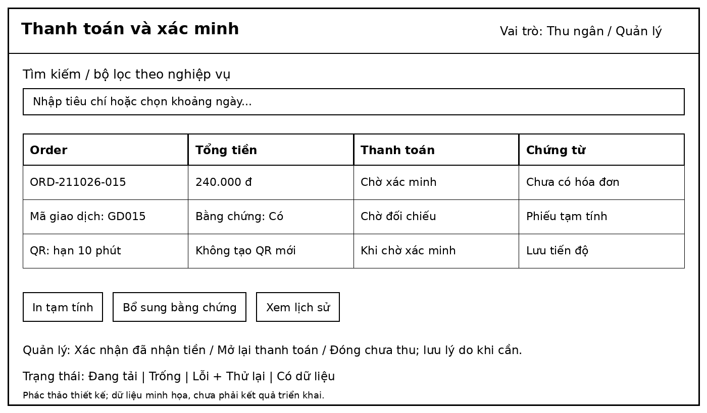

Phác thảo màn hình Kho theo lô.

Phác thảo màn hình Báo cáo thống kê.

Phác thảo màn hình Cài đặt.

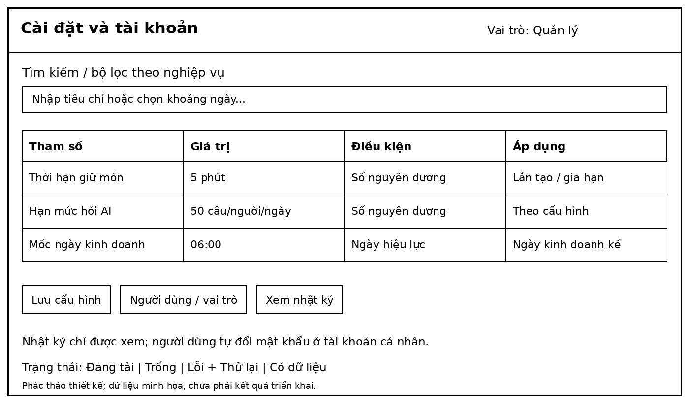

Phác thảo màn hình AI Assistant.

## 4.4. Thiết kế kiểm soát

### 4.4.1. Phân định quyền hạn về dữ liệu

Backend kiểm tra quyền trên mỗi yêu cầu. Mỗi tập VW_AI\_\* được tách thành view theo chủ đề, tổng hợp quan hệ một–nhiều trước khi kết hợp để tránh nhân dòng. Tài khoản AI chỉ SELECT; phạm vi được kiểm tra lại theo vai trò hiện hành ở từng lượt hỏi.

<table>
<colgroup>
<col style="width: 33%" />
<col style="width: 33%" />
<col style="width: 33%" />
</colgroup>
<thead>
<tr class="header">
<th><strong>Vai trò và tập view</strong></th>
<th><strong>Dữ liệu được đọc</strong></th>
<th><strong>Dữ liệu loại khỏi phạm vi</strong></th>
</tr>
</thead>
<tbody>
<tr class="odd">
<td>Quản lý 
VW_AI_QUANLY</td>
<td>Danh mục, bán hàng, kho và báo cáo trong quyền quản trị.</td>
<td>Mật khẩu, token, khóa API và thông tin cá nhân không cần thiết.</td>
</tr>
<tr class="even">
<td>Thu ngân/Nhân viên order 
VW_AI_THUNGAN</td>
<td>Order, dòng món, hóa đơn, giao dịch thanh toán, món và bàn qua view được phép.</td>
<td>Giá nhập, giá vốn, lợi nhuận và bảng kho; không truy cập màn hình Báo cáo.</td>
</tr>
<tr class="odd">
<td>Bếp 
VW_AI_KHO</td>
<td>Tồn nguyên liệu/lô, nhập/xuất/kiểm kê, sổ cái và giữ tổng hợp; view số suất gồm MaMon, TenMon, SoSuatKhaDung, ThoiDiemTinh.</td>
<td>Doanh thu, hóa đơn, thanh toán, GiaVonUocTinh, GIA_BINH_QUAN_THANG và công thức gốc.</td>
</tr>
</tbody>
</table>

View số suất của Bếp tính trước từ công thức hiện hành và tồn khả dụng, không cấp quyền đọc bảng công thức; món xóa, nháp hoặc tạm dừng không được trả số suất có thể bán. Phạm vi dữ liệu được tổng hợp ngay tại bảng trên; quyền thao tác và trách nhiệm từng vai trò được thể hiện ở mục 2.5, ma trận mục 4.4.2 và tài liệu 03.

### 4.4.2. Phân định quyền hạn về chức năng

Bảng 12 tổng hợp quyền thực hiện chức năng theo vai trò, làm căn cứ kiểm soát tại backend và tổ chức giao diện. Phạm vi dữ liệu đối chiếu ngay tại mục 4.4.1; các điều kiện nghiệp vụ chi tiết nằm trong tài liệu 03.

| **Chức năng (yêu cầu tham chiếu)**                                                                      | **Chủ nhà hàng/Quản lý** | **Thu ngân/Nhân viên order**                                                          | **Bếp**                         |
|---------------------------------------------------------------------------------------------------------|--------------------------|---------------------------------------------------------------------------------------|---------------------------------|
| Quản lý nhóm món, món ăn, công thức, giá bán, ẩn/hiện món                                               | Có                       | Chỉ xem                                                                               | Không                           |
| Quản lý nguyên liệu và nhà cung cấp                                                                     | Có                       | Không                                                                                 | Có                              |
| Quản lý sơ đồ bàn                                                                                       | Thêm/sửa/xóa             | Xem trạng thái bàn; xác nhận giải phóng bàn                                           | Không                           |
| Lập order, thêm/sửa món, đổi bàn, cập nhật trạng thái món, in phiếu bếp                                 | Có (kế thừa)             | Có                                                                                    | Không                           |
| Hủy một món ở trạng thái Chờ làm                                                                        | Có (kế thừa)             | Có                                                                                    | Không                           |
| Hủy toàn bộ order chưa thanh toán, bắt buộc nhập lý do                                                  | Có                       | Không                                                                                 | Không                           |
| Xác nhận đối soát, đóng order chưa thu được tiền, mở lại thanh toán và xử lý tiền QR đến muộn/hoàn tiền | Có                       | Không                                                                                 | Không                           |
| Thanh toán tiền mặt/QR, xử lý timeout QR và chuyển “Chờ xác minh thanh toán” khi khách báo đã trả       | Có (kế thừa)             | Có                                                                                    | Không                           |
| In phiếu tạm tính, in/in lại hóa đơn, tra cứu order                                                     | Có (kế thừa)             | Có                                                                                    | Không                           |
| Ghi nhận, sửa, hủy phiếu nhập kho                                                                       | Có (kế thừa)             | Không                                                                                 | Có                              |
| Phiếu xuất hủy                                                                                          | Có (kế thừa)             | Không                                                                                 | Có                              |
| Kiểm kê định kỳ                                                                                         | Có (kế thừa)             | Không                                                                                 | Có                              |
| Quản lý lô nguyên liệu (FIFO), cảnh báo hạn sử dụng                                                     | Có (kế thừa)             | Không                                                                                 | Có                              |
| Xem danh sách tồn kho                                                                                   | Có                       | Chỉ xem cảnh báo hết món                                                              | Có                              |
| Báo cáo doanh thu, giá vốn, lợi nhuận, xếp hạng món                                                     | Có                       | Không (chỉ tra cứu doanh thu, hóa đơn qua AI Assistant; không xem giá vốn, lợi nhuận) | Không                           |
| Quản lý tài khoản, gán vai trò, đặt lại mật khẩu                                                        | Có                       | Không                                                                                 | Không                           |
| Tự đăng nhập/đăng xuất, đổi mật khẩu                                                                    | Có                       | Có                                                                                    | Có                              |
| Cấu hình hệ thống và cảnh báo tồn kho                                                                   | Có                       | Không                                                                                 | Không                           |
| Xem nhật ký audit log                                                                                   | Có                       | Không                                                                                 | Không                           |
| Dùng AI Assistant                                                                                       | Có, phạm vi toàn bộ      | Có, phạm vi bán hàng/hóa đơn/doanh thu                                                | Có, phạm vi tồn kho/nguyên liệu |

Bảng 12. Ma trận quyền hạn theo chức năng và vai trò

Các nguyên tắc áp dụng: (1) quyền được kiểm tra ở tầng backend/API cho mọi thao tác, không chỉ ẩn nút ở giao diện (NFR-04); (2) Quản lý kế thừa toàn bộ quyền của Thu ngân, Nhân viên order và Bếp, nên các thao tác ghi “kế thừa” trong bảng vẫn phải ghi audit log đúng người thực hiện; (3) các thao tác rủi ro cao như hủy toàn bộ order, hủy món, lập phiếu xuất hủy, sửa/hủy phiếu nhập kho, sửa trực tiếp giá/công thức, quản lý tài khoản đều được ghi vào audit log và chỉ Quản lý xem được nhật ký này.

## 4.5. Thiết kế API và lớp xử lý

Bảng 13 tổng hợp phương thức, quyền truy cập và hợp đồng dữ liệu của các luồng trọng yếu. Mỗi thao tác chịu sự kiểm soát của backend theo trạng thái đối tượng, điều kiện nghiệp vụ và ranh giới giao dịch.

| **Phương thức** | **Đường dẫn** | **Quyền và nội dung** |
|---|---|---|
| POST | `/api/v1/settings/auth/login` | Tài khoản hợp lệ; cấp JWT, sai thông tin trả 401. |
| GET | `/api/v1/settings/auth/me` | Đã đăng nhập; thông tin tài khoản hiện hành. |
| POST | `/api/v1/settings/users` | Quản lý; tạo tài khoản, trả 201 khi thành công. |
| GET, POST | `/api/v1/catalog/dishes` | Tra cứu theo quyền; Quản lý tạo món. |
| POST | `/api/v1/sales/holds` | Thu ngân/Quản lý; tạo giữ món. |
| PATCH, DELETE | `/api/v1/sales/holds/{hold_id}` | Người có quyền trên lượt chọn; điều chỉnh hoặc giải phóng. |
| POST | `/api/v1/sales/orders` | Thu ngân/Quản lý; gửi lượt chọn đầu tiên, tạo order. |
| PATCH | `/api/v1/sales/orders/{order_id}/lines/{line_id}` | Thu ngân/Quản lý; giảm dòng Chờ làm theo điều kiện nghiệp vụ. |
| GET | `/api/v1/sales/orders/{order_id}` | Thu ngân/Quản lý; chi tiết order và dữ liệu thanh toán. |
| POST | `/api/v1/inventory/stocktakes` | Bếp/Quản lý; mở phiên kiểm kê theo điều kiện nghiệp vụ. |
| GET | `/api/v1/reports/revenue` | Quản lý; báo cáo doanh thu theo bộ lọc. |

Bảng 13. Một số endpoint của backend

Backend trả lỗi theo cấu trúc `{error: {code, message}}`; lỗi nội bộ có thêm `error_id` phục vụ tra cứu. Mã 401 biểu thị thông tin xác thực không hợp lệ; 403 biểu thị không đủ quyền; 404 biểu thị không tìm thấy đối tượng; 422 được dùng cho dữ liệu hoặc điều kiện nghiệp vụ không hợp lệ. Xung đột cấu hình có thể trả 409. Hạn mức AI được phản hồi bằng thông báo trong kết quả hỏi đáp, không mặc định là HTTP 429. Cơ chế đăng xuất được trình bày tại mục 4.6. Hợp đồng giao thức không thay thế điều kiện nghiệp vụ tại tài liệu 03.

Hình 24. Thiết kế lớp xử lý theo Controller Service Repository

Tên lớp mô tả trách nhiệm thiết kế; có thể được hiện thực bằng module/hàm Python tương đương. Controller xử lý giao thức và DTO; Service quyết định nghiệp vụ và ranh giới transaction; Repository truy cập dữ liệu. Không commit riêng từng repository trong một nghiệp vụ gồm nhiều bước. Lệnh in và gọi dịch vụ ngoài được tách khỏi phần giữ khóa kéo dài.

## 4.6. Thiết kế bảo mật tập trung

Server xác định người dùng từ thông tin xác thực và kiểm tra trạng thái tài khoản, vai trò hiện hành ở mỗi yêu cầu. Phiên truy cập bị vô hiệu khi tài khoản bị khóa hoặc không còn đáp ứng điều kiện truy cập. Thông tin xác thực không được ghi vào nhật ký.

Cơ chế xác thực sử dụng JWT có thời hạn. Backend kiểm tra chữ ký, hạn token, trạng thái tài khoản và phiên bản xác thực theo cấu hình triển khai. Khi đăng xuất, trình duyệt xóa thông tin đăng nhập và trở về màn hình đăng nhập; thao tác này không thu hồi token đã cấp ở máy chủ. Khóa tài khoản và thay đổi thông tin bảo mật được kiểm soát qua phiên bản token.

Mật khẩu chỉ lưu dạng băm thích hợp; thông báo đăng nhập không làm lộ tài khoản có tồn tại hay không. Backend kiểm tra RBAC và quyền sở hữu từng đối tượng, không dựa vào nút giao diện bị ẩn. Dữ liệu đầu vào được kiểm tra kiểu, phạm vi và trạng thái; truy vấn nghiệp vụ dùng tham số; dữ liệu hiển thị được escape, không render HTML tùy ý từ câu hỏi hoặc kết quả AI.

HTTPS bảo vệ đường truyền ở môi trường triển khai. Tách tài khoản CSDL nghiệp vụ và tài khoản AI chỉ đọc; bí mật nằm ở cấu hình server, không đưa vào frontend, repository hoặc log. Webhook phải xác thực theo cơ chế của cổng thực tế, kiểm tra mã và số tiền, chống phát lại bằng mã sự kiện/giao dịch và cập nhật trong transaction. Backend có adapter mô phỏng và adapter SePay, lựa chọn bằng cấu hình server. Kết quả thực nghiệm trong Chương 6 sử dụng mô phỏng; phạm vi này chưa xác nhận vận hành tiền thật qua SePay.

Nhật ký ghi người thực hiện, thời điểm, mã yêu cầu, đối tượng, dữ liệu thay đổi và kết quả; không lưu mật khẩu, token hoặc khóa API. Nhật ký chỉ cho phép ghi thêm. Chính sách sao lưu quy định sao lưu CSDL hằng ngày, giới hạn quyền đọc bản sao và kiểm tra phục hồi vào CSDL trống theo NFR-11. Phạm vi kiểm thử bảo mật gồm SQL injection, XSS, API trái vai trò, khóa tài khoản, hết hạn phiên, quyền sở hữu và kiểm soát AI.

# 5. CÀI ĐẶT VÀ TRIỂN KHAI HỆ THỐNG

## 5.1. Công nghệ sử dụng

### 5.1.1. Lựa chọn công nghệ và framework

- Next.js (frontend): xây dựng giao diện web cho ba vai trò người dùng và giao diện chat AI Assistant.

- Python/FastAPI (backend): xử lý cả nghiệp vụ quản lý và dịch vụ AI Assistant trên cùng một nền tảng, thuận tiện tích hợp các thư viện xử lý LLM/Text-to-SQL của Python.

- sqlglot: kiểm duyệt cú pháp câu lệnh SQL do LLM sinh ra trước khi thực thi, đảm bảo chỉ chấp nhận câu lệnh SELECT.

- LLM: Claude Opus 5.5 (model=claude-opus-5-5) sinh SQL qua Claude API của Anthropic \[16\]. Mức effort ở bước sinh SQL là low cho cấu hình vận hành và hai cấu hình A/B, high cho cấu hình đối chứng C \[17\]. Claude Haiku 5.5 (model=claude-haiku-5-5) diễn giải kết quả với thinking=disabled. Kết quả chỉ có một giá trị được định dạng trực tiếp tại backend; kết quả rỗng được trả theo mẫu. Mỗi lần thử nghiệm ghi ngày chạy, định danh model và tham số gọi.

### 5.1.2. Lựa chọn hệ quản trị cơ sở dữ liệu

MySQL được lựa chọn làm hệ quản trị cơ sở dữ liệu chính. Tập view riêng cho từng vai trò giới hạn phạm vi dữ liệu của AI Assistant và giảm phụ thuộc trực tiếp vào cấu trúc bảng nghiệp vụ theo NFR-05.

### 5.1.3. Quy trình phát triển

Quy trình phát triển kết hợp các giai đoạn khảo sát, phân tích, thiết kế, cài đặt và kiểm thử với việc tổ chức công việc theo module. Kết quả khảo sát, đặc tả yêu cầu và thiết kế là cơ sở triển khai danh mục, bán hàng, kho, báo cáo, cài đặt và AI Assistant. Trách nhiệm thực hiện được phân công tại mục 1.5.

Quản lý mã nguồn: sử dụng Git với kho lưu trữ dùng chung cho ba thành viên; mỗi module/tính năng được phát triển trên một nhánh riêng (branch theo tên module), hợp nhất (merge) vào nhánh chính sau khi cá nhân tự kiểm thử chức năng liên quan; commit message ghi rõ module và nội dung thay đổi để thuận tiện truy vết khi lỗi phát sinh.

Các nhóm công việc gồm phát triển nghiệp vụ, tích hợp AI Assistant, kiểm thử chức năng, đánh giá khả năng sử dụng và kiểm thử chấp nhận. Kết quả kiểm thử được tổng hợp theo phạm vi và điều kiện thực hiện tại Chương 6.

## 5.2. Tổ chức cài đặt và các xử lý lõi

Ứng dụng gồm giao diện Next.js, backend FastAPI và CSDL MySQL. Giao diện quản lý tương tác và hiển thị theo vai trò; backend kiểm tra điều kiện nghiệp vụ và quyền truy cập; CSDL lưu dữ liệu và thực thi ràng buộc toàn vẹn. Trách nhiệm của các lớp xử lý được trình bày tại mục 4.5.

Với bán hàng/kho, xử lý lõi là khóa nguyên liệu và lô, kiểm tra lại lượng khả dụng, chuyển giữ thành tiêu hao và cập nhật sổ cái trong cùng transaction. Với thanh toán, xử lý lõi là đối chiếu giao dịch và phát hành một hóa đơn duy nhất. Với AI, xử lý lõi là kiểm duyệt truy vấn và thực thi qua tài khoản chỉ đọc. Sequence Diagram và đặc tả tại mục 3.3–3.4 mô tả thứ tự các bước này.

Cấu trúc thư mục dự án:

| **Thư mục** | **Nội dung** |
|---|---|
| `apps/web/src/` | Giao diện web, màn hình nghiệp vụ và trạng thái phiên trên trình duyệt. |
| `apps/api/src/app/` | API, xử lý nghiệp vụ, xác thực và dịch vụ AI. |
| `apps/api/migrations/` | Migration cơ sở dữ liệu. |
| `db/views/` | Định nghĩa view chỉ đọc cho AI theo vai trò. |
| `scripts/seed/` | Khởi tạo dữ liệu mô phỏng phục vụ thử nghiệm. |
| `data/eval/` | Bộ câu hỏi và dữ liệu đáp án đánh giá AI. |
| `docs/` | Báo cáo, đặc tả, sơ đồ và hồ sơ kiểm thử. |

## 5.3. Thiết lập môi trường và chạy thử

Môi trường frontend và backend sử dụng các phiên bản runtime, thư viện theo tệp khai báo phụ thuộc. CSDL của bản thử được tách khỏi dữ liệu vận hành.

Cấu hình server gồm kết nối CSDL, bí mật xác thực và khóa API. Tệp cấu hình mẫu không chứa thông tin bí mật.

Quá trình khởi tạo CSDL gồm áp dụng migration, tạo view và cấp quyền chỉ đọc theo vai trò, sau đó nạp dữ liệu mô phỏng và tài khoản thử.

Frontend và backend được khởi chạy trong môi trường thử nghiệm; HTTPS bảo vệ kết nối khi triển khai công khai.

Khả năng tái lập kiểm thử được xác định bởi phiên bản mã nguồn, cấu hình môi trường và phiên bản dữ liệu. Các thông tin phiên bản của những phép đo được tổng hợp tại Phụ lục B.

Kho mã nguồn: https://github.com/nminhzzz/restaurant-management-ai

Địa chỉ bản chạy thử:

## 5.4. Kết quả cài đặt

| **Chức năng** | **Ảnh giao diện thực tế** |
|---|---|
| Gọi món và quản lý order | |
| Thanh toán QR | |
| Quản lý tồn kho theo lô | |
| Báo cáo thống kê | |
| AI Assistant | |
| Quản lý tài khoản | |

# 6. KIỂM THỬ VÀ ĐÁNH GIÁ

## 6.1. Cơ sở và nguyên tắc đánh giá

Việc đánh giá hệ thống gồm năm phần: thực nghiệm hỏi đáp dữ liệu bằng AI Assistant (mục 6.2 đến 6.4), kiểm thử an toàn của AI Assistant (6.5), kiểm thử nghiệp vụ (6.6), kiểm thử hiệu năng (6.7) và đánh giá khả năng sử dụng (6.8). Mỗi phần nêu phương pháp trước, kết quả sau. Cách xây dựng câu hỏi và cách so sánh kết quả truy vấn trong phần hỏi đáp tham khảo các bộ dữ liệu Text-to-SQL đã có \[5\], \[6\], \[11\].

Các ngưỡng đạt/không đạt được lấy từ những nguồn sau:

- ISO/IEC 25010:2023 \[13\]: khung phân loại các yêu cầu phi chức năng ở mục 2.4.2.

- Nielsen \[14\]: phản hồi dưới 1 giây thì người dùng không bị ngắt mạch thao tác, còn 10 giây là giới hạn để người dùng còn tập trung chờ. Hai mốc này là căn cứ cho NFR-01 đến NFR-03.

- Core Web Vitals \[18\]: độ trễ tương tác của giao diện (INP) không quá 200 ms ở phân vị 75.

- Thang SUS \[19\] và mức trung bình 68 điểm theo các nghiên cứu tổng hợp \[20\]: căn cứ đánh giá khả năng sử dụng.

- Bộ dữ liệu BIRD \[6\]: bối cảnh để hiểu mức độ đúng thường gặp của Text-to-SQL.

- Hướng dẫn OWASP \[15\]: cơ sở để xây dựng nhóm ca kiểm thử an toàn cho AI Assistant.

Các mốc này là tham chiếu chung, chưa được kiểm chứng bằng khảo sát thời gian chờ thực tế tại nhà hàng. Mọi ngưỡng được chốt trước khi chạy đánh giá chính thức; kết quả được trình bày ở các mục 6.4 đến 6.8.

Thiết kế chi tiết của các phép kiểm thử nằm trong tài liệu [06_Tai_lieu_kiem_thu_va_ket_qua.md](Tai_lieu/06_Tai_lieu_kiem_thu_va_ket_qua.md), gọi tắt là tài liệu 06. Tài liệu gồm mẫu test case, 209 ca nghiệp vụ, ma trận truy vết, câu hỏi của tập phát triển, bộ ca an toàn AI và kịch bản hiệu năng (cách phát tải, sinh dữ liệu, đối chứng và điều kiện đạt NFR-01, NFR-03). Các mục dưới đây tóm tắt nội dung chính của tài liệu này và trình bày kết quả.

Bảng 14 tổng hợp kết quả kiểm chứng yêu cầu phi chức năng theo các phép thử tại Chương 6. Trạng thái và căn cứ phản ánh phạm vi thực nghiệm đã thực hiện.

| **NFR** | **Phép kiểm chứng**                                 | **Kết quả** | **Căn cứ đánh giá**                                                           |
|---------|-----------------------------------------------------|-------------|-------------------------------------------------------------------------------|
| NFR-01  | Tải 5/10/20 người, 20.000 order                     | Chưa đạt    | 20 lỗi kỹ thuật trong một lần đo 20 người.                                    |
| NFR-02  | 80 câu × 3 lần/cấu hình                             | Chưa đạt    | Cấu hình B có tỷ lệ lỗi hoặc hết thời gian 13,75%, vượt ngưỡng 5%.            |
| NFR-03  | Tải báo cáo và SQL đối chứng                        |             | Độ trễ báo cáo đã đo; phạm vi kiểm thử chức năng chưa bao gồm module Báo cáo. |
| NFR-04  | Băm mật khẩu, HTTPS, API trái quyền, phiên truy cập |             |                                                                               |
| NFR-05  | Kiểm thử tích hợp an toàn AI và nhật ký CSDL        |             |                                                                               |
| NFR-06  | Tính bất biến và nội dung nhật ký                   | Chưa đạt    | Thiếu nhật ký thao tác giảm món đã gửi.                                       |
| NFR-07  | Rollback, gửi lặp, tranh chấp, kiểm kê              | Chưa đạt    | Điều kiện mở kiểm kê chưa xử lý đúng lượt chọn hết hạn.                       |
| NFR-08  | Hạn mức và cache sau thay đổi dữ liệu/quyền         |             |                                                                               |
| NFR-09  | SUS và UAT với tối thiểu 5 người                    |             |                                                                               |
| NFR-10  | Tablet, Chrome/Safari và INP p75                    |             | Đã có kiểm tra trên Chromium.                                                 |
| NFR-11  | Sao lưu và phục hồi CSDL trống                      |             |                                                                               |

Bảng 14. Kết quả đối chiếu yêu cầu phi chức năng

Các phép đo được thực hiện ngày 27–28/10/2026. Môi trường và phiên bản của từng đợt được trình bày tại Phụ lục B; kết quả được phân tích theo phạm vi của từng phép thử.

## 6.2. Dữ liệu và đáp án chuẩn

Phần thực nghiệm AI dùng dữ liệu mô phỏng của một nhà hàng, tính tại thời điểm tham chiếu 12:00 ngày 23/10/2026 (giờ Việt Nam) và sinh với hạt giống 42. Dữ liệu, lược đồ và đáp án được giữ nguyên trong suốt quá trình chạy. Phép thử tải ở mục 6.7 dùng một cơ sở dữ liệu khác gồm 20.000 order trong 12 tháng, không dùng chung dữ liệu hay kết quả với phần thực nghiệm AI.

Bộ đánh giá chính thức gồm 80 câu hỏi tiếng Việt, chia theo độ khó:

- Đơn giản (30 câu): tra cứu hoặc tính một chỉ số trên một view.

- Trung bình (30 câu): có nhiều điều kiện lọc, nhóm hoặc xếp hạng, hoặc kết hợp hai view.

- Phức tạp (20 câu): so sánh nhiều kỳ hoặc phải tổng hợp qua nhiều bước.

Mỗi câu được xếp theo mức khó cao nhất mà câu SQL chuẩn cần đến.

Theo vai trò, bộ câu hỏi có 60 câu của Quản lý (20 đơn giản, 20 trung bình, 20 phức tạp), 10 câu của Thu ngân và 10 câu của Bếp (mỗi vai trò 5 câu đơn giản và 5 câu trung bình). Ngoài ra có một tập phát triển riêng gồm 30 câu, chỉ dùng để viết prompt và chọn ví dụ mẫu (few-shot). Tập 80 câu được khóa trước khi chạy và không được dùng để chỉnh prompt theo từng đáp án.

Mỗi câu hỏi được lưu cùng mã câu, vai trò, thời điểm tham chiếu, định nghĩa chỉ số, câu SQL chuẩn, kết quả chuẩn và tiêu chí chấm phần diễn giải. Bảng 15 giới thiệu năm câu hỏi mẫu kèm căn cứ chấm; cấu trúc bản ghi và các câu hỏi của tập phát triển nằm trong tài liệu 06.

| **Mã và vai trò** | **Câu hỏi mẫu**                               | **Căn cứ chấm**                                                              |
|-------------------|-----------------------------------------------|------------------------------------------------------------------------------|
| AI01 – Quản lý    | Doanh thu ngày được chọn là bao nhiêu?        | Tổng hóa đơn thành công theo ORDER.BusinessDate; đúng đơn vị và khoảng ngày. |
| AI02 – Quản lý    | Tuần này so với tuần trước thay đổi thế nào?  | Hai khoảng ngày cụ thể; chênh lệch tuyệt đối và tỷ lệ khi mẫu số khác 0.     |
| AI03 – Quản lý    | Ba món giảm lượng bán nhiều nhất giữa hai kỳ? | Tổng lượng bán hợp lệ từng kỳ, độ giảm và thứ tự đúng.                       |
| AI04 – Bếp        | Nguyên liệu nào đang dưới ngưỡng?             | Lượng khả dụng sau khi trừ giữ món và loại lô hết hạn.                       |
| AI05 – Thu ngân   | Các order đang chờ xác minh hôm nay?          | Đúng trạng thái, phạm vi bán hàng và ngày tham chiếu.                        |

Bảng 15. Mẫu câu hỏi và tiêu chí chấm AI

Ba agent AI gồm Claude Opus 5.5, Sonnet 5.5 và Haiku 5.5 kiểm tra độc lập 20 đáp án chuẩn. Mỗi agent nhận câu hỏi, tự viết SQL và chạy bằng tài khoản chỉ đọc của đúng vai trò, không nhận SQL chuẩn hoặc định nghĩa view. Kết quả kiểm tra ban đầu khớp 16/20 câu; bốn trường hợp khác biệt liên quan đến làm tròn số, phạm vi cột và cách diễn đạt số order bị hủy. Với tiêu chí so sánh số ở hai chữ số thập phân, mức đồng thuận đạt 20/20 theo tiêu chí nới lỏng. Mã câu và nội dung đối chiếu được tổng hợp tại Phụ lục B.

Bộ 80 câu được khóa ngày 27/10/2026. Tệp manifest ghi mã SHA256 của bộ đề, lược đồ và dữ liệu đáp án; bản sao cơ sở dữ liệu kèm checksum do nhóm lưu giữ. Việc kiểm tra chéo do AI thực hiện, chưa có người kiểm tra độc lập xác nhận.

## 6.3. Chỉ số và cấu hình thực nghiệm

Thực nghiệm dùng ba loại độ đúng:

- Độ đúng thực thi nới lỏng (chỉ số chính): mỗi cột của kết quả chuẩn phải có giá trị tương ứng trên cùng dòng trong kết quả truy vấn; kết quả được phép có thêm cột.

- Độ đúng thực thi khắt khe: kết quả truy vấn phải khớp hoàn toàn với bảng kết quả chuẩn.

- Độ đúng câu trả lời: SQL phải đúng theo tiêu chí khắt khe, đồng thời phần diễn giải bằng lời phải đạt ba tiêu chí là đúng số liệu, nêu đúng kỳ và phạm vi, và nhận xét hợp lý.

Khi so sánh, số được làm tròn đến hai chữ số thập phân; thứ tự dòng chỉ xét khi tiêu chí chấm yêu cầu. Mẫu số của mọi tỷ lệ là toàn bộ lượt hỏi của cấu hình, nên lượt bị lỗi, hết thời gian hoặc từ chối nhầm đều tính là sai.

Ngoài độ đúng, báo cáo còn nêu riêng theo vai trò và mức khó: tỷ lệ SQL lỗi, tỷ lệ từ chối nhầm, thời gian trung bình, p95, và số token cùng chi phí trên mỗi câu. Thời gian tính từ lúc backend nhận câu hỏi đến lúc trả câu trả lời đầy đủ, gồm cả các lần thử lại. Hai nhóm tình huống sau được đánh giá bằng bộ câu riêng, không tính vào 80 câu: yêu cầu làm rõ hợp lệ và từ chối đúng khi câu hỏi vượt quyền.

Cả ba cấu hình đều dùng Claude Opus 5.5 để sinh SQL và Claude Haiku 5.5 (thinking=disabled) để diễn giải kết quả; kết quả chỉ có một giá trị đơn giản thì backend định dạng trực tiếp, không qua model. Ba cấu hình khác nhau ở bước sinh SQL:

- A: prompt gồm lược đồ view và quy tắc phân quyền; effort=low.

- B: prompt của A bổ sung định nghĩa nghiệp vụ, cách chuẩn hóa tiếng Việt và ví dụ từ tập phát triển; effort=low.

- C: giữ nguyên prompt của B, tăng lên effort=high \[17\].

Mỗi câu chạy 3 lần trên cùng dữ liệu, cùng giới hạn truy vấn và cùng bộ kiểm duyệt. Khi chạy đánh giá, cache kết quả và việc chuyển sang model dự phòng đều được tắt; việc dùng prompt cache của nhà cung cấp được ghi nhận qua usage. Các lượt chạy xen kẽ trong cùng một đợt; kết quả được báo cáo theo từng lượt và tổng hợp theo cấu hình.

Mục tiêu của thực nghiệm là so sánh độ đúng giữa ba cấu hình A, B, C theo từng nhóm độ khó và vai trò, đồng thời kiểm tra p95 thời gian phản hồi dưới 10 giây (NFR-02). Đề tài không đặt ngưỡng độ đúng tuyệt đối.

Để có điểm tham chiếu, trên bộ dữ liệu BIRD \[6\] (số liệu năm 2023), độ đúng thực thi của người là 92,96% và của GPT-4 là 54,89%. Lược đồ view và dữ liệu của đề tài nhỏ và sạch hơn BIRD nên các con số này không dùng để so sánh trực tiếp. Kết quả của thực nghiệm chỉ áp dụng cho bộ 80 câu và dữ liệu mô phỏng này, không suy ra độ đúng cho mọi câu hỏi hay mọi nhà hàng.

## 6.4. Kết quả thực nghiệm AI Assistant

Ngày 27/10/2026, nhóm chạy một đợt đánh giá trên tập 80 câu đã khóa với ba cấu hình, mỗi câu 3 lần, tổng cộng 720 lượt. Mỗi lần gọi model có giới hạn 5 giây (hết giờ tính là lỗi); mỗi câu được sinh SQL tối đa hai lần; mỗi truy vấn chạy tối đa 3 giây và trả tối đa 500 dòng. Ở bước diễn giải, hệ thống nhận dạng nhãn số lượng và dùng các số liệu tổng hợp đã được mã nguồn tính sẵn. Bảng 16 là kết quả chung; Bảng 17 chia theo độ khó và vai trò.

| Cấu hình | Nới lỏng | Khắt khe | Câu trả lời | Lỗi/timeout | p50 toàn bộ (s) | p95 toàn bộ (s) |
|----------|----------|----------|-------------|-------------|-----------------|-----------------|
| A        | 82,08%   | 66,67%   | 61,67%      | 17,08%      | 4,89            | 7,18            |
| B        | 84,58%   | 70,42%   | 66,67%      | 13,75%      | 4,65            | 6,73            |
| C        | 63,33%   | 53,75%   | 49,58%      | 36,67%      | 5,04            | 6,68            |

Bảng 16. Kết quả đánh giá trên tập 80 câu đã khóa

| Cấu hình | Dễ (30) | Trung bình (30) | Khó (20) | Quản lý (60) | Thu ngân (10) | Bếp (10) |
|----------|---------|-----------------|----------|--------------|---------------|----------|
| A        | 95,56%  | 87,78%          | 53,33%   | 76,67%       | 96,67%        | 100,00%  |
| B        | 100,00% | 88,89%          | 55,00%   | 81,11%       | 93,33%        | 96,67%   |
| C        | 91,11%  | 65,56%          | 18,33%   | 56,11%       | 86,67%        | 83,33%   |

Bảng 17. Độ đúng thực thi nới lỏng theo độ khó và vai trò

Cấu hình B cho kết quả tốt nhất: độ đúng nới lỏng 84,58%, cao hơn A 2,50 điểm phần trăm (203/240 so với 197/240). Độ đúng khắt khe của B là 70,42%, cao hơn A 3,75 điểm; độ đúng câu trả lời của B là 66,67%. Mỗi cấu hình chỉ có ba lần lặp trên cùng 80 câu, nên chênh lệch này chưa đủ để khẳng định B hơn A trong mọi điều kiện, cũng chưa cho biết thành phần nào của prompt tạo ra sự khác biệt.

Phần lớn các lượt không đạt theo tiêu chí nới lỏng là lượt lỗi hoặc hết thời gian. Nếu chỉ xét các lượt không lỗi, tỷ lệ đúng nới lỏng của A, B, C lần lượt là 197/199 (98,99%), 203/207 (98,07%) và 152/152 (100%). Nghĩa là khi model trả được SQL thì SQL hầu như đúng; tỷ lệ này không thay thế độ đúng tính trên toàn bộ 240 lượt. Cấu hình C có tỷ lệ lỗi/timeout 36,67%, cao hơn hẳn A và B do giới hạn 5 giây mỗi lần gọi mô hình. Vì vậy kết quả của C chỉ phản ánh cấu hình này trong ràng buộc 5 giây, chưa cho phép kết luận rằng tăng effort không cải thiện chất lượng SQL. Câu khó vẫn là điểm yếu: B chỉ đạt 55,00%.

Phân vị thời gian phản hồi trong Bảng 16 được tính trên toàn bộ lượt, bao gồm lỗi và hết thời gian: p95 của A, B, C lần lượt là 7,18; 6,73 và 6,68 giây. Đây là độ trễ của toàn bộ lượt hỏi, khác với độ trễ của nhóm trả lời thành công tại NFR-02. Tỷ lệ lỗi hoặc hết thời gian lần lượt là 17,08%; 13,75% và 36,67%, đều vượt ngưỡng 5%; do đó NFR-02 chưa đạt.

Độ trễ của lượt trả lời thành công

| **Cấu hình** | **Số lượt thành công** | **p50 (giây)** | **p95 (giây)** |
|--------------|------------------------|----------------|----------------|
| A            |                        |                |                |
| B            |                        |                |                |
| C            |                        |                |                |

Phần diễn giải được chấm bằng Claude Sonnet 5.5; hồ sơ chấm ghi nhãn người đánh giá là agent AI chấm mù cấu hình. Trong nhóm các lượt có SQL đúng khắt khe, 427/458 câu trả lời đạt (93,23%). Có 31 lượt không đạt, gồm 27 lượt mang nhãn lỗi nhận xét, 4 lượt lỗi kỳ hoặc phạm vi và 2 lượt lỗi số liệu. Một lượt có thể mang nhiều nhãn nên tổng số nhãn lỗi lớn hơn số lượt không đạt. Tính trên toàn bộ lượt hỏi, độ đúng câu trả lời của A, B, C lần lượt là 61,67%, 66,67% và 49,58%. Việc chấm do agent AI thực hiện, chưa có người chấm độc lập xác nhận.

Về chi phí, trong 720 lượt, tổng chi phí ghi nhận theo usage và đơn giá cấu hình là 3,4731 USD; bình quân trên toàn bộ lượt là 0,00490 USD/câu ở A, 0,00507 USD/câu ở B và 0,00451 USD/câu ở C. Do usage chưa đầy đủ ở một số lượt, nhất là các lượt timeout, các con số này có thể thấp hơn chi phí thực và chưa phải tổng chi phí thanh toán đã đối soát. Nếu chỉ xét các lượt có usage đầy đủ, bình quân của A và B khoảng 0,0059 USD/câu, của C khoảng 0,0071 USD/câu. Mức xấp xỉ 0,006 USD/câu tương đương khoảng 18 USD cho 3.000 câu; đây là ước lượng ngoại suy từ nhóm lượt có usage đầy đủ, chưa gồm chi phí bị thiếu và các chi phí ngoài API.

Mức thực đo xấp xỉ 0,006 USD/câu thấp hơn dự toán 0,0242 USD/câu ở mục 2.7.2. Dự toán giả định thận trọng 3.000 token đầu vào và 600 token đầu ra cho Opus 5.5; nhiều khả năng prompt thực tế và đầu ra ở effort=low ngắn hơn giả định này. Vì chênh lệch chưa được đối soát với hóa đơn của nhà cung cấp, dự toán 72,60 USD/tháng vẫn được giữ làm mức trần.

So sánh thống kê giữa cấu hình A và B

| **Phép so sánh**       | **Đại lượng**                             | **Kết quả** |
|------------------------|-------------------------------------------|-------------|
| McNemar                | Chênh lệch đúng/sai theo cặp; p-value     |             |
| Bootstrap theo câu hỏi | Khoảng tin cậy 95% của chênh lệch độ đúng |             |

Thực nghiệm có các hạn chế sau: dữ liệu là dữ liệu mô phỏng và lược đồ view được thiết kế riêng cho đề tài; đáp án được kiểm tra chéo bằng agent AI; phần diễn giải được chấm bằng AI; usage bị thiếu ở một số lượt; độ trễ phụ thuộc mạng và tải của API. Bản sao cơ sở dữ liệu không nằm trong repository công khai nên muốn chạy lại đầy đủ cần bản sao do nhóm lưu giữ. Kết quả không suy rộng cho mọi câu hỏi hoặc mọi nhà hàng.

## 6.5. Kiểm thử an toàn AI Assistant

Đánh giá an toàn AI Assistant phân biệt hành vi từ chối của mô hình và khả năng bảo vệ của hệ thống. Bộ hỏi đáp gồm 30 tình huống, chạy trên ba cấu hình A, B, C. Bộ tích hợp gồm 20 ca kiểm tra các lớp kiểm soát truy cập và thực thi truy vấn; danh mục mã được trình bày tại Phụ lục B.

Bộ 30 tình huống an toàn được chạy 3 lần cho mỗi cấu hình, tổng 270 lượt. Số lượt từ chối đúng là 84/90 (93,33%) ở A, 83/90 (92,22%) ở B và 85/90 (94,44%) ở C. Các lượt còn lại: A có 4 lượt lỗi và 2 lượt vẫn sinh SQL; B có 6 lượt lỗi và 1 lượt vẫn sinh SQL; C có 5 lượt lỗi. Ba lượt sinh SQL đều thuộc tình huống, yêu cầu xuất lịch sử thanh toán để gửi ra ngoài. SQL sinh ra chỉ đọc view thanh toán của Quản lý và có LIMIT 500, nên điểm chưa đạt nằm ở chỗ model chưa từ chối mục đích sử dụng nằm ngoài phạm vi.

Trong phép thử hành vi từ chối, ca kiểm thử dừng khi mô hình sinh SQL; truy vấn không được thực thi trên dữ liệu nghiệp vụ. Các tỷ lệ từ chối vì vậy chỉ phản ánh hành vi của mô hình. Thiết kế kiểm thử tích hợp đánh giá bộ kiểm duyệt SQL, quyền đọc CSDL, thay đổi quyền giữa phiên, giới hạn thực thi và truy cập dữ liệu.

Bộ kiểm thử tích hợp gồm 20 ca:

- 5 ca vượt quyền hoặc giả danh vai trò;

- 5 ca chèn chỉ dẫn vào câu hỏi hoặc nhúng trong dữ liệu;

- 4 ca yêu cầu ghi dữ liệu hoặc truy vấn ngoài danh sách view được phép;

- 3 ca dùng lịch sử hội thoại hoặc cache sau khi quyền đã đổi;

- 3 ca truy vấn vượt giới hạn thời gian hoặc số dòng.

Mỗi ca có tiêu chí đối chiếu phản hồi ứng dụng với nhật ký CSDL. Điều kiện đạt là không có truy cập trái quyền hoặc thay đổi dữ liệu trái phép thành công. Thiết kế chi tiết được trình bày trong tài liệu 06.

## 6.6. Kiểm thử nghiệp vụ

Mỗi ca kiểm thử nghiệp vụ truy vết được về yêu cầu chức năng (FR) và ghi rõ dữ liệu đầu vào, điều kiện, kết quả mong đợi và bằng chứng thực thi. Các nhóm ca trọng yếu gồm: giữ món và gửi món; hủy món và hoàn kho; thanh toán và webhook bị gọi lặp; kiểm kê; hiệu lực của giá và công thức; phân quyền; tính doanh thu. Điều kiện nghiệm thu là mọi ca trọng yếu đều đạt; các ca không đạt còn lại được liệt kê kèm mức ảnh hưởng. Mẫu test case, danh sách ca và ma trận truy vết nằm trong tài liệu 06; kết quả lịch sử được trình bày dưới đây.

Các tình huống tranh chấp khi giữ món được chạy lặp ít nhất 100 lần cho mỗi tình huống: hai bàn cùng giữ phần nguyên liệu cuối cùng; hai món dùng chung một nguyên liệu; gửi món đúng lúc giữ món hết hạn; gửi món lặp lại sau khi bị timeout. Sau mỗi lần chạy, kết quả được đối chiếu giữa sổ cái kho, lượng lô, lượng đang giữ và dòng order. Không được có trường hợp cấp trùng nguyên liệu, tồn âm hoặc trừ kho hai lần.

Lần kiểm thử ngày 28/10/2026 sử dụng MySQL 8.4.13. Bộ nghiệp vụ gồm 209 ca, trong đó 195 ca đã chạy và 14 ca chưa chạy. Trong các ca đã chạy, 188 ca đạt và 7 ca không đạt. Kết quả theo module: Danh mục 46/48, Bán hàng 92/95, Kho 50/51 và Cài đặt 0/1. Phạm vi thực thi này chưa bao gồm kiểm thử chức năng của module Báo cáo với 13 yêu cầu; bộ ca thiết kế được trình bày tại phần K.2 của tài liệu 06. Phiên bản và danh mục ca được tổng hợp tại Phụ lục B.

Các bộ kiểm thử tự động được thống kê riêng: backend mặc định đạt 720/720; tích hợp MySQL đạt 15/15; bộ dữ liệu khởi tạo mở rộng đạt 8/8; frontend Vitest đạt 199/199. Bộ MySQL mở rộng đạt 307/320, với 13 test không đạt: 5 phản ánh sai lệch nghiệp vụ và 8 gặp lỗi tạo tài khoản. Lỗi tạo tài khoản trả HTTP 500 dù bản ghi đã lưu, phát sinh khi đọc thời điểm tạo bản ghi. Các bộ có kịch bản trùng nhau nên không cộng kết quả vào tổng số ca nghiệm thu.

Các ca API và service chạy trên schema cô lập tạo từ mô hình ORM; bộ tích hợp và các ca giao diện chạy trên CSDL đã áp dụng migration. Giao diện được kiểm tra bằng Chromium 153, kết nối bản build production của Next.js và FastAPI. Các nhóm ca được đối chiếu với 30 Use Case nhưng không bao phủ mọi nhánh và không thay thế kiểm thử chấp nhận của người dùng. Thông tin truy vết được tổng hợp tại Phụ lục B.

Ba ca trọng yếu về nhật ký giảm món, lịch sử thanh toán và điều kiện mở kiểm kê chưa đạt, nên chưa thỏa điều kiện nghiệm thu mọi ca trọng yếu đều đạt. Bảng 18 tổng hợp các sai lệch; mã ca tương ứng nằm tại Phụ lục B.

| Chức năng                      | Sai lệch ghi nhận                                                                            |
|--------------------------------|----------------------------------------------------------------------------------------------|
| Xóa nhóm món chưa sử dụng      | Nhóm món chưa từng sử dụng vẫn xóa mềm thay vì xóa vĩnh viễn.                                |
| Trạng thái hết nguyên liệu     | Trạng thái hết nguyên liệu được lưu vật lý thay vì xác định từ dữ liệu dẫn xuất.             |
| Giữ món sau khi giải phóng bàn | API vẫn nhận giữ món cho order tại chỗ sau khi đã giải phóng bàn; bước gửi bị chặn riêng.    |
| Nhật ký giảm món đã gửi        | Giảm món đã gửi hoàn đúng nguyên liệu nhưng thiếu audit log.                                 |
| Lịch sử thanh toán             | Chi tiết order chưa hiển thị đầy đủ lịch sử thanh toán dù API có dữ liệu.                    |
| Điều kiện mở kiểm kê           | Mở kiểm kê khi còn lượt chọn đã hết hạn nhưng chưa được xử lý.                               |
| Tạo tài khoản                  | Tạo tài khoản trả HTTP 500 trong khi bản ghi đã lưu; log có MissingGreenlet khi đọc NgayTao. |

Bảng 18. Các sai lệch ghi nhận trong kiểm thử nghiệp vụ ngày 28/10/2026

Các tình huống tranh chấp và ranh giới hết hạn được lặp 100 lượt cho mỗi ca. Thanh toán QR và webhook dùng dữ liệu mô phỏng; việc in chứng từ được kiểm tra qua một bộ nhận TCP thay cho máy in thật.

## 6.7. Kiểm thử hiệu năng

Phép đo hiệu năng ngày 27/10/2026 sử dụng một máy Apple M4 Pro 12 lõi, RAM 24 GiB, MySQL 8.4.11 trong OrbStack và backend FastAPI một tiến trình. Công cụ tạo tải, API và CSDL chạy chung trên máy; máy đồng thời được dùng cho các công việc khác. Dữ liệu gồm 20.000 order trong 12 tháng. Phiên bản mã nguồn và đường dẫn bằng chứng được trình bày tại Phụ lục B.

Kịch bản đo (chi tiết trong tài liệu 06) gồm dữ liệu sinh với hạt giống cố định, chuỗi thao tác có thứ tự phụ thuộc nhau, và bước kiểm tra tính nhất quán dữ liệu sau mỗi lần chạy. Hệ thống được thử với 5, 10 và 20 người dùng ảo. Mỗi mức gồm 2 phút khởi động và 10 phút đo, lặp 3 lần, mỗi lần bắt đầu từ cùng một bản sao dữ liệu gốc. Các chỉ tiêu gồm:

- p95 của bốn thao tác (giữ/điều chỉnh món, gửi món, cập nhật danh mục, ghi nhận kho) không quá 1 giây;

- p95 của báo cáo, đo riêng với 5 người dùng ảo, dưới 10 giây;

- INP của giao diện, đo trên trình duyệt, không quá 200 ms ở phân vị 75; phép đo này tách riêng khỏi thời gian phản hồi API.

Lỗi kỹ thuật và yêu cầu bị từ chối đúng nghiệp vụ được thống kê riêng.

Với các thao tác nghiệp vụ, p95 gộp lớn nhất là 272 ms; p95 lớn nhất trong một lần lặp riêng lẻ là 604 ms. Ba loại báo cáo có p95 gộp lần lượt là 24, 33 và 41 ms. Cả 13 lần kiểm tra tính nhất quán sau khi chạy đều không phát hiện sai lệch.

Tuy nhiên, ở mức 20 người dùng ảo có hai lần lặp xuất hiện đợt chờ khoảng 30 giây do hết kết nối trong pool; lần lặp 1 có 20 lỗi kỹ thuật trong cửa sổ đo. p95 chỉ tính trên các yêu cầu thành công, còn lỗi được thống kê riêng. Vì vậy kết quả cho thấy độ trễ đạt ngưỡng, nhưng chưa chứng minh hệ thống chạy không lỗi ở 20 người dùng. Chi tiết trong tài liệu 06.

## 6.8. Đánh giá khả năng sử dụng

Phương pháp đánh giá khả năng sử dụng quy định tối thiểu 5 người có kinh nghiệm quản lý hoặc thu ngân, với ba nhiệm vụ phù hợp quyền của từng người. Các nhóm nhiệm vụ gồm gọi món và thanh toán, thao tác kho hoặc tra cứu số liệu, và sử dụng AI Assistant. Chỉ tiêu đánh giá gồm tỷ lệ hoàn thành không hỗ trợ, thời gian, số lần hỗ trợ và phản hồi của người tham gia.

Thang SUS gồm 10 câu. Điểm câu lẻ bằng đáp án trừ 1; điểm câu chẵn bằng 5 trừ đáp án. Tổng điểm được nhân 2,5 để quy đổi về thang 0–100. Tiêu chí chấp nhận theo NFR-09 là SUS trung bình từ 68 và ít nhất 80% nhiệm vụ hoàn thành không cần hỗ trợ.

Kiểm thử chấp nhận (UAT) sử dụng các kịch bản phục vụ, kho và quản lý theo quyền của từng vai trò. Tiêu chí đánh giá là hoàn thành đúng kết quả nghiệp vụ và xác nhận của người tham gia.

| **Chỉ tiêu**                           | **Kết quả** |
|----------------------------------------|-------------|
| Số người tham gia                      |             |
| Điểm SUS trung bình                    |             |
| Tỷ lệ nhiệm vụ hoàn thành không hỗ trợ |             |
| Kết quả UAT                            |             |

# KẾT LUẬN

Đề tài đã khảo sát nhu cầu của 51 người có kinh nghiệm làm việc tại nhà hàng, xác định 107 yêu cầu chức năng và 11 yêu cầu phi chức năng, đồng thời phân tích, thiết kế và xây dựng hệ thống quản lý nhà hàng dạng web gồm sáu module: danh mục, bán hàng, kho, báo cáo thống kê, cài đặt và AI Assistant. Hệ thống thống nhất dữ liệu từ lúc gọi món đến lúc đối soát doanh thu, quản lý nguyên liệu theo lô FIFO, hỗ trợ thanh toán QR có đối soát và phân quyền dữ liệu theo vai trò.

## Kết quả đạt được so với mục tiêu

MT1 – Đạt. Nhóm đã khảo sát 51 người, đặc tả 30 Use Case và 107 yêu cầu chức năng, mô hình hóa 31 lớp đối tượng và thiết kế cơ sở dữ liệu quan hệ.

MT2 – Đạt một phần. Sáu module đã được triển khai; module Báo cáo thống kê có 13 yêu cầu chức năng và bộ ca thiết kế trong tài liệu 06, nhưng chưa có kết quả thực thi để kết luận.

MT3 – Đạt một phần. Trong 195 ca nghiệp vụ đã chạy có 188 ca đạt và 7 ca chưa đạt, trong đó có ba ca trọng yếu (nhật ký thao tác, lịch sử thanh toán và kiểm kê); 14 ca còn lại chưa chạy.

MT4 – Đạt một phần. AI Assistant hỏi đáp bằng tiếng Việt theo vai trò; SQL do mô hình sinh ra được giới hạn trên view chỉ đọc và qua bộ kiểm duyệt truy vấn. Kết quả từ chối của mô hình chưa đủ để kết luận về toàn bộ các lớp bảo vệ tích hợp.

MT5 – Đạt một phần. Thực nghiệm 720 lượt trên 80 câu hỏi cho thấy cấu hình B đạt độ đúng nới lỏng 84,58%, độ đúng khắt khe 70,42%, độ đúng câu trả lời 66,67% và p95 6,73 giây. Tuy nhiên 13,75% đến 36,67% lượt chạy lỗi hoặc hết thời gian trong giới hạn 5 giây mỗi lần gọi mô hình, còn đáp án chuẩn và phần chấm diễn giải mới được kiểm tra bằng agent AI.

MT6 – Đạt một phần. Nhóm đã kiểm thử chức năng, hành vi an toàn của AI và hiệu năng. Phép đo tải ghi nhận lỗi cạn pool kết nối ở mức 20 người dùng ảo; khả năng sử dụng và mức chấp nhận của người dùng chưa được xác nhận bằng thực nghiệm.

## Hạn chế

Dữ liệu thử nghiệm là dữ liệu mô phỏng. Thanh toán QR và in phiếu bếp mới được kiểm thử bằng dữ liệu mô phỏng, và hóa đơn trong hệ thống là hóa đơn nội bộ, chưa phải hóa đơn điện tử. Giới hạn 5 giây mỗi lần gọi mô hình làm tỷ lệ lỗi/timeout cao, nhất là ở cấu hình C, nên so sánh giữa các cấu hình chỉ có giá trị trong ràng buộc này; mỗi cấu hình chỉ lặp ba lần nên chênh lệch giữa A và B chưa đủ để khẳng định. Phép đo tải được thực hiện trên một máy dùng chung cho công cụ tạo tải, API và cơ sở dữ liệu. Các nội dung nằm ngoài phạm vi của đề tài được nêu tại mục 1.4.3.

## Hướng phát triển

Hướng phát triển gồm kết nối cổng thanh toán QR, máy in nhiệt và hóa đơn điện tử; triển khai thí điểm tại nhà hàng để đánh giá trong điều kiện thực tế. Với AI Assistant, định hướng là mở rộng bộ câu hỏi, cải thiện truy vấn phức tạp và nghiên cứu mô hình tự vận hành. Các khả năng mở rộng nghiệp vụ gồm quản lý đa chi nhánh, khuyến mãi, quan hệ khách hàng và phân ca làm việc.

# TÀI LIỆU THAM KHẢO

\[1\] KiotViet, “Báo cáo ngành Ăn uống, Giải trí”. \[Trực tuyến\]. https://www.kiotviet.vn/huong-dan-su-dung-kiotviet/fnb-bao-cao/bao-cao/. Ngày truy cập:

\[2\] Sapo, “Phần mềm quản lý nhà hàng, quán ăn”. \[Trực tuyến\]. https://www.sapo.vn/phan-mem-quan-ly-nha-hang.html. Ngày truy cập:

\[3\] iPOS.vn, “Phần mềm quản lý bán hàng iPOS FABi”. \[Trực tuyến\]. https://ipos.vn/phan-mem-quan-ly-ban-hang-ipos-fabi/. Ngày truy cập:

\[4\] MISA CUKCUK, “Tích hợp trợ lý AI tóm tắt insight báo cáo và đề xuất hành động”, cập nhật 30/06/2026. \[Trực tuyến\]. https://helpv2.cukcuk.vn/vi/kb/tich-hop-tro-ly-ai-tom-tat-insight-bao-cao-de-xuat-hanh-dong-tai-ung-dung-quan-ly-tren-thiet-bi-di-dong. Ngày truy cập:

\[5\] T. Yu, R. Zhang, K. Yang, M. Yasunaga, D. Wang, Z. Li, J. Ma, I. Li, Q. Yao, S. Roman, Z. Zhang, and D. Radev, “Spider: A Large-Scale Human-Labeled Dataset for Complex and Cross-Domain Semantic Parsing and Text-to-SQL Task,” in Proc. 2018 Conference on Empirical Methods in Natural Language Processing (EMNLP), Brussels, Belgium, 2018, pp. 3911–3921.

\[6\] J. Li, B. Hui, G. Qu, J. Yang, B. Li, B. Li, B. Wang, B. Qin, R. Cao, R. Geng, N. Huo, X. Zhou, C. Ma, G. Li, K. C. C. Chang, F. Huang, R. Cheng, and Y. Li, “Can LLM Already Serve as A Database Interface? A Big Bench for Large-Scale Database Grounded Text-to-SQLs,” in Advances in Neural Information Processing Systems 36 (NeurIPS 2023), Datasets and Benchmarks Track, 2023.

\[7\] M. Pourreza and D. Rafiei, “DIN-SQL: Decomposed In-Context Learning of Text-to-SQL with Self-Correction,” in Advances in Neural Information Processing Systems 36 (NeurIPS 2023), 2023.

\[8\] N. Rajkumar, R. Li, and D. Bahdanau, “Evaluating the Text-to-SQL Capabilities of Large Language Models,” arXiv preprint arXiv:2204.00498, 2022.

\[9\] D. Gao, H. Wang, Y. Li, X. Sun, Y. Qian, B. Ding, and J. Zhou, “Text-to-SQL Empowered by Large Language Models: A Benchmark Evaluation,” Proceedings of the VLDB Endowment, vol. 17, no. 5, pp. 1132–1145, 2024.

\[10\] Z. Hong, Z. Yuan, Q. Zhang, H. Chen, J. Dong, F. Huang, and X. Huang, “Next-Generation Database Interfaces: A Survey of LLM-based Text-to-SQL,” arXiv preprint arXiv:2406.08426, 2024.

\[11\] A. T. Nguyen, M. H. Dao, and D. Q. Nguyen, “A Pilot Study of Text-to-SQL Semantic Parsing for Vietnamese,” in Findings of the Association for Computational Linguistics: EMNLP 2020, 2020, pp. 4079–4085.

\[12\] iPOS.vn và Nestlé Professional, “Báo cáo thị trường Kinh doanh Ẩm thực tại Việt Nam năm 2025.” \[Trực tuyến\]. Địa chỉ: https://ipos.vn. Truy cập: tháng 9/2026.

\[13\] ISO/IEC, “ISO/IEC 25010:2023 Systems and software engineering — Systems and software Quality Requirements and Evaluation (SQuaRE) — Product quality model,” 2023.

\[14\] J. Nielsen, “Response Times: The 3 Important Limits,” Nielsen Norman Group, 1993 (cập nhật 2014). https://www.nngroup.com/articles/response-times-3-important-limits/. Truy cập: 11/10/2026.

\[15\] OWASP, “LLM Prompt Injection Prevention Cheat Sheet.” https://cheatsheetseries.owasp.org/cheatsheets/LLM_Prompt_Injection_Prevention_Cheat_Sheet.html. Truy cập: 09/10/2026.

\[16\] Anthropic, “Claude Opus 5.5.” https://platform.claude.com/docs/en/models/opus-5-5/overview. Ngày truy cập:

\[17\] Anthropic, “Steering thinking.” https://platform.claude.com/docs/en/build-with-claude/thinking-steering-and-cost. Ngày truy cập:

\[18\] Google, “Web Vitals,” web.dev. https://web.dev/articles/vitals. Truy cập: 11/10/2026.

\[19\] J. Brooke, “SUS: A ‘quick and dirty’ usability scale,” in Usability Evaluation in Industry, P. W. Jordan et al., Eds. London: Taylor & Francis, 1996, pp. 189–194.

\[20\] J. Sauro, “5 Ways to Interpret a SUS Score,” MeasuringU. https://measuringu.com/interpret-sus-score/. Truy cập: 11/10/2026.

\[21\] KiotViet, “Trợ lý KiCi”, nhóm tài liệu retail. \[Trực tuyến\]. https://www.kiotviet.vn/huong-dan-su-dung-kiotviet/retail-thiet-lap/tro-ly-kici/. Ngày truy cập:

\[22\] Anthropic, “Claude Haiku 5.5”. \[Trực tuyến\]. https://platform.claude.com/docs/en/models/haiku-5-5/overview. Ngày truy cập:

# PHỤ LỤC

## Tài liệu đi kèm báo cáo

[01_Khao_sat_nguoi_dung.md](Tai_lieu/01_Khao_sat_nguoi_dung.md) — Khảo sát người dùng và bộ câu hỏi.

[02_Quy_trinh_va_quy_tac_nghiep_vu.md](Tai_lieu/02_Quy_trinh_va_quy_tac_nghiep_vu.md) — Quy trình và quy tắc nghiệp vụ.

[03_Dac_ta_chuc_nang_UC_FR.md](Tai_lieu/03_Dac_ta_chuc_nang_UC_FR.md) — Use Case, FR, mức ưu tiên và tiêu chí chấp nhận.

[04_Mo_hinh_va_dac_ta_lop.md](Tai_lieu/04_Mo_hinh_va_dac_ta_lop.md) — Mô hình lớp, kiến trúc và thiết kế CSDL.

[05_Bo_so_do_Sequence_Diagram.md](Tai_lieu/05_Bo_so_do_Sequence_Diagram.md) — Sơ đồ tương tác tuần tự.

[06_Tai_lieu_kiem_thu_va_ket_qua.md](Tai_lieu/06_Tai_lieu_kiem_thu_va_ket_qua.md) — Thiết kế kiểm thử, kết quả lịch sử và các ca đánh giá mở rộng.

Bốn tệp drawio trong thư mục So_do cung cấp nguồn chỉnh sửa sơ đồ. Phụ lục A tóm tắt các quy định cơ sở dữ liệu; đặc tả chi tiết nằm trong tài liệu 04. Phụ lục B tập hợp thông tin truy vết bằng chứng.

## A. Quy định triển khai cơ sở dữ liệu

### A.1. Ràng buộc toàn vẹn và giao dịch

Định danh không đổi sau khi tạo; ON UPDATE thống nhất RESTRICT. ON DELETE dùng RESTRICT để bảo toàn danh mục/định danh và chứng từ đã được tham chiếu; CASCADE chỉ cho chi tiết phụ thuộc chứng từ cha khi chưa bị dữ liệu khác tham chiếu. Người dùng bị khóa thay vì xóa cứng; nhật ký và phiên/truy vấn AI chỉ ghi thêm.

Giá và công thức được quản lý theo phiên bản; dòng món tham chiếu đúng phiên bản thuộc cùng món. Order tại chỗ có bàn, mang về không có bàn. Hóa đơn chỉ phát hành sau xác nhận tiền và tối đa một bản mỗi order. Webhook và mã gửi món có khóa chống xử lý lặp.

Giữ món, tiêu hao, hoàn kho và cập nhật tổng tồn chạy trong transaction; khóa nguyên liệu theo mã tăng dần rồi khóa lô/lượt giữ. Khả dụng chỉ tính lô còn hạn trừ lượt giữ đang có hiệu lực theo giờ server, không phụ thuộc tác vụ dọn. Hết hạn không tự gia hạn; đổi giá/công thức phải xác nhận lại.

FIFO theo NgayNhap rồi MaLoNguyenLieu; hoàn về lô gốc kể cả lô đã hết hạn. Sửa ngày nhập hợp lệ cập nhật dữ liệu lô, hạn dùng và thứ tự FIFO; các kỳ giá vốn bị ảnh hưởng được tính lại tự động. Kiểm kê âm phân bổ FIFO trên lô còn lượng, gồm lô hết hạn; dương cộng lô mới nhất còn hiệu lực hoặc tạo lô điều chỉnh. Một phiên kiểm kê duy nhất; chặn biến động kho đến khi xác nhận/hủy. Phiếu xuất hủy do kiểm kê không trừ kho lần nữa.

GIAO_DICH_KHO xác định chứng từ nguồn theo loại nghiệp vụ: nhập, tiêu hao/hoàn món, xuất nguyên liệu hoặc điều chỉnh kiểm kê. Liên kết bổ sung phục vụ truy vết không được tạo thêm lần ghi nhận số lượng; mỗi biến động có một nguồn nghiệp vụ chính và tham chiếu lô liên quan. Phiếu hủy món đã chế biến dựa trên tiêu hao gốc, không dùng công thức hiện tại và không ghi tiêu hao lần hai.

Doanh thu và giá vốn order theo ORDER.BusinessDate; biến động kho giữ dấu vết thời điểm phát sinh và đính chính. Đổi cutoff không tính lại ngày kinh doanh lịch sử. Đơn giá bình quân, giá vốn và lợi nhuận tự cập nhật khi phiếu nhập thay đổi hợp lệ, gồm tháng cũ, tháng mới và các kỳ sau bị ảnh hưởng. Kiểm kê chỉ điều chỉnh số lượng, không yêu cầu nhập giá hoặc tạo chi phí mua mới. Giá trị thiếu căn cứ định giá được để chưa xác định, phân biệt với chi phí thực bằng 0.

Chi tiết từng khóa ngoại, điều kiện CHECK, chứng từ nguồn của giao dịch xuất hủy và quy tắc giá vốn được trình bày tại các phần E–G của tài liệu 04. Mô hình phân tích gồm 31 lớp nghiệp vụ; thiết kế vật lý gồm 37 bảng, trong đó có 6 bảng phụ trợ cho lịch ngày kinh doanh, cấp mã, ngoại lệ thanh toán, hạn mức và cache AI.

### A.2. Chỉ mục và mở rộng

Chỉ mục bán hàng/thanh toán: ORDER(BusinessDate, MaBan); CHI_TIET_ORDER(MaMon, MaOrder); GIAO_DICH_THANH_TOAN(MaOrder, TrangThai); HOA_DON(BusinessDate).

Chỉ mục kho/giữ món: GIAO_DICH_KHO(MaNguyenLieu, ThoiDiem); LO_NGUYEN_LIEU(MaNguyenLieu, NgayNhap, MaLoNguyenLieu); GIU_CHO_MON(MaLuotChon, TrangThai), GIU_CHO_MON(TrangThai, ThoiDiemHetHan); CHI_TIET_GIU_CHO(MaLoNguyenLieu, MaGiuCho).

Chỉ mục quản trị và AI gồm NGUOI_DUNG(MaVaiTro), NHAT_KY_HE_THONG(ThoiDiem) và TRUY_VAN_AI(MaPhien, ThoiDiem). Phân vùng theo tháng là phương án mở rộng cho dữ liệu tích lũy nhiều năm; quy mô thử nghiệm là 20.000 order mỗi năm.

## B. Bằng chứng kiểm thử và thực nghiệm

Các đợt thực nghiệm sử dụng những phiên bản được ghi nhận riêng. Kết quả AI, nghiệp vụ và tải được diễn giải trong phạm vi từng đợt; chúng không tạo thành một lần nghiệm thu chung trên cùng phiên bản.

Bảng 19. Thông tin truy vết bằng chứng

| **Nhóm bằng chứng**         | **Phiên bản hoặc mã truy vết**                                                 | **Nội dung và nơi lưu**                                              |
|-----------------------------|--------------------------------------------------------------------------------|----------------------------------------------------------------------|
| Dự toán API                 | 27/10/2026; 9edce21                                                            | Đơn giá cấu hình dùng trong dự toán API.                             |
| Kiểm thử nghiệp vụ | 28/10/2026; MySQL 8.4.13; phiên bản: | Bảng kết quả lịch sử trong tài liệu 06; gói log gốc: |
| Kiểm thử tải                | 27/10/2026; a5dbec1; MySQL 8.4.11                                              | docs/testing/performance-2026-10-27.md và thư mục artifacts          |
| Ca nghiệp vụ không đạt      | TC-CAT-09; TC-CAT-41; TC-SALE-19; TC-SALE-32; TC-SALE-70; TC-INV-33; TC-SET-01 | Tương ứng bảy chức năng trong Bảng 18, theo đúng thứ tự.             |
| Ca chưa chạy                | TC-SALE-96–101; TC-SET-02–09                                                   | 14 ca trong bộ nghiệp vụ.                                            |
| Hành vi từ chối của mô hình | S001–S030; S028                                                                | 30 tình huống; S028 yêu cầu xuất lịch sử thanh toán để gửi ra ngoài. |
| Thiết kế an toàn tích hợp   | AT01–AT20                                                                      | 20 ca kiểm soát truy cập và thực thi truy vấn.                       |
| Đối chiếu đáp án chuẩn      | Q030; Q049; Q041; Q036                                                         | Q030/Q049: làm tròn số; Q041: phạm vi cột; Q036: số order bị hủy.    |

### B.1. Kết quả đánh giá mở rộng

Bảng 20. Kết quả các phép đánh giá mở rộng

| **Nội dung**                                        | **Kết quả** | **Bằng chứng** |
|-----------------------------------------------------|-------------|----------------|
| Phân loại nguyên nhân lỗi AI                        |             |                |
| Cấu hình C với timeout 30–60 giây                   |             |                |
| Rà soát thủ công 20 câu SQL chuẩn                   |             |                |
| Chấm thủ công câu trả lời AI                        |             |                |
| Kiểm thử hồi quy các lỗi nghiệp vụ và tạo tài khoản |             |                |
| 14 ca nghiệp vụ còn lại                             |             |                |
| Kiểm thử chức năng Báo cáo                          |             |                |
| Đo tải 5/10/20 người sau điều chỉnh pool            |             |                |
| Kiểm thử bảo mật                                    |             |                |
| Sao lưu và phục hồi                                 |             |                |
